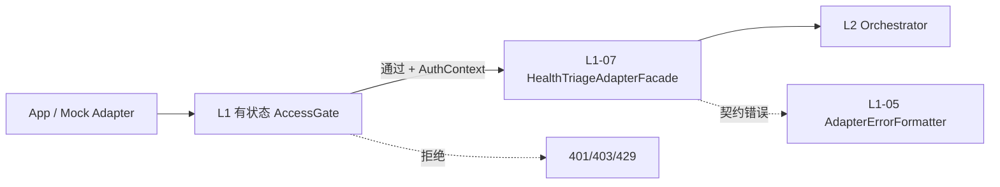

# L1 边界有状态 — AccessGate（访问门控）组件设计

本文档描述 **L1 接入层边界外的有状态组件**，与 `L1-stateless-components.md` 明确隔离。  
**设计依据**：`overall.md`、L1 无状态设计、ToC 传统多用户（非多租户）、有状态按层隔离原则。

---

## 一、L1 边界有状态层定位

### 1.1 职责（只做访问控制，不做医学、不做契约校验）

AccessGate 是 **App 请求进入 L1 无状态 Adapter 之前的唯一有状态门控**：

| 做 | 不做 |
|----|------|
| 校验用户身份（登录态 / Token） | 风险判断、证据融合 |
| 校验 userId 对 petId 的访问权限 | input schema 校验（属 L1-01） |
| per-user / 全局限流 | 读写 SessionStore（属 L2） |
| 输出 `AuthContext` 供下游元数据使用 | 修改 input 医学字段 |
| 拒绝非法访问并返回统一错误 | 审计写库（属 L7 AuditSink） |
| 开发/CI 旁路模式 | 多租户隔离、租户级配置 |

### 1.2 与 L1 无状态的分工



| 阶段 | 层级 | 失败语义 |
|------|------|---------|
| 身份/权限/限流 | AccessGate | 401 Unauthorized / 403 Forbidden / 429 Too Many Requests |
| 契约/版本/scene | L1 无状态 | 400 Bad Request（AdapterErrorFormatter） |
| 医学分诊 | L3–L6 | 200 + 结构化 output（或 L2 降级） |

**原则**：AccessGate 失败时 **不进入** L1 Facade，更不进入分诊 Pipeline。

### 1.3 ToC 多用户前提（非多租户）

- 用户通过 App 账号体系登录，请求携带 **用户身份凭证**。
- 一只宠物归属一个用户；分诊请求中的 `pet.petId` 必须属于当前 `userId`。
- 全站共享一套 Agent 策略（ConfigReleaseStore 全局指针），**无租户级 RuleKB / 配额套餐**。
- 限流维度：`userId` + 可选 `deviceId` + 全局限流；**无 tenantId**。

### 1.4 有状态定义（L1 边界范围内）

> 给定同一凭证、同一限流窗口状态、同一宠物归属缓存快照，AccessGate 的允许/拒绝结论在策略配置不变时可预期；其状态来自 **令牌校验依赖、限流计数器、归属缓存**，不来自分诊历史或医学结论。

---

## 二、请求链路位置

### 2.1 `/health` 路径

```
HTTP POST /health
  → AccessGateFacade.evaluate(request)
  → [通过] L1-07 Facade Ingress
  → L2 health_triage_v1_sync（无 Session）
  → L7 AuditSink（异步，携带 userId 元数据）
```

### 2.2 `/intelligent` 路径

```
HTTP POST /intelligent
  → AccessGateFacade.evaluate(request)     // 同上，可能额外校验 sessionId 头
  → [通过] L1-07 Facade Ingress
  → [L2 外] SessionStore.load(userId, sessionId)   // 属 L2 有状态，非 AccessGate
  → L2 intelligent_wrap_v1
```

AccessGate **不加载、不保存** 会话内容；仅校验 **用户有权发起该 session**，并将 `userId` 注入元数据供 L2 SessionStore 使用。

### 2.3 Mock / CI 旁路

20 case 回归与本地 mock 需能 **绕过真实账号服务**：

| 模式 | 行为 |
|------|------|
| `accessMode=strict` | 生产默认，完整鉴权 |
| `accessMode=bypass` | 仅开发/CI；固定注入 `userId=test-user`，跳过 Token 与归属远程校验 |
| `accessMode=local` | 本地集成测；用内存 Fake 实现替代 Redis/账号服务 |

旁路 **不得** 在生产默认开启；须在 AuditRecord 中标记 `accessMode`（经 L7 元数据透传）。

---

## 三、L1 有状态组件清单

| 组件 ID | 组件名 | 核心职责 |
|---------|--------|----------|
| ST-L1-01 | CredentialValidator | 校验用户凭证，解析 userId |
| ST-L1-02 | PetOwnershipAuthorizer | 校验 userId 对 input.pet.petId 的归属 |
| ST-L1-03 | RateLimitGate | per-user / 全局限流 |
| ST-L1-04 | TokenBlocklist | 已注销/吊销令牌黑名单（可选） |
| ST-L1-05 | AccessContextBuilder | 组装下游可用的 AuthContext |
| ST-L1-06 | AccessDeniedFormatter | 拒绝响应格式化（**可无状态**，建议仍放 AccessGate 包内） |
| ST-L1-07 | AccessGateFacade | 门控编排唯一入口 |

可选扩展（V1.x）：

| 组件 ID | 组件名 | 说明 |
|---------|--------|------|
| ST-L1-08 | DeviceBindingChecker | 校验 deviceId 与用户常用设备一致（防盗用，可选） |
| ST-L1-09 | OwnershipCache | 归属关系缓存层（可内嵌于 ST-L1-02） |

---

## 四、组件逐一设计

---

### ST-L1-01 CredentialValidator（凭证校验器）

#### 职责

从 HTTP 请求中提取凭证，校验有效性，解析出 **可信 userId**。

#### 有状态依赖

| 状态来源 | 用途 |
|---------|------|
| 账号服务 / JWT 公钥 | 校验签名与过期 |
| TokenBlocklist（ST-L1-04） | 吊销令牌拒绝 |
| （可选）会话表 | 若 App 用 server-side session 而非 JWT |

#### 输入

| 字段 | 说明 |
|------|------|
| authorizationHeader | `Bearer <token>` 或 App 约定头 |
| requestTimestamp | 用于过期判断 |
| accessMode | strict / bypass / local |

#### 输出

| 字段 | 说明 |
|------|------|
| valid | boolean |
| userId | string，通过时必填 |
| deviceId | string?，从 token claims 或头解析 |
| expiresAt | timestamp? |
| failureCode | `MISSING_TOKEN` / `INVALID_TOKEN` / `EXPIRED` / `REVOKED` |

#### ToC 设计要点

- **一个凭证对应一个用户**，不解析 tenantId。
- Mock adapter 在 bypass 模式下可使用固定测试 userId。
- **不把 userId 写入 `pet` 或 `userReport`**；只进入 `AuthContext`。

#### 明确不做

- 不校验 pet 归属（交给 ST-L1-02）
- 不代替 App 做登录注册

---

### ST-L1-02 PetOwnershipAuthorizer（宠物归属授权器）

#### 职责

确保当前 `userId` 有权对请求体中的 `pet.petId` 发起分诊。  
防止用户 A 伪造 petId 查看用户 B 的宠物健康结论。

#### 有状态依赖

| 状态来源 | 用途 |
|---------|------|
| 归属缓存 | `petId → userId` 短期缓存，减账号服务压力 |
| App 宠物服务 API | 缓存未命中时权威查询 |

#### 输入

| 字段 | 说明 |
|------|------|
| userId | 来自 ST-L1-01 |
| petId | 来自 **原始请求体** `pet.petId`（在 L1 校验前即可读取，仅做授权） |
| accessMode | bypass 时可跳过远程校验，默认认为归属成立 |

#### 输出

| 字段 | 说明 |
|------|------|
| allowed | boolean |
| failureCode | `PET_NOT_FOUND` / `PET_NOT_OWNED` / `OWNERSHIP_SERVICE_UNAVAILABLE` |
| cacheHit | boolean，供观测 |

#### 策略

| 场景 | 行为 |
|------|------|
| petId 属于 userId | 通过 |
| petId 属于他人 | 403，**不泄露**「该宠物是否存在」的过多细节（统一文案） |
| 归属服务不可用 | 可配置：**fail-closed**（推荐生产）或 fail-open（仅 dev 禁止） |
| bypass 模式 | 跳过，用于 case 回归 |

#### 与 L1-01 的关系

- 在 **InputValidator 之前** 执行：只需从 raw body 安全解析 `pet.petId`（JSON 浅取），不做全量 schema 校验。
- 若 body 无法解析 petId → 可交给后续 L1-01 报 400，或此处报 `MALFORMED_BODY`（建议统一 400 由 L1 处理，AccessGate 仅在有 petId 时做归属）。

推荐顺序：

```
CredentialValidator → 浅取 petId → PetOwnershipAuthorizer → L1 Facade 全量校验
```

#### 明确不做

- 不校验 pet 医学字段（品种、年龄等）
- 不缓存 vitals 或 healthEvidence

---

### ST-L1-03 RateLimitGate（限流门控）

#### 职责

防止单用户刷接口、保护 LLM 成本与服务质量。ToC 下为 **用户级 + 全站级**，非租户套餐。

#### 有状态依赖

| 实现 | 存储 |
|------|------|
| 滑动窗口计数 | Redis 或内存（local 模式） |

#### 限流维度（V1 建议）

| 维度 | 键示例 | 默认窗口 | 说明 |
|------|--------|---------|------|
| 每用户 | `rl:user:{userId}` | 1 分钟 N 次 | 防刷 |
| 全站 | `rl:global` | 1 秒 M 次 | 保护整体 |
| intelligent 附加 | `rl:intelligent:{userId}` | 1 分钟更低阈值 | 多轮成本更高（可选） |

**不把 petId 作为限流键**（避免多宠用户误伤）；userId 足够。

#### 输入

| 字段 | 说明 |
|------|------|
| userId | 已通过凭证校验 |
| entry | `health` / `intelligent` |
| accessMode | bypass 可跳过限流 |

#### 输出

| 字段 | 说明 |
|------|------|
| allowed | boolean |
| retryAfterSec | 429 时建议重试秒数 |
| limitType | `user` / `global` |
| remaining | 可选，给客户端展示 |

#### 边界

- 限流触发 → **429**，不走分诊、不走 LLM 降级
- 限流状态 **不影响** riskLevel 逻辑（因未进入 Pipeline）

---

### ST-L1-04 TokenBlocklist（令牌黑名单，可选 V1）

#### 职责

用户登出、改密、封号后，旧 token 即使未过期也应拒绝。

#### 有状态存储

- Redis Set 或带 TTL 的 key：`bl:jti:{tokenId}`  
- 或用户级失效戳：`user:{userId}:tokenVersion`

#### 输入/输出

- 输入：token claims（jti / userId / issuedAt）  
- 输出：是否命中黑名单  

#### V1 简化

- 若 App 使用极短 TTL JWT + 刷新机制，V1 可 **暂不实现**，由 ST-L1-01 仅验签与过期。
- 生产有账号注销需求时再启用。

---

### ST-L1-05 AccessContextBuilder（访问上下文构建器）

#### 职责

将通过门控的信息组装为 **下游可消费的 AuthContext**，与医学 input 严格分离。

#### 输出：AuthContext

| 字段 | 类型 | 消费者 |
|------|------|--------|
| userId | string | L2 SessionStore、L7 AuditSink |
| deviceId | string? | 审计、可选风控 |
| sessionId | string? | 来自请求头，供 `/intelligent` → L2 SessionStore |
| entry | `health` \| `intelligent` | 路由、指标 |
| accessMode | enum | 审计 |
| authenticatedAt | timestamp | 审计 |
| credentialType | `jwt` \| `session` \| `bypass` | 审计 |

#### 关键约束

- **AuthContext 不得合并进 NormalizedInput 的医学字段**。
- 应置于 **IngressEnvelope.meta** 或 **并行 DTO**，与 `IngressBundle` 一并传 L2：

```
IngressEnvelope {
  authContext: AuthContext      // 有状态门控产出
  ingressBundle: IngressBundle   // L1 无状态产出
}
```

L1-07 Facade **不感知** AuthContext 如何产生，只接收已门控通过的请求；编排上由 **HTTP Handler / AccessGateFacade** 先门控再调 Facade。

---

### ST-L1-06 AccessDeniedFormatter（拒绝响应格式化器）

#### 职责

将 AccessGate 拒绝原因映射为 **稳定、可文档化的 HTTP/API 错误体**。

#### 无状态性

纯函数，不读写存储；放在 `adapter/stateful/access/` 内与门控同包，便于维护。

#### 错误码表（V1 建议）

| HTTP | code | 场景 |
|------|------|------|
| 401 | `AUTH_MISSING` | 无 token |
| 401 | `AUTH_INVALID` | 签名校验失败 |
| 401 | `AUTH_EXPIRED` | 过期 |
| 401 | `AUTH_REVOKED` | 黑名单 |
| 403 | `PET_ACCESS_DENIED` | 宠物不属于当前用户 |
| 403 | `SESSION_ACCESS_DENIED` | sessionId 与 userId 绑定校验失败（intelligent，可选） |
| 429 | `RATE_LIMIT_USER` | 用户限流 |
| 429 | `RATE_LIMIT_GLOBAL` | 全局限流 |
| 503 | `OWNERSHIP_SERVICE_DOWN` | 归属服务不可用且 fail-closed |

#### 与 L1-05 区分

| 组件 | 错误类型 |
|------|---------|
| AccessDeniedFormatter | 身份、权限、限流 |
| AdapterErrorFormatter | 契约、版本、scene、body 格式 |

客户端可据此区分「未登录」与「参数错误」。

---

### ST-L1-07 AccessGateFacade（访问门控门面）

#### 职责

对外 **唯一门控入口**，固定调用顺序，封装有状态依赖注入。

#### 评估流程（evaluate）

```
1. 解析 accessMode（配置 / 请求头）
2. CredentialValidator
   → fail → AccessDeniedFormatter → return
3. 浅解析 raw body 取 pet.petId（失败则 defer 到 L1）
4. PetOwnershipAuthorizer（有 petId 时）
   → fail → AccessDeniedFormatter → return
5. RateLimitGate
   → fail → AccessDeniedFormatter → return
6. （可选）SessionHeaderValidator：sessionId 格式 + 与 userId 绑定预检
7. AccessContextBuilder → AuthContext
8. return AccessDecision { allowed: true, authContext }
```

#### 出口契约

| 结果 | 下游 |
|------|------|
| `allowed=true` | HTTP Handler 调 L1-07 + 将 authContext 附给 L2 |
| `allowed=false` | 直接 HTTP 响应，**不调 L1 Facade** |

#### 与 L2 SessionStore 的边界

| AccessGate | SessionStore |
|------------|--------------|
| 验证用户身份 | 存储对话增量 |
| 可选验证 sessionId 头格式/归属 | load/save SessionDelta |
| 产出 userId | 使用 userId 作为存储键一部分 |

**Session 内容读写永远在 L2 边界**，AccessGate 不碰 Redis session 键。

---

## 五、L1 有状态数据对象

| 对象 | 产生者 | 消费者 | 说明 |
|------|--------|--------|------|
| CredentialValidationResult | ST-L1-01 | Facade | 凭证结果 |
| OwnershipCheckResult | ST-L1-02 | Facade | 归属结果 |
| RateLimitResult | ST-L1-03 | Facade | 限流结果 |
| AuthContext | ST-L1-05 | L2、L7、Handler | 非医学元数据 |
| AccessDecision | ST-L1-07 | HTTP Handler | 通过/拒绝汇总 |
| AccessDeniedResponse | ST-L1-06 | App | 对外错误体 |
| IngressEnvelope | Handler 组装 | L2 | authContext + ingressBundle |

---

## 六、与上下游接口契约

### 6.1 上游（App）

| 责任方 | 责任 |
|--------|------|
| App | 登录后携带有效凭证 |
| App | 请求体 petId 必须为当前用户宠物 |
| App | `/intelligent` 在头或元数据携带 `sessionId`（可选约定） |
| App | 不在客户端绕过 AccessGate 直接打内网 Agent（生产） |

### 6.2 下游（L1 无状态）

| 字段 | 传递方式 |
|------|---------|
| rawRequest body | 原样交给 L1-07，**不被 AccessGate 修改** |
| AuthContext | 并行元数据，不进 NormalizedInput |

L1 无状态包 **不得 import** AccessGate 实现；依赖方向：`handler → AccessGate → L1 stateless`。

### 6.3 下游（L2）

L2 `OrchestratorFacade.runTriage` 扩展 options（概念）：

| 字段 | 来源 |
|------|------|
| authContext | ST-L1-05 |
| sessionDelta | L2 SessionStore（intelligent，AccessGate 之后） |

L2 可将 `authContext.userId` 写入 `PipelineResult.internalAudit`，供 L7 落库。

### 6.4 下游（L7）

AuditRecord 扩展字段（非医学）：

- userId（可脱敏）
- deviceId
- sessionId
- entry
- accessMode
- accessDenied 场景 **不写 AuditSink**（未进入 Pipeline），可写 **访问日志**（轻量，可选）

---

## 七、存储与基础设施选型（ToC）

| 组件 | 开发/mock | 生产 |
|------|-----------|------|
| CredentialValidator | 固定 token 表 / bypass | JWT 验签 或 App 账号 introspection |
| PetOwnershipAuthorizer | 内存 map petId→userId | App API + Redis 缓存 TTL 5–15min |
| RateLimitGate | 内存计数 | Redis 滑动窗口 |
| TokenBlocklist | 无或内存 Set | Redis |

**单区域 ToC** 无需多租户级隔离库；按 `userId` 逻辑隔离即可。

---

## 八、代码管理与分包建议

```
adapter/
  stateless/              # 已有 L1-01～07
  stateful/
    access/
      credential_validator/
      pet_ownership/
      rate_limit/
      token_blocklist/    # 可选
      access_context/
      denied_formatter/   # 纯函数
      facade/
    contracts/            # AuthContext, AccessDecision 等
    config/               # 限流阈值、accessMode、fail-closed 开关
  # 注意：session/ 归属 L2 stateful，不在此目录
```

### 依赖规则

| 允许 | 禁止 |
|------|------|
| `access/facade` → 各 ST-L1 子组件 | `stateless` → `stateful/access` 实现 |
| `access` → `contracts`、`config` | `access` → L3–L6 |
| `access` → 外部账号/宠物 API 客户端 | `access` → SessionStore |
| HTTP handler → AccessGate → L1 stateless | AccessGate 调 AuditSink 写分诊审计 |
| 测试 `InMemoryRateLimiter` / `FakeOwnership` | 生产在 L1-01 内嵌鉴权 |

---

## 九、测试策略（AccessGate 专属）

### 9.1 单测

| 组件 | 方法 |
|------|------|
| CredentialValidator | 过期、篡改、缺失、bypass |
| PetOwnershipAuthorizer | 自有宠物、他人宠物、缓存命中/失效 |
| RateLimitGate | 窗口边界、用户/全局独立 |
| AccessDeniedFormatter | 错误码与 HTTP 映射快照 |
| AccessGateFacade | 顺序与短路（401 后不再查归属） |

### 9.2 集成测

- Handler 全链：Gate 通过 → L1 → L2 mock  
- Gate 拒绝 → 确保 L1 Facade **未被调用**（spy）  
- bypass 模式：20 case 回归路径畅通  

### 9.3 回归约束

- AccessGate 变更 **不得** 改变 case 医学 expected（case 走 bypass）  
- 生产 strict 模式启用时，须单独 E2E 鉴权用例，不混入 20 case 医学回归  

---

## 十、非功能要求（ToC）

| 维度 | 要求 |
|------|------|
| 延迟 | P99 增加 < 10–30ms（缓存命中时） |
| 可用性 | 归属服务挂掉：生产 fail-closed；返回 503 而非静默放行 |
| 安全 | 统一 403 文案，避免 petId 枚举 |
| 隐私 | 访问日志不记录完整 token |
| 可观测 | 拒绝率、限流命中、归属缓存命中率（低基数 metric，**无 userId label**） |
| 配置 | 限流阈值、accessMode 走 ConfigRelease 或独立 ops 配置，**不进 RuleKB** |

---

## 十一、明确排除（不得放入 L1 AccessGate）

| 能力 | 归属 |
|------|------|
| SessionStore 读写 | L2 stateful |
| input/output schema 校验 | L1-01 / L6 |
| 审计写库 | L7 AuditSink |
| LLM 限流熔断 | L4 LLMRuntimePool |
| 全局 RuleKB 版本 | infrastructure ConfigReleaseStore |
| pet 医学历史缓存 | App / Cloud |
| 多租户隔离 | 不适用 |
| 根据用户等级差异化 risk | 禁止 |

---

## 十二、V1 实施建议

| 优先级 | 组件 | 说明 |
|--------|------|------|
| P0 | Facade + CredentialValidator + bypass 模式 | 支撑 case 回归与本地开发 |
| P1 | PetOwnershipAuthorizer + RateLimitGate | 生产 ToC 上线 |
| P2 | TokenBlocklist、DeviceBindingChecker | 有注销/风控需求时 |
| P2 | SessionHeaderValidator | intelligent 防 sessionId 劫持 |

---

## 十三、总结

L1 边界有状态共 **6+1 个核心组件**（加 2 个可选）：

1. **CredentialValidator** — 谁在用  
2. **PetOwnershipAuthorizer** — 能否动这只宠物  
3. **RateLimitGate** — 是否刷接口  
4. **TokenBlocklist** — 旧 token 是否作废（可选）  
5. **AccessContextBuilder** — 把身份变成下游元数据  
6. **AccessDeniedFormatter** — 拒绝响应形状  
7. **AccessGateFacade** — 固定顺序的门控入口  

**核心原则**：

- AccessGate 在 **L1 无状态之前**，失败不进入分诊。  
- **AuthContext 与医学 input 分离**，不写进 NormalizedInput。  
- ToC **用户级** 授权与限流，**无租户**。  
- 会话内容属 **L2 SessionStore**，AccessGate 只认证人、不记对话。  

与 `L1-stateless-components.md` 对称：**无状态管契约，有状态管谁能带着契约进来**。