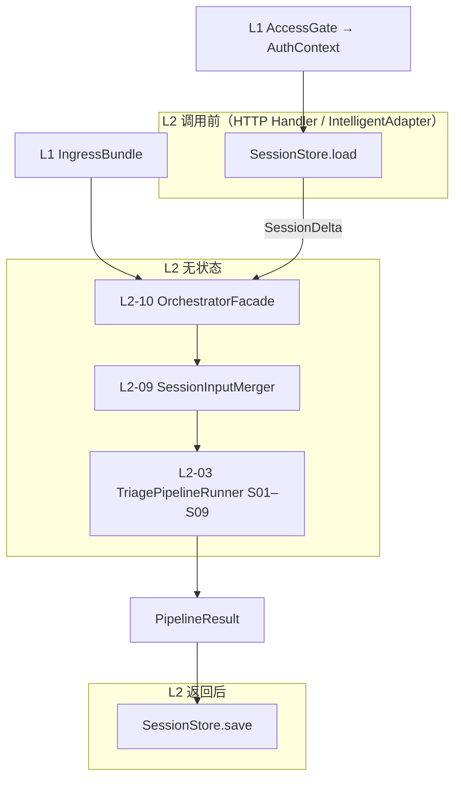

# L2 边界有状态 — SessionStore（会话存储）组件设计

本文档描述 **L2 编排层边界外的有状态组件**，与 `L2-stateless-components.md` 明确隔离。  
**设计依据**：`overall.md`、L2 无状态设计（尤其 `L2-09 SessionInputMerger`）、L1 有状态 `AccessGate`、`/intelligent` 管道变体 `intelligent_wrap_v1`、ToC 传统多用户（非多租户）、有状态按层隔离原则。

---

## 一、L2 边界有状态层定位

### 1.1 职责（只存会话增量，不做医学、不做编排决策）

SessionStore 是 **`/intelligent` 多轮对话在 L2 边界的唯一有状态组件**，负责：

| 做 | 不做 |
|----|------|
| 按 `userId + sessionId` 读写轻量会话记录 | 风险判断、证据融合、文案医学含义 |
| `load` 产出 `SessionDelta`，供 `L2-09` 纯函数合并 | 在 L2 无状态 Facade 内部直接访问存储 |
| `save` 写回本轮对话摘要与累计用户增量 | 覆盖当次 App 快照中的 vitals / healthEvidence |
| 校验会话与 userId、petId 一致性 | input schema 校验（属 L1） |
| TTL、会话数上限、显式结束 | 鉴权（属 L1 AccessGate） |
| 开发/测试用内存实现 | 审计写库（属 L7 AuditSink） |
| | 决策型时序记忆、体征历史、baseline/trend |

### 1.2 与 L2 无状态的分工



| 阶段 | 层级 | 说明 |
|------|------|------|
| 身份 | L1 AccessGate | 提供可信 `userId` |
| 会话读 | L2 有状态 SessionStore | 产出 `SessionDelta` |
| 会话合并 | L2-09 无状态 | `merge(normalizedInput, sessionDelta)` |
| 医学分诊 | L3–L6 无状态 | 与 `/health` 完全相同 S01–S09 |
| 会话写 | L2 有状态 SessionStore | 写摘要，不阻断响应优先 |

**原则**：

- `L2-10 OrchestratorFacade` **不** `load` / `save`；只接收 `options.sessionDelta`（与无状态文档一致）。
- **读取在 Facade 外、写入在 Facade 后**，由 **IntelligentRequestCoordinator**（编排协调器，可放在 `orchestrator/stateful/facade`）串联。

### 1.3 `/health` 与 `/intelligent` 边界

| 入口 | SessionStore |
|------|--------------|
| `/health` | **完全不使用**；`health_triage_v1_sync` 无 S00 |
| `/intelligent` | **必须使用**；S00 = `SessionInputMerger`，前后各一次 load/save |

`/health` 必须能在 **零 Session 依赖** 下跑通 20 case 回归。

### 1.4 ToC 多用户前提（非多租户）

- 会话键绑定 **`userId`**（来自 AccessGate `AuthContext`），防止跨用户串会话。
- 同一会话绑定 **`petId`**；换宠必须 reset 或拒绝。
- 无租户级会话隔离；全用户共享同一套合并策略与 TTL 配置。
- 单用户活跃会话数可设上限（防滥用），非套餐计费逻辑。

### 1.5 有状态定义（L2 边界范围内）

> SessionStore 的状态是 **「多轮 intelligent 对话中，用户侧增量的累计与上轮 Agent 摘要」**；不包含体征时序、不包含 risk 裁决记忆。给定同一 `SessionRecord` + 当次 `NormalizedInput`，经 `L2-09` 合并后的 `EnrichedNormalizedInput` 在无状态管道侧可复现。

---

## 二、请求链路位置（`/intelligent` 完整时序）

```
1. AccessGateFacade → AuthContext { userId, sessionId?, entry=intelligent }
2. L1-07 Facade → IngressBundle（requiresSessionMerge=true）
3. SessionStore.load(LoadRequest) → SessionDelta | 新建空会话
4. TurnInputExtractor（可选）从本请求提取本轮用户增量 TurnDelta
5. L2-10 runTriage(ingressBundle, { sessionDelta, authContext })
     └─ L2-09 SessionInputMerger → EnrichedNormalizedInput
     └─ S01–S09（与 /health 相同）
6. PipelineResult
7. SessionStore.save(SaveRequest)  // 建议异步，失败记日志不阻断 200
8. L1 OutputMapper → 响应 App
```

**save 失败策略**：用户仍收到本轮分诊结果；记录告警；下一轮可能丢失部分会话连续性，但 **不得** 用 Session 补 vitals 或伪造医学数据。

---

## 三、L2 有状态组件清单

| 组件 ID | 组件名 | 核心职责 |
|---------|--------|----------|
| ST-L2-01 | SessionKeyFactory | 生成规范存储键（userId + sessionId） |
| ST-L2-02 | SessionOwnershipGuard | 校验 session 归属 userId、petId 一致性 |
| ST-L2-03 | SessionRecordRepository | 持久化读写抽象（Redis / 内存） |
| ST-L2-04 | SessionLoadProjector | `SessionRecord` → `SessionDelta` |
| ST-L2-05 | SessionSaveProjector | 本轮输入 + `PipelineResult` → 更新 `SessionRecord` |
| ST-L2-06 | TurnInputExtractor | 从当次请求提取本轮用户增量 `TurnDelta` |
| ST-L2-07 | SessionLifecycleManager | TTL、续期、清理、每用户会话数上限 |
| ST-L2-08 | SessionStoreFacade | load/save/delete 唯一对外入口 |

**与无状态对应关系**：

| 有状态 | 无状态 |
|--------|--------|
| ST-L2-04 LoadProjector | L2-09 消费 `SessionDelta` |
| ST-L2-05 SaveProjector | L2-08 产出 `PipelineResult` 作为写回素材 |
| ST-L2-08 Facade | L2-10 **不** 直接依赖 Facade 实现 |

---

## 四、核心数据对象

### 4.1 SessionKey（存储主键）

| 字段 | 说明 |
|------|------|
| userId | AccessGate 注入，必填 |
| sessionId | 客户端或 App 生成，必填 |

规范键：`session:{userId}:{sessionId}`（Redis String/Hash）。

**不用 petId 作主键**：同一会话换 pet 应走 OwnershipGuard 拒绝或显式 `reset`。

### 4.2 SessionRecord（持久化全量记录）

SessionStore **存的是 Record**，不是直接存 L2-09 的 `SessionDelta`（Delta 是 load 时的 **投影**）。

| 字段 | 类型语义 | 说明 |
|------|---------|------|
| sessionKey | SessionKey | 主键 |
| petId | string | 会话绑定宠物；变更则冲突 |
| turnIndex | int | 已完成轮次；下一轮 load 时 +1 逻辑由 Projector 处理 |
| accumulatedUserText | string | 历史多轮用户描述合并块（有最大长度） |
| accumulatedSymptoms | string[] | 历史症状并集 |
| lastDuration | string? | 最近一次有效持续时间 |
| lastTurnRiskLevel | enum? | 上轮 `output.riskLevel` |
| lastTurnSummaryShort | string? | 上轮 `summary` 截断（供对话包装，**非 L4 输入**） |
| promptedMissingItems | string[] | 已对用户提示过的缺失项 |
| createdAt | timestamp | 创建时间 |
| updatedAt | timestamp | 最后写入 |
| expiresAt | timestamp | TTL 截止时间 |
| schemaVersion | string | 记录格式版本，便于迁移 |

#### 明确不存储

| 不存 | 原因 |
|------|------|
| vitals / healthEvidence 历史 | 防编造；每轮以 App 快照为准 |
| device 状态历史 | 同上 |
| 完整 LLM prompt/response | 体积、隐私、非 V1 必需 |
| Agent 自算 baseline / trend | 架构红线 |
| ruleHits / arbitration 明细 | 属 L7 AuditSink |
| 替代 App 宠物档案 | pet 医学背景在当次 input |

### 4.3 SessionDelta（与 L2-09 的契约 — load 输出）

必须与 `L2-stateless-components.md` 中 `L2-09` **字段对齐**：

| 字段 | 说明 | 投影规则 |
|------|------|---------|
| `appendedUserText` | 供 Merger 合并进 `userReport.text` 的历史文本块 | 来自 `accumulatedUserText`；空会话为 `""` |
| `appendedSymptoms` | 供 Merger 与当次 symptoms 并集 | 来自 `accumulatedSymptoms` |
| `updatedDuration` | 覆盖 duration 的来源 | 来自 `lastDuration` |
| `lastTurnRiskLevel` | 上轮 risk，供 L3 一致性标注可选 | 来自 `lastTurnRiskLevel` |
| `turnIndex` | 当前轮次元数据 | 来自 `turnIndex`（Merger 写入 `meta.turnIndex`） |

**注意**：L2-09 文档中 `appendedUserText` 表述为「本轮新增」时，指的是 **相对当次 App 快照需要追加的会话侧历史**；持久化层用 **累计块** 存储，由 `SessionLoadProjector` 投影为 Merger 所需形态，避免双份追加。

### 4.4 TurnDelta（本轮用户增量 — save 输入之一）

从 **当次** `NormalizedInput.userReport` 与请求元数据提取，表示 **本轮新信息**（非全量 Record）：

| 字段 | 说明 |
|------|------|
| newUserText | 本轮新增描述（若 App 送全量则需去重策略） |
| newSymptoms | 本轮新增症状 |
| durationUpdate | 若本轮更新了 duration |
| petId | 当次 pet，用于 OwnershipGuard |

由 **ST-L2-06 TurnInputExtractor** 产出；App 契约应在产品层约定「每轮送增量」或「送全量由 Extractor  diff」。

### 4.5 SessionSavePayload（save 输入汇总）

| 字段 | 来源 |
|------|------|
| sessionKey | AuthContext + 头 |
| turnDelta | ST-L2-06 |
| pipelineResult | L2-08：`riskLevel`、`summary`、`missingData` 等 |
| authContext | 校验归属 |
| normalizedInput.pet.petId | pet 一致性 |

---

## 五、组件逐一设计

---

### ST-L2-01 SessionKeyFactory（会话键工厂）

#### 职责

从 `AuthContext` 与请求头安全构造 `SessionKey`。

#### 输入

| 字段 | 说明 |
|------|------|
| userId | AuthContext，必填 |
| sessionId | 头 `X-Session-Id` 或 body 元数据，必填 |

#### 输出

`SessionKey` 或失败 `MISSING_SESSION_ID` / `INVALID_SESSION_ID_FORMAT`。

#### 规则

- `sessionId` 格式：长度上限、字符集（如 UUID / 客户端生成 id）  
- **禁止** 仅按 sessionId 查库而不带 userId（ToC 防劫持）  
- bypass/测试模式可用固定 `sessionId=test-session`

---

### ST-L2-02 SessionOwnershipGuard（会话归属守卫）

#### 职责

在 load/save 时校验 **会话记录属于当前用户且宠物一致**。

#### 校验矩阵

| 场景 | 行为 |
|------|------|
| load 无记录 | 允许，视为新会话（save 时创建） |
| load 有记录，userId 一致 | 继续 |
| record.petId 为空（新会话首写） | 允许，save 时绑定当次 petId |
| record.petId == 当次 petId | 通过 |
| record.petId != 当次 petId | **拒绝**：`PET_SESSION_MISMATCH`，建议客户端 `reset` 新 session |
| sessionId 属于他人 userId | **理论上不存在**（键含 userId）；若迁移错误则拒绝 |

#### 与 AccessGate 分工

| AccessGate | SessionOwnershipGuard |
|------------|----------------------|
| userId 有权访问 petId（账号维度） | 同一会话是否绑定错 pet（对话维度） |
| 可选 sessionId 头格式预检 | 会话记录与当次 input 一致性 |

#### 明确不做

- 不替代 AccessGate 做登录校验  
- 不校验宠物医学权限以外的共享场景（V1 不支持多人共养同一会话）

---

### ST-L2-03 SessionRecordRepository（会话记录仓储）

#### 职责

`SessionRecord` 的 CRUD 与原子更新抽象。

#### 接口（概念）

```
get(key) → SessionRecord | null
put(key, record) → void
delete(key) → void
touch(key, expiresAt) → void   // 续期
listByUser(userId) → keys[]    // 仅 Lifecycle 用
```

#### 实现选型（ToC）

| 环境 | 实现 |
|------|------|
| 开发 / case 旁路 | `InMemorySessionRepository` |
| 生产 | Redis Hash 或 String(JSON)，带 TTL |

#### 并发

- 同一 `sessionId` 快速连点：建议 **乐观锁**（`recordVersion`）或 Lua 原子更新，避免 turnIndex 乱序  
- V1 可简化为 last-write-wins + turnIndex 单调检查，冲突时拒绝 save 并记日志

#### 明确不做

- 不做跨 region 多活（V1）  
- 不做会话内容全文检索

---

### ST-L2-04 SessionLoadProjector（加载投影器）

#### 职责

将 `SessionRecord`（或 null）投影为 `L2-09` 所需的 `SessionDelta`。

#### 输入

| 字段 | 说明 |
|------|------|
| record | null 表示首轮 |
| loadPolicy | 投影策略版本 |

#### 输出

`SessionDelta`；null record 时输出 **空 Delta**（各字段零值），保证 `L2-09` 行为等同 `/health` 输入。

#### 投影规则

| Record 字段 | SessionDelta 字段 |
|-------------|-------------------|
| accumulatedUserText | appendedUserText |
| accumulatedSymptoms | appendedSymptoms |
| lastDuration | updatedDuration |
| lastTurnRiskLevel | lastTurnRiskLevel |
| turnIndex | turnIndex（当前已完成轮次，Merger 可写 meta） |

#### 无状态保证

- 纯函数：`project(record, policy) → SessionDelta`  
- 可单测，不触存储

---

### ST-L2-05 SessionSaveProjector（保存投影器）

#### 职责

根据 `TurnDelta` + `PipelineResult` + 原 `SessionRecord`，计算 **下一轮** 的 `SessionRecord`。

#### 输入

| 字段 | 说明 |
|------|------|
| existing | 可 null（首写） |
| turnDelta | 本轮用户增量 |
| pipelineResult | 分诊结果 |
| savePolicy | 合并策略版本 |

#### 输出

更新后的 `SessionRecord`（待 Repository put）。

#### 更新规则（V1 默认）

| 字段 | 更新逻辑 |
|------|---------|
| turnIndex | +1 |
| accumulatedUserText | 将 `turnDelta.newUserText` 按分隔符追加到块尾；超上限则截断或摘要（可配置） |
| accumulatedSymptoms | 与 `turnDelta.newSymptoms` 并集去重 |
| lastDuration | `turnDelta.durationUpdate` 优先，否则保留 |
| lastTurnRiskLevel | `pipelineResult.composedOutput.riskLevel` |
| lastTurnSummaryShort | `summary` 截断至 N 字 |
| promptedMissingItems | 若 output.missingData 非空，合并进列表（去重） |
| petId | 首写绑定；之后必须一致 |
| updatedAt / expiresAt | 刷新；expiresAt = now + TTL |

#### 明确不写入

- vitals、healthEvidence、signals  
- evidence 全文、ruleHits  
- LLM 原始输出  

---

### ST-L2-06 TurnInputExtractor（本轮输入提取器）

#### 职责

从当次 `NormalizedInput`（及可选 App 约定字段）提取 `TurnDelta`，供 SaveProjector 使用。

#### App 契约两种模式（可配置）

| 模式 | 行为 |
|------|------|
| `incremental`（推荐） | `userReport.text` 仅为本轮新话；直接作 `newUserText` |
| `full_snapshot` | `userReport.text` 为 App 侧全量；与 `accumulatedUserText` diff 出新块 |

#### 输出

`TurnDelta`；symptoms 同理（增量 vs 全量 diff）。

#### 边界

- 只处理 **userReport 相关** 字段  
- 不解析 vitals 变化写入 Session

---

### ST-L2-07 SessionLifecycleManager（会话生命周期管理）

#### 职责

TTL、续期、清理、每用户会话数限制；可与 Repository 内嵌，V1.x 建议独立便于运维。

#### 能力

| 能力 | 说明 |
|------|------|
| TTL 默认 | 30min–2h 无操作过期（可配置） |
| touch on save | 每次 save 刷新 `expiresAt` |
| 显式结束 | `SessionStore.delete(sessionKey)`；App「结束对话」 |
| 每用户活跃会话上限 | 如最多 5 个 intelligent 会话；超出拒绝创建或 LRU 淘汰最旧 |
| 后台清理 | 扫描过期键（Redis TTL 自动即可） |
| 账号注销 | 按 userId 批量 delete（ToC 合规） |

#### 与限流分工

| AccessGate RateLimit | SessionLifecycle |
|---------------------|------------------|
| 请求频率 | 会话个数与存活时间 |

---

### ST-L2-08 SessionStoreFacade（会话存储门面）

#### 职责

对外 **唯一** Session 入口；编排 ST-L2-01～07，对 IntelligentRequestCoordinator 隐藏细节。

#### load（概念）

```
输入: LoadRequest { authContext, sessionId, petIdFromInput }
1. SessionKeyFactory
2. Repository.get
3. SessionOwnershipGuard（有 record 时）
4. SessionLoadProjector → SessionDelta
输出: LoadResult { sessionDelta, sessionMeta? }
```

#### save（概念）

```
输入: SaveRequest { authContext, sessionId, turnDelta, pipelineResult, petId }
1. SessionKeyFactory
2. Repository.get
3. SessionOwnershipGuard
4. SessionSaveProjector → newRecord
5. SessionLifecycleManager.applyTTL(newRecord)
6. Repository.put
输出: SaveResult { ok, newTurnIndex? }
```

#### delete / reset

- 用户换宠、结束对话、检测到污染时调用  
- reset = delete + 下轮 load 空 Delta

#### 与 L2-10 的边界

```
Coordinator:
  delta = SessionStoreFacade.load(...)
  result = OrchestratorFacade.runTriage(bundle, { sessionDelta: delta })
  SessionStoreFacade.save(...)  // 不传入 Facade
```

**L2-10 的 options 仅含 `sessionDelta` 快照**，不含 Store 引用。

---

## 六、与 L2-09 SessionInputMerger 的合并语义对齐

L2 无状态已定义合并规则；SessionStore **必须配合**，不得与之冲突：

| L2-09 规则 | SessionStore 配合 |
|------------|------------------|
| `userReport.text` 默认追加 | Store 提供历史块 `appendedUserText` |
| `symptoms` 并集去重 | Store 提供 `appendedSymptoms` |
| `duration` Session 有则覆盖 | Store 提供 `updatedDuration` |
| **vitals/healthEvidence 以当次为准** | Store **绝不** 写入或投影这些字段 |
| 不引入体征历史 | Record 无 vitals 字段 |
| 空 SessionDelta 等同原 input | 首轮 load 返回空 Delta |

**lastTurnRiskLevel**：

- 可供 L3 `ContradictionDetector` 标注「上轮 emergency 本轮用户说没事」等  
- **L4 Arbiter 不得读取 SessionStore 或依赖此字段做降级**

---

## 七、与上下游接口契约

### 7.1 上游（L1 AccessGate + L1 Facade）

| 字段 | 用途 |
|------|------|
| AuthContext.userId | SessionKey 必选 |
| AuthContext.sessionId | intelligent 必选 |
| IngressBundle.normalizedInput | Merger 当次快照 + TurnExtractor |
| pipelinePlan.requiresSessionMerge | 为 true 时 Coordinator 才 load/save |

AccessGate **不** 读写 Session 内容。

### 7.2 下游（L2 无状态）

| 方向 | 契约 |
|------|------|
| Store → L2-10 | 仅 `SessionDelta` 通过 `options` 注入 |
| L2-10 → Store | **无**；只输出 `PipelineResult` 给 Coordinator |

### 7.3 下游（L3，间接）

- L3 收到的是 `EnrichedNormalizedInput`（已合并）  
- L3 **不** 感知 SessionStore 存在  
- 可选：在 `DecisionContextPackage.meta` 中带 `turnIndex`、`lastTurnRiskLevel`（来自 Merger meta，非 Store 直读）

### 7.4 下游（L7 AuditSink）

在线审计可记录（非 Session 内容）：

| 字段 | 说明 |
|------|------|
| sessionId | intelligent 关联 |
| turnIndex | 排障 |
| sessionSaveOk | save 是否成功 |
| petSessionMismatch | 归属拒绝事件 |

**分诊 Audit 不替代 SessionRecord**；会话丢失不能从 Audit 重建 vitals 历史。

### 7.5 上游（App 产品约定）

| 责任方 | 责任 |
|--------|------|
| App | 每轮 intelligent 携带稳定 `sessionId` |
| App | 每轮提供 **最新** 设备/App 组装的 vitals 与 healthEvidence 快照 |
| App | 约定 userReport 增量或全量模式，与 `TurnInputExtractor` 配置一致 |
| App | 换宠时换新 `sessionId` 或调 delete |

---

## 八、错误处理与对外语义

SessionStore 失败 **不应** 替代 L1 AdapterErrorFormatter 的 400 契约错误。

| 错误 | 建议 HTTP | 说明 |
|------|-----------|------|
| MISSING_SESSION_ID | 400 | intelligent 缺 session |
| PET_SESSION_MISMATCH | 409 | 会话宠物不一致，提示 reset |
| SESSION_SAVE_FAILED | 200 + 分诊结果仍返回 | save 异步失败；body 可选 warning |
| SESSION_LIMIT_EXCEEDED | 429 或 409 | 超每用户会话数上限 |
| STORAGE_UNAVAILABLE | 503 | load 失败且无法空 Delta 降级时（可配置首轮空 Delta 继续） |

**推荐**：load 失败时 **降级为空 Delta** 继续分诊（丢多轮连续性，不丢当次快照医学能力）；save 失败只告警。

---

## 九、代码管理与分包建议

```
orchestrator/
  stateless/              # 已有 L2-01～10
  stateful/
    session/
      key_factory/
      ownership_guard/
      repository/         # 接口 + redis + in_memory
      load_projector/
      save_projector/
      turn_extractor/
      lifecycle/
      facade/
    coordinator/          # IntelligentRequestCoordinator（load→L2→save）
    contracts/            # SessionRecord, SessionDelta, TurnDelta
    config/               # TTL、文本上限、incremental/full 模式
```

### 依赖规则

| 允许 | 禁止 |
|------|------|
| `stateful/session` → `contracts`、`config` | `stateless` → `repository` 实现 |
| `coordinator` → `SessionStoreFacade` + `L2-10` 接口 | `L2-10` 实现 → `SessionStoreFacade` |
| `L3–L6` → 不知 Session 存在 | SessionStore → L3/L4 医学模块 |
| 测试 InMemoryRepository | Session 存 risk 历史做下轮降级 |

**注意**：`adapter/stateful/access`（L1）与 `orchestrator/stateful/session`（L2）**分包隔离**。

---

## 十、测试策略（SessionStore 专属）

### 10.1 单测（纯函数组件）

| 组件 | 要点 |
|------|------|
| SessionLoadProjector | null record → 空 Delta |
| SessionSaveProjector | turnIndex 单调、文本追加、symptoms 并集 |
| SessionOwnershipGuard | pet 不一致拒绝 |
| TurnInputExtractor | incremental / full_snapshot 两种模式 |
| SessionKeyFactory | 缺 userId/sessionId |

### 10.2 集成测

| 场景 | 预期 |
|------|------|
| 两轮 intelligent | 第二轮 input 含合并后 userReport.text |
| 第二轮 vitals 变化 | 以第二轮 App 快照为准，不受 Session 影响 |
| 换 petId 同 sessionId | 409 / mismatch |
| save 失败 | 仍 200 + 合法 output |
| `/health` | SessionStore 零调用 |

### 10.3 与 20 case 关系

- 20 case 走 `/health` 或 bypass intelligent **不依赖** SessionStore  
- 另设 **intelligent 专属会话用例**（多轮追加症状、运动场景补充），不混入医学 risk 金标回归集

---

## 十一、非功能要求（ToC）

| 维度 | 要求 |
|------|------|
| 延迟 | load P99 < 5ms（Redis 本地）；save 可异步 |
| 容量 | 单记录大小上限（如 16KB）；文本截断策略 |
| 隐私 | 不存 token；用户注销可 purge |
| 隔离 | 键必含 userId |
| 可观测 | save 失败率、mismatch 次数、平均 turnIndex（无 userId 高基数 label） |
| 迁移 | `schemaVersion` 支持 Record 字段演进 |

---

## 十二、明确排除（不得放入 L2 SessionStore）

| 能力 | 归属 |
|------|------|
| 用户登录鉴权 | L1 AccessGate |
| 会话限流 | L1 RateLimitGate |
| vitals / trend / baseline 历史 | 禁止；App/Cloud |
| 决策型时序记忆 | V2 审慎立项，非 Session |
| 完整对话 LLM 历史 | 非 V1 |
| output 缓存 | 禁止 |
| L4 读 lastTurnRisk 做裁决 | 禁止 |
| 审计明细 | L7 AuditSink |
| 多租户会话隔离 | 不适用 |

---

## 十三、V1 实施顺序

| 优先级 | 交付物 |
|--------|--------|
| P0 | Repository(in_memory) + Load/Save Projector + Facade + 与 L2-09 联调 |
| P1 | Redis 实现 + OwnershipGuard + Lifecycle TTL |
| P2 | TurnInputExtractor 双模式 + 并发 version |
| P2 | IntelligentRequestCoordinator 与 AccessGate sessionId 联调 |
| P3 | 每用户会话数上限、账号注销 bulk delete |

---

## 十四、总结

L2 边界有状态以 **SessionStore 体系** 为核心，共 **8 个组件**：

1. **SessionKeyFactory** — 键规范（userId + sessionId）  
2. **SessionOwnershipGuard** — 会话与宠物一致性  
3. **SessionRecordRepository** — 持久化抽象  
4. **SessionLoadProjector** — Record → `SessionDelta`  
5. **SessionSaveProjector** — 本轮增量 + 分诊摘要 → Record  
6. **TurnInputExtractor** — 当次 userReport 增量提取  
7. **SessionLifecycleManager** — TTL 与清理  
8. **SessionStoreFacade** — load/save/delete 唯一入口  

**核心原则**：

- **只服务 `/intelligent`**；`/health` 零依赖。  
- **读写都在 L2-10 Facade 外**；Facade 只收 `SessionDelta` 快照。  
- **与 L2-09 对齐**：只合并用户侧增量；vitals/healthEvidence 永远以当次 App 快照为准。  
- **不存医学时序、不参裁决**；上轮 risk 仅作元数据与对话一致性参考。  
- **ToC 键绑定 userId**；与 L1 AccessGate 分工：门禁认证人，Session 记对话。  

与 `L2-stateless-components.md` 对称：**无状态管合并规则，有状态管跨轮用户增量该记什么、怎么投影给 Merger**。