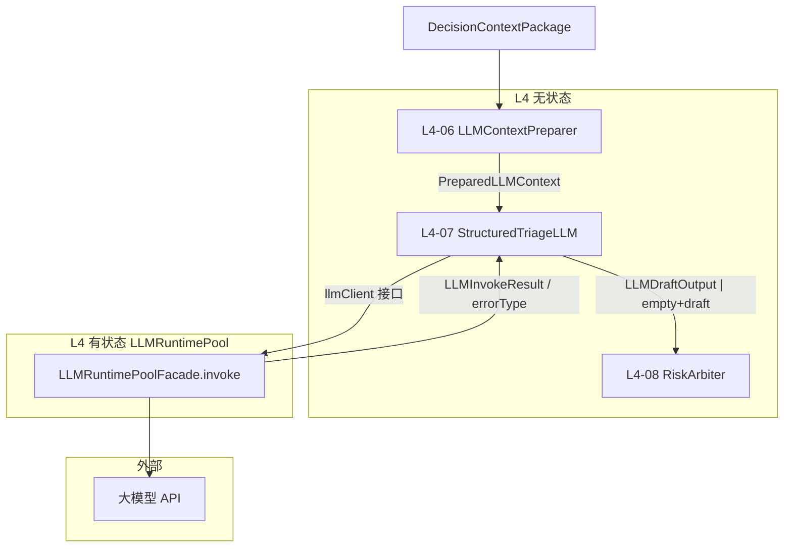

# L4 边界有状态 — LLMRuntimePool（LLM 运行时池）组件设计

本文档描述 **L4 决策层边界外的有状态组件**，与 `L4-stateless-components.md` 明确隔离。  
**设计依据**：`overall.md`、L4 无状态设计（尤其 `L4-07 StructuredTriageLLM`）、L2 无状态设计（`StepExecutionPolicy`、`DegradationPolicy`、`RetryPlanner`、`ShortCircuitPolicy`）、L1 有状态 `AccessGate`、ToC 传统多用户（非多租户）、有状态按层隔离原则。

---

## 一、L4 边界有状态层定位

### 1.1 职责（只做 LLM 外部 IO 运行时，不做医学裁决）

LLMRuntimePool 是 **L4 `StructuredTriageLLM` 调用外部大模型服务的唯一有状态运行时**，负责：

| 做 | 不做 |
|----|------|
| HTTP 连接池、并发控制、超时执行 | 风险判断、riskFloor、Arbiter 仲裁 |
| 熔断与半开恢复 | 裁剪 prompt（属 L4-06 LLMContextPreparer） |
| 对接厂商 API（鉴权头、重试 transport 层） | 携带多轮对话历史 |
| 将调用错误分类为稳定 `errorType` 供 L2 降级 | 缓存 response 参与下次 risk 决策 |
| 产出调用遥测（latency、token、model） | 读写 SessionStore（属 L2） |
| 提供 `llmClient` 接口实现供 L4-07 注入 | 审计写库（属 L7；仅 emit 事件） |
| Mock / 固定响应模式（CI） | 用户级 API 限流（属 L1 AccessGate） |

### 1.2 与 L4 无状态的分工



| 阶段 | 层级 | 说明 |
|------|------|------|
| 上下文裁剪 | L4-06 无状态 | 纯函数，防编造、注入 floor |
| 文案生成编排 | L4-07 无状态 | 组装请求、解析 JSON draft；**不** 自建连接池 |
| 外部 IO | L4 有状态 Pool | 连接、并发、熔断、超时 |
| 失败语义 | L4-07 → L2 | 空 draft + `errorType`；L2 `DegradationPolicy` 走模板 |
| 最终 risk | L4-08 无状态 | **不** 读取 Pool 历史状态 |

**原则**：

- `L4-10 DecisionCoreFacade` **不** 直接依赖 Pool 实现；仅通过注入给 `L4-07` 的 `llmClient` 接口。
- Pool **不参与** `finalRiskLevel` 计算；LLM 失败时 Arbiter 仍基于 Rule + Fusion。

### 1.3 与 L2 编排层的关系

L2 管 **步骤级** 超时、重试、降级、短路；Pool 管 **传输级** 连接与熔断。二者协同但不重叠：

| 能力 | L2 无状态 | L4 有状态 Pool |
|------|-----------|----------------|
| S05 步骤总超时（如 8–15s） | `StepExecutionPolicy` | `RequestTimeoutEnforcer` 与之对齐或略短 |
| S05 失败降级模板 | `DegradationPolicy` | 提供分类错误 |
| S05 重试 1 次 | `RetryPlanner` | Pool 可在 **单次 invoke 内** 做 transport 重试（限次数） |
| emergency 跳过 LLM | `ShortCircuitPolicy` | Pool **不被调用** |
| 用户刷接口 | L1 `RateLimitGate` | 不处理 |

**铁律**（与 L2/L4 无状态一致）：

1. LLM 失败 → `LLMDraftOutput` 为空 + 标记 → **riskFloor 与 candidateRisk 保留**  
2. 熔断 open → **快速失败**，不长时间阻塞 S05  
3. Pool 状态 **不得** 导致同一 `PreparedLLMContext` 在不同时间得到不同 `finalRiskLevel`

### 1.4 ToC 多用户前提（非多租户）

- 全站 **共享** 一个（或一组）LLM 端点与连接池；**无** 租户级模型路由、租户级 Key 池。
- 并发与熔断以 **全站 + 可选按模型** 维度控制；用户级成本保护 primarily 由 **L1 限流** 完成。
- API Key 来自全局 `SecretProvider`（infrastructure），Pool 只 **消费** 密钥，不定义租户套餐。

### 1.5 有状态定义（L4 边界范围内）

> Pool 的跨请求状态限于 **连接复用、并发计数、熔断器相位、近期错误率窗口**；不包含 prompt、response 医学缓存。给定熔断 closed、并发未满，单次 `invoke(preparedPayload)` 的行为仅依赖当次 payload 与厂商响应（模型本身非确定性除外）。

---

## 二、在 Pipeline 中的位置（S05）

```
S02–S04（规则/融合，确定性）
  → ShortCircuitPolicy：emergency / disableLlm / DATA_MISSING 可跳过 S05
  → S05 GenerateLLMDraft
       L4-06 LLMContextPreparer（无状态）
       L4-07 StructuredTriageLLM（无状态）
            └─ llmClient.invoke() → LLMRuntimePoolFacade（有状态）
  → S06 RiskArbiter（无状态，可无 draft）
  → S07+ Guard / Output
```

**`/health` 与 `/intelligent`**：S05 路径 **完全相同**；Pool 不读取 Session。

---

## 三、L4 有状态组件清单

| 组件 ID | 组件名 | 核心职责 |
|---------|--------|----------|
| ST-L4-01 | LLMEndpointRegistry | 端点、模型、默认参数注册 |
| ST-L4-02 | ConnectionPoolManager | HTTP 连接复用与池化 |
| ST-L4-03 | ConcurrencyLimiter | 全站/ per-model 并发信号量 |
| ST-L4-04 | CircuitBreaker | 熔断、半开探测 |
| ST-L4-05 | RequestTimeoutEnforcer | 单次调用超时（≤ L2 S05） |
| ST-L4-06 | LLMCredentialResolver | 从 SecretProvider 解析 Key/鉴权头 |
| ST-L4-07 | TransportRetryPolicy | 传输层有限重试（429/502/网络闪断） |
| ST-L4-08 | ResponseParserAdapter | 厂商原始响应 → 统一 RawLLMBody |
| ST-L4-09 | InvokeTelemetryCollector | 收集 latency/token 供 L7 |
| ST-L4-10 | LLMRuntimePoolFacade | `invoke` 唯一对外入口 |
| ST-L4-11 | MockLLMBackend | CI/本地固定响应（可选实现） |

**与无状态对应**：

| 有状态 | 无状态 |
|--------|--------|
| ST-L4-10 Facade | L4-07 注入的 `llmClient` 接口 |
| ST-L4-08 Parser | L4-07 将 RawLLMBody 映射为 `LLMDraftOutput` 字段 |

---

## 四、核心数据对象与接口契约

### 4.1 LLMClient 接口（L4-07 依赖的抽象）

L4 无状态只依赖此接口，不依赖 Redis/HTTP 实现：

**输入 `LLMInvokeRequest`**

| 字段 | 来源 | 说明 |
|------|------|------|
| traceId | L2 TraceContext | 全链路关联 |
| preparedPayload | L4-07 由 PreparedLLMContext 序列化 | system/user messages 或等价 JSON |
| modelId | generationOptions + Registry | 如 `triage-writer-v1` |
| temperature | generationOptions | 低温度优先 |
| maxTokens | 配置 | 上限防超长 |
| timeoutMs | L2 S05 策略注入 | 步骤超时 |
| requestId | 每次 invoke 生成 | 幂等追踪，非医学幂等缓存 |

**输出 `LLMInvokeResult`（成功）**

| 字段 | 说明 |
|------|------|
| rawBody | 厂商返回体 |
| latencyMs | 端到端 |
| modelUsed | 实际模型 |
| tokenUsage | prompt/completion/total |
| transportMeta | 厂商 request id 等 |

**输出 `LLMInvokeFailure`（失败）**

| 字段 | 说明 |
|------|------|
| errorType | 稳定枚举，供 L2 降级矩阵 |
| message | 内部日志，非用户原文 |
| retryable | 是否已被 Pool 用尽 transport 重试 |
| latencyMs | 失败前耗时 |

### 4.2 errorType 枚举（与 L2 DegradationPolicy 对齐）

| errorType | 典型原因 | L4-07 行为 | L2 预期 |
|-----------|---------|------------|---------|
| `NONE` | 成功 | 解析 draft | 正常 |
| `TIMEOUT` | 超过 timeoutMs | 空 draft | USE_TEMPLATE |
| `CIRCUIT_OPEN` | 熔断打开 | 空 draft，快速 | USE_TEMPLATE |
| `CONCURRENCY_LIMIT` | 池内排队超时 | 空 draft | USE_TEMPLATE |
| `PROVIDER_RATE_LIMIT` | 厂商 429 | transport 重试后仍失败 | USE_TEMPLATE |
| `PROVIDER_ERROR` | 5xx / 未知 | 空 draft | USE_TEMPLATE |
| `AUTH_ERROR` | Key 无效 | 空 draft + 运维告警 | USE_TEMPLATE |
| `INVALID_RESPONSE` | JSON 不可解析 | 空 draft；可触发 L2 S05 **业务重试 1 次** | USE_TEMPLATE 或重试后模板 |
| `REQUEST_TOO_LARGE` | 超窗/超 token | 空 draft | USE_TEMPLATE（L4-06 应尽量避免） |

**注意**：`INVALID_RESPONSE` 的 **业务重试** 由 L2 `RetryPlanner` 对 **整步 S05** 发起；Pool 内 transport 重试 **不计入** L2 重试次数。

### 4.3 CircuitBreakerState（Pool 内部状态）

| 字段 | 说明 |
|------|------|
| phase | `closed` / `open` / `half_open` |
| consecutiveFailures | 连续失败计数 |
| openedAt | 打开时间 |
| halfOpenProbeInFlight | 半开探测互斥 |

**触发建议（V1 可配置）**：

- 滑动窗口 60s 内失败率 > 50% 且样本 ≥ N → open  
- open 持续 30s → half_open，允许 1 个探测请求  
- 探测成功 → closed；失败 → 再 open  

**边界**：熔断 open **不** 改变 RuleEngine/Fusion 结果；仅加速失败 + 模板文案。

### 4.4 ConcurrencyLimiterState

| 维度 | V1 建议 |
|------|---------|
| 全站 in-flight 上限 | 如 32–128（按 GPU/厂商配额） |
| per-model 上限 | 可选 |
| 排队等待上限 | 超过则 `CONCURRENCY_LIMIT`，不无限阻塞 |

ToC：**不按 userId 分配 LLM 并发槽**（避免实现复杂）；用户公平性靠 L1 限流 + 全站并发。

---

## 五、组件逐一设计

---

### ST-L4-01 LLMEndpointRegistry（端点注册表）

#### 职责

管理 **静态/配置发布** 的模型端点映射，非运行时医学配置。

#### 内容

| 字段 | 说明 |
|------|------|
| modelId | 逻辑名 `triage-writer-v1` |
| provider | openai-compatible / 私有网关等 |
| baseUrl | 调用地址 |
| defaultModel | 厂商模型名 |
| defaultMaxTokens | 上限 |
| enabled | 开关 |

#### 与 ConfigReleaseStore

- 端点表版本随 `llmEndpointRegistryVersion` 写入 AuditRecord  
- **禁止** Pool 自动切换模型以「优化 risk」；切换只通过配置发布

#### 明确不做

- 不存用户偏好模型  
- 不做 A/B 医学实验路由（V1）

---

### ST-L4-02 ConnectionPoolManager（连接池管理器）

#### 职责

对同一 `baseUrl` 复用 TCP/TLS 连接，降低 S05 P99。

#### 状态

- 空闲连接数、活跃连接数、池上限  
- 连接空闲超时回收  

#### 边界

- 池只服务 LLM HTTP；不混用宠物服务、账号服务连接  
- 进程级单例（ToC 单集群）

---

### ST-L4-03 ConcurrencyLimiter（并发限制器）

#### 职责

在 invoke 前获取信号量，控制同时打向厂商的请求数。

#### 流程

```
acquire(timeout=queueWaitMs) 
  → 失败 → CONCURRENCY_LIMIT
  → 成功 → 执行 HTTP → release（finally）
```

#### 与 L1 限流区别

| L1 AccessGate | ConcurrencyLimiter |
|---------------|-------------------|
| 每用户请求频率 | 全站同时打 LLM 的请求数 |
| 保护 Agent API | 保护厂商配额与延迟 |

---

### ST-L4-04 CircuitBreaker（熔断器）

#### 职责

厂商持续异常时快速失败，避免 S05 占满线程并拖垮 P99。

#### 记录事件

- 每次 invoke 成功/失败更新窗口  
- open 时 **新请求直接拒绝**，不发起 HTTP  

#### 与 L2 短路

| 场景 | 行为 |
|------|------|
| emergency 已短路 S05 | Pool 不被调用；熔断状态仍可在后台由其他请求更新 |
| 熔断 open + 未短路 | S05 快速失败 → 模板 |

#### 明确不做

- 熔断 **不** 触发 L2 改 pipeline 路径（仍 S05 失败降级）  
- **不** 基于 userId 单独熔断（V1）

---

### ST-L4-05 RequestTimeoutEnforcer（请求超时执行器）

#### 职责

单次 HTTP 调用的硬超时，与 L2 `StepExecutionPolicy` 中 S05 对齐。

#### 规则

| 参数 | 建议 |
|------|------|
| poolTimeoutMs | ≤ L2 S05 stepTimeoutMs（如池 12s，步骤 15s 留解析余量） |
| 包含 | 连接 + 首字节 + 读 body |
| 不包含 | L4-06 裁剪时间、L4-08 解析（解析在 Pool 外由 L4-07 完成，或算在 S05 内） |

超时 → `TIMEOUT` → L4-07 空 draft。

---

### ST-L4-06 LLMCredentialResolver（凭证解析器）

#### 职责

从全局 **SecretProvider**（infrastructure）读取 API Key、组织头、私有网关 token。

#### 状态

- 内存短缓存 Key 引用（非医学数据）  
- Key 轮换时支持热更新句柄（不重启进程）

#### 安全

- Key **不出** 现在 AuditRecord、不进 prompt  
- `AUTH_ERROR` 触发运维告警（Metrics + 日志）

---

### ST-L4-07 TransportRetryPolicy（传输重试策略）

#### 职责

**单次 invoke 内部** 对可恢复网络/厂商错误有限重试。

#### V1 建议

| 条件 | 重试 |
|------|------|
| 连接重置、502/503 | 最多 1–2 次，指数退避 |
| 429 | 尊重 `Retry-After`，最多 1 次 |
| 401/403 | 不重试 → AUTH_ERROR |
| 400 | 不重试 → PROVIDER_ERROR 或 REQUEST_TOO_LARGE |

**与 L2 RetryPlanner 边界**：

- Pool transport 重试：对 **同一次 S05 尝试** 的 HTTP 层透明  
- L2 S05 FULL_STEP 重试：整个 L4-07 步骤再来一遍（含重新 prepare 可选，通常复用 PreparedLLMContext）

---

### ST-L4-08 ResponseParserAdapter（响应解析适配器）

#### 职责

将不同厂商响应格式统一为 `RawLLMBody`（文本或 JSON 字符串），供 **L4-07 无状态** 映射 `LLMDraftOutput`。

#### 边界

- **医学字段校验**（禁止词、schema）在 L4-07 / L5，不在 Pool  
- 解析失败 → `INVALID_RESPONSE`

---

### ST-L4-09 InvokeTelemetryCollector（调用遥测收集器）

#### 职责

每次 invoke 收集指标与 span 属性，交给 L7 `MetricsEventFormatter`（无状态格式化）。

#### 建议指标（低基数）

| 指标 | 标签 |
|------|------|
| `llm_invoke_total` | model_id, outcome=success/errorType |
| `llm_invoke_latency_ms` | model_id |
| `llm_tokens_total` | model_id, type=prompt/completion |
| `llm_circuit_state` | phase |

**无 userId / petId label**。

#### 与 AuditSink

- `PipelineResult.internalAudit` 可含 `llmLatencyMs`、`tokenUsage` 摘要（由 L4-07 填入 `llmMeta`）  
- Pool 不直接写 AuditSink

---

### ST-L4-10 LLMRuntimePoolFacade（运行时池门面）

#### 职责

实现 `llmClient` 接口；编排 ST-L4-01～09。

#### invoke 流程（概念）

```
1. EndpointRegistry.resolve(modelId)
2. ConcurrencyLimiter.acquire
3. CircuitBreaker.allowRequest? 
     → no → return CIRCUIT_OPEN
4. CredentialResolver.resolveHeaders
5. ConnectionPoolManager.getClient
6. RequestTimeoutEnforcer.run:
     TransportRetryPolicy + HTTP POST
7. ResponseParserAdapter.parse
8. CircuitBreaker.recordSuccess
9. InvokeTelemetryCollector.record
10. return LLMInvokeResult
```

失败路径：`recordFailure`、release、分类 errorType。

#### 与 L4-07 注入

- 生产：`DecisionCoreFacade` 构造时注入 `PoolFacade` 实例  
- 测试：注入 `MockLLMBackend` 或固定脚本响应  
- **L4-07 单元测试不启真实 Pool**

---

### ST-L4-11 MockLLMBackend（Mock 后端，可选）

#### 职责

CI、20 case 语义评测、本地无密钥开发。

#### 模式

| 模式 | 行为 |
|------|------|
| `fixed` | 按 caseId / prompt hash 返回金标 JSON |
| `echo_minimal` | 最小合法 draft |
| `fail` | 模拟 TIMEOUT / CIRCUIT_OPEN 测降级 |

#### 边界

- Mock **不** 维护跨请求医学状态  
- 风险金标回归：推荐 **LLM mock off + 模板**；语义评测：**mock on**

---

## 六、与 L4-07 StructuredTriageLLM 的协作契约

### 6.1 无状态侧职责（L4-07）

| 步骤 | 负责方 |
|------|--------|
| 构建 preparedPayload | L4-07 |
| 调用 `llmClient.invoke` | L4-07 |
| 将 RawLLMBody 映射 title/summary/evidence… | L4-07 |
| suggestedRisk 解析 | L4-07；Arbiter 可忽略 |
| 失败时 `draft=null` + `llmErrorType` | L4-07 |

### 6.2 有状态侧职责（Pool）

| 步骤 | 负责方 |
|------|--------|
| 网络、并发、熔断、传输重试 | Pool |
| 错误分类 errorType | Pool |
| token/latency 原始值 | Pool → L4-07 llmMeta |

### 6.3 失败后的医学保证

```
LLM 失败
  → LLMDraftOutput 空
  → RiskArbiter 仍用 ruleFloor + fusionResult.candidateRisk
  → L6 模板兜底文案（DegradationPolicy）
  → finalRiskLevel 仍须满足 20 case expected（风险评测）
```

Pool 故障 **等价于** LLM 超时，不等价于「降低风险」。

---

## 七、与上下游接口契约

### 7.1 上游（L4 无状态）

| 来源 | 传递 |
|------|------|
| L4-06 | PreparedLLMContext |
| L2 StepContext | timeoutMs、traceId、disableLlm（短路则不调用） |
| ConfigRelease | modelId、endpointRegistryVersion |

### 7.2 下游（L2）

| 事件 | L2 组件 |
|------|---------|
| S05 超时/错误 | DegradationPolicy → USE_TEMPLATE |
| INVALID_RESPONSE | RetryPlanner 可能 FULL_STEP 一次 |
| 多次失败 | degradationEvents[] → PipelineResult |

Pool **不** 调用 L2；只返回错误分类。

### 7.3 下游（L5 / L6）

- Pool **不** 参与 Guard  
- 模板兜底在 L6；与 Pool 无直接调用

### 7.4 下游（L7）

- token/latency/errorType 经 `llmMeta` / Metrics 汇总  
- 可观测：`degraded=true` 且 `degradationReason=LLM_*`

### 7.5 全局 infrastructure

| 组件 | 关系 |
|------|------|
| SecretProvider | ST-L4-06 消费 |
| ConfigReleaseStore | ST-L4-01 端点版本 |
| TraceExporter | ST-L4-09 可选对接 |

### 7.6 L1 AccessGate

- 用户进不来 → Pool 不会被调用  
- 用户进来后 **共享** 全站 Pool；不在 L4 重复 per-user 限流（除非产品 later 要求「LLM 豪华版用户」— V1 不做）

---

## 八、错误处理与运维语义

| 场景 | 用户侧 | 运维侧 |
|------|--------|--------|
| 单次 LLM 超时 | 正常 200 + 模板文案 + 可能 degraded | llm_invoke_latency 超阈 |
| 熔断 open | 同上，P99 下降 | circuit=open 告警 |
| AUTH_ERROR | 200 + 模板（risk 仍合法） | 紧急：Key 失效 |
| 全站并发打满 | 200 + 模板 | 扩容或调并发上限 |
| L4-06 请求过大 | 模板；应优化裁剪 | REQUEST_TOO_LARGE 监控 |

**原则**：ToC 用户 **不应** 因 LLM 故障看到 5xx 空 body（L2 最低可用输出保证）。

---

## 九、代码管理与分包建议

```
decision/
  stateless/              # 已有 L4-01～10
  stateful/
    llm_runtime/
      endpoint_registry/
      connection_pool/
      concurrency/
      circuit_breaker/
      timeout/
      credential/
      transport_retry/
      response_parser/
      telemetry/
      facade/
      mock_backend/
    contracts/            # LLMInvokeRequest/Result, errorType
    config/               # 池大小、熔断阈值、超时
```

### 依赖规则

| 允许 | 禁止 |
|------|------|
| `stateless` L4-07 → `llmClient` 接口 | `stateless` → Redis/HTTP 客户端实现 |
| `stateful/llm_runtime` → SecretProvider | Pool → SessionStore |
| `stateful` → `contracts` | Pool → RiskArbiter / RuleEngine |
| `DecisionCoreFacade` DI 注入 llmClient | L4-08 Arbiter 读 CircuitBreaker 状态 |
| 测试 Mock 实现接口 | 用 Pool 缓存 response 改 risk |

**与 L2 文档差异说明**：L2 排除表写「LLM 连接池 → infrastructure」；本设计将其 **收敛到 L4 边界 `decision/stateful/llm_runtime`**，因 IO 专属于 `StructuredTriageLLM`，利于层内聚；`SecretProvider`、端点配置指针仍属 **global infrastructure**。

---

## 十、测试策略（LLMRuntimePool 专属）

### 10.1 单测

| 组件 | 要点 |
|------|------|
| CircuitBreaker | closed→open→half_open→closed |
| ConcurrencyLimiter | 排队超时 CONCURRENCY_LIMIT |
| TransportRetryPolicy | 429/502 重试次数 |
| RequestTimeoutEnforcer | TIMEOUT 分类 |
| Facade | 错误分类矩阵 |

### 10.2 集成测

| 场景 | 预期 |
|------|------|
| 厂商 mock 500 | 空 draft + 模板 + risk 不变 |
| 熔断 open | S05 快速失败 |
| emergency case | Pool 零调用（ShortCircuit） |
| LLM mock 金标 | Pool 使用 MockLLMBackend |

### 10.3 与 20 case

| 模式 | 用途 |
|------|------|
| LLM off / 熔断强制 open | **风险评测** 仍 pass |
| LLM mock 固定文案 | **语义 mustMention** 评测 |
| 真实 LLM | 非 CI 门禁；人工抽测 |

---

## 十一、非功能要求（ToC）

| 维度 | 要求 |
|------|------|
| 延迟 | 熔断 open 时 S05 < 100ms 级失败 |
| 可用性 | Pool 故障不导致 5xx；降级可服务 |
| 成本 | token 监控；全站并发上限 |
| 安全 | Key 不落盘审计；日志不打印完整 prompt（隐私策略可配置） |
| 扩展 | 新厂商加 Parser + Registry 行 |
| 确定性 | Pool 状态不影响 risk；只影响是否拿到 draft |

---

## 十二、明确排除（不得放入 L4 LLMRuntimePool）

| 能力 | 归属 |
|------|------|
| Prompt 缓存（按 input hash） | 禁止（V1）；医疗结论时效性 |
| Response 缓存复用 output | 禁止 |
| LLM 对话 history / memory | 禁止 |
| 按用户分配模型/Key 池 | V1 不做（非多租户） |
| 根据 Audit 自动调熔断阈值反馈 risk | 禁止 |
| RAG 向量检索 | 禁止 |
| Arbiter 读熔断状态降 risk | 禁止 |
| 用户 API 限流 | L1 AccessGate |
| 会话上下文 | L2 SessionStore |

---

## 十三、V1 实施顺序

| 优先级 | 交付物 |
|--------|--------|
| P0 | `llmClient` 接口 + MockLLMBackend + Facade 骨架 |
| P1 | ConnectionPool + Timeout + Credential + Parser |
| P2 | ConcurrencyLimiter + TransportRetry |
| P3 | CircuitBreaker + Telemetry |
| P4 | 与 L2 DegradationPolicy 联调 errorType 全矩阵 |

---

## 十四、总结

L4 边界有状态以 **LLMRuntimePool** 为核心，共 **10+1 个组件**：

1. **LLMEndpointRegistry** — 端点与模型注册  
2. **ConnectionPoolManager** — 连接复用  
3. **ConcurrencyLimiter** — 全站并发  
4. **CircuitBreaker** — 熔断恢复  
5. **RequestTimeoutEnforcer** — 调用超时  
6. **LLMCredentialResolver** — 密钥解析  
7. **TransportRetryPolicy** — 传输重试  
8. **ResponseParserAdapter** — 厂商响应统一  
9. **InvokeTelemetryCollector** — 遥测  
10. **LLMRuntimePoolFacade** — `invoke` 唯一入口  
11. **MockLLMBackend** — CI/本地 mock（可选）  

**核心原则**：

- **只服务 L4-07 的外部 IO**；医学裁决仍在无状态 Rule/Fusion/Arbiter。  
- **失败分类驱动 L2 模板降级**，不拖垮 risk，不向用户暴露 5xx。  
- **ToC 全站共享池**；用户级保护在 L1，不在 L4 重复造限流。  
- **无 prompt/response 医学缓存、无对话记忆**；状态仅是运行时健康与连接。  
- 与 `L4-stateless-components.md` 对称：**无状态写稿与解析，有状态管怎么打出去、怎么失败**。  

与 L1 AccessGate、L2 SessionStore 共同构成：**门禁管谁进来、会话管多轮用户话、Pool 管模型怎么调** — 三者均 **不参与 finalRisk 裁决**。