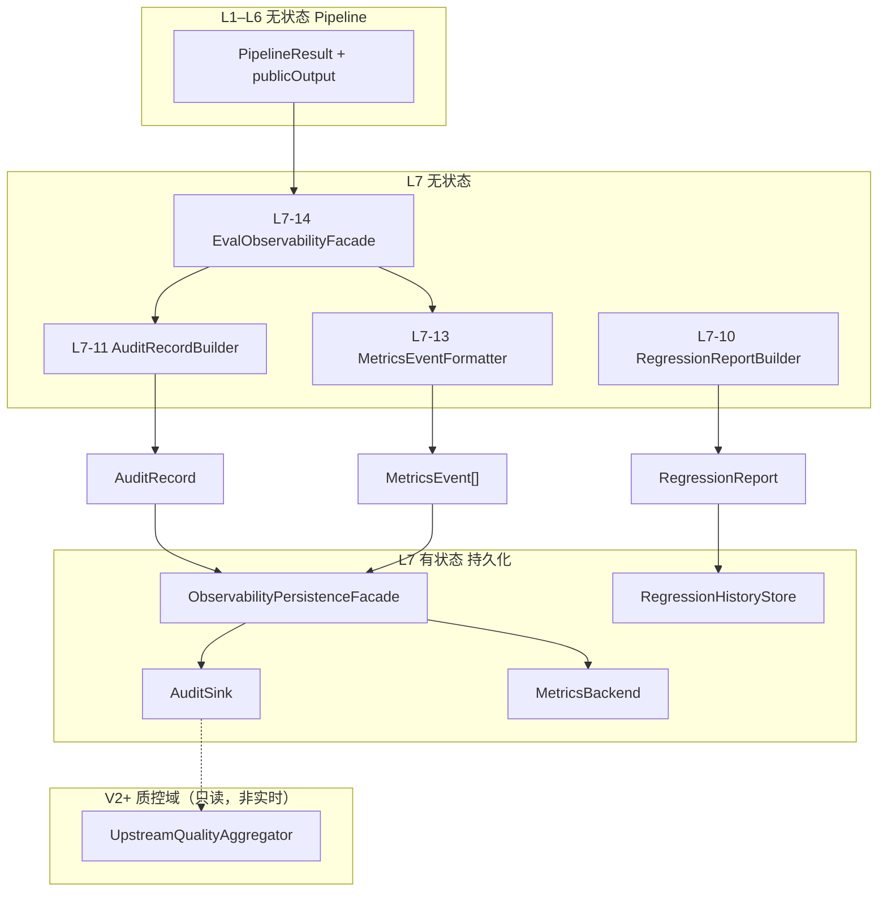

# L7 边界有状态 — 观测与评测持久化组件设计

本文档描述 **L7 评测与观测层边界外的有状态组件**，与 `L7-stateless-components.md` 明确隔离。  
**设计依据**：`overall.md`、L7 无状态设计（`L7-11`～`L7-14`、`CaseRegressionRunner`）、L1 `AccessGate`、L2 `PipelineResult`、ToC 传统多用户（非多租户）、「审计不反哺 Pipeline、评测与 serving 解耦」等架构结论。

---

## 一、L7 边界有状态层定位

### 1.1 职责（只持久化观测与评测产物，不参与决策）

L7 有状态层是 **质量闭环的「写入端」**：承接无状态层已构建好的 `AuditRecord`、`MetricsEvent[]`、`RegressionReport`，将其 **可靠或 best-effort 地落盘/入仓**，供排障、SLO、CI 门禁与 V2 只读质控使用。

| 做 | 不做 |
|----|------|
| 持久化单次分诊审计记录 | 修改 `finalRiskLevel` 或 `publicOutput` |
| 推送低基数指标到时序系统 | 在实时路径读取历史 Audit 做裁决 |
| 存储 CI 回归报告与历史对比 | 根据失败率自动改 RuleKB |
| 脱敏、留存期、擦除（ToC 合规） | 替代 L5 Guard 或 L6 schema 修复 |
| 审计写入失败时的 DLQ/告警 | 阻塞用户响应等待写库成功 |
| 回归历史「本次 vs 上次」查询（CI） | 多租户分库、租户级评测策略 |

### 1.2 与 L7 无状态的分工



| 阶段 | 层级 | 说明 |
|------|------|------|
| 组装 | L7 无状态 | 纯函数构建 AuditRecord / Report / Metrics |
| 写入 | L7 有状态 | `write` / `emit` / `store` |
| 用户响应 | L1 | **先于或并行** 持久化完成即可返回 200 |
| 医学决策 | L3–L6 | **永不** read AuditSink |

**原则**：

- `L7-14 Facade` **只构建**，不 `import` DB/Redis 客户端；持久化由 **ObservabilityPersistenceFacade**（有状态）在 Handler 外层调用。
- 离线 `runRegression` 结束后 **单独** 写 `RegressionHistoryStore`，与在线 Audit 路径解耦。

### 1.3 双模式与有状态组件映射

| 模式 | 无状态产出 | 有状态组件 |
|------|-----------|-----------|
| **在线观测**（每请求） | AuditRecord + MetricsEvent[] | AuditSink + MetricsBackend |
| **离线回归**（CI） | RegressionReport | RegressionHistoryStore |
| **访问拒绝**（未进 Pipeline，可选） | SecurityEvent | SecurityEventSink（可选） |

### 1.4 ToC 多用户前提（非多租户）

- 审计可含 `userId`（来自 L1 `AuthContext`），但须 **脱敏策略** 与留存配置；**无** tenantId 分库。
- 全站共用一套评测策略版本（`policyVersion` 写入 Report/Audit）；回归历史 **全局一份**，不按用户分表。
- 用户注销时支持按 `userId` 擦除或匿名化审计（合规）。

### 1.5 有状态定义（L7 边界范围内）

> L7 有状态层保存的是 **已发生的观测与评测结果快照**；不保存「如何改 risk」的学习状态。给定同一份 `AuditRecord`，写入多次应幂等（按 `traceId` 去重），且 **读取历史记录不得进入 V1 实时分诊 Pipeline**。

---

## 二、在请求生命周期中的位置

### 2.1 在线路径（`/health` / `/intelligent`）

```
AccessGate（可选失败 → SecurityEventSink，不进 AuditSink 分诊审计）
  → L1 Facade → L2 Pipeline → L1 OutputMapper → publicOutput
  → [返回用户 200]（主路径）
  → [并行/异步] L7-14 observe() → AuditRecord + MetricsEvent[]
  → ObservabilityPersistenceFacade.persist(...)
       → AuditSink.write
       → MetricsBackend.emit
```

**铁律**：AuditSink 写失败 **不** 改变已返回的 `publicOutput`。

### 2.2 离线路径（CI `run_cases`）

```
L7-02 CaseRegressionRunner → 每 case Pipeline
  → L7-03～09 Matchers → L7-10 RegressionReportBuilder
  → RegressionHistoryStore.store(report)
  → CI 读取 passRate / failedCases → 退出码
```

Runner **不** 为每个 case 写生产级 AuditSink（可选 debug 模式写本地 JSONL）。

### 2.3 与 L2 文档协作点对照

| L2 无状态表述 | L7 有状态落点 |
|--------------|--------------|
| `degradationEvents` 记入 PipelineResult | 进入 AuditRecord，经 AuditSink 持久化 |
| TraceContext 生成 | `traceId` 为 Audit 主键之一 |
| 观测副作用不参与调度 | AuditSink 异步，不反馈 L2 |

---

## 三、L7 有状态组件清单

### 3.1 V1 核心

| 组件 ID | 组件名 | 核心职责 |
|---------|--------|----------|
| ST-L7-01 | AuditRecordSerializer | AuditRecord → 存储行/文档 |
| ST-L7-02 | PIIRedactionEnforcer | 写入前脱敏 |
| ST-L7-03 | AuditRecordRepository | 审计存储抽象 |
| ST-L7-04 | AuditSinkFacade | `write(AuditRecord)` 唯一审计入口 |
| ST-L7-05 | MetricsCardinalityGuard | 写入前标签白名单校验 |
| ST-L7-06 | MetricsBackendAdapter | `emit(MetricsEvent[])` |
| ST-L7-07 | ObservabilityPersistenceFacade | 在线 observe 后统一 persist |
| ST-L7-08 | RetentionLifecycleManager | 留存、滚动、擦除 |

### 3.2 V1.x 增强

| 组件 ID | 组件名 | 核心职责 |
|---------|--------|----------|
| ST-L7-09 | RegressionReportStore | 持久化 RegressionReport |
| ST-L7-10 | RegressionHistoryQuery | CI「本次 vs 上次」对比 |
| ST-L7-11 | AuditDeadLetterQueue | 审计写入失败缓冲 |
| ST-L7-12 | SecurityEventSink | AccessGate 拒绝事件（可选） |

### 3.3 V2+（质控域，只读下游，非实时 L7 包内逻辑）

| 组件 | 说明 |
|------|------|
| UpstreamQualityAggregator | 只读 Audit 聚合，**不进 Pipeline** |
| AlertStateEngine | 指标/审计聚合告警，**不改 risk** |

建议放在 `quality/stateful/`，**消费** L7 已落库数据，不并入 `eval/stateful` 实时写入路径。

---

## 四、核心数据对象与接口契约

### 4.1 AuditSink 接口（L7 无状态依赖的抽象）

```
write(record: AuditRecord) → WriteResult
writeBatch(records[]) → BatchWriteResult   // 离线批量可选
```

**WriteResult**

| 字段 | 说明 |
|------|------|
| ok | boolean |
| storageId | 外部系统 id（可选） |
| errorCode | STORAGE_UNAVAILABLE / SERIALIZE_ERROR |

**幂等键**：`traceId`（同 trace 重复写应 no-op 或覆盖同文档）。

### 4.2 MetricsBackend 接口

```
emit(events: MetricsEvent[]) → EmitResult
flush() → void   // 进程退出前可选
```

与 L7-13 产出 **一一对应**；Sink 侧二次校验 CFG-L7-06 白名单。

### 4.3 RegressionHistoryStore 接口

```
store(report: RegressionReport) → StoreResult
getLatest(runContext?) → RegressionReport | null
list(limit, offset) → RegressionReportSummary[]
compare(current, baseline) → RegressionDiff   // V1.x
```

### 4.4 StoredAuditDocument（持久化投影）

在 `AuditRecord`（CFG-L7-05）基础上，Storage 层可增加：

| 字段 | 说明 |
|------|------|
| recordSchemaVersion | 审计 schema 版本 |
| ingestedAt | 入库时间 |
| redactionProfile | 使用的脱敏配置 id |
| storageShard | 物理分片（按日期，非租户） |

**禁止新增医学决策字段**（如「建议下调 risk」）。

---

## 五、组件逐一设计

---

### ST-L7-01 AuditRecordSerializer（审计记录序列化器）

#### 职责

将 L7-11 产出的 `AuditRecord` 转为存储后端可接受的 JSON/列式行。

#### 输入/输出

- 输入：`AuditRecord`  
- 输出：`SerializedAuditPayload`（bytes 或 structured row）

#### 规则

- 字段集 **不得** 大于 CFG-L7-05 允许集合（防无状态层漂移后泄漏）  
- 大字段（如完整 `executionSummary`）可配置 **截断**  
- `caseEvalDelta` 仅测试模式序列化；生产可省略

#### 无状态性

纯函数，可单测；放在有状态包因其与 Storage 格式紧耦合。

---

### ST-L7-02 PIIRedactionEnforcer（隐私脱敏执行器）

#### 职责

在 **写入存储前** 对 `AuditRecord` 做脱敏（最后一道闸）。

#### 可配置项（ToC）

| 字段 | 默认策略 |
|------|---------|
| userId | 哈希或后四位 |
| petId | 哈希（排障用可选保留） |
| userReport 摘要 | 不存原文；仅长度/hash |
| pet.name | 不存或掩码 |
| sessionId | 可存（低敏感）或哈希 |

#### 与 L7-11 关系

- L7-11 已默认不记完整 userReport；Sink 层 **防御性** 再扫一遍  
- vitals 数值：产品合规允许则保留用于排障；可配置关闭

#### 明确不做

- 脱敏 **不改变** 已返回给用户的 `publicOutput`（仅影响存储副本）

---

### ST-L7-03 AuditRecordRepository（审计记录仓储）

#### 职责

`SerializedAuditPayload` 的 CRUD 抽象。

#### 实现选型

| 环境 | 方案 |
|------|------|
| 开发 | JSONL 按日滚动文件 |
| 生产 | 列存（ClickHouse）/ ES / 云日志仓 |
| 测试 | InMemory 列表 |

#### 分区策略（ToC 全局）

- 按 **日期** + `traceId` 索引  
- **不按** tenant 分库  
- 可选二级索引：`petIdHash`、`userIdHash`、`finalRiskLevel`、`degraded`

#### 明确不做

- 不提供「给 L4 读最近 N 次 risk」的 API（V1 禁止）

---

### ST-L7-04 AuditSinkFacade（审计下沉门面）

#### 职责

审计写入 **唯一入口**；编排 Serializer → Redaction → Repository → DLQ。

#### write 流程（概念）

```
1. 校验 recordSchemaVersion
2. PIIRedactionEnforcer.apply
3. AuditRecordSerializer.serialize
4. Repository.put(idempotentKey=traceId)
5. 失败 → AuditDeadLetterQueue.offer（可选）
6. 返回 WriteResult
```

#### 性能与可用性

- **异步调用** 为主（队列 + worker 或 fire-and-forget goroutine）  
- 同步 write 仅用于集成测  
- 目标：不增加用户响应 P99（< 1ms 主线程占用）

#### 与 Pipeline 边界

- 只接受 **已完成** 分诊的 `AuditRecord`  
- AccessGate 拒绝 **不走** 本 Facade（见 ST-L7-12）

---

### ST-L7-05 MetricsCardinalityGuard（指标基数守卫）

#### 职责

在 emit 前校验 `MetricsEvent` 标签符合 CFG-L7-06。

#### 拒绝规则

| 标签 | 处理 |
|------|------|
| petId、userId、caseId（生产） | 丢弃事件 + 内部计数 `metric_rejected_total` |
| riskLevel、degraded、stepId、entry | 允许 |
| 未知标签 | 丢弃或剥离（可配置） |

#### 原则

ToC 用户量大，**高基数标签不进时序库**；用户级问题用 `traceId` 关联 Audit 查。

---

### ST-L7-06 MetricsBackendAdapter（指标后端适配器）

#### 职责

将 `MetricsEvent[]` 推送到 Prometheus / OTel Collector / 云监控。

#### 状态

- Collector 客户端缓冲、批量 flush 间隔  
- 与 Audit **独立**：Metrics 失败不影响 Audit

#### V1 核心指标（与 L7-13 对齐）

| 指标 | 用途 |
|------|------|
| `triage_requests_total` | 量 |
| `triage_risk_level_total` | 风险分布 |
| `triage_step_duration_ms` | 性能 |
| `triage_degraded_total` | 降级 |
| `triage_guard_violation_total` | 合规 |
| `llm_invoke_*` | 可接收 L4 Pool 遥测（若经 L7 汇总） |
| `audit_write_fail_total` | Sink 健康 |
| `session_save_fail_total` | L2 Session 可选上报 |

---

### ST-L7-07 ObservabilityPersistenceFacade（观测持久化门面）

#### 职责

在线路径 **统一** 调用 AuditSink + MetricsBackend；对 HTTP Handler 隐藏细节。

#### persist 输入

| 字段 | 来源 |
|------|------|
| auditRecord | L7-14 `observe()` |
| metricsEvents | L7-14 `observe()` |
| persistMode | async / sync_debug |

#### persist 流程

```
MetricsCardinalityGuard.filter(events)
  → MetricsBackendAdapter.emit
AuditSinkFacade.write(auditRecord)   // 并行
```

#### 与 L7-14 边界

```
observeResult = L7-14.observe(pipelineBundle)   // 无状态
ObservabilityPersistenceFacade.persist(observeResult)   // 有状态
```

L7-14 **不** 调用本 Facade。

---

### ST-L7-08 RetentionLifecycleManager（留存生命周期管理）

#### 职责

审计与回归历史的保留、归档、擦除。

#### 策略（可配置）

| 类型 | 默认 |
|------|------|
| Audit 热数据 | 90 天在线 |
| Audit 冷归档 | 对象存储 1 年 |
| RegressionReport | 永久保留最近 N 次 + 重要 release 标签 |
| 用户注销 | `eraseByUserIdHash` 任务 |

#### 与 ToC 合规

- 支持「删除我的数据」触达 Audit 擦除  
- **不** 擦除已聚合的匿名统计（若法律要求则停聚合）

---

### ST-L7-09 RegressionReportStore（回归报告存储）

#### 职责

持久化 L7-10 产出的 `RegressionReport`，服务 CI 与发布门禁。

#### 存储内容

| 字段 | 说明 |
|------|------|
| runId | UUID |
| timestamp | |
| gitSha、branch | |
| datasetVersion | |
| policyVersion | eval + synonym + forbidden |
| passRate、failedCases[] | |
| llmMode | off / mock / live |
| fullReportRef | 对象存储指针或内联 JSON |

#### 边界

- **仅 CI/发布读写**；serving 不读  
- **禁止** 根据 store 内失败率 webhook 自动改 ConfigRelease

---

### ST-L7-10 RegressionHistoryQuery（回归历史查询，V1.x）

#### 职责

只读对比：`main` 上次 pass vs 当前 branch；输出 `RegressionDiff` 供 PR 评论。

#### 输出示例语义

- 新增失败 caseIds  
- 风险评测退化 / 语义退化分类计数  
- 不修改任何 Pipeline 配置

---

### ST-L7-11 AuditDeadLetterQueue（审计死信队列，可选）

#### 职责

AuditSink 写失败时暂存 payload，后台重试。

#### 状态

- 队列深度、重试次数、最终丢弃计数  
- 告警：`audit_dlq_depth` 超阈

#### 边界

- DLQ 重试成功 **不** 触发任何分诊逻辑  
- 仅运维可见

---

### ST-L7-12 SecurityEventSink（安全事件下沉，可选）

#### 职责

持久化 **未进入 Pipeline** 的 AccessGate 拒绝事件（401/403/429）。

#### 事件字段

| 字段 | 说明 |
|------|------|
| timestamp | |
| userIdHash | |
| reasonCode | AUTH_* / PET_ACCESS_DENIED / RATE_LIMIT_* |
| entry | health / intelligent |
| clientIpHash | 可选 |

#### 与 AuditSink 区分

| AuditSink | SecurityEventSink |
|-----------|-------------------|
| 分诊完成后的医学决策审计 | 门禁拒绝，无 riskLevel |
| 含 ruleHits、finalRisk | 仅安全码 |

避免把「未分诊」与「已分诊」混在同一表导致分析偏差。

---

## 六、AuditRecord 持久化字段与上游映射

与 L7-11 区块对齐，并扩展 **ToC 元数据**（来自 L1/L2）：

| 区块 | 字段示例 | 上游 |
|------|---------|------|
| trace | traceId, pipelineId, latencyMs | L2 |
| identity（脱敏后） | userIdHash, sessionId, entry | L1 AuthContext |
| inputSummary | dataQuality, missingData, species, ageRisk | L3 摘要 |
| contextSummary | trust 分布、flags | L3 |
| decisionSummary | riskFloor, candidateRisk, finalRisk, confidence | L4 |
| ruleHits[] | ruleId | L4 |
| arbitrationReasons[] | | L4 |
| llmMeta | invoked, errorType, latencyMs, degraded | L4 Pool + L2 |
| guardSummary | violation codes, sanitization | L5 |
| outputSummary | riskLevel, evidenceCount | L6 |
| composeMeta | templateUsed, degraded | L6 |
| execution | steps[], degradationEvents, shortCircuit | L2 L7-12 |
| versions | ruleKb, guard, evalPolicy, pipeline | ConfigRelease |
| sessionMeta | turnIndex, sessionSaveOk | L2 Session（intelligent） |
| caseEvalDelta | 仅 testMode | case.expected |

---

## 七、与上下游接口契约

### 7.1 上游（L7 无状态）

| 来源 | 接口 |
|------|------|
| L7-14 `observe()` | `ObserveResult { auditRecord, metricsEvents }` |
| L7-10 `runRegression()` | `RegressionReport` |

无状态包 **只定义** `AuditSink` / `MetricsBackend` / `RegressionReportStore` **接口**。

### 7.2 上游（Pipeline / Handler）

| 字段 | 说明 |
|------|------|
| PipelineResult | 须在 observe 前完整 |
| publicOutput | 已返回用户 |
| AuthContext | 进入 Audit identity 区 |

Handler 责任：先响应用户，再 `persist`（或投递异步任务）。

### 7.3 下游（V2 质控域，只读）

```
AuditRecordRepository（只读副本或 OLAP）
  → UpstreamQualityAggregator
  → 运营报表 / 告警
```

**红线**：Aggregator 结果 **不得** 注入 L2/L3/L4 实时路径。

### 7.4 与其他有状态层

| 层 | 关系 |
|----|------|
| L1 AccessGate | 拒绝 → SecurityEventSink；通过 → 正常 Audit |
| L2 SessionStore | sessionMeta 写入 Audit；Session 不读 Audit |
| L4 LLMRuntimePool | llm 遥测经 L4-07 llmMeta → Audit / Metrics |
| infrastructure ConfigRelease | version 字段写入 Audit/Report |

---

## 八、错误处理与运维语义

| 场景 | 用户侧 | 运维侧 |
|------|--------|--------|
| AuditSink 失败 | 无感知，200 正常 | audit_write_fail_total ↑，DLQ |
| Metrics 失败 | 无感知 | metrics_emit_fail_total |
| 脱敏配置过严 | 无感知 | 排障字段减少 |
| RegressionStore 失败 | CI 失败（非用户） | 发布阻断 |
| 磁盘满 | 无感知 | 告警 + DLQ 丢弃策略 |

**原则**：观测层故障 **永不** 改变医学输出；宁可丢审计，不可拖垮或篡改分诊。

---

## 九、代码管理与分包建议

```
eval/
  stateless/                 # 已有 L7-01～14
  stateful/
    observability/
      audit_serializer/
      pii_redaction/
      audit_repository/
      audit_sink_facade/
      audit_dlq/
      metrics_guard/
      metrics_backend/
      persistence_facade/
      retention/
    regression/
      report_store/
      history_query/
    security/                # 可选
      security_event_sink/
    contracts/               # Sink 接口、WriteResult
    config/                  # 留存、脱敏、基数策略
  # V2+ 只读质控
quality/
  stateful/
    upstream_quality_aggregator/
    alert_state_engine/
```

### 依赖规则

| 允许 | 禁止 |
|------|------|
| `stateless` → Sink **接口** | `stateless` → Repository 实现 |
| `stateful` → DB/Redis/OTel SDK | L3–L6 → AuditSink.read |
| Handler → PersistenceFacade | AuditSink → RuleEngine / Arbiter |
| `quality` 只读 `audit_repository` 副本 | `quality` → 实时 Pipeline |
| 测试 InMemoryAuditSink | L7 有状态 import L4 决策逻辑 |

---

## 十、测试策略（L7 有状态专属）

### 10.1 单测

| 组件 | 要点 |
|------|------|
| PIIRedactionEnforcer | userId/pet.name 掩码 |
| MetricsCardinalityGuard | 非法标签丢弃 |
| AuditRecordSerializer | 与 CFG-L7-05 快照一致 |
| AuditSinkFacade | traceId 幂等 |
| RegressionReportStore | store/getLatest |

### 10.2 集成测

| 场景 | 预期 |
|------|------|
| 全 Pipeline 完成 | Audit 含 finalRisk、ruleHits |
| 用户响应先于 Audit 完成 | 200 不等待写库 |
| observe 失败 | 不影响 publicOutput |
| CI 回归 | Report 入库 + 退出码 |

### 10.3 与 20 case

| 模式 | AuditSink |
|------|-----------|
| case 回归 | 默认 **不写** 生产 Audit（或写 isolated test 前缀） |
| 在线 mock | testMode 可写 caseEvalDelta |

避免 CI 污染生产审计索引。

---

## 十一、非功能要求（ToC）

| 维度 | 要求 |
|------|------|
| 延迟 | 主线程异步；persist 不阻塞 P99 响应 |
| 吞吐 | 支持峰值 QPS 批量 Metrics emit |
| 存储 | Audit 按日分区；可水平扩展 |
| 隐私 | 脱敏可配置；用户擦除 |
| 安全 | Audit 访问权限运维 RBAC；不含 API Key |
| 确定性 | 同 AuditRecord 序列化结果稳定 |
| 合规 | 留存策略可审计 |

---

## 十二、明确排除（不得放入 L7 有状态持久化）

| 能力 | 归属 / 原因 |
|------|------------|
| 实时读取 Audit 调 risk | **严禁** |
| 按失败率自动改 RuleKB | 禁止 |
| LLM 评 mustMention | V1 禁止 |
| 会话内容存储 | L2 SessionStore |
| 用户 API 限流计数 | L1 AccessGate |
| LLM 连接池状态 | L4 LLMRuntimePool |
| 决策型时序记忆 | V2 审慎，非 L7 写入 |
| 多租户分库 | 不适用 |
| 用 Audit 做 response 缓存 | 禁止 |

---

## 十三、V1 实施顺序

| 优先级 | 交付物 |
|--------|--------|
| P0 | AuditSinkFacade + InMemory/JSONL Repository + Serializer |
| P0 | ObservabilityPersistenceFacade（async） |
| P1 | PIIRedaction + MetricsBackend + CardinalityGuard |
| P1 | 与 L7-14 observe 联调 |
| P2 | RegressionReportStore + CI 门禁 |
| P2 | RetentionLifecycleManager |
| P3 | AuditDeadLetterQueue + SecurityEventSink |
| V2 | UpstreamQualityAggregator（只读质控域） |

---

## 十四、总结

L7 边界有状态以 **观测与评测持久化** 为核心，共 **8 个 V1 核心 + 4 个 V1.x 可选 + V2 只读质控域**：

**V1 核心**

1. **AuditRecordSerializer** — 存储格式  
2. **PIIRedactionEnforcer** — 写入前脱敏  
3. **AuditRecordRepository** — 审计仓储  
4. **AuditSinkFacade** — 审计写入唯一入口  
5. **MetricsCardinalityGuard** — 标签白名单  
6. **MetricsBackendAdapter** — 指标推送  
7. **ObservabilityPersistenceFacade** — 在线 persist 编排  
8. **RetentionLifecycleManager** — 留存与擦除  

**V1.x**

9. **RegressionReportStore** — CI 报告入库  
10. **RegressionHistoryQuery** — 历史对比  
11. **AuditDeadLetterQueue** — 写失败重试  
12. **SecurityEventSink** — 门禁拒绝事件（可选）  

**核心原则**：

- **无状态构建、有状态写入**；L7-14 永不碰 DB。  
- **审计与决策分离**：V1 Pipeline **禁止** read AuditSink。  
- **Serving 解耦**：写失败不阻断 200，不改变 risk。  
- **ToC 全局审计 + 脱敏**：无租户分库；用户擦除可触达。  
- **离线回归历史服务 CI**，不反哺实时分诊。  

与 `L7-stateless-components.md` 对称：**无状态回答「测得对不对、记什么」；有状态回答「存哪儿、存多久、怎么脱敏、怎么不拖垮用户」**。与 L1/L2/L4 有状态共同构成完整边界：**谁进门、多轮说了什么、模型怎么调、事后怎么查** — 四者均 **不参与 finalRisk 裁决**。