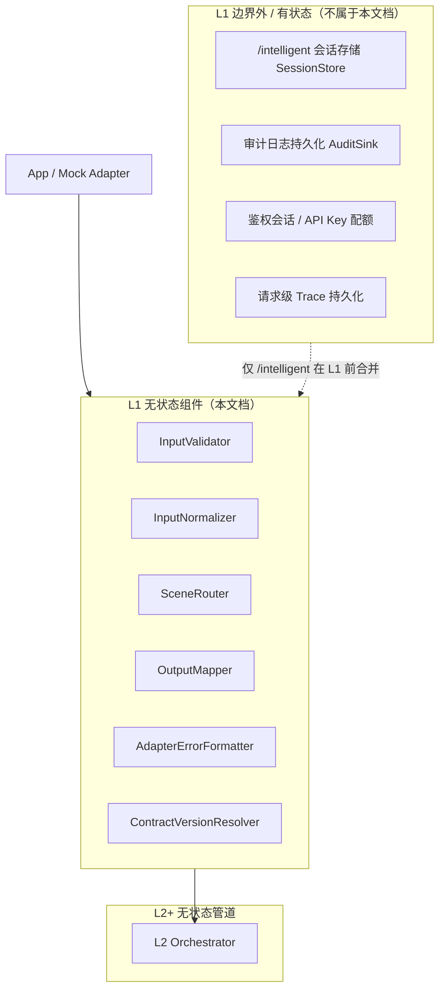

# L1 接入层 — 无状态组件设计

本文档仅描述 **L1 接入层（Adapter）的无状态组件**，与有状态组件明确隔离，便于后续代码分包、单测与复用。设计依据：`overall.md` 七层架构、input/output schema V1、20 case 验收前提。

---

## 一、L1 层定位与边界

### 1.1 职责（只做契约，不做医学）

L1 是 **App / Mock Adapter 与 Agent 内核之间的唯一边界**：

| 做 | 不做 |
|----|------|
| 输入校验与归一化 | 风险判断、证据融合 |
| 入口路由（选择 pipeline 变体） | 读取历史请求、会话记忆 |
| 内部结果 → 对外 output 映射 | 补全缺失医学数据 |
| 对外错误结构与 HTTP/API 封装 | 调用 LLM、执行规则引擎 |

### 1.2 无状态定义（L1 范围内）

> 给定同一份原始请求体 + 固定 schema 版本 + 固定路由配置，L1 无状态组件的输出完全可复现，**不读写数据库、缓存、会话存储**。

### 1.3 L1 无状态 vs 有状态隔离



**原则**：有状态能力若在 `/intelligent` 需要，应在 **L1 之前的会话适配器** 或 **L3 之前的会话合并器** 实现，不污染 L1 无状态组件本体。

---

## 二、L1 无状态组件清单

| 组件 ID | 组件名 | 核心职责 |
|---------|--------|----------|
| L1-01 | InputValidator | 契约校验，拒绝非法输入 |
| L1-02 | InputNormalizer | 表示归一化，不改医学语义 |
| L1-03 | SceneRouter | 按入口/scene 选择 pipeline 计划 |
| L1-04 | OutputMapper | 内部结果 → 对外 output_schema |
| L1-05 | AdapterErrorFormatter | 统一对外错误结构 |
| L1-06 | ContractVersionResolver | input/output schema 版本解析与兼容 |

可选但建议纳入 L1 无状态包：

| 组件 ID | 组件名 | 说明 |
|---------|--------|------|
| L1-07 | HealthTriageAdapterFacade | 门面，串联 L1-01～06，对外单一入口 |

---

## 三、组件逐一设计

---

### L1-01 InputValidator（输入校验器）

#### 职责

验证 App 提交的 input 是否满足 `xiaozhua.health_agent.input.v1` 语义契约。**只判断「格式与必填是否合法」**，不判断医学合理性。

#### 无状态保证

- 仅依赖：原始 input JSON + 内置 schema 定义（静态版本化配置）
- 不查历史、不查 pet 档案服务

#### 输入

| 字段 | 类型 | 说明 |
|------|------|------|
| rawInput | object | App 原始 JSON |
| schemaVersion | string | 默认 `xiaozhua.health_agent.input.v1` |

#### 输出

| 字段 | 类型 | 说明 |
|------|------|------|
| valid | boolean | 是否通过 |
| errors | ValidationError[] | 失败时错误列表 |
| warnings | ValidationWarning[] | 非阻断警告（可选） |

`ValidationError` 应包含：`fieldPath`、`code`、`message`、`severity`。

#### 校验范围

**1. 顶层必填字段**

`caseId`、`scene`、`timestamp`、`pet`、`device`、`vitals`、`healthEvidence`、`userReport`、`context`、`missingData`

**2. scene 枚举**

仅允许 `health_triage`（V1）

**3. timestamp**

ISO-8601 可解析；是否未来时间可做 warning，不阻断（时钟偏差场景）

**4. pet 必填子字段**

`petId`、`name`、`species`、`ageMonths`、`weightKg`

**5. device 必填子字段**

`deviceOnline`、`lastSeenAt`、`dataQuality`

**6. 枚举合法性**（出现即校验，不出现不补）

- `pet.species`: dog | cat | unknown  
- `pet.sex`: male | female | unknown  
- `device.dataQuality`: good | partial | stale | missing  
- `healthEvidence.riskLevel`: normal | watch | warning | emergency | unknown  
- `healthEvidence.confidence`: low | medium | high  
- signals 内 `id`、`category`、`riskLevel`、`confidence`  
- `userReport` 各枚举字段  
- `vitals.activityLevel`、`sleepQuality`  
- `missingData[]` 项枚举  

**7. 类型检查**

- 数值字段为 number 或 null（按 schema 约定）
- 布尔字段为 boolean 或 null
- 数组字段为 array

#### 明确不做

| 不做 | 原因 |
|------|------|
| 补全缺失字段 | 属于编造或越权 |
| 判断体温是否异常 | 属于 L4 |
| 修正明显错误的 baseline | 属于 L3 SignalTrustScorer |
| 因 device 离线而改 riskLevel | 属于 L4 RuleEngine |

#### 错误策略

- `valid=false` → 交由 L1-05 格式化为 4xx，**不进入 L2 pipeline**
- 区分 `INVALID_SCHEMA`（客户端错）与 `UNSUPPORTED_VERSION`（版本错）

#### 单测要点

- 20 case 的 input 必须全部 pass
- 故意缺字段、错枚举、坏时间格式的负例
- 每条 error 的 fieldPath 精确到路径

---

### L1-02 InputNormalizer（输入归一化器）

#### 职责

在 **通过校验** 的前提下，统一 input 的「表示形式」，降低 L3/L4 分支复杂度。**只改写法，不改含义。**

#### 无状态保证

- 纯函数：`NormalizedInput = f(ValidatedInput)`
- 无外部 IO

#### 输入

| 字段 | 说明 |
|------|------|
| validatedInput | 已通过 L1-01 的 input |
| normalizationProfile | 归一化配置版本（静态） |

#### 输出

`NormalizedInput`：结构上与 input 相同，但表示统一。

#### 归一化规则

**1. 字符串**

- 顶层与嵌套文本 `trim`
- 空字符串与 null 策略：保持 schema 原意，不把 null 改成默认值

**2. 枚举大小写与别名**

- 统一为小写 canonical 值（如 `Dog` → `dog`）
- 仅接受 schema 已知别名，未知别名应在 Validator 阶段已拒绝

**3. 数组**

- `missingData`、`symptoms`、`chronicConditions` 等：去重、稳定排序（便于 diff 与单测）
- 空数组保持 `[]`，不改为 null

**4. 数值**

- 不四舍五入医学数值（体温 39.30 保持原精度）
- `null` 保持 `null`，不填 0

**5. 时间**

- 保留原始 ISO 字符串，可选附加解析后的 `timestampEpochMs` 作为 **Normalizer 附加元数据**（仅内部管道使用，不回流 App）

**6. 嵌套对象**

- 不展平、不删字段
- 确保 `healthEvidence.signals` 即使为空也是 `[]`

#### 内部元数据（仍属无状态附加层）

Normalizer 可在 `NormalizedInput` 外包装一层 **管道元数据**（非 App 契约字段）：

| 元数据 | 用途 |
|--------|------|
| normalizationVersion | 追踪归一化配置版本 |
| canonicalTimestamp | 供 L3 新鲜度计算 |

该元数据 **不得** 由 OutputMapper 返回给 App。

#### 明确不做

| 不做 | 归属 |
|------|------|
| 根据 ageMonths 推断 ageRisk | L3 ContextModifierExtractor |
| 把 missing 改成 watch | L4 |
| 合并 userReport 与 healthEvidence | L3/L4 |

#### 单测要点

- 归一化前后医学语义等价（除排序/trim）
- 20 case 归一化结果稳定快照
- 同一 input 多次调用输出一致

---

### L1-03 SceneRouter（场景路由器）

#### 职责

根据 **HTTP/API 入口** 与 input 中的 `scene`，生成 **PipelinePlan**，告诉 L2 走哪条编排变体。

#### 无状态保证

- 路由表为静态配置
- 不读取会话；`/intelligent` 的会话合并发生在路由之前或 L3 之前

#### 输入

| 字段 | 说明 |
|------|------|
| endpoint | `health` \| `intelligent` |
| scene | 来自 input.scene |
| schemaVersion | 契约版本 |

#### 输出

`PipelinePlan`：

| 字段 | 说明 |
|------|------|
| pipelineId | 如 `health_triage_v1_sync` |
| corePipeline | 是否走标准 L3–L6 分诊核心 |
| requiresSessionMerge | boolean，仅告知 L2 是否需调用外部 Session（L1 不执行合并） |
| options | 如 `enableLlm`、`debugMode` |
| contractVersion | 传递给下游 |

#### V1 路由表

| endpoint | scene | pipelineId | 说明 |
|----------|-------|------------|------|
| health | health_triage | health_triage_v1_sync | 标准单次分诊 |
| intelligent | health_triage | intelligent_wrap_v1 | 对话包装 + 同一分诊核心 |

#### 错误策略

- `scene` 非 `health_triage` → `UNSUPPORTED_SCENE`
- endpoint 未知 → `UNKNOWN_ENDPOINT`

#### 与有状态边界

`requiresSessionMerge=true` 时，L2 调用 **外部 SessionMerger（有状态）**，SceneRouter **只打标，不访问会话**。

#### 单测要点

- 路由表全覆盖
- 非法 scene/endpoint 负例

---

### L1-04 OutputMapper（输出映射器）

#### 职责

将 L6 产出的 **内部组合结果 `ComposedOutput`** 映射为 App 可见的 `xiaozhua.health_agent.output.v1`  JSON，并处理 debug 可见性。

#### 无状态保证

- 纯映射：对外 output 完全由当次 `ComposedOutput` + 映射配置决定

#### 输入

| 字段 | 说明 |
|------|------|
| composedOutput | L6 OutputFieldComposer 产物 |
| internalAudit | 可选，含 trust、ruleHits、arbitrationReason |
| mappingOptions | `debugMode`、`locale` 等 |

#### 输出

| 字段 | 说明 |
|------|------|
| publicOutput | 符合 output_schema 的 JSON |
| debugPayload | 仅 debugMode 时附加 |

#### 对外必填字段映射

确保输出包含 schema 全部 `requiredTopLevelFields`：

`riskLevel`、`scene`、`title`、`summary`、`evidence`、`recommendation`、`whenToSeeVet`、`missingData`、`confidence`、`safetyNotice`、`primaryAction`

以及可选 `secondaryAction`。

#### 字段映射规则

| 对外字段 | 来源 | 约束 |
|---------|------|------|
| riskLevel | Arbiter 最终值 | 禁止在 L1 修改 |
| scene | 固定 `health_triage` | |
| title/summary/... | L6 文案 | 仅裁剪长度，不改医学含义 |
| evidence | 审查通过列表 | 保持 string[] |
| missingData | 用户可读翻译 | 可与 input.missingData 对应 |
| primaryAction | ActionRouteResolver | label + route |
| secondaryAction | 可 null | |

#### 内部字段剥离（默认）

以下 **不得** 出现在 publicOutput：

- signalTrustScores  
- ruleHits  
- arbitrationReasons  
- contradictionFlags  
- candidateRisks  
- llmRawDraft  

#### debugMode 行为

`debugMode=true` 时，`debugPayload` 可包含：

- 最终 risk 与 ruleFloor  
- 命中规则 ID 列表  
- 仲裁原因摘要  
- Guard 修正项  

**仍不暴露**完整 prompt 或用户隐私扩展字段（除非产品明确要求）。

#### 明确不做

| 不做 | 原因 |
|------|------|
| 因 App 喜好改 riskLevel | 破坏医学一致性 |
| 自动翻译英文 | V1 中文产品可固定 locale |
| 缓存 output | 有状态 |

#### 单测要点

- 20 case 的 expected 字段层级覆盖
- 默认模式无内部字段泄漏
- debug 模式含指定调试信息

---

### L1-05 AdapterErrorFormatter（接入层错误格式化器）

#### 职责

将 L1 校验失败、路由失败、以及 L2 传来的 **可预期业务失败** 统一为 App 可消费的错误响应。**不参与医学决策。**

#### 无状态保证

- 错误码表静态配置
- `format(error) → ErrorResponse`

#### 输入

| 字段 | 说明 |
|------|------|
| errorType | 枚举错误码 |
| details | 结构化细节（如 ValidationError[]） |
| traceId | 请求级 trace（透传，非生成依赖存储） |

#### 输出

`AdapterErrorResponse`：

| 字段 | 说明 |
|------|------|
| success | false |
| error.code | 机器可读 |
| error.message | 用户/开发可读 |
| error.details | 可选 |
| traceId | 链路追踪 |

#### 错误码分层（L1 域）

| code | 场景 | HTTP 建议 |
|------|------|-----------|
| INVALID_INPUT | 校验失败 | 400 |
| UNSUPPORTED_SCENE | scene 不支持 | 400 |
| UNSUPPORTED_SCHEMA_VERSION | 版本不匹配 | 400 |
| UNKNOWN_ENDPOINT | 路由失败 | 404 |
| PIPELINE_FAILURE | L2 未预期失败 | 500 |
| DEGRADED_SUCCESS | 降级成功（可选 warning） | 200 + meta |

#### 与降级成功区分

当 L2 走 FallbackTemplate 仍返回合法 output 时：

- 对外仍是 **200 + 正常 output**
- 可选在响应 meta 中带 `degraded: true`（产品约定）
- **不** 把降级成功当 500

#### 单测要点

- 每类错误码有稳定 JSON 形状
- ValidationError 数组完整透出

---

### L1-06 ContractVersionResolver（契约版本解析器）

#### 职责

解析并绑定本次请求使用的 input/output schema 版本，为全链提供 **版本上下文**。

#### 无状态保证

- 版本映射表静态
- 不做运行时迁移写库

#### 输入

| 字段 | 说明 |
|------|------|
| declaredInputVersion | 来自 input 或 HTTP header |
| declaredOutputVersion | 来自 header 或默认 |
| agentSupportedVersions | 静态列表 |

#### 输出

`ContractContext`：

| 字段 | 说明 |
|------|------|
| inputSchemaVersion | 实际使用的输入版本 |
| outputSchemaVersion | 实际使用的输出版本 |
| compatible | 是否兼容 |
| migrationHints | 未来 v1→v2 用，V1 可空 |

#### V1 行为

- 未声明版本 → 默认 `xiaozhua.health_agent.input.v1` / `output.v1`
- 不兼容 → 在 L1-01 之前失败，走 AdapterErrorFormatter

#### 价值

- 后续 schema 演进时，L1 成为 **唯一版本闸门**
- L3–L6 可通过 ContractContext 选择字段解释器

---

### L1-07 HealthTriageAdapterFacade（接入层门面，推荐）

#### 职责

对 L2 与 HTTP handler 暴露 **单一无状态入口**，固定调用顺序，避免调用方绕过校验或映射。

#### 无状态保证

- 仅组合 L1-01～06，不持有状态

#### 入站流程（Ingress）

```
rawRequest
  → ContractVersionResolver
  → InputValidator
  → [fail → AdapterErrorFormatter]
  → InputNormalizer
  → SceneRouter
  → 交给 L2（NormalizedInput + PipelinePlan + ContractContext）
```

#### 出站流程（Egress）

```
ComposedOutput (+ optional internalAudit)
  → OutputMapper
  → publicOutput
  → [若 L2 错误 → AdapterErrorFormatter]
```

#### 价值

- 代码管理：业务方只依赖 Facade
- 测试：Facade 集成测 + 子组件单测分层

---

## 四、L1 数据对象（管道类型，非 App 契约）

为隔离层间依赖，建议在 L1 定义 **内部 DTO**（概念名）：

| 对象 | 产生者 | 消费者 | 说明 |
|------|--------|--------|------|
| ValidationResult | L1-01 | L1-05 / Facade | 校验结果 |
| NormalizedInput | L1-02 | L2/L3 | 归一化输入 |
| PipelinePlan | L1-03 | L2 | 编排计划 |
| ContractContext | L1-06 | L1～L7 | 版本上下文 |
| PublicOutput | L1-04 | App | 对外契约 |
| AdapterErrorResponse | L1-05 | App | 错误契约 |

**NormalizedInput 与 App input 同构**，附加管道元数据应放在 `NormalizedInputEnvelope.meta`，避免污染医学字段。

---

## 五、L1 与上下游接口契约

### 5.1 上游（App / Mock Adapter）

| 责任方 | 责任 |
|--------|------|
| App | 按 input_schema 组装完整快照 |
| App | 不在客户端做 risk 裁决 |
| App | `/intelligent` 若多轮，由 App 或 SessionMerger 合并后再调 L1 |

### 5.2 下游（L2 Orchestrator）

L1 向 L2 传递的 **IngressBundle** 应包含：

| 字段 | 来源 |
|------|------|
| normalizedInput | L1-02 |
| pipelinePlan | L1-03 |
| contractContext | L1-06 |
| traceId | L2 或网关生成，L1 透传 |

L2 **不应** 再重复做 schema 必填校验（避免双份逻辑漂移）；若防御性二次校验，应复用 L1-01 同一配置源。

### 5.3 下游（L6 → L1 回程）

L6 交给 L1-04 的 `ComposedOutput` 应已满足内部完整性；L1-04 只做 **对外投影**，不再做 Schema 校验（校验留在 L6-27；L1 可选手法冗余检查）。

---

## 六、代码管理与分包建议

为落实「有状态 / 无状态隔离」，建议目录语义

```
adapter/
  stateless/          # 本文档全部组件
    validator/
    normalizer/
    router/
    output_mapper/
    error_formatter/
    contract/
    facade/
  stateful/           # 不在 L1 无状态包内
    session/          # /intelligent 会话（若放 adapter 边界的话）
  contracts/          # input/output DTO 类型定义
  config/             # 静态路由表、错误码表、schema 版本表
```

**依赖规则**：

| 允许 | 禁止 |
|------|------|
| stateless → config | stateless → stateful |
| stateless → contracts | stateless → L4/L5 医学逻辑 |
| facade → 所有 L1 stateless | validator → RuleKB |

L1 无状态包 **不得 import** L3/L4 任何组件。

---

## 七、测试策略（L1 专属）

### 7.1 单测分层

| 组件 | 方法 |
|------|------|
| InputValidator | 表驱动正负例 + 20 case 全 pass |
| InputNormalizer | 快照稳定性 + 语义等价 |
| SceneRouter | 路由表枚举 |
| OutputMapper | 字段投影 + 内部字段不泄漏 |
| AdapterErrorFormatter | 错误码形状 |
| ContractVersionResolver | 版本兼容矩阵 |
| Facade | 入站/出站集成（mock L2） |

### 7.2 回归约束

- 改 L1 配置必须跑：20 case input 校验 + output 映射形状检查
- L1 变更 **不得** 改变 riskLevel（映射器禁止修改医学字段）

### 7.3 与 case expected 的关系

L1 不直接断言 `mustMention`（属 L7），但应保证：

- case input 能无警告通过 Validator
- case 标准 output 能被 OutputMapper 正确投影（字段齐全）

---

## 八、非功能要求

| 维度 | 要求 |
|------|------|
| 性能 | 纯 CPU，毫秒级；无 IO |
| 并发 | 完全线程安全，无共享可变状态 |
| 可观测 | 透传 traceId；L1 可记录校验耗时 metric（metric 导出可有状态，但不影响组件纯度） |
| 安全 | 不在日志打印完整 userReport 原文（隐私策略在网关/观测层） |
| 扩展 | 新 scene 先扩展 SceneRouter + ContractVersion，不动 Facade 对外签名 |

---

## 九、L1 明确排除的有状态能力（对照表）

以下能力若出现，**不得** implement 在 `adapter/stateless/` 下：

| 能力 | 建议归属 |
|------|----------|
| 多轮对话上下文存储 | `adapter/stateful/session` 或独立 Session 服务 |
| 审计日志写库 | L7 AuditSink |
| 请求幂等键去重缓存 | API 网关 |
| pet 历史体征缓存 | App / Cloud 数据平台 |
| LLM 对话 memory | L4 StructuredTriageLLM 调用方禁止带历史；会话在 L1 外合并进 input |

---

## 十、总结

L1 无状态组件共 **6+1 个**：

1. **InputValidator** — 契约守门  
2. **InputNormalizer** — 表示统一  
3. **SceneRouter** — pipeline 选择（只打标，不碰会话）  
4. **OutputMapper** — 对外投影与 debug 隔离  
5. **AdapterErrorFormatter** — 统一错误形状  
6. **ContractVersionResolver** — 版本闸门  
7. **HealthTriageAdapterFacade** — 固定编排的门面  

**核心原则**：L1 薄、纯、可复现；医学智能全部在 L3 之后；有状态能力在包结构上与 `adapter/stateless` 物理隔离，避免后续代码管理混用。