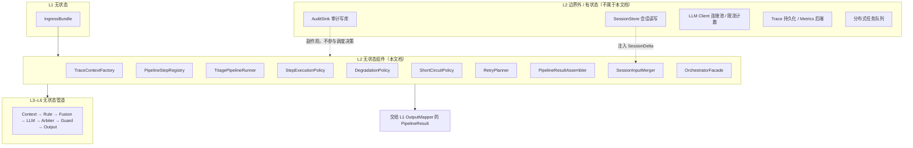
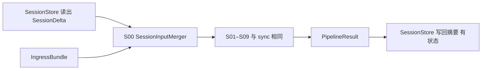

# L2 编排层 — 无状态组件设计

本文档仅描述 **L2 编排层（Orchestrator）的无状态组件**，与有状态组件明确隔离，便于后续代码分包、单测与复用。设计依据：`overall.md` 七层架构、L1 无状态组件设计、input/output schema V1、20 case 验收前提。

---

## 一、L2 层定位与边界

### 1.1 职责（只做流程，不做医学）

L2 是 **一次分诊请求的执行调度中枢**：

| 做 | 不做 |
|----|------|
| 按固定顺序调度 L3–L6 步骤 | 风险判断、证据融合、文案医学含义 |
| 定义超时、重试、降级、短路策略 | 读写会话存储、审计持久化 |
| 组装请求级 Trace 与 Pipeline 中间态 | 校验 input schema（属 L1） |
| 收集各步产物，交给 L1 OutputMapper | 修改 riskLevel（属 L4 Arbiter） |
| 在失败时保证「最低可用输出路径」 | 调用外部服务时自行维护连接态决策 |

### 1.2 无状态定义（L2 范围内）

> 给定同一份 `IngressBundle`（来自 L1）+ 固定 Pipeline 配置版本 + 固定降级/重试策略表，L2 无状态组件的步骤调度顺序、短路决策、降级路径 **完全可复现**，不依赖历史请求、会话存储或审计库。

**说明**：

- L2 会 **调用** L3–L6 的无状态组件与 LLM（外部 IO），但 L2 自身决策逻辑不读历史。
- TraceId 可在请求入口生成并 **透传**；生成算法可无状态（如 UUID），**持久化** 不属于 L2 无状态组件。

### 1.3 L2 无状态 vs 有状态隔离



**原则**：

- 有状态 **数据** 若以参数形式注入（如 `SessionDelta`），L2 可用 **纯函数合并器** 处理；**读取** SessionStore 的动作在 L2 外完成。
- L2 不实现医学逻辑，只决定 **何时调用谁、失败后走哪条路径**。

---

## 二、L2 无状态组件清单

| 组件 ID | 组件名 | 核心职责 |
|---------|--------|----------|
| L2-01 | TraceContextFactory | 生成本次请求的追踪上下文 |
| L2-02 | PipelineStepRegistry | 静态步骤注册表与依赖顺序 |
| L2-03 | TriagePipelineRunner | 按 registry 执行 L3–L6 步骤 |
| L2-04 | StepExecutionPolicy | 逐步超时、并发禁止、执行约束 |
| L2-05 | DegradationPolicy | 失败后的退化路径选择 |
| L2-06 | ShortCircuitPolicy | 紧急/无 LLM 等短路策略 |
| L2-07 | RetryPlanner | 有限重试与重试范围规划 |
| L2-08 | PipelineResultAssembler | 汇总执行产物为 PipelineResult |
| L2-09 | SessionInputMerger | 纯函数合并会话增量到 input |
| L2-10 | OrchestratorFacade | L2 对外门面，固定编排入口 |

---

## 三、标准 Pipeline 与步骤模型

### 3.1 V1 标准步骤序列（`health_triage_v1_sync`）

L2 调度的 **逻辑步骤**（实现分布在 L3–L6，L2 只负责顺序与策略）：

| Step ID | 步骤名 | 所属层 | 可短路 | 可重试 |
|---------|--------|--------|--------|--------|
| S01 | BuildDecisionContext | L3 | 否 | 否 |
| S02 | EvaluateRules | L4 RuleEngine | 否 | 否 |
| S03 | ApplyContextModifiers | L4 Matrix | 否 | 否 |
| S04 | FuseSignals | L4 Fusion + Evidence + Confidence | 否 | 否 |
| S05 | GenerateLLMDraft | L4 LLM | **是** | **是（局部）** |
| S06 | ArbitrateRisk | L4 Arbiter | 否 | 否 |
| S07 | RunSafetyGuard | L5 | 否 | **是（局部）** |
| S08 | ComposeOutput | L6 Composer | 否 | 否 |
| S09 | ValidateOutputSchema | L6 Validator | 否 | **是（模板兜底）** |

### 3.2 Pipeline 数据流（L2 视角）


L2 维护的是 **StepContext**（随步骤增长的不可变管道上下文），不是医学状态机。

---

## 四、组件逐一设计

---

### L2-01 TraceContextFactory（追踪上下文工厂）

#### 职责

为单次请求创建 **请求级追踪上下文**，供 L2–L7 透传，便于日志关联与 case 调试。

#### 无状态保证

- 仅依赖入参字段 + 静态 ID 生成策略（如 UUID v4）
- 不写 trace 存储

#### 输入

| 字段 | 说明 |
|------|------|
| caseId | 来自 input |
| petId | 来自 input.pet |
| timestamp | 来自 input |
| pipelineId | 来自 L1 PipelinePlan |
| endpoint | health / intelligent |
| parentTraceId | 可选，网关透传 |

#### 输出

`TraceContext`：

| 字段 | 说明 |
|------|------|
| traceId | 本次主 trace |
| correlationId | 对外/跨服务关联 |
| caseId / petId / timestamp | 业务索引 |
| pipelineId | 管道版本 |
| startedAtEpochMs | 开始时间 |

#### 明确不做

- 不写 OpenTelemetry backend（有状态副作用，在 Facade 外层）
- 不聚合历史 trace

#### 单测要点

- 同输入 + 固定随机种子 → traceId 可预测（测试模式）
- 必填字段缺失时由 L1 拦截，L2 假定已合法

---

### L2-02 PipelineStepRegistry（管道步骤注册表）

#### 职责

以 **静态配置** 定义 pipeline 的步骤列表、顺序、所属层、依赖关系与 step handler 绑定键。

#### 无状态保证

- Registry 为版本化静态配置（如 `pipeline_registry.v1.json`）
- 运行时只读

#### 输入

| 字段 | 说明 |
|------|------|
| pipelineId | 如 `health_triage_v1_sync` |
| contractContext | 来自 L1 |

#### 输出

`PipelineDefinition`：

| 字段 | 说明 |
|------|------|
| steps | StepDefinition[] |
| version | registry 版本 |
| requiredLayers | 依赖的 L3–L6 handler 集合 |

`StepDefinition` 包含：

- stepId、name、layerId  
- handlerKey（注入用，非直接 import 医学实现）  
- skippable、retryable  
- hardDependency（前置 stepId）

#### V1 注册内容

至少包含 3.1 节 S01–S09 全量定义。

`/intelligent` 变体 `intelligent_wrap_v1`：

- **核心步骤与 sync 相同**（S01–S09）
- 可在 S01 前增加逻辑步骤 `S00 MergeSessionInput`（调用 L2-09，非医学）

#### 明确不做

- 动态按风险改步骤顺序（V1 固定顺序，避免不可测）
- 在 registry 内写医学条件

#### 单测要点

- DAG 无环
- 每个 step handlerKey 在 DI 容器有绑定
- intelligent 与 sync 的核心步骤一致

---

### L2-03 TriagePipelineRunner（分诊管道执行器）

#### 职责

根据 `PipelineDefinition`，**顺序调用** 各 step handler，维护 `StepContext`，应用 ShortCircuit、Retry、Degradation 策略。

#### 无状态保证

- 执行逻辑只依赖：IngressBundle + PipelineDefinition + 策略配置 + 注入的 step handlers（handlers 自身无状态）
- 不缓存上次请求 StepContext

#### 输入

| 字段 | 说明 |
|------|------|
| ingressBundle | L1 产物（含 NormalizedInput、PipelinePlan、ContractContext） |
| pipelineDefinition | L2-02 输出 |
| traceContext | L2-01 输出 |
| sessionDelta | 可选，由外部 SessionStore 读出后注入 |
| stepHandlers | L3–L6 实现注入 |
| policies | Execution / Degradation / ShortCircuit / Retry |

#### 输出

`PipelineExecutionState`（交给 L2-08 组装）：

| 字段 | 说明 |
|------|------|
| stepResults | 每步状态、耗时、产物 |
| finalComposedOutput | S08 产物 |
| schemaValidation | S09 产物 |
| degradationEvents | 降级记录 |
| shortCircuitEvents | 短路记录 |
| traceContext | 透传 |

#### 执行循环（概念）

对每个 step：

1. 查 ShortCircuitPolicy：是否跳过  
2. 查 StepExecutionPolicy：超时预算  
3. 执行 handler(StepContext)  
4. 失败 → RetryPlanner → 仍失败 → DegradationPolicy  
5. 将产物不可变写入 StepContext  
6. 继续下一步（除非致命失败）

#### 致命失败 vs 可降级失败

| 类型 | 示例 | 行为 |
|------|------|------|
| 致命 | S01/S02/S06 抛错 | 无 riskFloor 时走 EmergencyTemplate 最低保底 |
| 可降级 | S05 LLM 超时 | 跳过 LLM，走 FallbackTemplate |
| 可局部重试 | S07 禁止词命中 | 重写部分字段后重试 Guard |

#### 明确不做

- 不内嵌 RuleEngine/LLM 实现
- 不因业务判断跳过 S02 RuleEngine
- 不修改 Arbiter 的 finalRisk

#### 单测要点

- Mock handlers 验证顺序与短路
- LLM 超时场景验证降级路径
- emergency 场景验证 S05 被跳过

---

### L2-04 StepExecutionPolicy（步骤执行策略）

#### 职责

为每个 step 定义 **执行约束**：超时、是否允许并行、是否必须等待、资源预算。

#### 无状态保证

- 静态策略表查表

#### 输入

| 字段 | 说明 |
|------|------|
| stepId | 当前步骤 |
| pipelineId | 管道 |
| options | 如 debugMode |

#### 输出

`StepExecutionConstraints`：

| 字段 | 说明 |
|------|------|
| timeoutMs | 超时 |
| allowParallel | V1 全 false |
| mustRun | 是否不可跳过（S02/S06 为 true） |
| budgetClass | cpu / io_llm / io_none |

#### V1 建议超时预算

| Step | timeoutMs | 说明 |
|------|-----------|------|
| S01–S04 | 短（如 200ms 级） | 纯计算 |
| S05 LLM | 较长（如 8–15s） | 唯一 IO 重步骤 |
| S06–S07 | 短 | 规则 + 审查 |
| S08–S09 | 短 | 组装 + 校验 |
| **Pipeline 总预算** | 略大于 S05 + 其他 | 防止 hung |

#### 明确不做

- 自适应学习超时（有状态）
- 按用户 ID 限流（有状态，在网关）

---

### L2-05 DegradationPolicy（降级策略器）

#### 职责

当某步失败或产物不合格时，决定 **退化路径**，保证仍能得到合法结构化输出。

#### 无状态保证

- `(stepId, errorType, currentStepContext) → DegradationAction` 纯查表 + 只读上下文

#### 输入

| 字段 | 说明 |
|------|------|
| failedStepId | 失败步骤 |
| errorType | TIMEOUT / VALIDATION / GUARD_VIOLATION / HANDLER_ERROR |
| stepContext | 当前已完成的医学产物（含 riskFloor） |

#### 输出

`DegradationAction`：

| 字段 | 说明 |
|------|------|
| actionType | SKIP_STEP / USE_TEMPLATE / RETRY_STEP / ABORT_WITH_MINIMUM |
| templateId | 若走模板 |
| preserveFields | 必须保留的字段（如 riskLevel） |
| reason | 审计用 |

#### V1 降级矩阵（核心）

| 失败点 | 降级动作 | 保留 |
|--------|----------|------|
| S05 LLM 超时/错误 | USE_TEMPLATE 文案 | ruleFloor + Fusion candidateRisk |
| S07 Guard 失败 | RETRY_STEP 一次 → USE_TEMPLATE | finalRisk 不变 |
| S09 Schema 失败 | USE_TEMPLATE 全量兜底 | finalRisk 不变 |
| S08 缺字段 | 从 StepContext 补全 + 模板填充 | finalRisk 不变 |
| S02 失败（极少） | ABORT_WITH_MINIMUM 紧急保底模板 | 就高原则 |

#### 铁律（降级不可违反）

1. **riskLevel 不得低于 ruleFloor**  
2. **emergency 不可降为 watch/normal**  
3. **缺数据时不可降级为「正常」叙事**（模板选用 DATA_MISSING 变体）  
4. **降级必须记入 degradationEvents**（供 L7，不写库由外层负责）

#### 单测要点

- 覆盖 20 case 中 LLM mock 失败仍能通过风险评测
- 每次降级 preserveFields 含 riskLevel

---

### L2-06 ShortCircuitPolicy（短路策略器）

#### 职责

在满足条件时 **跳过非必须步骤**（主要是 S05 LLM），缩短路径并降低幻觉风险。

#### 无状态保证

- 仅读当前 StepContext，不读历史

#### 输入

| 字段 | 说明 |
|------|------|
| stepId | 待执行步骤 |
| stepContext | 含 RuleEvaluationResult、FusionResult 等 |

#### 输出

`ShortCircuitDecision`：

| 字段 | 说明 |
|------|------|
| skip | boolean |
| reason | 如 EMERGENCY_RULE_HIT |
| substituteAction | 通常 USE_TEMPLATE |

#### V1 短路规则

| 条件 | 跳过 | 替代 |
|------|------|------|
| S05 前：emergencyTriggered=true | 跳过 LLM | 紧急模板 |
| S05 前：pipeline options.disableLlm=true | 跳过 LLM | 标准模板 |
| S05 前：DATA_MISSING 且仅需设备提示 | 可跳过 LLM | 缺失数据模板 |
| S02/S06/S07 | **永不跳过** | — |

**注意**：短路是 **省 LLM**，不是 **省安全**；S07 Guard 不可短路。

#### 与 case 对齐

- `emergency_breathing_difficulty`、`emergency_seizure`：应命中 emergency 短路，快速稳定输出  
- `missing_vitals`：可短路 LLM，但仍走 S02–S04–S06–S07

#### 单测要点

- emergency case 不调用 LLM handler
- 非 emergency 不误短路

---

### L2-07 RetryPlanner（重试规划器）

#### 职责

定义 **有限次、有限范围** 的重试，避免无限 LLM 循环。

#### 无状态保证

- 重试次数基于静态 `maxRetries` 与当前 attempt 计数（计数在 StepContext 请求内，非跨请求）

#### 输入

| 字段 | 说明 |
|------|------|
| stepId | 失败步骤 |
| errorType | 错误类型 |
| attempt | 当前尝试次数（请求内） |

#### 输出

`RetryDecision`：

| 字段 | 说明 |
|------|------|
| shouldRetry | boolean |
| retryMode | FULL_STEP / PARTIAL_REWRITE |
| maxAttempts | 静态上限 |

#### V1 重试策略

| Step | 可重试 | 上限 | 模式 |
|------|--------|------|------|
| S05 LLM | 是 | 1 | FULL_STEP |
| S07 Guard | 是 | 1 | PARTIAL_REWRITE（仅违规字段） |
| S09 Schema | 是 | 1 | 模板兜底，非 LLM |
| 其他 | 否 | 0 | — |

#### 明确不做

- 指数退避跨请求重试
- 因 riskLevel 不满意自动重试（避免医学漂移）

---

### L2-08 PipelineResultAssembler（管道结果组装器）

#### 职责

将 `PipelineExecutionState` 整理为交给 **L1 OutputMapper** 与 **L7 AuditRecordBuilder** 的统一结果包。

#### 无状态保证

- 纯组装，不新增医学判断

#### 输入

`PipelineExecutionState`

#### 输出

`PipelineResult`：

| 字段 | 说明 |
|------|------|
| composedOutput | 给 L1-04 |
| internalAudit | ruleHits、arbitration、trust、flags、degradation、shortCircuit |
| traceContext | 透传 |
| executionSummary | 每步耗时、状态 |
| success | boolean |
| degraded | 是否走过降级 |

#### 组装规则

- `composedOutput.riskLevel` 必须等于 StepContext 中 Arbiter 输出  
- 若 S09 失败但模板兜底成功，`success=true, degraded=true`  
- `internalAudit` 默认不进入 publicOutput

#### 明确不做

- 不调用 OutputMapper（边界：L2 结束，L1 映射）

---

### L2-09 SessionInputMerger（会话输入合并器）

#### 职责

将 **外部读出的 SessionDelta** 与 `NormalizedInput` 按纯函数规则合并，供 `/intelligent` 多轮使用。**不读取 SessionStore。**

#### 无状态保证

- `merge(normalizedInput, sessionDelta) → enrichedInput` 纯函数

#### 输入

| 字段 | 说明 |
|------|------|
| normalizedInput | L1 产物 |
| sessionDelta | 外部注入，结构见下 |

`SessionDelta`（仅增量，非全量存储）：

| 字段 | 说明 |
|------|------|
| appendedUserText | 本轮新增用户描述 |
| appendedSymptoms | 新增症状 |
| updatedDuration | 更新持续时间 |
| lastTurnRiskLevel | 上轮 Agent 输出 risk（供一致性检查，非裁决） |
| turnIndex | 轮次 |

#### 输出

`EnrichedNormalizedInput`：仍为 NormalizedInput 同构 + meta.turnIndex

#### 合并规则（V1）

| 规则 | 行为 |
|------|------|
| userReport.text | 追加或替换策略可配置；默认追加并分隔 |
| symptoms | 并集去重 |
| duration | Session 有更新则覆盖 |
| vitals/healthEvidence | **以当次 App 快照为准**，不用 Session 覆盖 |
| 不引入 Session 中的体征历史 | 防编造 |

#### 有状态边界

```
SessionStore.load(sessionId)  →  SessionDelta  →  L2-09 merge  →  S01
     ^有状态在外部              ^无状态纯函数
```

#### 单测要点

- 多轮追加 symptoms 不丢当次 vitals
- 空 SessionDelta 时输出等于原 input

---

### L2-10 OrchestratorFacade（编排层门面）

#### 职责

L2 对外 **唯一入口**，串联 L2-01～09，对 L1 与 L3–L6 隐藏内部调度细节。

#### 无状态保证

- 只组合无状态组件与注入 handlers

#### 入口方法（概念）

**`runTriage(ingressBundle, options?) → PipelineResult`**

#### 内部流程

```
1. TraceContextFactory
2. 若 pipelinePlan.requiresSessionMerge：
     sessionDelta = options.sessionDelta（外部注入，Facade 不 load）
     SessionInputMerger
3. PipelineStepRegistry.resolve(pipelineId)
4. TriagePipelineRunner.run(...)
5. PipelineResultAssembler
6. 返回 PipelineResult
```

#### 出口契约

- 成功：`PipelineResult.success=true` + composedOutput  
- 可降级成功：`success=true, degraded=true`  
- 致命失败：仍尽可能带 `minimumComposedOutput`（由 DegradationPolicy ABORT_WITH_MINIMUM）

#### 与 L1 边界

| 方向 | 契约 |
|------|------|
| L1 → L2 | IngressBundle |
| L2 → L1 | PipelineResult → OutputMapper |

---

## 五、L2 管道数据对象（内部 DTO）

| 对象 | 产生者 | 消费者 | 说明 |
|------|--------|--------|------|
| IngressBundle | L1 Facade | L2 Facade | 编排输入 |
| TraceContext | L2-01 | L2–L7 | 请求追踪 |
| PipelineDefinition | L2-02 | L2-03 | 步骤定义 |
| StepContext | L2-03 | L2-03/05/06/07 | 随步骤增长的不可变上下文 |
| DegradationAction | L2-05 | L2-03 | 降级指令 |
| ShortCircuitDecision | L2-06 | L2-03 | 短路指令 |
| RetryDecision | L2-07 | L2-03 | 重试指令 |
| PipelineExecutionState | L2-03 | L2-08 | 执行态 |
| PipelineResult | L2-08 | L1-04, L7 | 编排输出 |
| SessionDelta | 外部有状态 | L2-09 | 会话增量 |

**StepContext 应包含的关键医学产物指针**（L2 只传递，不解释）：

- decisionContextPackage  
- ruleEvaluationResult  
- adjustedAssessments  
- fusionResult / evidenceCandidates  
- llmDraft（可选）  
- arbitrationResult  
- guardedDraft  
- composedOutput  

---

## 六、与上下游接口契约

### 6.1 上游（L1）

L2 期望收到的 `IngressBundle`：

| 字段 | 必须 | 说明 |
|------|------|------|
| normalizedInput | 是 | 已校验归一化 |
| pipelinePlan | 是 | 含 pipelineId、requiresSessionMerge |
| contractContext | 是 | schema 版本 |
| traceId | 可选 | 若 L1 未生成，L2-01 生成 |

L2 **不再** 做 input schema 校验。

### 6.2 下游（L3–L6）

L2 通过 **StepHandler 接口** 调用各层（依赖注入），handler 签名概念：

- 输入：`StepContext` + `TraceContext`  
- 输出：`StepResult { ok, artifact, error? }`  

L2 不关心 handler 内部实现，只关心 **ok/error 类型与 artifact 类型**。

### 6.3 下游（L1 回程）

`PipelineResult.composedOutput` 交给 L1 OutputMapper；  
`PipelineResult.internalAudit` 仅 debug 或 L7 使用。

### 6.4 外部有状态协作点（唯一两处）

| 协作点 | L2 无状态部分 | 有状态部分 |
|--------|---------------|------------|
| /intelligent 多轮 | SessionInputMerger | SessionStore.load / save |
| 观测 | TraceContext 生成 | AuditSink.write(PipelineResult) |

---

## 七、两种 Pipeline 变体

### 7.1 `health_triage_v1_sync`（/health）

- 无 S00  
- IngressBundle → S01–S09 直线执行  
- 全程无 Session  

### 7.2 `intelligent_wrap_v1`（/intelligent）



- **S00** 仅为 L2-09，不做对话意图识别（意图识别可放 L1 前或独立有状态服务）  
- **核心医学路径与 /health 完全一致**，保证同一 risk 逻辑  

---

## 八、代码管理与分包建议

```
orchestrator/
  stateless/              # 本文档全部组件
    trace/
    registry/
    runner/
    policies/
      execution/
      degradation/
      short_circuit/
      retry/
    assembler/
    session_merge/        # 纯函数合并，不读 store
    facade/
  stateful/               # 不属于无状态包
    session_store/
    audit_sink/
  config/                 # pipeline_registry、policy_tables
  contracts/              # IngressBundle、PipelineResult、StepContext
```

**依赖规则**：

| 允许 | 禁止 |
|------|------|
| L2 stateless → L3–L6 handlers（接口） | L2 stateless → SessionStore 实现 |
| L2 stateless → orchestrator/config | L2 stateless 内嵌 RuleEngine 逻辑 |
| L2 facade → L1 contracts（只读 IngressBundle） | L2 修改 composedOutput.riskLevel |

---

## 九、测试策略（L2 专属）

### 9.1 单测

| 组件 | 方法 |
|------|------|
| PipelineStepRegistry | 步骤完整性与 DAG |
| StepExecutionPolicy | 每步 timeout 配置 |
| DegradationPolicy | 矩阵全覆盖 |
| ShortCircuitPolicy | emergency / missing 短路 |
| RetryPlanner | 上限与不可重试步骤 |
| SessionInputMerger | 增量合并不污染 vitals |
| PipelineResultAssembler | 字段完整性 |

### 9.2 集成测（Mock Handlers）

| 场景 | 断言 |
|------|------|
|  Happy path | S01–S09 全绿，无 degraded |
| LLM 超时 | S05 降级，riskLevel 仍符合 expected |
| Guard 违规 | 重试一次后模板 |
| Emergency | S05 跳过，S07 仍执行 |
| Session 合并 | intelligent 路径 S00 生效 |

### 9.3 回归约束

- 20 case 在 **LLM mock 关闭**（纯模板）下仍通过风险评测  
- 20 case 在 **LLM mock 开启** 下通过语义评测  
- L2 策略变更不得降低 riskFloor  

---

## 十、非功能要求

| 维度 | 要求 |
|------|------|
| 确定性 | 同输入 + mock LLM 固定响应 → 执行路径可复现 |
| 并发 | Runner 无共享可变状态；StepContext 请求内隔离 |
| 延迟 | 纯计算步骤总和应远小于 LLM；短路降低 P99 |
| 可观测 | executionSummary 逐步耗时；degraded/shortCircuit 原因码 |
| 失败隔离 | 单步 handler 异常不拖垮进程，转化为 DegradationAction |
| 扩展 | 新 pipelineId 通过 Registry 扩展，不改 Runner 核心循环 |

---

## 十一、L2 明确排除的有状态能力

| 能力 | 建议归属 |
|------|----------|
| Session 读写 | orchestrator/stateful/session_store |
| 审计持久化 | L7 AuditSink |
| LLM 连接池与配额 | infrastructure / llm_client |
| 跨请求 pipeline 缓存 | 不允许 |
| 基于历史的动态 pipeline 选路 | 不允许（V1） |
| 用户级熔断计数 | API 网关 |

---

## 十二、与 20 case 的执行预期（L2 视角）

| case 类型 | L2 预期行为 |
|-----------|-------------|
| normal_dog_daily_check | 全步骤，无短路无降级 |
| emergency_* | ShortCircuit 跳过 LLM，Guard 仍执行 |
| missing_vitals / stale_device_data | 可短路 LLM，走缺失/过期模板变体 |
| 其余 warning/watch | 标准路径；LLM 失败时 degraded 仍保持 risk |

L2 不直接断言 mustMention（属 L7），但应保证 **degraded 路径选用的 templateId** 与 case 类型匹配（通过 DegradationPolicy 配置关联）。

---

## 十三、总结

L2 无状态组件共 **10 个**：

1. **TraceContextFactory** — 请求追踪上下文  
2. **PipelineStepRegistry** — 静态步骤与顺序  
3. **TriagePipelineRunner** — 核心调度循环  
4. **StepExecutionPolicy** — 超时与执行约束  
5. **DegradationPolicy** — 失败退化，保住 riskFloor  
6. **ShortCircuitPolicy** — 紧急/无 LLM 短路  
7. **RetryPlanner** — 有限重试  
8. **PipelineResultAssembler** — 统一编排输出  
9. **SessionInputMerger** — 纯函数会话增量合并  
10. **OrchestratorFacade** — L2 唯一入口  

**核心原则**：

- L2 管 **流程、时序、失败**，不管 **医学**  
- 有状态 **读取** 在 L2 外完成，仅以 `SessionDelta` 注入  
- `/health` 与 `/intelligent` **共享 S01–S09**，医学逻辑不分叉  
- 再差的失败也要走 **降级模板**，绝不返回空或非法 JSON  