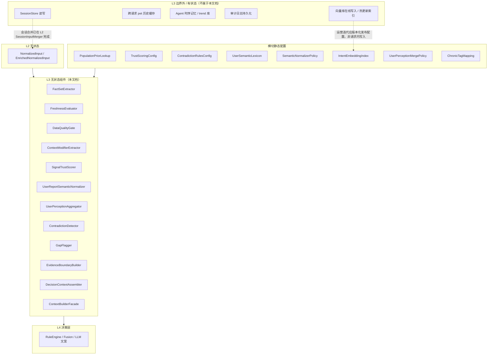
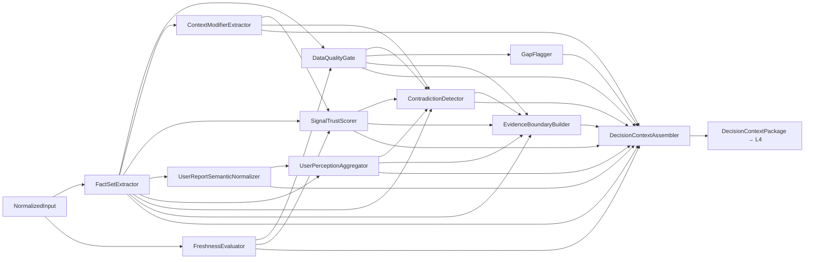
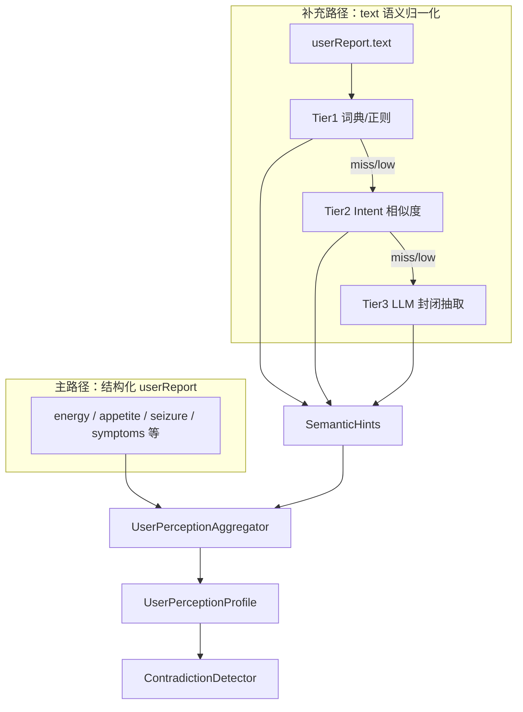
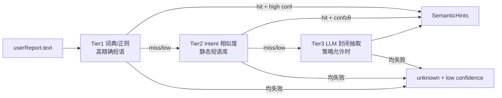

# L3 上下文构建层 — 无状态组件设计

本文档描述 **L3 上下文构建层（Context Builder）的无状态组件**，与有状态组件明确隔离，便于后续代码分包、单测与复用。

**设计依据**：`overall.md` 七层架构、L1/L2 无状态组件设计、input/output schema V1、20 case 验收前提，以及分层信任、防编造、个体/环境差异由情境修饰覆盖、用户文本语义归一化与矛盾检测结构化优先等架构结论。

---

## 一、L3 层定位与边界

### 1.1 职责（只做上下文，不做裁决）

L3 是 **医学决策前的「可读事实层」**：把当次 input 转化为 L4 可消费、L5 可审查、L7 可评测的统一中间表示。

| 做 | 不做 |
|----|------|
| 提取客观事实清单（Fact Set） | 输出最终 riskLevel |
| 将用户自由文本归一化为封闭内部标签（可插拔） | 生成面向用户的分诊文案 |
| 聚合用户侧感知画像（结构化 + 语义） | 读写会话/历史体征 |
| 为上游 signal 计算信任分 | 补全缺失 vitals 或 baseline |
| 检测矛盾、缺失、数据质量门禁 | 执行紧急升级裁决（属 L4） |
| 划定 evidence 允许引用边界 | 修改 input 原始字段并回写 App |

### 1.2 无状态定义（L3 范围内）

> 给定同一份 `NormalizedInput`（或 L2 `SessionInputMerger` 后的 `EnrichedNormalizedInput`）+ 固定配置版本（信任评分表、矛盾规则表、语义词典、Normalizer 策略、PopulationPriorLookup），L3 各组件输出 **完全可复现**，不依赖历史请求、Agent 记忆、向量库在线写入或审计库。

**说明**：

- 允许使用 **版本化静态配置**（语义词典、intent 短语索引、可选预计算 embedding）做语义匹配；这是配置，不是跨请求可变状态。
- 允许在策略开启时调用 LLM 做 **封闭标签抽取**（非文案生成），结果须带 `source` 与 `confidence`；`/health` 默认关闭。
- L3 内 LLM **不是** ContradictionDetector 的必经路径。

### 1.3 L3 无状态 vs 有状态隔离



**原则**：

- `/intelligent` 的会话增量 **必须在 L2 合并进 input 后** 再进入 L3；L3 不直接读 SessionStore。
- L3 对上游 baseline/reason 采取 **条件信任**：打 trust 分、标矛盾，不在缺历史时重算 trend。
- 用户语义理解采用 **先归一化、再聚合、后判矛盾**；矛盾检测保持确定性规则消费。

---

## 二、L3 在 Pipeline 中的位置

L3 对应 L2 步骤 **S01 BuildDecisionContext**，由 `ContextBuilderFacade` 作为 step handler 入口。

### 2.1 内部流水线



### 2.2 用户侧信号处理链路



---

## 三、L3 无状态组件清单

| 组件 ID | 组件名 | 核心职责 |
|---------|--------|----------|
| L3-01 | FactSetExtractor | 提取可引用客观事实清单 |
| L3-02 | FreshnessEvaluator | 评估数据新鲜度与同步一致性 |
| L3-03 | DataQualityGate | 数据质量门禁与 confidence 上限 |
| L3-04 | ContextModifierExtractor | 提取情境/个体修饰因子 |
| L3-05 | SignalTrustScorer | 上游 signal 信任评分 |
| L3-06 | UserReportSemanticNormalizer | 用户 text → 封闭语义标签 |
| L3-07 | UserPerceptionAggregator | 结构化 + 语义 → 用户感知画像 |
| L3-08 | ContradictionDetector | 多源矛盾检测与打标 |
| L3-09 | GapFlagger | 缺失项与空洞数据标注 |
| L3-10 | EvidenceBoundaryBuilder | 划定 evidence 允许引用边界 |
| L3-11 | DecisionContextAssembler | 组装 L4 唯一入口包 |
| L3-12 | ContextBuilderFacade | L3 门面，S01 步骤入口 |

**横切静态配置**：

| 配置 ID | 名称 | 被谁使用 |
|---------|------|----------|
| CFG-01 | PopulationPriorLookup | L3-05、L3-08、L3-10 |
| CFG-02 | TrustScoringConfig | L3-05 |
| CFG-03 | ContradictionRulesConfig | L3-08 |
| CFG-04 | ChronicTagMapping | L3-04 |
| CFG-05 | UserSemanticLexicon | L3-06 Tier1 |
| CFG-06 | IntentEmbeddingIndex | L3-06 Tier2（可选） |
| CFG-07 | SemanticNormalizerPolicy | L3-06 三层开关与阈值 |
| CFG-08 | UserPerceptionMergePolicy | L3-07 合并优先级 |

---

## 四、组件逐一设计

---

### L3-01 FactSetExtractor（事实清单提取器）

#### 职责

从 input 提取 **后续 evidence、LLM、Guard 允许引用的客观事实**，建立可回溯 `factIndex`。这是防编造的第一道闸。

#### 无状态保证

- 纯提取：`FactSet = extract(normalizedInput)`
- 不推断、不补全 null

#### 输入

| 字段 | 说明 |
|------|------|
| normalizedInput | L1/L2 产物 |

#### 输出

`FactSet`：

| 子结构 | 内容 |
|--------|------|
| vitalsFacts | 各 vital 当前值或显式 null |
| petFacts | 物种、年龄、体重、慢病、用药、过敏等 |
| deviceFacts | online、dataQuality、lastSeenAt、warningText、battery |
| userReportFacts | 见下表分层 |
| contextFacts | 环境、运动、疫苗、年龄风险、notes |
| missingDataFacts | 缺失项列表 |
| healthEvidenceFacts | 上游 riskLevel、displayClaim、signals 原文（作「上游声称」） |

**userReportFacts 分层**：

| 子字段 | 说明 |
|--------|------|
| structured | 枚举、布尔、symptoms 等结构化字段 |
| textRaw | `userReport.text` 原文 |
| textDerived | 不在本组件填充；由 L3-06/07 产出后写入 Package |

**事实级别**：

| 类型 | 示例 | 级别 |
|------|------|------|
| 客观事实 | vitals.temperatureC=40.2 | T0/T1，可进 evidence |
| 上游声称 | healthEvidence.displayClaim | T2，需 trust |
| 衍生信号 | signals[].baseline | T2，条件信任 |

**factIndex**：稳定路径 ID，如 `fact.vitals.temperatureC`、`fact.userReport.seizure`，供 L3-10、L5 回溯。

#### 明确不做

- 不判断体征是否异常（属 L4）
- 不解析 text 语义（属 L3-06）
- 不把 unknown 改成默认值

#### 单测要点

- 20 case FactSet 快照稳定
- null 显式保留
- healthEvidence 原样保留为「声称」

---

### L3-02 FreshnessEvaluator（新鲜度评估器）

#### 职责

评估 device、vitals、signals 相对于请求 `timestamp` 的新鲜度与彼此同步一致性。

#### 无状态保证

- 仅依赖当次 input 时间戳 + 静态阈值表

#### 输入

| 字段 | 说明 |
|------|------|
| normalizedInput | timestamp、device.lastSeenAt、vitals.updatedAt、signals[].updatedAt |
| freshnessPolicy | 静态阈值（如 stale 分钟数） |

#### 输出

`FreshnessAssessment`：

| 字段 | 说明 |
|------|------|
| deviceFreshness | fresh / stale / unknown |
| vitalsFreshness | 相对 timestamp |
| signalSyncScore | signals 与 vitals 时间一致性 0–1 |
| staleMinutes | 数值 |
| issues[] | 如 VITALS_OLDER_THAN_DEVICE |

#### 评估逻辑

| 检查 | 说明 |
|------|------|
| device.lastSeenAt vs timestamp | 支持 stale 判定 |
| vitals.updatedAt vs timestamp | 过期 vitals 降权 |
| signals[].updatedAt vs vitals.updatedAt | 不一致降低 trust |
| device.dataQuality=stale | 应与 freshness 结论一致 |

#### 明确不做

- 不跨请求比较历史 lastSeenAt
- 不因新鲜度直接定 riskLevel

#### 单测要点

- stale_device_data：deviceFreshness=stale
- good 数据：fresh + 高 syncScore

---

### L3-03 DataQualityGate（数据质量门禁）

#### 职责

基于 `device.dataQuality`、`missingData`、`vitals` 空洞程度，输出 **数据是否足以支持 normal 判断** 与 **confidence 上限**。

#### 无状态保证

- 查表 + 只读 FactSet / FreshnessAssessment

#### 输入

| 字段 | 说明 |
|------|------|
| factSet | L3-01 |
| freshnessAssessment | L3-02 |
| dataQualityPolicy | 静态配置 |

#### 输出

`DataQualityVerdict`：

| 字段 | 说明 |
|------|------|
| usableForNormalJudgement | boolean |
| usableForWarningJudgement | boolean |
| confidenceCap | low / medium / high |
| dominantIssue | missing / stale / partial / good |
| gateFlags[] | 如 GATE_BLOCK_NORMAL |

#### 门禁规则

| 条件 | usableForNormal | confidenceCap |
|------|-----------------|---------------|
| dataQuality=missing 或 vitals 全 null | false | low |
| dataQuality=stale | false | low |
| dataQuality=partial | 条件允许 | medium |
| dataQuality=good 且缺失项少 | true | high |
| missingData 含 device_freshness | 强化 stale | ≤ medium |

#### 明确不做

- 不输出 watch/warning（属 L4）
- 语义理解不能绕过 missing/stale 门禁

#### 单测要点

- missing_vitals：usableForNormal=false
- stale_device_data：dominantIssue=stale
- normal_dog_daily_check：usableForNormal=true

---

### L3-04 ContextModifierExtractor（情境修饰因子提取器）

#### 职责

从 input 提取 **影响数值解释的修饰标签**，覆盖个体/环境差异，供 L4 ContextModifierMatrix 使用。只做标签化，不做风险加权。

#### 无状态保证

- 纯标签提取 + ChronicTagMapping 静态映射

#### 输入

| 字段 | 说明 |
|------|------|
| factSet | L3-01 |
| chronicTagMapping | CFG-04 |

#### 输出

`ContextModifiers`：

| 字段 | 来源 | 说明 |
|------|------|------|
| activityContext | activityLevel + recentExercise + notes | resting / post_exercise / active / unknown |
| ageRiskTier | ageRisk + ageMonths | puppy_kitten / senior / normal / unknown |
| chronicRiskTags | chronicConditions | heart_disease、kidney_history 等 |
| breedTags | breed + chronic | 如 brachycephalic |
| medicationContext | medications | on_medication / none / unknown |
| environmentModifiers | 环境/疫苗/餐后 | heat_stress / post_vaccine / post_meal / none |
| userReportModifiers | 结构化 userReport | pain_reported、limping、vomiting_repeated 等 |

**活动态判定**：

| 条件 | activityContext |
|------|-----------------|
| recentExercise=intense/moderate 或 notes 含「刚运动/刚玩耍」 | post_exercise |
| activityLevel=resting 且 recentExercise=none | resting |
| 冲突 | 供 L3-08 打 ACTIVITY_AMBIGUOUS |

#### 明确不做

- 不从 text 推断修饰因子（属 L3-06/07）
- 不做体温/心率风险加权（属 L4）

#### 单测要点

- mild_fever_after_exercise：post_exercise
- puppy_fever_high_risk：puppy_kitten
- emergency_breathing_difficulty：brachycephalic
- chronic_heart_resp_warning：heart_disease + on_medication

---

### L3-05 SignalTrustScorer（信号信任评分器）

#### 职责

为每个 `healthEvidence.signals[]` 计算 **信任分** 与是否可采纳 baseline/reason/riskLevel，落实分层信任中对 T2 上游结论的条件信任。

#### 无状态保证

- 纯函数评分，TrustScoringConfig 版本化

#### 输入

| 字段 | 说明 |
|------|------|
| factSet | L3-01 |
| freshnessAssessment | L3-02 |
| contextModifiers | L3-04 |
| populationPriorLookup | CFG-01 |
| trustScoringConfig | CFG-02 |

#### 输出

`ScoredSignal[]`：

| 字段 | 说明 |
|------|------|
| signalId | 稳定键 |
| originalSignal | 原对象 |
| trustScore | 0.0–1.0 或 high/medium/low |
| trustFactors | 加减分原因 |
| adoptBaseline | boolean |
| adoptReason | boolean |
| adoptRiskLevel | boolean |
| citationMode | baseline_compare / current_value_only / label_only |

#### 评分维度

| 维度 | 加分 | 减分 |
|------|------|------|
| device.dataQuality | good | partial / stale / missing |
| 新鲜度 | fresh + sync 高 | stale / 不一致 |
| reason ↔ context | 运动叙事一致 | REASON_CONTEXT_MISMATCH |
| baseline ↔ population prior | 合理 | 缺失 / 离谱 |
| signal ↔ vitals | 有对应值 | vital null 却引用 |
| signal ↔ structured userReport | 互相印证 | 明显冲突迹象 |

**原则**：不因「可能误解 text」而降低设备 signal trust；用户/设备冲突由 L3-08 打 flag。

#### 阈值策略

| trustScore | 行为 |
|------------|------|
| 高 | 可引用 baseline、reason、signal.riskLevel |
| 中 | 可引用 reason 与当前 value，baseline 慎用 |
| 低 | 仅当前 vital 或用户结构化字段；citationMode=current_value_only |

#### 明确不做

- 不修改 signal 内容
- 不用 Agent 历史重算 baseline
- 不输出 finalRiskLevel

#### 单测要点

- conflict case：temperature signal trust 可仍高，矛盾由 L3-08 处理
- missing_vitals：missing_data signal trust 高
- reason 与运动矛盾：adoptReason=false

---

### L3-06 UserReportSemanticNormalizer（用户文本语义归一化器）

#### 职责

将 `userReport.text`（及可选 symptoms 自由文本）映射为 **封闭内部标签集**，输出 `SemanticHints`。不做矛盾判断、不输出 riskLevel、不生成用户可见文案。

#### 无状态保证

- Tier1/2：静态配置 + 可选内存 intent 索引
- Tier3：单次封闭 LLM 抽取，无对话历史；可 mock 回归

#### 输入

| 字段 | 说明 |
|------|------|
| userReport.text | 自由文本 |
| userReport.symptoms | 辅助 |
| semanticNormalizerPolicy | CFG-07 |
| userSemanticLexicon | CFG-05 |
| intentEmbeddingIndex | CFG-06，可选 |
| endpoint | health / intelligent |
| llmExtractor | 可选注入 |

#### 输出

`SemanticHints`：

| 字段 | 类型 | 说明 |
|------|------|------|
| perceivedHealth | normal / watch / warning / unknown | 用户主观整体健康感知 |
| perceivedSeverity | none / mild / moderate / severe / unknown | 严重程度 |
| urgencyCues | string[] | breathing_distress、seizure_like、pain 等（提示 cue，非确诊） |
| negationDetected | boolean | 否定结构（「不是没事」） |
| confidence | low / medium / high | 组件置信度 |
| source | lexicon / intent_match / llm / none | 产出层级 |
| matchedRules | string[] | 审计：命中 ID |
| tierUsed | 0 / 1 / 2 / 3 | 0 表示 text 空未处理 |

#### 三层过滤架构



**Tier1 词典规则（/health 默认开启）**

- 高精确 normal：「和平时一样」「看起来没事」「精神不错」
- 高精确异常：「精神很差」「完全不动」「喘不上气」
- 否定检测：「不是没事」「并非正常」→ negationDetected=true，**禁止**映射为 normal
- 原则：**宁漏勿滥**；歧义短语不映射为 normal

**Tier2 Intent 相似度（V1.x 可选）**

- 使用静态 IntentEmbeddingIndex（内存短语库，不必依赖在线向量数据库）
- 须 similarityScore≥θ 且 top1-top2 margin≥δ 才采纳
- 否则 → unknown，进入 Tier3 或结束

**Tier3 LLM 封闭抽取（默认关闭）**

- 仅 /intelligent 或显式开关启用
- 输出与 SemanticHints 同 schema 的封闭 JSON
- 禁止确诊、病因、保证性表述
- urgencyCues **不得**单独触发 emergency（紧急以 structured 布尔为准）
- 强制 source=llm，confidence 上限 medium

#### SemanticNormalizerPolicy 默认值

| 场景 | Tier1 | Tier2 | Tier3 |
|------|-------|-------|-------|
| /health 默认 | on | off | off |
| /health 增强 | on | on（θ 偏高） | off |
| /intelligent | on | on | on（低置信时） |

#### 明确不做

- 不判定 USER_DEVICE_CONFLICT（属 L3-08）
- 不修改 structured userReport
- 不做向量库在线学习

#### 单测要点

- 否定句不误判 normal
- 空 text → tierUsed=0
- 各 tier 命中可审计
- LLM mock 输出 schema 校验

---

### L3-07 UserPerceptionAggregator（用户感知画像聚合器）

#### 职责

将 **结构化 userReport** 与 **SemanticHints** 合并为 `UserPerceptionProfile`，作为 L3-08 用户侧 **唯一入口**。

#### 无状态保证

- UserPerceptionMergePolicy（CFG-08）纯合并

#### 输入

| 字段 | 说明 |
|------|------|
| factSet.userReportFacts.structured | 结构化字段 |
| semanticHints | L3-06 |
| userPerceptionMergePolicy | CFG-08 |

#### 输出

`UserPerceptionProfile`：

| 字段 | 说明 |
|------|------|
| perceivedHealth | 合并后整体感知 |
| perceivedSeverity | 合并后严重程度 |
| emergencyStructured | structured 紧急布尔汇总 |
| urgencyCues | 合并 cues（structured 优先） |
| selfReportedNormal | **是否可认定用户自述正常**（矛盾检测关键） |
| selfReportedAbnormal | 是否自述异常 |
| confidence | 合并置信度 |
| provenance | structured / semantic / both / unknown |
| mergeConflicts | 结构化与语义冲突记录 |

#### 合并优先级

| 优先级 | 规则 |
|--------|------|
| 1 | structured 紧急布尔（seizure、breathingDifficulty、trauma）→ emergencyStructured |
| 2 | structured 枚举（energy、appetite、vomiting 等）→ 主判断 |
| 3 | SemanticHints → structured 大量 unknown 或冲突时提升权重 |
| 4 | text 语义 **不得单独** 将 selfReportedNormal 置 true |

#### selfReportedNormal 判定

须满足方可 `selfReportedNormal=true`：

1. **结构化**：energy=normal，无 emergency 布尔，symptoms 空或轻微，appetite/drinking 非 none/reduced  
2. **语义**（若参与）：perceivedHealth=normal 且 confidence≥medium，negationDetected=false  
3. **或**：结构化已满足，语义为 unknown（**不把 unknown 当 normal**）

仅语义 normal、structured unknown → selfReportedNormal=false，confidence=low。

#### 明确不做

- 不输出 riskLevel
- 不用语义猜测将 structured null 填为 false

#### 单测要点

- conflict case：structured normal → selfReportedNormal=true
- 全 unknown + text「没事」：selfReportedNormal=false
- 双源一致：provenance=both，confidence 升高

---

### L3-08 ContradictionDetector（矛盾检测器）

#### 职责

检测 **UserPerceptionProfile、设备数据、上游 signal、healthEvidence** 之间的冲突，输出标准化 `ContradictionFlags` 供 L4/L5/L7 使用。

#### 设计原则

- 用户侧统一读 `UserPerceptionProfile`，**不**直接解析 `userReport.text` 关键词
- 设备/signal 侧基于 FactSet、ScoredSignal、ContextModifiers
- **确定性规则消费**，内部不调用 LLM/向量

#### 无状态保证

- ContradictionRulesConfig 驱动，只读 L3 产物

#### 输入

| 字段 | 说明 |
|------|------|
| factSet | L3-01 |
| userPerceptionProfile | L3-07 |
| scoredSignals | L3-05 |
| contextModifiers | L3-04 |
| dataQualityVerdict | L3-03 |
| freshnessAssessment | L3-02 |
| contradictionRulesConfig | CFG-03 |
| populationPriorLookup | CFG-01（安静态护栏参照） |

#### 输出

`ContradictionFlags[]`：

| Flag | 触发条件 | 关联 case |
|------|----------|-----------|
| DATA_MISSING | missingData 非空或关键 vitals 全 null | missing_vitals |
| DATA_STALE | dataQuality=stale 或 freshness=stale | stale_device_data |
| USER_DEVICE_CONFLICT | 设备侧异常成立 且 selfReportedNormal=true | conflict_user_normal_sensor_fever |
| USER_PERCEPTION_LOW_CONF | 用户侧判断 confidence 低 | 降置信，不强行冲突 |
| SEMANTIC_STRUCTURED_CONFLICT | SemanticHints 与 structured 冲突 | mergeConflicts |
| REASON_CONTEXT_MISMATCH | signal.reason 与 activityContext 矛盾 | 质检 |
| EMERGENCY_STRUCTURED_FLAG | emergencyStructured=true | emergency_* |
| EMERGENCY_SEMANTIC_CUE | urgencyCues 含高危 cue 且 structured 未否认 | 辅助 L4 |
| UPSTREAM_UNDER_RISK | healthEvidence.riskLevel 低于最高 signal | 仲裁 |
| VITAL_SIGNAL_MISMATCH | signal 引用 vital 但 vital null | partial |
| ACTIVITY_AMBIGUOUS | 活动态冲突 | confidence 降级 |

每条 flag 含：`severity`、`evidenceRefs[]`、`suggestedHandling`（供 L4 参考）。

#### USER_DEVICE_CONFLICT 完整逻辑

**A. 设备侧异常成立**（满足其一）：

- trust≥阈值的 warning/emergency signal，且 activityContext=resting（或非运动后情境）
- 或安静态 vitals 超 PopulationPrior 护栏
- 且 dataQuality 非 missing

**B. 用户侧自述正常成立**：

- `userPerceptionProfile.selfReportedNormal === true`
- **禁止**仅靠 text 关键词认定

**C. 输出**：A ∧ B → USER_DEVICE_CONFLICT

若 semantic 倾向 normal 但 structured unknown → 打 USER_PERCEPTION_LOW_CONF，**不打** USER_DEVICE_CONFLICT。

#### EMERGENCY 处理

| 来源 | Flag | 严重度 |
|------|------|--------|
| structured 布尔 | EMERGENCY_STRUCTURED_FLAG | critical |
| Semantic urgencyCues | EMERGENCY_SEMANTIC_CUE | medium，须 L4 联合 structured 裁决 |

#### 明确不做

- 不调用 LLM/向量
- 不修改 Profile
- 不输出 finalRiskLevel

#### 单测要点

- conflict case：USER_DEVICE_CONFLICT
- 委婉 text + structured unknown：不打 USER_DEVICE_CONFLICT
- emergency 仅 semantic：仅 EMERGENCY_SEMANTIC_CUE
- 否定句：selfReportedNormal 不为 true

---

### L3-09 GapFlagger（缺失与空洞标注器）

#### 职责

对缺失数据、部分可用、不可判断项做细粒度标注，支撑 output.missingData 与「不能判断」叙事。

#### 与 L3-08 区别

| 组件 | 侧重 |
|------|------|
| ContradictionDetector | 多源 **冲突** |
| GapFlagger | 信息 **空洞** 与覆盖度 |

#### 无状态保证

- 基于 factSet + missingData 纯计算

#### 输入

| 字段 | 说明 |
|------|------|
| factSet | L3-01 |
| dataQualityVerdict | L3-03 |
| userPerceptionProfile | L3-07，可选 |

#### 输出

`GapAssessment`：

| 字段 | 说明 |
|------|------|
| explicitGaps | input.missingData |
| inferredGaps | vitals 全 null 等推断 |
| coverageScore | 体征+用户报告覆盖度 0–1 |
| blockingGaps | 阻止 normal 判断的缺失项 |
| userFacingGapLabels | 供 L6 翻译为 output.missingData |

#### 规则示例

| 状态 | blockingGaps |
|------|--------------|
| vitals 全 null + device offline | temperature、heart_rate 等 |
| drinking unknown | 通常非 blocking |
| stale | device_freshness |
| structured 大量 unknown + text 非空 | 可加 user_report_structured_detail（提示上游结构化不足） |

#### 明确不做

- 用语义填补 blockingGaps

#### 单测要点

- missing_vitals blockingGaps 齐全
- senior_cat_low_energy：drinking unknown 不误判全缺失

---

### L3-10 EvidenceBoundaryBuilder（证据边界构建器）

#### 职责

综合 FactSet、ScoredSignal、DataQualityVerdict、GapAssessment、UserPerceptionProfile、ContradictionFlags，生成 **允许/禁止引用清单**，约束 L4 LLM 与 L5 Guard。

#### 无状态保证

- 纯规则合并

#### 输入

| 字段 | 说明 |
|------|------|
| factSet | L3-01 |
| scoredSignals | L3-05 |
| dataQualityVerdict | L3-03 |
| gapAssessment | L3-09 |
| userPerceptionProfile | L3-07 |
| contradictionFlags | L3-08 |
| populationPriorLookup | CFG-01 |

#### 输出

`EvidenceBoundary`：

| 字段 | 说明 |
|------|------|
| allowedFactRefs | 可引用 factIndex |
| allowedSignalRefs | trust 达标 signal |
| forbiddenPatterns | 禁止表述模式 |
| populationPriorAllowed | 仅护栏用途 |
| mustAcknowledgeGaps | 必须承认的缺失 |
| citationRules | LLM/Guard 检查规则 |

#### 核心规则

1. allowedFactRefs 含 T0/T1 非 null 事实；null 不能说成「正常」  
2. adoptBaseline=false 的 signal 禁止「高于基线 X%」类 evidence  
3. DATA_STALE 禁止用旧 vitals 声称「当前正常」  
4. 低置信语义禁止「用户表示一切正常」类强陈述  
5. USER_DEVICE_CONFLICT 须预留「感受与监测不一致」表述空间  
6. mergeConflicts 非空禁止单方面采信 semantic 覆盖 structured  

#### 明确不做

- 不生成最终 evidence 文案（属 L4/L6）

#### 单测要点

- missing_vitals：mustAcknowledgeGaps 非空
- 低 trust baseline：禁止基线对比句

---

### L3-11 DecisionContextAssembler（决策上下文组装器）

#### 职责

将 L3 各组件产物 **不可变组装** 为 L4 唯一入口 `DecisionContextPackage`。

#### 无状态保证

- 纯组装，不新增推理

#### 输入

L3-01～10 全部产物 + normalizedInput 元信息（caseId、timestamp、scene）

#### 输出

`DecisionContextPackage`：

| 字段 | 来源 |
|------|------|
| meta | caseId、petId、timestamp、scene、buildVersion |
| factSet | L3-01 |
| freshnessAssessment | L3-02 |
| dataQualityVerdict | L3-03 |
| contextModifiers | L3-04 |
| scoredSignals | L3-05 |
| semanticHints | L3-06 |
| userPerceptionProfile | L3-07 |
| contradictionFlags | L3-08 |
| gapAssessment | L3-09 |
| evidenceBoundary | L3-10 |
| upstreamHealthEvidence | 原始 healthEvidence 快照 |
| buildDigest | 可选，case 快照测试 |

#### 组装不变式

- 不包含 finalRiskLevel、LLM 文案
- semantic/Profile 默认不进 public output
- 字段只引用子组件输出，不复制后篡改

#### 明确不做

- 不调用 L4 规则
- 不对 signal 做风险排序（属 L4）

#### 单测要点

- 20 case Package 快照回归
- 不变式校验

---

### L3-12 ContextBuilderFacade（上下文构建门面）

#### 职责

L3 对外唯一入口，供 L2 S01 handler 调用；固定子组件顺序。

#### 无状态保证

- 串联 L3-01～11，无缓存

#### 输入

| 字段 | 说明 |
|------|------|
| normalizedInput | 来自 L2 |
| traceContext | 透传 |
| configBundle | 各 CFG 版本 |
| normalizerOptions | endpoint、LLM 开关等 |

#### 输出

| 字段 | 说明 |
|------|------|
| decisionContextPackage | 给 L4 |
| stepResult | ok / error |
| timing | 子步骤耗时 |

#### 固定执行顺序

```
1.  FactSetExtractor
2.  FreshnessEvaluator
3.  DataQualityGate
4.  ContextModifierExtractor
5.  SignalTrustScorer
6.  UserReportSemanticNormalizer
7.  UserPerceptionAggregator
8.  ContradictionDetector
9.  GapFlagger
10. EvidenceBoundaryBuilder
11. DecisionContextAssembler
```

#### 错误策略

| 失败点 | 行为 |
|--------|------|
| L3-06 Tier3 LLM 失败 | SemanticHints=unknown，继续 |
| L3-07 合并失败 | 回退仅 structured Profile |
| L3-08 失败 | S01 失败，不进入 L4 |
| 其他子组件失败 | S01 失败 |

---

## 五、L3 内部数据对象

| 对象 | 产生者 | 消费者 |
|------|--------|--------|
| FactSet | L3-01 | L3-05～11、L4、L5 |
| FreshnessAssessment | L3-02 | L3-03、L3-05、L3-08 |
| DataQualityVerdict | L3-03 | L3-08～11、L4 |
| ContextModifiers | L3-04 | L3-05、L3-08、L4 |
| ScoredSignal[] | L3-05 | L3-08、L3-10、L4 |
| SemanticHints | L3-06 | L3-07、L3-11 |
| UserPerceptionProfile | L3-07 | L3-08、L3-09、L3-10、L4 |
| ContradictionFlags[] | L3-08 | L4、L5、L7 |
| GapAssessment | L3-09 | L3-10、L6 |
| EvidenceBoundary | L3-10 | L4 LLM、L5 Guard |
| DecisionContextPackage | L3-11 | L4 全链路 |

### 分层信任在 L3 的落点

| 信任层 | L3 落点 | 矛盾检测角色 |
|--------|---------|-------------|
| T0 客观事实 | FactSet | 设备侧异常依据 |
| T1 结构化 userReport | UserPerceptionProfile | 主路径 |
| T2 上游声称 / signal | ScoredSignal + ContradictionFlags | 条件信任 |
| T3 语义标签 | SemanticHints → Profile | 补充，带 confidence |
| T4 群体先验 | EvidenceBoundary | 仅护栏 |
| textRaw | FactSet | **不**直接进入 ContradictionDetector |

---

## 六、与上下游接口契约

### 6.1 上游（L2 / App）

| 责任方 | 要求 |
|--------|------|
| App / adapter | 尽量填充 structured userReport；text 为补充 |
| L2 SessionInputMerger | 会话增量合并 text/symptoms，不覆盖 vitals |
| L1 | 已完成校验归一化 |

structured 质量越高，对 Tier2/3 依赖越低；`/health` 可默认仅 Tier1。

### 6.2 下游（L4）

L4 **只应读取** `DecisionContextPackage`，不应再直接解析原始 input。

| L4 组件 | 主要使用的 L3 字段 |
|---------|-------------------|
| RuleEngine | emergencyStructured、contradictionFlags、dataQualityVerdict |
| ContextModifierMatrix | contextModifiers |
| SignalFusion | scoredSignals、USER_DEVICE_CONFLICT |
| LLM | evidenceBoundary、userPerceptionProfile（裁剪） |
| Arbiter | UPSTREAM_UNDER_RISK、EMERGENCY_* flags |

L4 **不应**直接解析 `userReport.text`。

### 6.3 PopulationPriorLookup

- 仅 L3-05、L3-08、L3-10 可读
- 用于 baseline 合理性、安静态护栏、evidence 边界
- 禁止生成「个体正常值」结论

---

## 七、与 20 case 的映射

| caseId | 关键 L3 产出 |
|--------|-------------|
| normal_dog_daily_check | good verdict，无矛盾 flag，高 coverage |
| mild_fever_after_exercise | post_exercise modifier |
| high_fever_resting | resting，temperature signal 高 trust |
| respiratory_rate_high_resting | warning 相关 flags |
| heart_rate_high_after_play | post_exercise |
| heart_rate_high_resting_warning | senior + chronic tags |
| hrv_stress_watch | recovery signal，环境 modifier |
| limping_pain_watch | pain/limping modifiers |
| recovery_slow_watch | senior + recovery signal |
| missing_vitals | DATA_MISSING，blockingGaps，confidenceCap=low |
| conflict_user_normal_sensor_fever | selfReportedNormal=true → USER_DEVICE_CONFLICT |
| emergency_breathing_difficulty | EMERGENCY_STRUCTURED_FLAG，brachycephalic |
| emergency_seizure | EMERGENCY_STRUCTURED_FLAG |
| persistent_vomiting_warning | vomiting_repeated modifier |
| mild_diarrhea_watch | userReport modifier |
| senior_cat_low_energy | senior + kidney tag，drinking gap |
| puppy_fever_high_risk | puppy_kitten modifier |
| post_vaccine_tired_watch | post_vaccine modifier |
| stale_device_data | DATA_STALE，禁止当前正常边界 |
| chronic_heart_resp_warning | heart_disease + medication |

L3 不保证 riskLevel 正确，但 flags/modifiers/verdict 应与 case 设计一致，便于 L7 定位问题层级。

---

## 八、代码管理与分包建议

```
context/
  stateless/
    extractors/
      fact_set/
      context_modifiers/
    evaluators/
      freshness/
      data_quality/
      signal_trust/
    user_perception/
      semantic_normalizer/
        tiers/
          lexicon_tier/
          intent_tier/
          llm_tier/
      perception_aggregator/
    detectors/
      contradiction/
      gap/
    boundary/
      evidence_boundary/
    assembler/
      decision_context/
    facade/
  config/
    population_prior/
    trust_scoring/
    contradiction_rules/
    chronic_tag_mapping/
    user_semantic_lexicon/
    intent_embedding_index/
    semantic_normalizer_policy/
    user_perception_merge/
  contracts/
```

**依赖规则**：

| 允许 | 禁止 |
|------|------|
| semantic_normalizer → llm_tier（可选注入） | contradiction → llm 直接调用 |
| contradiction → user_perception | L3-06 修改 structured 字段 |
| intent_tier → 静态 CFG-06 | 请求内写向量索引 |
| L3 → config（只读） | L3 → SessionStore |
| L3 facade → L2 step 接口 | L3 → L4 具体实现 |

---

## 九、测试策略

### 9.1 单测（组件级）

| 组件 | 重点 |
|------|------|
| FactSetExtractor | factIndex、null 显式 |
| FreshnessEvaluator | 时间差、stale 判定 |
| DataQualityGate | 四门禁矩阵 |
| ContextModifierExtractor | 20 case 修饰标签 |
| SignalTrustScorer | trustFactors 可解释 |
| UserReportSemanticNormalizer | 口语变体、否定句、tier 行为 |
| UserPerceptionAggregator | structured×semantic 组合 |
| ContradictionDetector | Profile 驱动，每 flag 正负例 |
| GapFlagger | blocking vs non-blocking |
| EvidenceBoundaryBuilder | forbiddenPatterns、citationRules |
| DecisionContextAssembler | 不变式 |
| ContextBuilderFacade | 顺序与错误策略 |

### 9.2 分层回归

| 配置 | 目的 |
|------|------|
| Tier1 only（/health 默认） | 20 case 基线 |
| Tier1+2 | 语义增强 |
| Tier1+2+3 mock LLM | /intelligent 路径 |

### 9.3 快照回归

- UserPerceptionProfile + ContradictionFlags + DecisionContextPackage 对 20 case 快照
- 配置版本变更时 intentional 更新

### 9.4 回归约束

- L3 不得引入 finalRiskLevel
- 不得将 null vitals 提取为伪造数值
- unknown 语义不得单独触发 selfReportedNormal

---

## 十、非功能要求

| 维度 | 要求 |
|------|------|
| 性能 | 除 Tier3 LLM 外，全层 CPU 毫秒～十毫秒级 |
| 确定性 | /health 默认 Tier1 only，同输入同输出 |
| 延迟 | Tier3 不得阻塞 /health 默认路径 |
| 可解释性 | trustFactors、matchedRules、provenance、evidenceRefs |
| 并发 | 无共享可变状态 |
| 安全 | 语义层不得单独 emergency；否定句防护 |
| 降级 | LLM/intent 失败 → unknown，Pipeline 继续 |
| 版本化 | buildVersion、config 版本写入 package.meta |
| 隐私 | userReport 原文日志脱敏策略在观测层 |

---

## 十一、明确排除的有状态能力

| 能力 | 建议归属 |
|------|----------|
| 跨请求 baseline 学习 | 上游 Cloud / input trend 字段 |
| Session 读写 | L2 stateful SessionStore |
| Agent 时序记忆 | 禁止进入 L3 |
| 审计写库 | L7 AuditSink |
| 向量库在线热更新 | 运营平台，版本化发布 CFG-06 |
| ContradictionDetector 内嵌 LLM | 禁止 |
| 用 semantic 回填 structured 到 input | 禁止 |
| 缓存 DecisionContextPackage | 禁止 |

---

## 十二、设计原则与总结

### 12.1 L3 设计原则

1. **只描述世界，不裁决世界**：输出事实、信任、矛盾、边界，不输出 riskLevel。  
2. **防编造优先于丰富度**：EvidenceBoundary 宁可紧，不可松。  
3. **个体/环境差异在修饰因子表达**：不靠 Agent 记忆或单一硬编码阈值。  
4. **上游 signal 条件信任**：trust 低则降级引用方式，不静默删除 signal。  
5. **用户语义：先归一化、再聚合、后判矛盾**：ContradictionDetector 保持确定性。  
6. **结构化优先**：App 应尽量提供 structured userReport；text 语义为可插拔增强。  
7. **与 L4 清晰分界**：L4 读 Package，不重复解析 input。

### 12.2 组件总览

L3 共 **12 个无状态组件**：

| ID | 组件 |
|----|------|
| L3-01 | FactSetExtractor |
| L3-02 | FreshnessEvaluator |
| L3-03 | DataQualityGate |
| L3-04 | ContextModifierExtractor |
| L3-05 | SignalTrustScorer |
| L3-06 | UserReportSemanticNormalizer |
| L3-07 | UserPerceptionAggregator |
| L3-08 | ContradictionDetector |
| L3-09 | GapFlagger |
| L3-10 | EvidenceBoundaryBuilder |
| L3-11 | DecisionContextAssembler |
| L3-12 | ContextBuilderFacade |