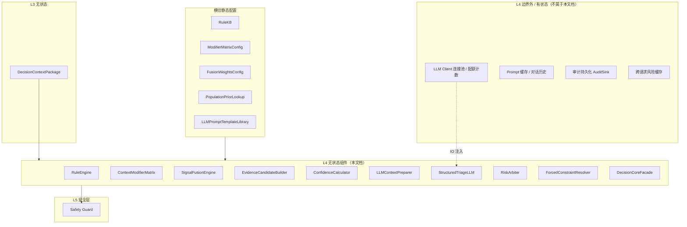
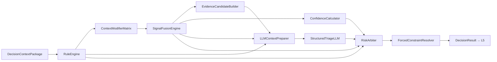

# L4 决策层 — 无状态组件设计

本文档仅描述 **L4 决策层（Decision Core）的无状态组件**，与有状态组件明确隔离，便于后续代码分包、单测与复用。

**设计依据**：`overall.md` 七层架构、L1–L3 无状态组件设计、input/output schema V1、20 case 验收前提，以及「规则优先 + 情境修正 + 条件信任 signal + LLM 限权文案 + 风险仲裁」等架构结论。

---

## 一、L4 层定位与边界

### 1.1 职责（做裁决与文案素材，不做契约与守卫终检）

L4 是 **医学分诊的核心决策层**：在 L3 提供的 `DecisionContextPackage` 约束下，产出风险候选、规则下限、证据候选、LLM 文案草稿与 **最终 riskLevel 仲裁结果**。

| 做 | 不做 |
|----|------|
| 硬规则引擎输出 riskFloor | 解析原始 input（属 L1/L3） |
| 情境修正各 signal 有效严重度 | 读写会话/历史/trend 记忆 |
| 多源信号融合与 evidence 候选 | 最终禁止词审查（属 L5） |
| 调用 LLM 生成用户可读文案草稿 | 单独用 LLM 决定 emergency |
| 风险仲裁（finalRisk、confidence） | 对外 output 映射（属 L1） |
| 产出 forcedMentions 等待办 | 修改 L3 的 FactSet / Boundary |

### 1.2 无状态定义（L4 范围内）

> 给定同一份 `DecisionContextPackage` + 固定 RuleKB / 矩阵配置 / 融合权重 / LLM 固定响应（测试 mock），L4 各 **确定性组件** 输出完全可复现。  
> **StructuredTriageLLM** 调用外部模型属于 IO，但组件本身不维护跨请求状态；同 prompt + 同模型参数应可回归（生产环境允许模型非确定性，需 mock 测路径）。

### 1.3 L4 无状态 vs 有状态隔离



**原则**：

- L4 **只读** `DecisionContextPackage`，不重复跑 L3 逻辑。  
- LLM 是 L4 内 **唯一非确定性依赖**；emergency、riskFloor 必须由规则先行确定。  
- finalRisk 只在 **RiskArbiter** 产出，L5/L6 不得修改。

---

## 二、L4 在 Pipeline 中的位置

L4 对应 L2 步骤 **S02–S06**：

| Step | L4 组件 |
|------|---------|
| S02 EvaluateRules | RuleEngine |
| S03 ApplyContextModifiers | ContextModifierMatrix |
| S04 FuseSignals | SignalFusionEngine + EvidenceCandidateBuilder + ConfidenceCalculator |
| S05 GenerateLLMDraft | LLMContextPreparer + StructuredTriageLLM |
| S06 ArbitrateRisk | RiskArbiter + ForcedConstraintResolver |



---

## 三、L4 无状态组件清单

| 组件 ID | 组件名 | 核心职责 |
|---------|--------|----------|
| L4-01 | RuleEngine | 硬规则、riskFloor、强制约束 |
| L4-02 | ContextModifierMatrix | 情境/个体修正信号严重度 |
| L4-03 | SignalFusionEngine | 多源融合与 candidateRisk |
| L4-04 | EvidenceCandidateBuilder | 可回溯 evidence 候选 |
| L4-05 | ConfidenceCalculator | 候选置信度计算 |
| L4-06 | LLMContextPreparer | 裁剪 LLM 上下文与约束注入 |
| L4-07 | StructuredTriageLLM | 结构化文案草稿生成 |
| L4-08 | RiskArbiter | 最终 riskLevel 与仲裁原因 |
| L4-09 | ForcedConstraintResolver | forcedMentions / 模板约束解析 |
| L4-10 | DecisionCoreFacade | L4 门面，S02–S06 编排 |

**横切静态配置**：

| 配置 ID | 名称 | 使用者 |
|---------|------|--------|
| CFG-L4-01 | RuleKB | L4-01 |
| CFG-L4-02 | ModifierMatrixConfig | L4-02 |
| CFG-L4-03 | FusionWeightsConfig | L4-03 |
| CFG-L4-04 | PopulationPriorLookup | L4-01、L4-02 |
| CFG-L4-05 | LLMPromptTemplateLibrary | L4-06、L4-07 |
| CFG-L4-06 | ArbiterPolicyConfig | L4-08 |

---

## 四、组件逐一设计

---

### L4-01 RuleEngine（硬规则引擎）

#### 职责

在一切软推理之前，输出 **风险下限 `riskFloor`** 与 **不可被 LLM 推翻的约束**。这是医疗安全的确定性锚点。

#### 无状态保证

- 纯规则求值：`evaluate(package, ruleKB) → RuleEvaluationResult`
- 不调用 LLM，不读历史

#### 输入

| 字段 | 来源 |
|------|------|
| decisionContextPackage | L3 完整包 |
| ruleKB | CFG-L4-01 |
| populationPriorLookup | CFG-L4-04 |

#### 输出

`RuleEvaluationResult`：

| 字段 | 说明 |
|------|------|
| riskFloor | normal / watch / warning / emergency |
| emergencyTriggered | boolean |
| ruleHits[] | ruleId、severity、reason、evidenceRefs |
| forcedMentions[] | 必须覆盖主题（如「休息」「补水」「联系兽医」） |
| forbiddenConclusions[] | 禁止结论类型（确诊、保证没事等） |
| gateBlocks[] | 如 BLOCK_NORMAL_JUDGEMENT |
| absoluteBreachFlags[] | 绝对生理护栏命中 |

#### 规则模块（与 20 case 对齐）

| 模块 ID | 规则类别 | 触发要点 | 典型 case |
|---------|----------|----------|-----------|
| R-EMG | 紧急升级 | seizure、breathingDifficulty、严重 trauma | emergency_* |
| R-DQ | 数据门禁 | DATA_MISSING / DATA_STALE → 禁 normal | missing_vitals、stale_device_data |
| R-ABS | 绝对生理护栏 | 安静态极端体温/呼吸（分层群体先验） | high_fever_resting、respiratory_rate_high_resting |
| R-SIG | 上游 signal 下限 | 最高 signal.riskLevel 对应下限 | 多个 warning case |
| R-CHR | 慢病组合升级 | 心脏病史 + 安静呼吸偏高等 | chronic_heart_resp_warning |
| R-AGE | 年龄加权下限 | 幼宠发热、老年精神食欲差 | puppy_fever、senior_cat |
| R-USR | 用户紧急结构化 | EMERGENCY_USER_FLAG 对应字段 | emergency_* |

#### 求值原则

1. **就高原则**：多规则命中取最高 riskFloor。  
2. **紧急优先**：R-EMG 命中 → emergencyTriggered=true。  
3. **数据门禁优先于乐观**：R-DQ 命中时 gateBlocks 含 BLOCK_NORMAL。  
4. **不产出文案**：只产出约束与 floor。

#### 明确不做

- 不因 userReport.text 单独确诊  
- 不用 Agent 记忆补规则条件  
- 不输出 finalRisk（属 Arbiter，但 floor 即下限）

#### 单测要点

- 每 ruleId 独立正负例  
- 20 case riskFloor 与 expected.riskLevel 关系：floor ≤ final ≤ 合理就高（由 Arbiter 测 final）

---

### L4-02 ContextModifierMatrix（情境修正矩阵）

#### 职责

对每个 **已评分 signal** 与关键 **vitals 维度**，计算「对这个宠物、这个时刻」的 **有效严重度**，覆盖运动后升高、疫苗后疲倦、幼老年、短鼻等差异。

#### 无状态保证

- 矩阵查表 + 修饰因子权重，纯计算

#### 输入

| 字段 | 说明 |
|------|------|
| decisionContextPackage | contextModifiers、scoredSignals、factSet |
| ruleEvaluationResult | 已知 floor，避免修正后低于绝对护栏 |
| modifierMatrixConfig | CFG-L4-02 |

#### 输出

`AdjustedSignalAssessments[]`：

| 字段 | 说明 |
|------|------|
| signalId / vitalKey | 对象标识 |
| rawSeverity | 来自 signal.riskLevel 或 vital 推导 |
| adjustedSeverity | 修正后 normal/watch/warning/emergency |
| adjustmentReasons[] | 如 POST_EXERCISE_DOWNGRADE、PUPPY_UPGRADE |
| effectiveWeight | 供 Fusion 使用 |

#### 修正维度

| 修饰因子 | 修正方向 | 示例 |
|---------|----------|------|
| post_exercise | 降低 1 档 | mild_fever_after_exercise |
| resting + 高热 | 维持或升高 | high_fever_resting |
| post_vaccine | 降低或维持 watch | post_vaccine_tired_watch |
| puppy_kitten | 升高或维持 warning | puppy_fever_high_risk |
| senior + 慢病 | 升高 | senior_cat_low_energy |
| brachycephalic + 呼吸 | 升高 | emergency_breathing_difficulty |
| low trust baseline | 更依赖当前 value 严重度 | conflict、missing 场景 |

#### 与群体先验关系

- 矩阵做 **情境解释**  
- PopulationPriorLookup 仅在 **rawSeverity 难判定** 时作粗参考  
- **不是**用群体区间替代个体 signal

#### 明确不做

- 不跨越 riskFloor 向下修正全局 risk  
- 不生成自然语言

#### 单测要点

- 表驱动：情境 × 原始严重度 → adjustedSeverity  
- 20 case 中运动后 vs 安静态成对对比

---

### L4-03 SignalFusionEngine（信号融合引擎）

#### 职责

融合 **riskFloor、修正信号、用户感知、矛盾 flags、上游 healthEvidence**，产出 **candidateRisk** 与分项候选。

#### 无状态保证

- 权重融合纯函数

#### 输入

| 字段 | 说明 |
|------|------|
| ruleEvaluationResult | floor |
| adjustedAssessments | L4-02 |
| decisionContextPackage | scoredSignals、contradictionFlags、userPerceptionProfile、upstreamHealthEvidence |
| fusionWeightsConfig | CFG-L4-03 |

#### 输出

`FusionResult`：

| 字段 | 说明 |
|------|------|
| candidateRisk | 融合主候选 |
| riskCandidates[] | 各来源及风险值 |
| dominantSources[] | 主导证据来源 |
| fusionNotes[] | 可审计说明 |
| upgradeTriggers[] | 何因升级 |
| downgradeBlocked | 是否因 floor 阻止降级 |

#### 融合优先级（概念）

```
candidateRisk = max(
  riskFloor,
  max(adjustedSignalSeverities 按 trust 加权),
  userEmergencyLevel,
  userReportStructuredSeverity,
  upstreamHealthEvidence.riskLevel 按信任降权
)
```

| 来源 | 策略 |
|------|------|
| riskFloor | 不可低于 |
| 高 trust signal | 主权重 |
| 低 trust signal | 降权，偏当前 vitals |
| userPerceptionProfile | 可升级；**低置信不单独降级 emergency** |
| USER_DEVICE_CONFLICT | 不降级设备侧；candidate 就高 |
| 多信号共振 | 多 vital warning → 可升一级 |

#### 明确不做

- 不生成 evidence 文案（L4-04）  
- 不调用 LLM  
- 不输出 finalRisk（须过 Arbiter）

#### 单测要点

- floor 约束：candidate ≥ floor  
- conflict case：candidate ≥ warning  
- missing case：candidate 常为 watch，非 normal

---

### L4-04 EvidenceCandidateBuilder（证据候选构建器）

#### 职责

基于 Fusion 结果与 L3 `evidenceBoundary`，生成 **可回溯** 的 evidence 候选句（草稿），供 LLM 润色或模板兜底。

#### 无状态保证

- 模板 + factRef 组装，纯函数

#### 输入

| 字段 | 说明 |
|------|------|
| fusionResult | L4-03 |
| decisionContextPackage | factSet、scoredSignals、evidenceBoundary、gapAssessment |
| ruleEvaluationResult | ruleHits |

#### 输出

`EvidenceCandidate[]`：

| 字段 | 说明 |
|------|------|
| draftText | 中文草稿句 |
| sourceRefs[] | factIndex / signalId |
| priority | 排序权重 |
| admissible | 是否允许进入最终 evidence |
| blockReason | 若不可采纳 |

#### 构建规则

1. 每条必须映射 `sourceRefs`。  
2. trust 低 signal：用「当前体温 XX°C」而非「高于基线」。  
3. DATA_STALE：强调数据过期，不说「当前正常」。  
4. USER_DEVICE_CONFLICT：包含设备读数 + 用户自述差异事实。  
5. 数量建议 2–5 条，按 priority 排序。

#### 明确不做

- 不编造未在 FactSet 的数值  
- 不做最终合规审查（L5）

#### 单测要点

- 每条 sourceRefs 可解析  
- missing_vitals：无假正常 evidence

---

### L4-05 ConfidenceCalculator（置信度计算器）

#### 职责

计算 **candidateConfidence**，供 Arbiter 与 output.confidence 使用。

#### 无状态保证

- 加权表纯函数

#### 输入

| 字段 | 说明 |
|------|------|
| decisionContextPackage | dataQualityVerdict、scoredSignals、contradictionFlags |
| fusionResult | 多源一致性 |
| ruleEvaluationResult | emergency 与 gate |

#### 输出

`ConfidenceAssessment`：

| 字段 | 说明 |
|------|------|
| candidateConfidence | low / medium / high |
| factors[] | 加减分原因 |
| cap | 来自 dataQuality 的上限 |

#### 规则摘要

| 条件 | confidence |
|------|------------|
| missing/stale dominant | cap=low |
| 多源一致 + good data | high |
| USER_DEVICE_CONFLICT | 降一级 |
| partial data | ≤ medium |
| emergency + 充分结构化紧急字段 | high（若数据可信） |

#### 明确不做

- 不因 LLM 自信度改 confidence  
- 不输出 riskLevel

---

### L4-06 LLMContextPreparer（LLM 上下文准备器）

#### 职责

将 L3/L4 产物 **裁剪** 为 LLM 可消费、受约束的 prompt 上下文，防止超窗、防编造、注入 riskFloor。

#### 无状态保证

- 纯裁剪与模板填充；不调用模型

#### 输入

| 字段 | 说明 |
|------|------|
| decisionContextPackage | 裁剪源 |
| ruleEvaluationResult | floor、forcedMentions、forbidden |
| fusionResult | candidateRisk、dominantSources |
| evidenceCandidates | 可采纳列表 |
| evidenceBoundary | 允许/禁止引用 |
| llmPromptTemplateLibrary | CFG-L4-05 |

#### 输出

`PreparedLLMContext`：

| 字段 | 说明 |
|------|------|
| systemConstraints | 非诊断、不得低于 floor 等 |
| factSummary | 允许事实摘要 |
| signalSummary | 已修正严重度摘要 |
| flagsSummary | 矛盾与缺失 |
| evidenceSeed | 候选 evidence |
| outputSchemaHint | 期望 JSON 字段 |
| mustInclude | forcedMentions |
| mustAvoid | forbiddenConclusions + boundary |

#### 裁剪原则

- **不传** 完整 raw input  
- **不传** 低 trust baseline 对比句  
- **必传** riskFloor、evidenceBoundary.forbiddenPatterns  
- USER_DEVICE_CONFLICT：显式说明「勿站队用户忽视设备」

#### 明确不做

- 不执行 LLM 调用  
- 不扩大 evidence 边界

---

### L4-07 StructuredTriageLLM（结构化分诊 LLM 生成器）

#### 职责

L4 **唯一 LLM 调用点**，生成用户可读 **文案草稿**（非最终合规稿）。

#### 无状态保证（组件级）

- 每次调用自包含：仅依赖 `PreparedLLMContext`  
- 不携带对话历史  
- 不读写 Session

#### 输入

| 字段 | 说明 |
|------|------|
| preparedLLMContext | L4-06 |
| llmClient | 外部 IO 注入 |
| generationOptions | temperature、model、timeout |

#### 输出

`LLMDraftOutput`：

| 字段 | 说明 |
|------|------|
| title | 短标题 |
| summary | 用户解释 |
| recommendation | 下一步建议 |
| whenToSeeVet | 就医升级条件 |
| evidence[] | 字符串数组 |
| safetyNoticeDraft | 安全声明草稿 |
| suggestedRisk | 可选，**仅作参考** |
| llmMeta | model、latency、token |

#### 允许职责

- 润色 evidenceCandidates  
- 解释矛盾与缺失  
- 在 watch 多信号间排序叙述  

#### 禁止职责

- 单独决定 emergency（须已被 RuleEngine 约束）  
- 低于 riskFloor 的 suggestedRisk（Arbiter 忽略）  
- 确诊、保证性表述  
- 引用 boundary 外事实  

#### 与 L2 ShortCircuit 关系

- `emergencyTriggered=true` 时 L2 可跳过本组件，改走 FallbackTemplate  
- 本组件被跳过时，L4-08 仍基于 Fusion + Rule 仲裁

#### 失败策略

- 超时/错误 → 空 draft + error 标记，由 L2 DegradationPolicy 走模板

#### 单测要点

- mock LLM 固定 JSON 输出  
- prompt 含 floor 与 boundary  
- 生产非确定性不阻塞确定性组件单测

---

### L4-08 RiskArbiter（风险仲裁器）

#### 职责

产生 **finalRiskLevel** 与 **arbitrationReasons**，是 L4 唯一最终风险裁决出口。

#### 无状态保证

- 确定性仲裁策略

#### 输入

| 字段 | 说明 |
|------|------|
| ruleEvaluationResult | riskFloor、emergencyTriggered |
| fusionResult | candidateRisk |
| confidenceAssessment | L4-05 |
| llmDraftOutput | 可选 suggestedRisk |
| upstreamHealthEvidence | 对照 |
| arbiterPolicyConfig | CFG-L4-06 |

#### 输出

`ArbitrationResult`：

| 字段 | 说明 |
|------|------|
| finalRiskLevel | normal / watch / warning / emergency |
| finalConfidence | low / medium / high |
| arbitrationReasons[] | 不一致时必须记录 |
| adoptedSources | 采纳哪方 |
| vsExpectedNote | 评测模式可选 |

#### 仲裁优先级

1. `emergencyTriggered` → finalRiskLevel = emergency  
2. `finalRiskLevel = max(riskFloor, candidateRisk, llmSuggestedRisk 若存在)`  
3. 若 `finalRiskLevel` < 上游最高 signal risk → 记录 reason（README：不能静默忽略）  
4. `finalConfidence = min(cap, candidateConfidence)`，冲突再降  
5. missing/stale → confidence 上限 low  

#### 明确不做

- 不生成文案  
- 不因「用户说没事」降低设备侧 emergency

#### 单测要点

- 20 case finalRiskLevel 对齐 expected  
- 仲裁 reason 在 under-risk 场景非空

---

### L4-09 ForcedConstraintResolver（强制约束解析器）

#### 职责

将 RuleEngine 的 `forcedMentions`、`forbiddenConclusions` 与 case 级策略，解析为 **L5/L6 可执行的检查清单**。

#### 无状态保证

- 查表合并

#### 输入

| 字段 | 说明 |
|------|------|
| ruleEvaluationResult | forced/forbidden |
| arbitrationResult | finalRiskLevel |
| decisionContextPackage | flags、modifiers |
| fusionResult | 主导主题 |

#### 输出

`ResolvedConstraints`：

| 字段 | 说明 |
|------|------|
| mustMentionTopics[] | 主题级，非字面字符串 |
| mustNotMentionTopics[] | |
| safetyNoticeRequired | boolean |
| templateHints | 供 L6 Fallback |
| primaryActionHint | 联系兽医 / 检查设备等 |

#### 与 20 case expected 关系

- `mustMention` 在 L7 做语义检查  
- 本组件输出 **主题级约束**（如 topic: rest_hydration、contact_vet），L6/L7 映射到文案

#### 单测要点

- emergency → safetyNoticeRequired=true  
- mild_fever → mustMention 含 rest/hydration 主题

---

### L4-10 DecisionCoreFacade（决策层门面）

#### 职责

L4 对外唯一入口，供 L2 在 S02–S06 调用；固定子组件顺序，输出 `DecisionResult`。

#### 无状态保证

- 编排 L4-01～09，无缓存

#### 输入

| 字段 | 说明 |
|------|------|
| decisionContextPackage | L3 S01 产物 |
| traceContext | 透传 |
| pipelineOptions | enableLlm、shortCircuitLlm |
| configBundle | CFG-L4-* |
| llmClient | 可选注入 |

#### 输出

`DecisionResult`：

| 字段 | 消费者 |
|------|--------|
| arbitrationResult | L5、L6、L7 |
| llmDraftOutput | L5、L6 |
| evidenceCandidates | L5、L6 |
| resolvedConstraints | L5、L6 |
| ruleEvaluationResult | L5、L7 审计 |
| fusionResult | L7 审计 |
| stepTimings | 可观测 |

#### 内部分步（可由 L2 分 step 调用，或 Facade 一次跑完）

```
RuleEngine
→ ContextModifierMatrix
→ SignalFusionEngine
→ EvidenceCandidateBuilder + ConfidenceCalculator
→ [若未短路] LLMContextPreparer → StructuredTriageLLM
→ RiskArbiter
→ ForcedConstraintResolver
```

#### 错误策略

- RuleEngine/Fusion/Arbiter 失败：S02–S06 失败，L2 降级  
- 仅 LLM 失败：继续仲裁 + 模板，不失败整链

---

## 五、L4 内部数据对象（管道 DTO）

| 对象 | 产生者 | 主要消费者 |
|------|--------|------------|
| RuleEvaluationResult | L4-01 | L4-02～09、L5、L7 |
| AdjustedSignalAssessments | L4-02 | L4-03 |
| FusionResult | L4-03 | L4-04、L4-06、L4-08 |
| EvidenceCandidate[] | L4-04 | L4-06、L4-07、L6 |
| ConfidenceAssessment | L4-05 | L4-08 |
| PreparedLLMContext | L4-06 | L4-07 |
| LLMDraftOutput | L4-07 | L4-08、L5、L6 |
| ArbitrationResult | L4-08 | L5、L6、L7 |
| ResolvedConstraints | L4-09 | L5、L6 |
| DecisionResult | L4-10 | L5 入口 |

**关键不变式**：

- `finalRiskLevel ≥ riskFloor`  
- `emergencyTriggered → finalRiskLevel = emergency`  
- evidence 候选均有 sourceRefs  
- L4 不修改 `DecisionContextPackage`

---

## 六、与上下游接口契约

### 6.1 上游（L3）

| 要求 | 说明 |
|------|------|
| 唯一输入 | `DecisionContextPackage` |
| 禁止 | L4 重跑 FactSetExtractor 等 |
| 用户侧 | 使用 `userPerceptionProfile`（L3-07），非直接解析 text |

### 6.2 下游（L5）

| 传递 | 用途 |
|------|------|
| ArbitrationResult.finalRiskLevel | Guard 底线 |
| LLMDraftOutput | 审查与改写 |
| EvidenceCandidate + boundary | 真实性检查 |
| ResolvedConstraints | mustMention / safetyNotice |

### 6.3 下游（L6）

| 传递 | 用途 |
|------|------|
| LLMDraft 或空 | 组装 output 文案 |
| ArbitrationResult | riskLevel、confidence |
| ResolvedConstraints | safetyNotice、primaryActionHint |

### 6.4 与 L2 协作

| L2 策略 | L4 行为 |
|---------|---------|
| ShortCircuit S05 | 跳过 L4-06/07，Arbiter 仍执行 |
| Degradation LLM 失败 | L4-08 用 Fusion + Rule，draft 空 |
| S02–S04 不可跳过 | Rule/Matrix/Fusion 必须执行 |

---

## 七、与 20 case 的映射（L4 视角）

| caseId | 关键 L4 行为 |
|--------|-------------|
| normal_dog_daily_check | floor=normal，fusion=normal，high confidence |
| mild_fever_after_exercise | Matrix 降级，watch |
| high_fever_resting | R-ABS + warning |
| respiratory_rate_high_resting | warning，forced 联系兽医 |
| heart_rate_high_after_play | post_exercise 降级 watch |
| heart_rate_high_resting_warning | senior+慢病，warning |
| hrv_stress_watch | watch，非确诊 |
| limping_pain_watch | watch，forced 减运动 |
| recovery_slow_watch | watch |
| missing_vitals | R-DQ，floor≥watch，禁 normal |
| conflict_user_normal_sensor_fever | fusion 就高 warning，LLM 解释冲突 |
| emergency_breathing_difficulty | R-EMG，emergency，可短路 LLM |
| emergency_seizure | R-EMG，emergency |
| persistent_vomiting_warning | warning |
| mild_diarrhea_watch | watch |
| senior_cat_low_energy | R-AGE/慢病，warning |
| puppy_fever_high_risk | R-AGE，warning |
| post_vaccine_tired_watch | Matrix 疫苗后 watch |
| stale_device_data | R-DQ stale，禁当前正常 |
| chronic_heart_resp_warning | R-CHR，warning |

---

## 八、RuleKB 结构要求（CFG-L4-01）

RuleKB 应 **可版本化、可单测、与 case 可追溯**：

| 模块 | 内容 |
|------|------|
| emergencyRules | 结构化用户紧急字段 → emergency |
| dataQualityRules | missing/stale/partial 行为 |
| absoluteThresholdRules | 分层群体护栏 |
| signalFloorRules | 按 signal.riskLevel 下限 |
| chronicComboRules | 慢病 + 体征组合 |
| ageModifierRules | 幼老年加权 |
| forcedMentionRules | 风险级 + 情境 → 主题 |
| rulePriority | 冲突时就高 |

每条规则：`ruleId`、`condition`、`riskFloorContribution`、`emits[]`。

---

## 九、代码管理与分包建议

```
decision/
  stateless/
    rules/
      rule_engine/
    modifiers/
      context_modifier_matrix/
    fusion/
      signal_fusion/
      evidence_candidates/
      confidence/
    llm/
      context_preparer/
      structured_triage_llm/
    arbitration/
      risk_arbiter/
      forced_constraints/
    facade/
  config/
    rule_kb/
    modifier_matrix/
    fusion_weights/
    arbiter_policy/
    llm_prompt_templates/
  contracts/
```

**依赖规则**：

| 允许 | 禁止 |
|------|------|
| L4 → L3 contracts（只读 Package） | L4 → L1 raw input |
| L4 → decision/config | L4 → SessionStore |
| L4-07 → llmClient 接口 | L4 → L5 Guard 实现 |
| L4 各组件互相通过 contracts | RuleEngine → LLM |

---

## 十、测试策略（L4 专属）

### 10.1 单测

| 组件 | 方法 |
|------|------|
| RuleEngine | 每 ruleId 表驱动 |
| ContextModifierMatrix | 情境×严重度矩阵 |
| SignalFusionEngine | floor 约束、冲突就高 |
| EvidenceCandidateBuilder | sourceRefs 完整性 |
| ConfidenceCalculator | cap 与降级 |
| LLMContextPreparer | 裁剪边界、floor 注入 |
| StructuredTriageLLM | mock 固定输出 |
| RiskArbiter | 仲裁优先级枚举 |
| ForcedConstraintResolver | 主题约束 |

### 10.2 集成测

- L3 Package → L4 Facade → DecisionResult  
- LLM 关闭：20 case 风险级应仍 largely 通过（文案走 L6 模板）  
- LLM mock 开启：语义 mustMention 交由 L7

### 10.3 回归约束

- 改 RuleKB 必须跑 20 case risk 回归  
- L4 变更不得降低 riskFloor  
- 禁止在 L4 引入跨请求状态

---

## 十一、非功能要求

| 维度 | 要求 |
|------|------|
| 确定性 | S02–S04、S06 全确定性；S05 可 mock |
| 延迟 | 规则+融合毫秒级；LLM 占主导 |
| 可审计 | ruleHits、fusionNotes、arbitrationReasons 必填 |
| 安全 | emergency 只来自 RuleEngine 结构化条件 + 绝对护栏 |
| 扩展 | 新规则加 ruleId，不改 Arbiter 核心 |
| 降级 | LLM 失败不影响 finalRisk 合法性 |

---

## 十二、明确排除的有状态能力

| 能力 | 归属 |
|------|------|
| LLM 对话历史 | 禁止 |
| 跨请求学习 fusion 权重 | 禁止 |
| 风险结果缓存 | 禁止 |
| 在线热更新 RuleKB 无版本 | 禁止；须版本化发布 |
| L4 内嵌向量检索 | 禁止；语义在 L3 |
| Arbiter 读审计历史 | 禁止 |

---

## 十三、设计原则与总结

### 13.1 L4 设计原则

1. **规则先行**：riskFloor 先于 LLM。  
2. **情境修正优于群体阈值**：个体/环境差异在 Matrix，不在单一硬编码。  
3. **融合就高不就低**：医疗保守原则。  
4. **LLM 只写稿不判案**：finalRisk 由 Arbiter 据 floor+candidate 决定。  
5. **证据可回溯**：EvidenceCandidate 必有 sourceRefs。  
6. **只读 L3 Package**：避免双轨解析。  
7. **与 L5 分工**：L4 产出草稿与约束，L5 做合规终检。

### 13.2 组件总览

L4 共 **10 个无状态组件**：

| ID | 组件 |
|----|------|
| L4-01 | RuleEngine |
| L4-02 | ContextModifierMatrix |
| L4-03 | SignalFusionEngine |
| L4-04 | EvidenceCandidateBuilder |
| L4-05 | ConfidenceCalculator |
| L4-06 | LLMContextPreparer |
| L4-07 | StructuredTriageLLM |
| L4-08 | RiskArbiter |
| L4-09 | ForcedConstraintResolver |
| L4-10 | DecisionCoreFacade |

**核心原则**：L4 是 **医学裁决与文案素材层**；确定性规则承载安全底线，LLM 承载表达力，Arbiter 承载最终风险一致性。