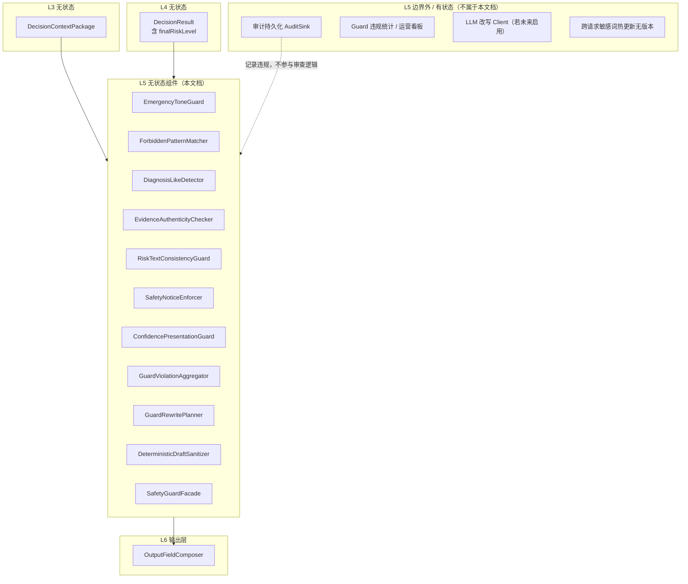
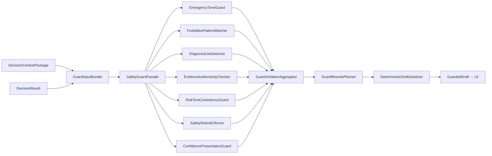

# L5 安全与合规层 — 无状态组件设计

本文档仅描述 **L5 安全与合规层（Safety Guard）的无状态组件**，与有状态组件明确隔离，便于后续代码分包、单测与复用。

**设计依据**：`overall.md` 七层架构、L1–L4 无状态组件设计、output_schema V1（含 `forbiddenOutputPatterns`）、20 case 验收前提，以及「生成后审查、宁可朴素不可越界、riskLevel 不可在 L5 被修改」等架构结论。

---

## 一、L5 层定位与边界

### 1.1 职责（做合规终检，不做裁决与组装）

L5 是 **医疗产品边界守卫层**：在 L4 已产出 `finalRiskLevel` 与 LLM 文案草稿之后，对 **用户可见文本字段** 做生成后审查（post-generation guard），并产出可交给 L6 的 `GuardedDraft`。

| 做 | 不做 |
|----|------|
| 拦截禁止词、确诊/保证性表述 | 修改 `finalRiskLevel`（属 L4 Arbiter，L5 只读） |
| 审查 evidence 可回溯性与真实性 | 重新跑 RuleEngine / Fusion |
| 检查 emergency 文案是否弱化 | 调用 LLM 做合规改写（V1 默认禁止） |
| 强制 safetyNotice 策略 | 填充 output_schema 全量字段（属 L6） |
| 规划局部字段消毒/模板替换 | 读写会话、审计持久化 |
| 输出违规清单与 Guard 审计 | 对外 HTTP 映射（属 L1） |

### 1.2 无状态定义（L5 范围内）

> 给定同一份 `GuardInputBundle`（L3 Package + L4 DecisionResult + LLM 草稿）+ 固定 Guard 配置版本，L5 各组件的审查结论与改写规划 **完全可复现**，不依赖历史请求、Guard 缓存或跨请求学习。

**说明**：

- L5 **不调用 LLM**（V1 默认）：改写通过 **确定性模板替换 / 字段回退** 完成，保证可测。  
- 若未来引入「Guard LLM 改写」，应作为 **可选 IO 适配器** 注入，且默认关闭，不改变 L5 组件的无状态契约语义。

### 1.3 L5 无状态 vs 有状态隔离



**原则**：

- **finalRiskLevel 冻结**：L5 只审查「文案是否与风险一致」，不得「为了文案好看」改风险。  
- **审查在组装前**：L6 消费 `GuardedDraft`，不是未经 Guard 的 LLM 原文。

---

## 二、L5 在 Pipeline 中的位置

L5 对应 L2 步骤 **S07 RunSafetyGuard**，位于 L4 S06 之后、L6 S08 之前。



与 L2 RetryPlanner 协作：

- S07 首次审查失败 → `PARTIAL_REWRITE` 一次 → 再跑 S07  
- 仍失败 → L2 DegradationPolicy 走 L6 FallbackTemplate（全量兜底）

---

## 三、L5 无状态组件清单

| 组件 ID | 组件名 | 核心职责 |
|---------|--------|----------|
| L5-01 | EmergencyToneGuard | 紧急场景文案弱化拦截 |
| L5-02 | ForbiddenPatternMatcher | schema 禁止词匹配 |
| L5-03 | DiagnosisLikeDetector | 隐性确诊/保证性表述检测 |
| L5-04 | EvidenceAuthenticityChecker | evidence 可回溯与真实性 |
| L5-05 | RiskTextConsistencyGuard | 文案与 finalRisk 一致性 |
| L5-06 | SafetyNoticeEnforcer | safetyNotice 必填与内容策略 |
| L5-07 | ConfidencePresentationGuard | confidence 呈现合规 |
| L5-08 | GuardViolationAggregator | 违规汇总与严重度排序 |
| L5-09 | GuardRewritePlanner | 改写/回退规划 |
| L5-10 | DeterministicDraftSanitizer | 确定性消毒与模板替换 |
| L5-11 | SafetyGuardFacade | L5 门面，S07 入口 |

**横切静态配置**：

| 配置 ID | 名称 | 使用者 |
|---------|------|--------|
| CFG-L5-01 | ForbiddenPatternLibrary | L5-02、L5-03 |
| CFG-L5-02 | EmergencyToneRules | L5-01 |
| CFG-L5-03 | RiskTextConsistencyRules | L5-05 |
| CFG-L5-04 | SafetyNoticeTemplateLibrary | L5-06、L5-10 |
| CFG-L5-05 | GuardRewritePolicy | L5-09、L5-10 |
| CFG-L5-06 | EvidenceCitationPolicy | L5-04 |

---

## 四、Guard 输入包（L5 统一入口数据结构）

`GuardInputBundle` 由 L2/L4 组装，L5 各组件只读：

| 字段 | 来源 | 用途 |
|------|------|------|
| decisionContextPackage | L3 | factSet、evidenceBoundary、flags、dataQuality |
| arbitrationResult | L4 | finalRiskLevel、finalConfidence（冻结） |
| llmDraftOutput | L4 | 待审查文案字段 |
| evidenceCandidates | L4 | 回退 evidence 依据 |
| resolvedConstraints | L4 | mustMention、safetyNoticeRequired |
| ruleEvaluationResult | L4 | emergencyTriggered、forcedMentions |

**冻结字段（L5 不可写）**：

- `arbitrationResult.finalRiskLevel`  
- `arbitrationResult.finalConfidence`（L5-07 仅审查「呈现是否夸大」，不改值）

---

## 五、组件逐一设计

---

### L5-01 EmergencyToneGuard（紧急语气守卫）

#### 职责

当 `finalRiskLevel=emergency` 或 `emergencyTriggered=true` 时，检测文案是否 **弱化紧急性**（如「继续观察即可」「不用就医」「先在家看看」）。

#### 无状态保证

- 规则表 + 模式匹配，纯函数

#### 输入

| 字段 | 说明 |
|------|------|
| arbitrationResult | finalRiskLevel、emergencyTriggered |
| llmDraftOutput | summary、recommendation、whenToSeeVet |
| emergencyToneRules | CFG-L5-02 |

#### 输出

`GuardFinding[]`：

| 字段 | 说明 |
|------|------|
| code | EMERGENCY_TONE_DOWNGRADE |
| fieldPath | 如 `recommendation` |
| severity | critical |
| matchedPhrase | 命中片段 |
| suggestedAction | REPLACE_WITH_EMERGENCY_TEMPLATE |

#### 必检字段

- `recommendation`：不得弱化就医  
- `whenToSeeVet`：不得写成「可暂缓」  
- `summary`：不得暗示「问题不大」

#### 与 20 case

- `emergency_breathing_difficulty`、`emergency_seizure`：`mustNotMention` 含「继续观察即可」

#### 明确不做

- 不将 non-emergency 升级为 emergency（属 L4）

---

### L5-02 ForbiddenPatternMatcher（禁止词匹配器）

#### 职责

对照 output_schema `forbiddenOutputPatterns` 及扩展库，扫描所有用户可见文本字段。

#### 无状态保证

- 静态词表/正则库，版本化

#### 输入

| 字段 | 说明 |
|------|------|
| llmDraftOutput | title、summary、recommendation、whenToSeeVet、evidence[]、safetyNoticeDraft |
| forbiddenPatternLibrary | CFG-L5-01 |

#### 输出

`GuardFinding[]`（code=`FORBIDDEN_PATTERN`）

#### V1 必覆盖禁止词（schema）

确诊为、一定没事、不用看医生、无需就医、保证、百分百

#### 扫描范围

| 字段 | 扫描 |
|------|------|
| title | ✅ |
| summary | ✅ |
| recommendation | ✅ |
| whenToSeeVet | ✅ |
| evidence[] | ✅ |
| safetyNoticeDraft | ✅ |

#### 明确不做

- 不做语义理解（「肯定」在「不确定」中不误杀——通过词边界/规则优化）

---

### L5-03 DiagnosisLikeDetector（类确诊表述检测器）

#### 职责

检测 **隐性确诊** 与 **隐性保证**，补充 L5-02 字面表之外的医疗越界表述。

#### 无状态保证

- 规则/正则分类器，非 LLM

#### 输入

同 L5-02 文本字段 + `forbiddenPatternLibrary` 扩展段

#### 输出

`GuardFinding[]`：

| code | 示例 |
|------|------|
| DIAGNOSIS_LIKE | 「就是胃炎」「肯定是肺炎」「已经确诊」 |
| GUARANTEE_LIKE | 「不用担心」「肯定能好」「绝对没事」 |
| NO_VET_NEEDED_LIKE | 「不用去医院」「观察就行」（非 emergency 也要审） |

#### 与 L4 分工

- L4 `forbiddenConclusions` 是生成约束  
- L5-03 是 **生成后验收**，双保险

#### 单测要点

- 正负例：「建议就医评估」✅ vs 「不用去医院」❌

---

### L5-04 EvidenceAuthenticityChecker（证据真实性审查器）

#### 职责

验证 `llmDraftOutput.evidence[]` 每条可回溯到 L3 FactSet / 可信 signal / 明确 userReport，且 **无编造数值/趋势**。

#### 无状态保证

- 引用解析 + 数值交叉校验

#### 输入

| 字段 | 说明 |
|------|------|
| llmDraftOutput.evidence[] | 待审 |
| decisionContextPackage | factSet、scoredSignals、evidenceBoundary |
| evidenceCandidates | L4 可采纳候选 |
| evidenceCitationPolicy | CFG-L5-06 |

#### 输出

`EvidenceAuditResult`：

| 字段 | 说明 |
|------|------|
| valid | boolean |
| findings[] | 逐条违规 |
| admissibleEvidence[] | 通过项 |
| rejections[] | 需剔除/替换项 |

#### 审查规则

1. 每条 evidence 应能映射到 `evidenceCandidates` 或 `sourceRefs` 等价路径。  
2. 出现具体数字（体温、心率等）必须在 factSet 中存在。  
3. `citationMode=current_value_only` 的 signal 不得以 baseline 对比形式出现。  
4. DATA_STALE / DATA_MISSING 场景不得有「当前一切正常」类 evidence。  
5. 不得出现「过去一周」「持续下降」等 **输入未提供的时序** 表述。

#### 失败处理

- 剔除违规条 → 不足条数时从 `evidenceCandidates` 补齐

#### 明确不做

- 不新增 evidence 医学含义（只采纳候选或模板句）

---

### L5-05 RiskTextConsistencyGuard（风险—文案一致性守卫）

#### 职责

检查文案语气、建议强度是否与 **冻结的 finalRiskLevel** 一致，防止「risk=warning 但文案像 normal」或「risk=emergency 但文案像 watch」。

#### 无状态保证

- 规则矩阵查表

#### 输入

| 字段 | 说明 |
|------|------|
| arbitrationResult.finalRiskLevel | 冻结 |
| llmDraftOutput | 关键文本字段 |
| riskTextConsistencyRules | CFG-L5-03 |
| decisionContextPackage.contradictionFlags | 冲突场景加强审查 |

#### 输出

`GuardFinding[]`（code=`RISK_TEXT_MISMATCH`）

#### 一致性矩阵（概念）

| finalRisk | recommendation 下限强度 | whenToSeeVet |
|-----------|---------------------------|--------------|
| normal | 观察级 | 可宽松 |
| watch | 观察+复查条件 | 需写何时升级 |
| warning | 联系兽医级 | 必须明确就医条件 |
| emergency | 立即就医级 | 不得弱化 |

#### 特殊场景

- `USER_DEVICE_CONFLICT`：允许解释不一致，但 **不得** 因用户主观而降低设备风险叙事  
- `missing/stale`：允许「无法判断」，禁止「正常」

#### 铁律

- 发现不一致 → **改文案，不改 finalRiskLevel**

---

### L5-06 SafetyNoticeEnforcer（安全提示强制执行器）

#### 职责

按 `resolvedConstraints.safetyNoticeRequired` 与 risk/data 场景，确保 `safetyNotice` 存在且满足最低医学边界表述。

#### 无状态保证

- 模板库 + 规则

#### 输入

| 字段 | 说明 |
|------|------|
| resolvedConstraints | safetyNoticeRequired |
| arbitrationResult | finalRisk、confidence |
| llmDraftOutput.safetyNoticeDraft | 草稿 |
| decisionContextPackage | dataQuality、flags |
| safetyNoticeTemplateLibrary | CFG-L5-04 |

#### 输出

`SafetyNoticeVerdict`：

| 字段 | 说明 |
|------|------|
| required | boolean |
| satisfied | boolean |
| findings[] | 缺失或过弱 |
| templateId | 推荐模板 |

#### 策略摘要（对齐 overall.md）

| 条件 | safetyNotice |
|------|--------------|
| watch 及以上 | 通常需要 |
| warning / emergency | 必须 |
| 存在 USER_DEVICE_CONFLICT | 必须（非诊断、建议兽医） |
| missing/stale | 按 case；强调非诊断、数据不足 |

#### 最低内容要求

- 声明 **非诊断**、不替代兽医  
- emergency 时强化 **立即寻求专业帮助**

---

### L5-07 ConfidencePresentationGuard（置信度呈现守卫）

#### 职责

审查文案是否 **夸大确定性**（与 `finalConfidence` 不一致），防止 low confidence 却写「可以确定」「没有问题」。

#### 无状态保证

- 规则匹配

#### 输入

| 字段 | 说明 |
|------|------|
| arbitrationResult.finalConfidence | 冻结 |
| llmDraftOutput | summary 等 |
| dataQualityVerdict | L3 |

#### 输出

`GuardFinding[]`（code=`OVERCONFIDENT_LANGUAGE`）

#### 规则示例

| finalConfidence | 禁止语气 |
|-----------------|----------|
| low | 「可以确定」「没有问题」「一切正常」 |
| medium | 「百分百」「保证」 |
| high | 仍受 L5-02/03 禁止词约束 |

#### 明确不做

- **不修改** finalConfidence 数值（不是 L5 职责；confidence 由 L4 决定）

---

### L5-08 GuardViolationAggregator（违规汇总器）

#### 职责

合并 L5-01～07 的 findings，按严重度排序，去重，输出统一 `GuardReport`。

#### 无状态保证

- 纯聚合

#### 输出

`GuardReport`：

| 字段 | 说明 |
|------|------|
| passed | boolean |
| findings[] | 全量 |
| criticalCount | 阻断级数量 |
| affectedFields | 需改写字段集合 |
| guardVersion | 配置版本 |

#### 严重度

| severity | 含义 |
|----------|------|
| critical | 必须改写才能过 Guard |
| major | 必须改写 |
| minor | 可模板自动修 |

#### passed 条件

- 无 critical/major 开放项（策略可配置 minor 容忍）

---

### L5-09 GuardRewritePlanner（守卫改写规划器）

#### 职责

根据 `GuardReport` 规划 **确定性** 改写动作，供 L5-10 执行；**不调用 LLM**（V1）。

#### 无状态保证

- 策略表：`finding.code + fieldPath → action`

#### 输出

`RewritePlan`：

| 字段 | 说明 |
|------|------|
| actions[] | REPLACE_FIELD / STRIP_PHRASE / FALLBACK_TO_CANDIDATE / USE_TEMPLATE |
| targetFields | 字段级 |
| templateIds | 模板引用 |
| maxPasses | V1=1（配合 L2 重试一次） |
| preserveRiskLevel | true（恒真） |

#### 改写优先级

1. **剔除/替换违规短语**（L5-02、03）  
2. **字段级模板替换**（L5-01、05、06）  
3. **evidence 回退到 evidenceCandidates**（L5-04）  
4. 若字段仍不可用 → 标 `FIELD_TEMPLATE_FALLBACK`

#### 与 L2 协作

- 规划完成后执行一次 Sanitizer  
- 若仍 `passed=false` → 交 L2 走 L6 全量 FallbackTemplate

---

### L5-10 DeterministicDraftSanitizer（确定性草稿消毒器）

#### 职责

执行 `RewritePlan`，产出 `GuardedDraft`（合规后的文案对象）。

#### 无状态保证

- 模板替换 + 字符串操作 + 候选回退，纯函数

#### 输入

| 字段 | 说明 |
|------|------|
| llmDraftOutput | 原始草稿 |
| rewritePlan | L5-09 |
| evidenceCandidates | 回退 |
| safetyNoticeTemplateLibrary | CFG-L5-04 |

#### 输出

`GuardedDraft`：

| 字段 | 说明 |
|------|------|
| title | 消毒后 |
| summary | 消毒后 |
| recommendation | 消毒后 |
| whenToSeeVet | 消毒后 |
| evidence[] | 消毒后 |
| safetyNotice | 最终安全提示 |
| sanitizationNotes[] | 审计：改了什么 |
| guardPassed | boolean |

#### 铁律

- **不得修改** `finalRiskLevel` / `finalConfidence`（随 Draft 透传只读副本）  
- 消毒后再次本地跑 L5-01～07 的快速复检（可选内嵌，仍属无状态）

---

### L5-11 SafetyGuardFacade（安全守卫门面）

#### 职责

L5 对外唯一入口，供 L2 S07 调用；固定审查顺序与一次改写循环。

#### 无状态保证

- 编排 L5-01～10

#### 输入

`GuardInputBundle` + `guardConfigBundle`

#### 输出

`GuardResult`：

| 字段 | 消费者 |
|------|--------|
| guardedDraft | L6 OutputFieldComposer |
| guardReport | L7 审计 |
| guardPassed | L2 RetryPlanner |
| frozenArbitration | 透传 L4 风险/confidence |

#### 内部固定顺序

```
EmergencyToneGuard
→ ForbiddenPatternMatcher
→ DiagnosisLikeDetector
→ EvidenceAuthenticityChecker
→ RiskTextConsistencyGuard
→ SafetyNoticeEnforcer
→ ConfidencePresentationGuard
→ GuardViolationAggregator
→ [若不通过] GuardRewritePlanner → DeterministicDraftSanitizer
→ [可选] 快速复检
```

#### 错误策略

- 审查器自身异常：视为 `guardPassed=false`，L2 降级模板  
- 绝不抛出无 GuardedDraft 的裸 LLM 原文给 L6

---

## 六、L5 内部数据对象

| 对象 | 产生者 | 消费者 |
|------|--------|--------|
| GuardFinding | L5-01～07 | L5-08 |
| GuardReport | L5-08 | L5-09、L7 |
| RewritePlan | L5-09 | L5-10 |
| GuardedDraft | L5-10 | L6 |
| GuardResult | L5-11 | L2、L6、L7 |

**关键不变式**：

- `GuardedDraft` 携带的 risk/confidence 与 L4 `ArbitrationResult` **完全一致**  
- `evidence[]` 每条可回溯  
- emergency 场景无弱化语气  
- 无 schema forbidden 词

---

## 七、与上下游接口契约

### 7.1 上游（L4）

| 要求 | 说明 |
|------|------|
| 必须提供 | arbitrationResult（含冻结 finalRisk） |
| 必须提供 | llmDraftOutput 或空（短路/降级时走模板） |
| 必须提供 | decisionContextPackage（证据审查） |
| 禁止 | L4 在交付 L5 后再改文案 |

### 7.2 下游（L6）

| 传递 | 用途 |
|------|------|
| GuardedDraft | 组装 output 文案字段 |
| frozenArbitration | riskLevel、confidence 原样写入 |
| guardReport.sanitizationNotes | debug/审计 |

L6 **不得** 绕过 Guard 直接用 `llmDraftOutput`（除非显式降级标记 `degraded=true` 且来自 L6 授权模板路径）。

### 7.3 与 L2 Retry / Degradation

| 事件 | 行为 |
|------|------|
| 首次 guard 失败 | L5-09/10 局部改写，L2 重试 S07 一次 |
| 二次失败 | L2 → L6 FallbackTemplate 全量兜底 |
| emergency 短路无 LLM | L5 仍执行；审查对象来自模板草稿 |

---

## 八、与 20 case 的映射（L5 视角）

| case 类型 | L5 重点 |
|-----------|---------|
| normal | 无禁止词；避免过度诊断 |
| watch/warning | safetyNotice 通常必填；risk 文案一致 |
| emergency | L5-01 禁弱化；L5-06 强化 |
| missing/stale | L5-04/05 禁「当前正常」；L5-07 禁高置信语气 |
| conflict | L5-05 允许不一致解释，但不降级设备侧 |
| 各 case mustNotMention | L5-02/03 字面+隐性检测 |

L7 `SemanticConstraintChecker` 负责 mustMention；L5 负责 **安全边界与禁止项**。

---

## 九、代码管理与分包建议

```
safety/
  stateless/
    guards/
      emergency_tone/
      forbidden_patterns/
      diagnosis_like/
      evidence_authenticity/
      risk_text_consistency/
      safety_notice/
      confidence_presentation/
    pipeline/
      violation_aggregator/
      rewrite_planner/
      draft_sanitizer/
    facade/
  config/
    forbidden_patterns/
    emergency_tone_rules/
    risk_text_consistency/
    safety_notice_templates/
    rewrite_policy/
    evidence_citation/
  contracts/
```

**依赖规则**：

| 允许 | 禁止 |
|------|------|
| L5 → L3/L4 contracts（只读） | L5 修改 finalRiskLevel |
| L5 → safety/config | L5 → RuleEngine |
| L5 → L6 contracts（GuardedDraft） | L5 默认 → LLM Client |
| facade 编排各 guard | guard → SessionStore |

---

## 十、测试策略（L5 专属）

### 10.1 单测

| 组件 | 方法 |
|------|------|
| EmergencyToneGuard | emergency 正负文案 |
| ForbiddenPatternMatcher | schema 词表全覆盖 |
| DiagnosisLikeDetector | 隐性确诊/保证样例 |
| EvidenceAuthenticityChecker | 编造数值、缺 sourceRef |
| RiskTextConsistencyGuard | 四档 risk 语气矩阵 |
| SafetyNoticeEnforcer | 必填场景 |
| ConfidencePresentationGuard | low 禁夸大 |
| GuardRewritePlanner | finding→action 映射 |
| DeterministicDraftSanitizer | 改写后复检通过 |

### 10.2 集成测

- L4 DecisionResult + 故意违规 LLM mock → Guard 通过或模板回退  
- emergency case：弱化文案必被 L5-01 抓  
- missing_vitals：正常叙事必被 L5-04/05 抓  

### 10.3 回归约束

- Guard 配置变更跑禁止词回归集  
- **任何 L5 改动不得改变 finalRiskLevel**  
- sanitization 可审计（sanitizationNotes 非空当改写发生）

---

## 十一、非功能要求

| 维度 | 要求 |
|------|------|
| 确定性 | 全层可确定性单测（V1 无 LLM） |
| 性能 | 毫秒～十毫秒级，远小于 LLM |
| 可审计 | 每条 finding 含 code、fieldPath、matchedPhrase |
| 安全优先 | critical 违规不可静默放行 |
| 版本化 | guardVersion 写入 GuardReport |
| 扩展 | 新禁止词加配置，不改 Facade 签名 |

---

## 十二、明确排除的有状态能力

| 能力 | 归属 |
|------|------|
| Guard 违规统计持久化 | L7 AuditSink / 运营库 |
| 跨请求用户敏感词学习 | 禁止 |
| Guard LLM 改写（默认） | 若启用，属 infrastructure，默认关 |
| 热更新词库无版本 | 禁止；须 CFG 版本发布 |
| 根据历史违规放宽规则 | 禁止 |
| 在 L5 修改 risk 以通过审查 | **严禁** |

---

## 十三、设计原则与总结

### 13.1 L5 设计原则

1. **生成后审查**：约束 LLM 产出，不替代 L4 裁决。  
2. **风险冻结**：只改文案，不改 finalRiskLevel/confidence 数值。  
3. **确定性优先**：V1 改写不用 LLM，保证可回归。  
4. **双层禁止**：生成约束（L4）+ 验收拦截（L5）。  
5. **证据可回溯**：编造数值比措辞不当更严重。  
6. **紧急不可弱化**：emergency 文案强度下限最高。  
7. **失败可降级**：Guard 不通过 → 模板，不返回越界原文。

### 13.2 组件总览

L5 共 **11 个无状态组件**：

| ID | 组件 |
|----|------|
| L5-01 | EmergencyToneGuard |
| L5-02 | ForbiddenPatternMatcher |
| L5-03 | DiagnosisLikeDetector |
| L5-04 | EvidenceAuthenticityChecker |
| L5-05 | RiskTextConsistencyGuard |
| L5-06 | SafetyNoticeEnforcer |
| L5-07 | ConfidencePresentationGuard |
| L5-08 | GuardViolationAggregator |
| L5-09 | GuardRewritePlanner |
| L5-10 | DeterministicDraftSanitizer |
| L5-11 | SafetyGuardFacade |

**核心原则**：L5 是 **医疗合规终检层**；与 L4 的「判风险、写草稿」分离，与 L6 的「填 schema、映射 App」分离，专责 **让用户最终看到的文字不越界**。