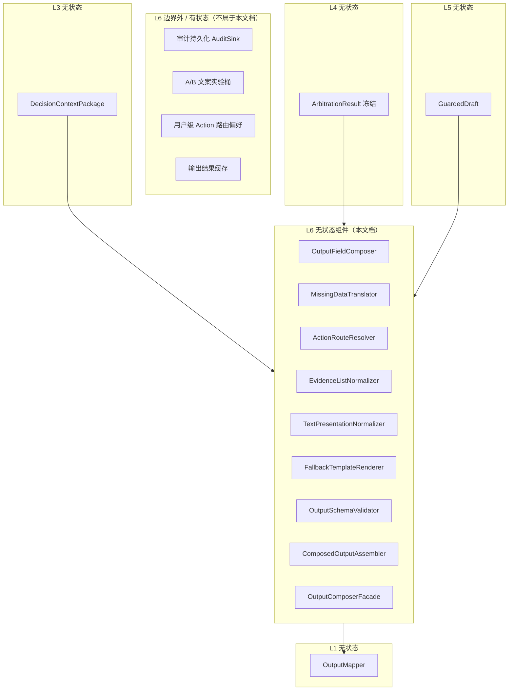
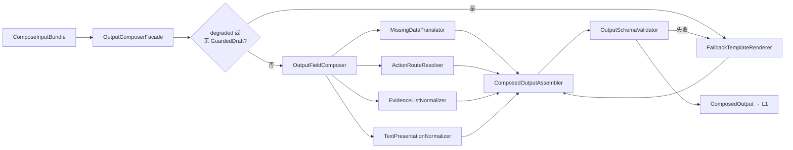

# L6 输出层 — 无状态组件设计

本文档仅描述 **L6 输出层（Output Composer）的无状态组件**，与有状态组件明确隔离，便于后续代码分包、单测与复用。

**设计依据**：`overall.md` 七层架构、L1–L5 无状态组件设计、`xiaozhua.health_agent.output.v1` schema、20 case 验收前提，以及「填满 output、risk 来自 L4 冻结值、Guard 后组装、Schema 失败走模板兜底」等架构结论。

---

## 一、L6 层定位与边界

### 1.1 职责（做组装与校验，不做裁决与合规审查）

L6 是 **对外 output 契约的组装层**：将 L4 冻结的医学裁决字段与 L5 审查后的文案，以及 L3 的缺失信息翻译，**填满** `output_schema`，供 L1 `OutputMapper` 投影给 App。

| 做 | 不做 |
|----|------|
| 字段级组装 `ComposedOutput` | 修改 `riskLevel` / `confidence` 数值 |
| 翻译 `missingData` 为用户可读文案 | 重新跑 RuleEngine、Guard |
| 解析 `primaryAction` / `secondaryAction` | 调用 LLM 生成文案 |
| output schema 结构校验 | 对外 HTTP 映射、debug 剥离（属 L1） |
| Guard/LLM 失败时模板兜底渲染 | 读写会话、审计持久化 |
| 文案长度与列表规范化（非医学） | 医学禁止词审查（属 L5，L6 可复检但不替代） |

### 1.2 无状态定义（L6 范围内）

> 给定同一份 `ComposeInputBundle`（L3 Package + L4 冻结裁决 + L5 GuardedDraft 或降级标记 + 模板配置版本），L6 各组件输出 **完全可复现**，不依赖历史请求、输出缓存或跨请求模板记忆。

### 1.3 L6 无状态 vs 有状态隔离



**原则**：

- L6 消费的文案 **默认来自 L5 `GuardedDraft`**；仅当 L2 标记 `degraded` 或 S07/S08 失败时走 `FallbackTemplateRenderer`。  
- `riskLevel`、`confidence` **只从 L4 `ArbitrationResult` 拷贝**，L6 任何组件不得重算。

---

## 二、L6 在 Pipeline 中的位置

L6 对应 L2 步骤 **S08 ComposeOutput** 与 **S09 ValidateOutputSchema**。



---

## 三、L6 无状态组件清单

| 组件 ID | 组件名 | 核心职责 |
|---------|--------|----------|
| L6-01 | OutputFieldComposer | 按策略映射各 output 字段 |
| L6-02 | MissingDataTranslator | missingData 枚举 → 用户可读 |
| L6-03 | ActionRouteResolver | primary/secondary Action |
| L6-04 | EvidenceListNormalizer | evidence 条数、去重、顺序 |
| L6-05 | TextPresentationNormalizer | 标题长度、空白、标点规范化 |
| L6-06 | FallbackTemplateRenderer | 降级/校验失败模板兜底 |
| L6-07 | OutputSchemaValidator | output schema 结构校验 |
| L6-08 | ComposedOutputAssembler | 不可变组装 ComposedOutput |
| L6-09 | OutputComposerFacade | L6 门面，S08–S09 入口 |

**横切静态配置**：

| 配置 ID | 名称 | 使用者 |
|---------|------|--------|
| CFG-L6-01 | OutputTemplateLibrary | L6-06（可与 L4/L5 共享变体 ID） |
| CFG-L6-02 | MissingDataLabelMap | L6-02 |
| CFG-L6-03 | ActionRouteTable | L6-03 |
| CFG-L6-04 | OutputPresentationPolicy | L6-04、L6-05 |
| CFG-L6-05 | OutputSchemaDefinition | L6-07 |

---

## 四、组装输入包（ComposeInputBundle）

L2 在调用 L6 前组装的只读包：

| 字段 | 来源 | 说明 |
|------|------|------|
| decisionContextPackage | L3 | gapAssessment、flags、meta |
| arbitrationResult | L4 | 冻结 riskLevel、confidence |
| guardedDraft | L5 | 审查后文案；可空 |
| resolvedConstraints | L4 | action 提示、mustMention 主题 |
| ruleEvaluationResult | L4 | 降级模板选型 |
| fusionResult | L4 | 可选，模板上下文 |
| pipelineMeta | L2 | degraded、shortCircuit、templateHint |
| contractContext | L1 | output schema 版本 |

---

## 五、组件逐一设计

---

### L6-01 OutputFieldComposer（输出字段组装器）

#### 职责

按 output_schema 字段策略，将 **冻结裁决字段** 与 **GuardedDraft 文案字段** 映射为 `PartialComposedOutput`。

#### 无状态保证

- 纯映射，不调用 LLM

#### 输入

| 字段 | 说明 |
|------|------|
| guardedDraft | L5 产物 |
| arbitrationResult | 冻结 |
| decisionContextPackage.meta | scene 等 |

#### 输出

`PartialComposedOutput`（尚未含 missingData、action、最终 evidence 规范化）：

| output 字段 | 来源策略 |
|-------------|----------|
| riskLevel | `arbitrationResult.finalRiskLevel` **原样拷贝** |
| scene | 固定 `health_triage` |
| confidence | `arbitrationResult.finalConfidence` **原样拷贝** |
| title | `guardedDraft.title` |
| summary | `guardedDraft.summary` |
| evidence | `guardedDraft.evidence[]`（待 L6-04） |
| recommendation | `guardedDraft.recommendation` |
| whenToSeeVet | `guardedDraft.whenToSeeVet` |
| safetyNotice | `guardedDraft.safetyNotice` |
| primaryAction | 占位，待 L6-03 |
| secondaryAction | 占位，待 L6-03 |
| missingData | 占位，待 L6-02 |

#### 铁律

- **禁止** 根据文案语气修改 riskLevel  
- **禁止** 在 missing/stale 场景从 summary 推断 normal 并写进 riskLevel（risk 已由 L4 决定，L6 只照抄）

#### 明确不做

- schema 校验（L6-07）  
- 禁止词审查（L5 已完成；L6 不重复完整 Guard）

---

### L6-02 MissingDataTranslator（缺失数据翻译器）

#### 职责

将 input `missingData` 枚举与 L3 `GapAssessment` 合并，生成 output `missingData: string[]` 用户可读描述。

#### 无状态保证

- 静态 label 映射表

#### 输入

| 字段 | 说明 |
|------|------|
| decisionContextPackage | missingDataFacts、gapAssessment、dataQualityVerdict |
| missingDataLabelMap | CFG-L6-02 |

#### 输出

`translatedMissingData: string[]`

#### 映射示例（概念）

| 枚举 | 用户可读 |
|------|----------|
| temperature | 体温数据缺失 |
| heart_rate | 心率数据缺失 |
| device_freshness | 设备数据已过期或未同步 |
| user_report | 主人观察信息不完整 |
| activity | 活动数据缺失 |

#### 规则

1. 以 input `missingData` 为主，不编造未声明缺失项。  
2. `dataQuality=stale` 可补充「当前不宜根据旧数据判断」类描述（与 case 对齐）。  
3. 无缺失时输出 `[]`，非 null。  
4. 不与 evidence 矛盾：若 output 已说明数据不足，missingData 应一致。

#### 单测要点

- missing_vitals：多条中文缺失说明  
- normal case：`[]`  
- stale_device_data：含设备过期描述

---

### L6-03 ActionRouteResolver（行动按钮路由解析器）

#### 职责

根据 **冻结 riskLevel**、L3 flags、L4 `resolvedConstraints.primaryActionHint`，解析 `primaryAction` 与可选 `secondaryAction`。

#### 无状态保证

- 静态路由表

#### 输入

| 字段 | 说明 |
|------|------|
| arbitrationResult.finalRiskLevel | 冻结 |
| decisionContextPackage | flags、dataQuality |
| resolvedConstraints | templateHints、primaryActionHint |
| actionRouteTable | CFG-L6-03 |

#### 输出

`ActionPlan`：

| 字段 | 类型 |
|------|------|
| primaryAction | `{ label, route }` |
| secondaryAction | `{ label, route } \| null` |

#### V1 路由矩阵（概念）

| 条件 | primaryAction.label | route 示例 |
|------|---------------------|------------|
| emergency | 联系兽医 / 就近就医 | `vet_emergency` |
| warning | 联系兽医 | `vet_consult` |
| watch + DATA_MISSING/STALE | 检查设备 | `device_check` |
| watch + post_exercise | 休息观察 | `rest_observe` |
| normal | 继续日常观察 | `daily_observe` |

**secondaryAction 示例**：

- warning：「记录症状」  
- missing：「查看佩戴指南」  
- conflict：「复查体温」  

#### 铁律

- route 可为 null（V1 mock 允许），但 label 必填  
- **不因** 用户偏好或历史改变 risk 对应关系（有状态偏好属产品层，非 L6）

#### 明确不做

- 不执行 App 内跳转（只产出 route 标识）

---

### L6-04 EvidenceListNormalizer（证据列表规范化器）

#### 职责

对 evidence 做 **非医学** 规范化：条数、去重、顺序、空项剔除。

#### 无状态保证

- 纯列表操作

#### 输入

| 字段 | 说明 |
|------|------|
| evidence[] | L6-01 或模板 |
| outputPresentationPolicy | CFG-L6-04 |

#### 输出

`normalizedEvidence: string[]`

#### 规则

| 规则 | 说明 |
|------|------|
| 条数 | 建议 2–5；不足不编造，过多截断保留高优先级 |
| 去重 | 完全相同字符串去重 |
| 空串 | 剔除 |
| 顺序 | 保持 L5/模板优先级，不重新按医学排序（医学排序在 L4） |

#### 明确不做

- 不修改 evidence 医学含义  
- 不新增 evidence 内容

---

### L6-05 TextPresentationNormalizer（文本呈现规范化器）

#### 职责

对 title、summary 等做 **呈现级** 处理：trim、多余空白、可选最大长度截断（不破坏医学句意）。

#### 无状态保证

- 确定性文本处理

#### 输入

| 字段 | 说明 |
|------|------|
| partialComposedOutput 文本字段 | |
| outputPresentationPolicy | 最大长度等 |

#### 输出

规范化后的文本字段

#### 规则

- 全角/半角标点不强制转换（避免医学数值歧义）  
- 超长 title 可在词边界截断并加省略号（策略可配置）  
- **禁止** 为缩短而删除否定词（「并非正常」）

#### 与 L5 边界

- L5 管医学合规；L6-05 管 **App 卡片展示体验**

---

### L6-06 FallbackTemplateRenderer（兜底模板渲染器）

#### 职责

当 **Guard 失败**、**LLM 跳过/超时**、**Compose 缺字段** 或 **Schema 校验失败** 时，用确定性模板生成完整文案字段，并与冻结 risk 一致。

#### 无状态保证

- 模板库版本化，纯渲染

#### 输入

| 字段 | 说明 |
|------|------|
| arbitrationResult | 冻结 risk、confidence |
| ruleEvaluationResult | emergency、flags |
| decisionContextPackage | dataQuality、flags、gapAssessment |
| fusionResult | 可选主题 |
| pipelineMeta | degraded 原因、templateHint |
| outputTemplateLibrary | CFG-L6-01 |

#### 输出

`TemplateDraft`：与 GuardedDraft 同构（title、summary、evidence、recommendation、whenToSeeVet、safetyNotice）

#### 模板选型维度

| 维度 | 变体 |
|------|------|
| riskLevel | normal / watch / warning / emergency |
| flag | DATA_MISSING、DATA_STALE、USER_DEVICE_CONFLICT |
| emergencyTriggered | 紧急专用套 |

#### 铁律

- 模板 risk 叙事与 `arbitrationResult.finalRiskLevel` 一致  
- 必须满足 L4 `forcedMentions` 最低主题（可主题级模板片段）  
- 仍须过 L5 理想路径；若从 L6 直接进入模板，模板须经 L5 离线验收集

#### 与 L2 DegradationPolicy

| 触发 | 行为 |
|------|------|
| S05 LLM 失败 | S08 直接用 TemplateDraft |
| S07 Guard 两次失败 | 全量模板 |
| S09 Schema 失败 | 重渲染模板 一次 |

---

### L6-07 OutputSchemaValidator（输出 Schema 校验器）

#### 职责

对 `ComposedOutput` 做 **结构级** 校验，确保 L1 OutputMapper 不会因缺字段失败。

#### 无状态保证

- 静态 schema 定义

#### 输入

| 字段 | 说明 |
|------|------|
| composedOutput | L6-08 |
| outputSchemaDefinition | CFG-L6-05 |

#### 输出

`SchemaValidationResult`：

| 字段 | 说明 |
|------|------|
| valid | boolean |
| errors[] | fieldPath、code、message |

#### 校验项

**1. 必填顶层字段**（schema）

`riskLevel`、`scene`、`title`、`summary`、`evidence`、`recommendation`、`whenToSeeVet`、`missingData`、`confidence`、`safetyNotice`、`primaryAction`

**2. 枚举**

- riskLevel：normal | watch | warning | emergency  
- scene：health_triage  
- confidence：low | medium | high  

**3. 类型**

- evidence、missingData 为 array  
- primaryAction 为 object 且含 label  
- secondaryAction 为 object 或 null  

**4. 非空策略**

- title、summary、recommendation、whenToSeeVet、safetyNotice 非空串  
- evidence 允许空数组仅当策略显式允许（V1 一般应有 ≥1 条，缺失数据场景可用「数据不足」类单条）  
- primaryAction.label 非空  

#### 明确不做

- 不做 mustMention 语义评测（L7）  
- 不做禁止词全文扫描（L5）；可选轻量复检非主责

#### 失败策略

- `valid=false` → Facade 触发 L6-06 全量模板 → 再校验一次 → 仍失败则 L2 致命降级（最小合法 output）

---

### L6-08 ComposedOutputAssembler（组合输出组装器）

#### 职责

将 L6-01～05 产物与 ActionPlan、translatedMissingData 合并为不可变 `ComposedOutput`。

#### 无状态保证

- 纯合并

#### 输出

`ComposedOutput`（内部契约，供 L1-04 OutputMapper 消费）：

| 字段 | 说明 |
|------|------|
| 全部 output schema 字段 | 齐全 |
| composeMeta | templateUsed、degraded、composeVersion |
| frozenRiskProvenance | 指向 arbitrationResult 的只读引用/id |

#### 不变式

- `composedOutput.riskLevel === arbitrationResult.finalRiskLevel`  
- `composedOutput.confidence === arbitrationResult.finalConfidence`  
- missingData 与 L3 gap 不矛盾

---

### L6-09 OutputComposerFacade（输出层门面）

#### 职责

L6 对外唯一入口；执行 S08–S09 完整流程。

#### 输入

`ComposeInputBundle`

#### 输出

`ComposeResult`：

| 字段 | 消费者 |
|------|--------|
| composedOutput | L1 OutputMapper |
| schemaValidation | L7、L2 |
| composeMeta | L7 审计 |
| success | L2 |

#### 内部流程

```
1. 若 pipelineMeta.degraded 或 guardedDraft 缺失
     → FallbackTemplateRenderer → 转 TemplateDraft 路径
   否则
     → OutputFieldComposer(guardedDraft)
2. MissingDataTranslator
3. ActionRouteResolver
4. EvidenceListNormalizer
5. TextPresentationNormalizer
6. ComposedOutputAssembler
7. OutputSchemaValidator
8. 若 invalid → FallbackTemplateRenderer → 重新 2–7（一次）
9. 返回 ComposeResult
```

---

## 六、L6 内部数据对象

| 对象 | 产生者 | 消费者 |
|------|--------|--------|
| PartialComposedOutput | L6-01 | L6-04、05、08 |
| ActionPlan | L6-03 | L6-08 |
| TemplateDraft | L6-06 | 作 GuardedDraft 等价输入 |
| ComposedOutput | L6-08 | L6-07、L1 |
| SchemaValidationResult | L6-07 | L2、L7 |
| ComposeResult | L6-09 | L1、L2、L7 |

---

## 七、与上下游接口契约

### 7.1 上游（L5 / L4 / L3 / L2）

| 来源 | 要求 |
|------|------|
| L5 | 默认提供 `GuardedDraft`；guardPassed 建议 true |
| L4 | 必须提供冻结 `arbitrationResult` |
| L3 | 提供 gap、flags、missing 翻译源 |
| L2 | 传递 degraded、templateHint |

### 7.2 下游（L1）

| 传递 | 说明 |
|------|------|
| ComposedOutput | L1-04 OutputMapper 映射为 publicOutput |
| composeMeta.degraded | 可选进入响应 meta |

L6 **不** 剥离 debug 字段（L6 输出即业务 output 语义；内部审计在 L7）。

### 7.3 与 L7 分工

| 层 | 职责 |
|----|------|
| L6-07 | 结构合法 |
| L7 | risk 对齐 expected、mustMention、禁止词二次抽检（可选） |

---

## 八、与 20 case 的映射（L6 视角）

| case 关注点 | L6 行为 |
|-------------|---------|
| 各档 riskLevel | 原样拷贝 L4，不漂移 |
| missing_vitals | missingData 中文列表；primary 偏设备检查 |
| stale_device_data | missingData 含过期说明 |
| emergency_* | primary 紧急就医；模板/emergency 套 |
| conflict | summary 来自 GuardedDraft；action 可含复查 |
| normal | secondary 可为 null；evidence 2+ 条 |
| mustMention | 主要由 L4/L5/L6 模板保证；L7 验收 |

---

## 九、代码管理与分包建议

```
output/
  stateless/
    compose/
      field_composer/
      output_assembler/
    translate/
      missing_data/
    actions/
      route_resolver/
    normalize/
      evidence_list/
      text_presentation/
    fallback/
      template_renderer/
    validate/
      schema_validator/
    facade/
  config/
    output_templates/
    missing_data_labels/
    action_routes/
    presentation_policy/
    output_schema/
  contracts/
```

**依赖规则**：

| 允许 | 禁止 |
|------|------|
| L6 → L3/L4/L5 contracts（只读） | L6 修改 arbitrationResult |
| L6 → output/config | L6 → LLM Client |
| L6 → L1 contracts（ComposedOutput） | L6 跳过 Guard 直接用 llmDraft（除非 degraded 显式） |
| 模板库与 L4/L5 共享 templateId | L6 内嵌 RuleEngine |

---

## 十、测试策略（L6 专属）

### 10.1 单测

| 组件 | 方法 |
|------|------|
| OutputFieldComposer | risk/confidence 拷贝不变 |
| MissingDataTranslator | 枚举全覆盖 |
| ActionRouteResolver | risk×flag 矩阵 |
| EvidenceListNormalizer | 条数、去重 |
| TextPresentationNormalizer | 长度边界 |
| FallbackTemplateRenderer | 每 risk×flag 变体 |
| OutputSchemaValidator | 必填、枚举、类型负例 |
| ComposedOutputAssembler | 不变式 |
| Facade | degraded 路径、schema 失败重试 |

### 10.2 集成测

- L5 GuardedDraft → L6 → schema valid  
- 无 GuardedDraft + degraded → 模板 compose valid  
- 20 case compose 后 L6-07 全 pass  

### 10.3 回归约束

- L6 变更不得改变 riskLevel/confidence  
- Schema 校验失败率应趋近 0（模板最终兜底）

---

## 十一、非功能要求

| 维度 | 要求 |
|------|------|
| 确定性 | 全层可确定性单测 |
| 性能 | 毫秒级 |
| 可靠性 | API 始终产出可校验 ComposedOutput |
| 版本化 | composeVersion、templateLibrary 版本写入 meta |
| 扩展 | 新 action route、新 missing 标签加配置 |

---

## 十二、明确排除的有状态能力

| 能力 | 归属 |
|------|------|
| 输出缓存 | 禁止 |
| 用户上次 action 记忆 | App / 有状态层 |
| 动态模板 A/B | 运营层，版本化后注入配置 |
| 根据历史改 risk 展示 | 禁止 |
| 审计写库 | L7 AuditSink |

---

## 十三、设计原则与总结

### 13.1 L6 设计原则

1. **只组装，不裁决**：risk/confidence 只拷贝 L4。  
2. **默认吃 Guard 后草稿**：不让未经 L5 的 LLM 原文直达 App。  
3. **结构必合法**：Schema 校验是交付前最后一道工程门。  
4. **失败有模板**：宁可朴素，不可缺字段或非法 JSON。  
5. **missing 诚实翻译**：与 L3 gap 一致，不编造。  
6. **Action 与 risk 一致**：按钮语义匹配医学严重度。  
7. **与 L1 分工**：L6 产出 ComposedOutput，L1 做对外映射与 debug 剥离。

### 13.2 组件总览

L6 共 **9 个无状态组件**：

| ID | 组件 |
|----|------|
| L6-01 | OutputFieldComposer |
| L6-02 | MissingDataTranslator |
| L6-03 | ActionRouteResolver |
| L6-04 | EvidenceListNormalizer |
| L6-05 | TextPresentationNormalizer |
| L6-06 | FallbackTemplateRenderer |
| L6-07 | OutputSchemaValidator |
| L6-08 | ComposedOutputAssembler |
| L6-09 | OutputComposerFacade |

**核心原则**：L6 是 **App 可渲染契约的组装层**；医学判断在 L4，合规在 L5，L6 负责 **把正确结论与合规文案装进正确 JSON 形状**。