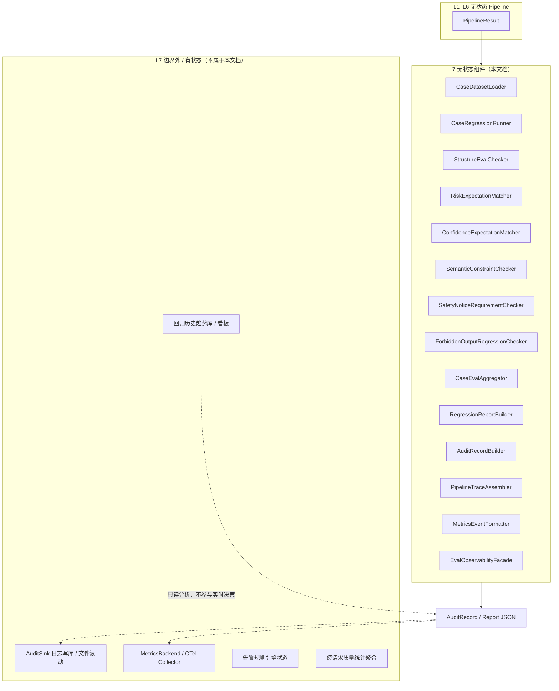
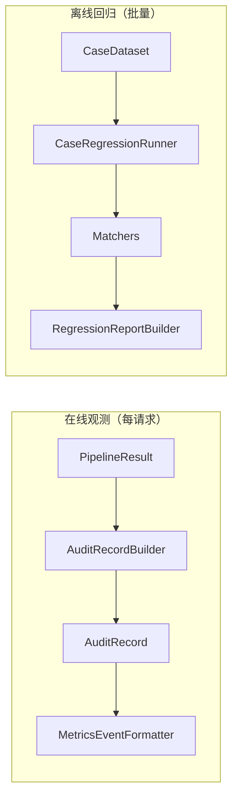
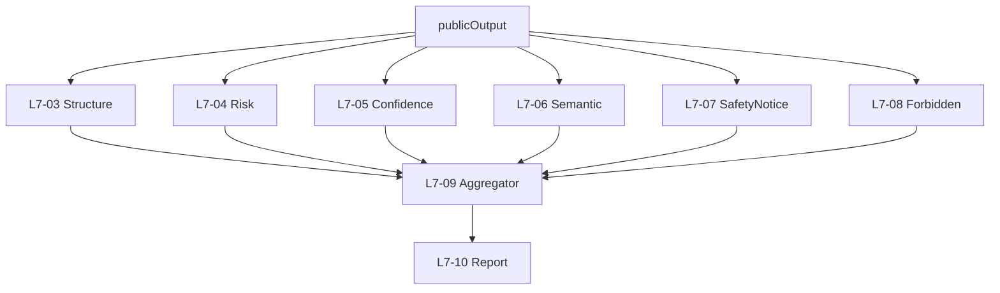

# L7 评测与观测层 — 无状态组件设计

本文档仅描述 **L7 评测与观测层（Eval / Observability）的无状态组件**，与有状态组件明确隔离，便于后续代码分包、单测与复用。

**设计依据**：`overall.md` 七层架构、L1–L6 无状态组件设计、`health_triage_cases.v1`（20 case）、output schema V1、README V1 验收重点，以及「评测不参与决策、审计不反向污染 Pipeline、V1 从一开始就要可回归」等架构结论。

---

## 一、L7 层定位与边界

### 1.1 职责（只观测与评测，不参与决策）

L7 是 **质量闭环层**：对单次请求的 Pipeline 产物做审计记录与可观测格式化，对 case 数据集做离线回归评测。**只读** L1–L6 产物，**绝不** 修改 risk、文案或 Pipeline 行为。

| 做 | 不做 |
|----|------|
| 20 case 批量回归与报告 | 修改 finalRiskLevel 或 output |
| 结构 / 风险 / 语义三类评测 | 重新跑分诊逻辑「替 Pipeline 纠错」 |
| 组装审计记录（AuditRecord） | 在实时路径中根据评测结果改路由 |
| 格式化 metrics / trace 事件 | 替代 L5 做生产合规守卫 |
| 对比 actual vs expected 并解释差异 | 读写跨请求学习状态 |
| 生成 CI 可读回归摘要 | 替代 L6 做 schema 修复 |

### 1.2 无状态定义（L7 范围内）

> 给定同一份评测输入（`PublicOutput` + Pipeline 内部审计快照 + case.expected）+ 固定评测配置版本，L7 各组件的评测结论与报告内容 **完全可复现**，不依赖历史请求、上次回归结果或运营库。

**说明**：

- L7 **构建** AuditRecord、RegressionReport，但 **写入** 日志/指标后端属于有状态 `AuditSink` / `MetricsBackend`（在 L7 包外）。  
- 在线路径：L7 与 L2 并行挂载在请求结束后，**只记录，不反馈**。

### 1.3 L7 无状态 vs 有状态隔离



**原则**：

- **审计型记忆**（V2 上游质量监控）的数据 **来源于** L7 审计记录沉淀，但 **不得** 在 V1 实时分诊中回读。  
- L7 失败（如 mustMention 未命中）**不阻断** 对用户返回 output（评测与 serving 解耦）。

---

## 二、L7 双模式：在线观测 vs 离线回归

| 模式 | 触发 | 主要组件 | 产出 |
|------|------|----------|------|
| **在线观测** | 每次 `/health` 请求结束 | AuditRecordBuilder、PipelineTraceAssembler、MetricsEventFormatter | AuditRecord、MetricsEvents |
| **离线回归** | CI / 本地 `run_cases` | CaseRegressionRunner + 各类 Matcher + ReportBuilder | RegressionReport |



两模式 **共享** Matcher 逻辑（结构、风险、语义），避免 CI 与线上一套标准、一套实现。

---

## 三、L7 无状态组件清单

| 组件 ID | 组件名 | 核心职责 |
|---------|--------|----------|
| L7-01 | CaseDatasetLoader | 加载版本化 case 数据集 |
| L7-02 | CaseRegressionRunner | 批量驱动 Pipeline 跑 case |
| L7-03 | StructureEvalChecker | 结构评测（output schema） |
| L7-04 | RiskExpectationMatcher | riskLevel 期望对齐 |
| L7-05 | ConfidenceExpectationMatcher | confidence 期望对齐 |
| L7-06 | SemanticConstraintChecker | mustMention / mustNotMention |
| L7-07 | SafetyNoticeRequirementChecker | safetyNoticeRequired 验收 |
| L7-08 | ForbiddenOutputRegressionChecker | 禁止词回归检测 |
| L7-09 | CaseEvalAggregator | 单 case 评测汇总 |
| L7-10 | RegressionReportBuilder | 批量回归报告 |
| L7-11 | AuditRecordBuilder | 单次请求审计记录 |
| L7-12 | PipelineTraceAssembler | 全链路 trace 摘要 |
| L7-13 | MetricsEventFormatter | 指标事件格式化 |
| L7-14 | EvalObservabilityFacade | L7 统一门面 |

**横切静态配置**：

| 配置 ID | 名称 | 使用者 |
|---------|------|--------|
| CFG-L7-01 | EvalPolicyConfig | 全局评测策略 |
| CFG-L7-02 | RiskMatchPolicy | L7-04（就高原则细则） |
| CFG-L7-03 | SemanticSynonymMap | L7-06（同义变体） |
| CFG-L7-04 | ForbiddenPatternLibrary | L7-08（可与 L5 共享版本） |
| CFG-L7-05 | AuditRecordSchema | L7-11 |
| CFG-L7-06 | MetricsCardinalityPolicy | L7-13（标签白名单） |

---

## 四、评测输入包（EvalInputBundle）

### 4.1 离线 case 评测输入

| 字段 | 来源 |
|------|------|
| caseId、name | case 元数据 |
| input | case.input |
| expected | case.expected |
| publicOutput | Pipeline 跑完经 L1 OutputMapper 的 output |
| pipelineAuditSnapshot | L2 PipelineResult.internalAudit |
| evalMode | strict / ci / debug |

### 4.2 在线观测输入

| 字段 | 来源 |
|------|------|
| traceContext | L2 |
| ingressMeta | caseId、petId、endpoint |
| pipelineResult | 完整内部产物 |
| publicOutput | L1 对外 output |
| composeMeta | degraded、templateUsed |
| guardReport | L5 |
| latencyBreakdown | L2 executionSummary |

---

## 五、组件逐一设计

---

### L7-01 CaseDatasetLoader（Case 数据集加载器）

#### 职责

加载 `health_triage_cases.v1` 版本化数据集，输出可迭代的 `CaseDefinition[]`。

#### 无状态保证

- 只读静态 JSON 文件；`datasetVersion` 写入加载结果

#### 输出

`CaseDataset`：

| 字段 | 说明 |
|------|------|
| datasetVersion | xiaozhua.health_triage_cases.v1 |
| cases | CaseDefinition[] |
| caseCount | 20 |

`CaseDefinition` 含：`caseId`、`name`、`input`、`expected`。

#### 明确不做

- 不修改 case  
- 不在加载时跑 Pipeline

#### 单测要点

- 20 case 全加载、caseId 唯一

---

### L7-02 CaseRegressionRunner（Case 回归运行器）

#### 职责

对数据集中每个 case：**驱动完整 Pipeline**（L1→L2→…→L6→L1 映射），收集 `EvalInputBundle`，调用评测组件。

#### 无状态保证

- 每次运行独立；不读上次 RegressionReport

#### 输入

| 字段 | 说明 |
|------|------|
| caseDataset | L7-01 |
| pipelineInvoker | 注入的「跑一轮分诊」函数 |
| evalPolicy | CFG-L7-01 |

#### 输出

`CaseRunResult[]`（每 case 一条，供 L7-09）

#### 运行策略

| 策略 | 说明 |
|------|------|
| 顺序执行 | V1 20 case，顺序即可 |
| 固定 seed | LLM mock 时固定响应 |
| 分层配置 | Tier1 only / +LLM mock（对齐 L3 文档） |
| 失败继续 | 单 case 失败不中断批量 |

#### 与 Pipeline 边界

- Runner **只调用** OrchestratorFacade + AdapterFacade，不绕过 L1 校验  
- 输入使用 case.input 原样（应先过 L1 Validator）

#### 明确不做

- 不根据失败 case 自动改 RuleKB

---

### L7-03 StructureEvalChecker（结构评测检查器）

#### 职责

离线/在线复用：验证 `publicOutput`（或 `ComposedOutput`）是否符合 output schema。

#### 无状态保证

- 与 L6-07 共享 schema 定义源，避免双份漂移

#### 输入

output JSON + outputSchemaDefinition

#### 输出

`StructureEvalResult`：`pass`、`errors[]`

#### 检查项

- 必填字段齐全  
- 枚举合法  
- 类型正确  
- primaryAction.label 非空  

#### 与 L6 分工

| 层 | 时机 | 目的 |
|----|------|------|
| L6-07 | 交付前阻断/模板 | 保证 API 合法 |
| L7-03 | 评测/CI | 验收与回归统计 |

---

### L7-04 RiskExpectationMatcher（风险期望匹配器）

#### 职责

比较 `actual.riskLevel` 与 `expected.riskLevel`，落实 README **就高原则** 与 case 验收。

#### 无状态保证

- 纯比较 + 策略表

#### 输入

| 字段 | 说明 |
|------|------|
| actualRiskLevel | publicOutput.riskLevel |
| expectedRiskLevel | case.expected.riskLevel |
| riskMatchPolicy | CFG-L7-02 |

#### 输出

`RiskMatchResult`：

| 字段 | 说明 |
|------|------|
| pass | boolean |
| actual / expected | |
| severity | mismatch 严重度 |
| note | 如「实际低于期望」 |

#### V1 匹配策略（推荐）

| 关系 | 判定 |
|------|------|
| actual == expected | pass |
| actual **高于** expected（就高） | pass（可选 warning 记录，不 fail） |
| actual **低于** expected | **fail** |
| emergency expected 但 actual 更低 | critical fail |

**说明**：医疗场景「更保守」可接受；「更乐观」不可接受。

#### 与 L4 仲裁文档对齐

- 若 actual < healthEvidence 最高 signal risk，L4 应已有 arbitrationReason；L7 在 case 模式可额外标注

---

### L7-05 ConfidenceExpectationMatcher（置信度期望匹配器）

#### 职责

比较 `actual.confidence` 与 `expected.confidence`（case 中部分指定）。

#### 无状态保证

- 有序枚举比较或精确匹配

#### 策略

| 模式 | 规则 |
|------|------|
| 精确 | actual == expected |
| 宽松（可选） | missing/stale case 允许 actual=low 当 expected=low；不接受 actual=high 当 expected=low |

#### 输出

`ConfidenceMatchResult`：pass、actual、expected、note

#### 单测要点

- missing_vitals：expected low  
- normal_dog_daily_check：expected high

---

### L7-06 SemanticConstraintChecker（语义约束检查器）

#### 职责

检查 output 全文是否满足 `mustMention`、`mustNotMention`（case.expected）。

#### 无状态保证

- 关键词 + 可配置同义词表；非 LLM

#### 输入

| 字段 | 说明 |
|------|------|
| outputTextCorpus | title+summary+recommendation+whenToSeeVet+evidence+safetyNotice 拼接 |
| expected.mustMention | string[] |
| expected.mustNotMention | string[] |
| semanticSynonymMap | CFG-L7-03 |

#### 输出

`SemanticEvalResult`：

| 字段 | 说明 |
|------|------|
| pass | boolean |
| mentionHits / mentionMisses | |
| forbiddenHits | 命中 mustNotMention |
| matchedBy | keyword / synonym |

#### mustMention 策略

- 每个主题至少命中一次（原词或同义词）  
- 例：「休息」≈「让宠物休息」「减少活动」  
- **禁止** 仅因 LLM 换说法而 fail：同义词表由产品/兽医审核维护

#### mustNotMention 策略

- 命中即 fail（substring 或词边界规则）  
- 例：「确诊」「立即就医」在 normal case 的 mustNotMention

#### 与 L5 分工

| 层 | 范围 |
|----|------|
| L5 | 实时拦截 forbiddenOutputPatterns |
| L7-06 | case 级 mustNotMention + 回归 |

---

### L7-07 SafetyNoticeRequirementChecker（安全提示需求检查器）

#### 职责

验证 `expected.safetyNoticeRequired` 与 output 中 `safetyNotice` 是否一致。

#### 无状态保证

- 规则：required=true 时 safetyNotice 非空且满足最低长度/关键词

#### 输出

`SafetyNoticeEvalResult`：pass、required、satisfied、findings[]

#### 规则

| expected.safetyNoticeRequired | 要求 |
|------------------------------|------|
| true | safetyNotice 非空，含非诊断边界表述（可配置关键词） |
| false | 允许空或短句（normal case） |

---

### L7-08 ForbiddenOutputRegressionChecker（禁止词回归检查器）

#### 职责

对 output 全文跑 **schema forbiddenOutputPatterns + 扩展库**，作为 CI 双保险（L5 已拦一次）。

#### 无状态保证

- 与 L5-02 共享 CFG-L7-04 版本

#### 输出

`ForbiddenEvalResult`：pass、hits[]（词、字段路径）

#### 价值

- 抓 L5 漏网、模板污染、L6 组装拼接错误

---

### L7-09 CaseEvalAggregator（单 Case 评测汇总器）

#### 职责

合并 L7-03～08 对单 case 的结果，产出 `CaseEvalVerdict`。

#### 输出

`CaseEvalVerdict`：

| 字段 | 说明 |
|------|------|
| caseId | |
| pass | 全部子项 pass |
| failures[] | 失败项 code、message |
| warnings[] | 就高原则等 warning |
| subResults | 各 checker 明细 |
| durationMs | 可选 |

#### 汇总规则

- 任一 critical fail → case fail  
- structure fail 权重最高（无合法 output 不谈语义）

---

### L7-10 RegressionReportBuilder（回归报告构建器）

#### 职责

将 `CaseEvalVerdict[]` 汇总为 CI / 人可读的 `RegressionReport`。

#### 无状态保证

- 纯聚合与格式化

#### 输出

`RegressionReport`：

| 字段 | 说明 |
|------|------|
| datasetVersion | |
| total / passed / failed | |
| failedCases[] | caseId、failures |
| passRate | |
| policyVersion | eval + synonym + forbidden 版本 |
| runMeta | timestamp、llmMode、tier |
| summaryByCategory | 结构/风险/语义失败计数 |

#### CI 退出码建议（概念）

- failed > 0 → 非零退出码  
- 报告输出 JSON + 可选 Markdown 摘要

---

### L7-11 AuditRecordBuilder（审计记录构建器）

#### 职责

将单次请求的 Pipeline 内部产物组装为标准化 `AuditRecord`，供持久化与排障。

#### 无状态保证

- 纯组装；不写库

#### 输入

`ObservabilityInputBundle`（见 4.2）

#### 输出

`AuditRecord`（CFG-L7-05 定义字段）：

| 区块 | 内容 |
|------|------|
| trace | traceId、caseId、petId、pipelineId、latency |
| inputSummary | dataQuality、missingData、scene |
| contextSummary | trust 分布、top flags |
| decisionSummary | riskFloor、candidateRisk、finalRisk、confidence |
| ruleHits[] | ruleId |
| arbitrationReasons[] | |
| llmMeta | 是否调用、超时、degraded |
| guardSummary | findings 计数、sanitizationNotes |
| outputSummary | riskLevel、evidence 条数 |
| caseEvalDelta | 仅测试模式：与 expected 差异 |

#### 隐私策略

- 默认 **不** 记录完整 userReport 原文（可 hash 或截断）  
- vitals 可记录数值用于排障（产品合规策略在观测层配置）

#### 铁律

- AuditRecord **不参与** 同请求后续步骤决策

---

### L7-12 PipelineTraceAssembler（管道追踪摘要组装器）

#### 职责

从 L2 `executionSummary` 生成 **步骤级** trace 摘要，附在 AuditRecord 或独立导出。

#### 输出

`PipelineTraceSummary`：

| 字段 | 说明 |
|------|------|
| steps[] | stepId、status、durationMs |
| degradationEvents | |
| shortCircuitEvents | |
| totalDurationMs | |

#### 用途

- P99 分析：LLM vs 规则耗时  
- 排障：哪步降级

---

### L7-13 MetricsEventFormatter（指标事件格式化器）

#### 职责

从 AuditRecord / PipelineTrace 生成 **低基数** metrics 事件（格式化 only，不 push）。

#### 无状态保证

- 纯映射；push 由 MetricsBackend 负责

#### 输出

`MetricsEvent[]`：

| 事件示例 | 标签 |
|----------|------|
| triage_request_total | endpoint、degraded |
| triage_risk_level | riskLevel |
| triage_guard_violation_total | code |
| triage_step_duration_ms | stepId |

#### CFG-L7-06

- 标签白名单：禁止 petId 高基数  
- 允许：riskLevel、dataQuality、degraded、pipelineId

---

### L7-14 EvalObservabilityFacade（评测与观测门面）

#### 职责

L7 对外统一入口，分离 **在线** 与 **离线** API。

#### 方法（概念）

| 方法 | 模式 | 行为 |
|------|------|------|
| `observe(pipelineResult) → AuditRecord` | 在线 | 组装审计 + trace + metrics 事件 |
| `runRegression(dataset) → RegressionReport` | 离线 | Loader + Runner + Matchers + Report |

#### 与 L2 挂载点

```
Pipeline 完成 → L1 映射
  → [并行] EvalObservabilityFacade.observe(...)
  → AuditSink.write (有状态，可选)
```

**不阻塞** 用户响应（observe 可异步，但 AuditRecord **构建** 仍是无状态纯函数）。

---

## 六、三类评测与组件映射

| 评测类型 | 组件 | 验收内容 |
|----------|------|----------|
| 结构评测 | L7-03 | schema 必填、枚举、类型 |
| 风险评测 | L7-04、L7-05 | riskLevel、confidence vs expected |
| 语义评测 | L7-06、L7-07、L7-08 | mustMention、mustNotMention、safetyNotice、禁止词 |



---

## 七、与 20 case expected 字段对齐

case.expected 典型结构：

```json
{
  "riskLevel": "watch",
  "confidence": "medium",
  "mustMention": ["休息", "补水", "复查"],
  "mustNotMention": ["确诊"],
  "safetyNoticeRequired": true
}
```

| expected 字段 | L7 组件 |
|---------------|---------|
| riskLevel | L7-04 |
| confidence | L7-05 |
| mustMention | L7-06 |
| mustNotMention | L7-06 |
| safetyNoticeRequired | L7-07 |

**input 不在 L7 重校验**（属 L1）；L7 假设 case.input 合法。

---

## 八、与上下游接口契约

### 8.1 上游（L1–L6）

| 要求 | 说明 |
|------|------|
| PipelineResult | 含 internalAudit、composeMeta、guardReport |
| publicOutput | L1 OutputMapper 后用于语义评测 |
| 测试模式 | 可传 case.expected 给 observe 生成 caseEvalDelta |

### 8.2 下游（有状态基础设施）

| 组件 | 接口 |
|------|------|
| AuditSink | `write(AuditRecord)` |
| MetricsBackend | `emit(MetricsEvent[])` |
| CI | 读取 RegressionReport 退出码 |

L7 无状态包 **只依赖接口**，不依赖具体存储实现。

### 8.3 与 V2「审计型记忆」

- V2 上游质量分析 **只读** 历史 AuditRecord 聚合  
- **禁止** V1 实时 Pipeline 读取 L7 聚合结果

---

## 九、代码管理与分包建议

```
eval/
  stateless/
    dataset/
      case_loader/
    runners/
      case_regression/
    checkers/
      structure/
      risk/
      confidence/
      semantic/
      safety_notice/
      forbidden/
    aggregate/
      case_eval/
      regression_report/
    observability/
      audit_record/
      pipeline_trace/
      metrics_formatter/
    facade/
  stateful/              # 不属于无状态包
    audit_sink/
    metrics_backend/
  config/
    eval_policy/
    risk_match/
    semantic_synonyms/
    audit_schema/
    metrics_cardinality/
  contracts/
```

**依赖规则**：

| 允许 | 禁止 |
|------|------|
| eval → L1–L6 contracts（只读） | eval 修改 Pipeline 产物 |
| eval → eval/config | eval → RuleEngine 实现 |
| checkers 共享 schema/forbidden 配置源 | L4–L6 依赖 eval（防循环） |
| facade → sink 接口 | eval 内嵌 DB 客户端 |

---

## 十、测试策略（L7 专属）

### 10.1 单测

| 组件 | 方法 |
|------|------|
| RiskExpectationMatcher | 就高/就低矩阵 |
| SemanticConstraintChecker | 同义词、mustNotMention |
| SafetyNoticeRequirementChecker | required true/false |
| AuditRecordBuilder | 字段完整、无多余 PII |
| RegressionReportBuilder | 聚合计数 |
| MetricsEventFormatter | 标签白名单 |

### 10.2 金标回归

- 对 **mock Pipeline 固定输出** 跑 20 case，L7 结论快照稳定  
- 改 synonym 表 intentional 更新快照

### 10.3 端到端

- 全 Pipeline + L7 runRegression → passRate 100% 为 V1 验收目标

### 10.4 回归约束

- L7 变更 **不得** 改变 Matcher 对同一 input 的 pass 语义（除非 policy 版本 bump）  
- 评测失败不导致 serving 行为变化

---

## 十一、非功能要求

| 维度 | 要求 |
|------|------|
| 确定性 | 评测逻辑全确定性；Runner 依赖 mock LLM 时固定 |
| 性能 | 在线 observe 构建 < 几毫秒；20 case 回归取决于 Pipeline |
| 可观测 | AuditRecord 必含 finalRisk、degraded、ruleHits 摘要 |
| 隐私 | 审计字段可配置脱敏 |
| 版本化 | policyVersion 写入 Report 与 AuditRecord |
| CI 友好 | RegressionReport 机器可读 |

---

## 十二、明确排除的有状态能力

| 能力 | 归属 |
|------|------|
| 日志/DB 持久化 | eval/stateful/audit_sink |
| 指标时序存储 | metrics_backend |
| 回归历史对比「本次 vs 上次」DB | 运营层，非 L7 无状态 |
| 根据失败率自动调 RuleKB | 禁止（人工 + 版本发布） |
| 实时路径读取回归结果改 risk | **严禁** |
| LLM 评判 mustMention（V1） | 禁止；用 synonym 表 |

---

## 十三、设计原则与总结

### 13.1 L7 设计原则

1. **只读 Pipeline**：评测不改变分诊结果。  
2. **三类评测闭环**：结构、风险、语义缺一不可。  
3. **就高原则**：风险评测偏保守验收。  
4. **审计与决策分离**：AuditRecord 供排障与 V2 分析，不反哺 V1 实时路径。  
5. **与 L5/L6 共享标准**：schema、禁止词配置同源，避免标准分裂。  
6. **Serving 解耦**：评测失败不阻断用户响应。  
7. **V1 即存在**：20 case 回归是发布门禁，不是事后补丁。

### 13.2 组件总览

L7 共 **14 个无状态组件**：

| ID | 组件 |
|----|------|
| L7-01 | CaseDatasetLoader |
| L7-02 | CaseRegressionRunner |
| L7-03 | StructureEvalChecker |
| L7-04 | RiskExpectationMatcher |
| L7-05 | ConfidenceExpectationMatcher |
| L7-06 | SemanticConstraintChecker |
| L7-07 | SafetyNoticeRequirementChecker |
| L7-08 | ForbiddenOutputRegressionChecker |
| L7-09 | CaseEvalAggregator |
| L7-10 | RegressionReportBuilder |
| L7-11 | AuditRecordBuilder |
| L7-12 | PipelineTraceAssembler |
| L7-13 | MetricsEventFormatter |
| L7-14 | EvalObservabilityFacade |

**核心原则**：L7 是 **质量与可观测性的只读层**；离线回归保证 **20 case 不退化**，在线审计保证 **出问题能定位到哪一层、哪条规则、是否降级**——但不参与医学裁决。