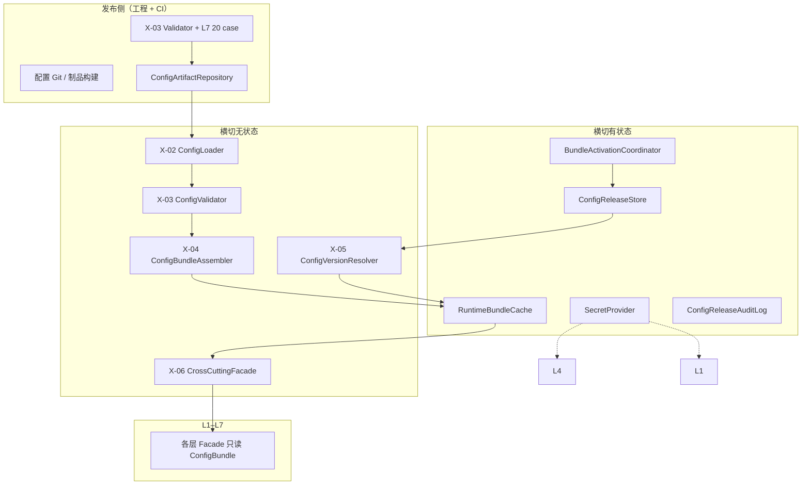
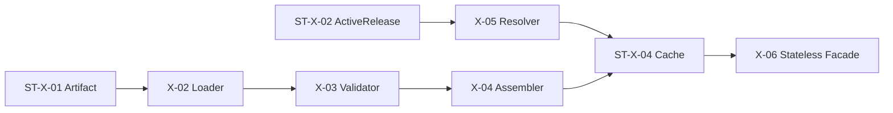

# 横切支撑 — 有状态组件设计

本文档描述 **横切支撑（Cross-Cutting Support）边界外的有状态组件**，与 `cross-cutting-stateless-components.md` 及各层 stateful 文档明确隔离。  
**设计依据**：`overall.md` 横切章节、横切无状态设计（X-01～X-06、Registry 族）、L1/L4/L7 有状态中对 `ConfigReleaseStore` / `SecretProvider` 的引用、ToC 传统多用户（非多租户）、「配置版本化发布、禁止无版本热改、禁止配置回流决策」等架构结论。

---

## 一、横切有状态层定位

### 1.1 职责（管「哪一版知识生效」与「密钥怎么取」，不提供医学查询）

横切 **无状态** 负责：给定 `ConfigBundle@version`，**只读查询** RuleKB、模板、禁止词、群体区间等。  
横切 **有状态** 负责：**哪一版 Bundle 在全站生效**、**制品存哪**、**密钥如何轮换**、**发布/回滚如何审计**——不替代 X-20 `RuleQueryService` 的查询逻辑。

| 做 | 不做 |
|----|------|
| 维护全局生效配置版本指针（ActiveRelease） | 执行分诊 Pipeline |
| 存储/分发 ConfigBundle 制品 | 替代 X-03 ConfigValidator 做校验 |
| 密钥解析与轮换状态 | 维护 RuleKB 内容（属 Git/制品） |
| 进程内按版本缓存已加载的 immutable Bundle | 请求内无版本热改 Registry 字段 |
| 配置发布/回滚运维审计 | 根据 L7 失败率自动改 RuleKB |
| 与 CI 门禁联动的激活协调 | 向量库在线写入与检索（V1 默认不做） |
| | 会话、LLM 连接池、分诊审计（属 L2/L4/L7） |

### 1.2 与横切无状态的分工



| 阶段 | 无状态 | 有状态 |
|------|--------|--------|
| 校验配置 | X-03 Validator | — |
| 存制品 | — | ConfigArtifactRepository |
| 定生效版本 | X-05 解析逻辑 | ConfigReleaseStore 指针 |
| 加载组装 | Loader + Assembler | RuntimeBundleCache（按版本） |
| 运行时查询 | Registry / Lookup | **不 mutate** |
| 密钥 | — | SecretProvider |

**原则**：

- **改知识内容** = 新 `bundleVersion` + Validator + case 回归 + **人工/CI 激活**；不是进程内改 JSON。  
- **有状态层绝不** 根据线上 Audit 自动切换 Bundle 或改 rule 权重。

### 1.3 与各层有状态边界（不重复造轮子）

| 能力 | 归属 | 说明 |
|------|------|------|
| SessionStore | **L2** stateful | 非横切 |
| LLMRuntimePool | **L4** stateful | 非横切；消费 SecretProvider |
| AuditSink / Metrics | **L7** stateful | 分诊观测；写入 `bundleVersion` 字段 |
| ConfigReleaseStore | **横切** stateful | 全站策略版本指针 |
| SecretProvider | **横切** stateful | 全局密钥 |
| AccessGate 限流阈值 | L1 ops 配置或横切 **OpsRuntimeKnobs**（可选） | 不进 RuleKB |

### 1.4 ToC 多用户前提（非多租户）

- **全站唯一** `ActiveRelease`；所有用户共享同一 `bundleVersion`。  
- **无** 租户级 ConfigBundle、租户级 RuleKB 分叉、租户级发布轨道。  
- 密钥全站共享（一套 LLM Key 池）；不做 per-user 配置隔离。

### 1.5 有状态定义（横切范围内）

> 横切有状态保存的是 **「生效版本指针、制品位置、密钥句柄、已加载 Bundle 缓存」**；**不保存** 分诊结论、会话增量、LLM 对话。给定 `ActiveRelease` 不变，新进程加载的 Registry 查询结果与无状态文档定义一致。

---

## 二、在运行时与发布流程中的位置

### 2.1 进程启动

```
1. SecretProvider 初始化（读密钥句柄）
2. ConfigReleaseStore.getActiveRelease() → bundleVersion, artifactUri
3. RuntimeBundleCache.getOrLoad(version):
     X-02 ConfigLoader(artifact)
     → X-03 ConfigValidator
     → X-04 ConfigBundleAssembler
4. CrossCuttingFacade.bind(cache.getActiveBundle())
5. L1–L7 Facade 注入 CrossCuttingFacade / ConfigBundle 子视图
```

校验失败 → **启动失败**（fast-fail），禁止带病规则 serving。

### 2.2 单次请求（版本冻结）

```
请求进入
  → X-05 ConfigVersionResolver.resolve() 
       输入：ActiveRelease + 环境 pin（如有）
  → 将 bundleVersion 写入 TraceContext / AuditRecord.versions
  → 本请求全程使用同一 ConfigBundle 引用（已加载 immutable）
  → 禁止请求中途切换 ActiveRelease
```

与 L7 审计对齐：`ruleKbVersion`、`evalPolicyVersion` 等均来自本次冻结的 `bundleVersion` 子模块版本。

### 2.3 配置发布（CI 门禁后）

```
开发合并配置 Git
  → 构建制品包 → ConfigArtifactRepository.publish
  → CI: Validator + 20 case（横切无状态 + L7）
  → BundleActivationCoordinator.activate(newVersion)  // 有状态
       → 写 ConfigReleaseStore ActiveRelease
       → 写 ConfigReleaseAuditLog
       → 通知各实例 reload（滚动）或下 deploy 生效
  → RuntimeBundleCache 加载新版本；旧版本可保留只读缓存供回滚
```

**禁止**：跳过 Validator/case 直接 `activate`。

### 2.4 回滚

```
BundleActivationCoordinator.rollback(targetVersion)
  → ConfigReleaseStore 指针指回旧版
  → ConfigReleaseAuditLog 记录 rollback 原因
  → 实例 reload / 滚动
```

回滚 **不** 改分诊 Audit 历史；只改变 **之后** 请求的策略版本。

---

## 三、横切有状态组件清单

### 3.1 V1 核心

| 组件 ID | 组件名 | 核心职责 |
|---------|--------|----------|
| ST-X-01 | ConfigArtifactRepository | ConfigBundle 制品存储与获取 |
| ST-X-02 | ConfigReleaseStore | 全局 ActiveRelease 指针与历史 |
| ST-X-03 | BundleActivationCoordinator | 激活/回滚编排与门禁检查 |
| ST-X-04 | RuntimeBundleCache | 按版本缓存 immutable ConfigBundle |
| ST-X-05 | SecretProvider | 密钥/凭证解析与轮换状态 |
| ST-X-06 | ConfigReleaseAuditLog | 配置发布运维审计 |
| ST-X-07 | CrossCuttingStatefulFacade | 横切有状态统一入口 |

### 3.2 V1 简化 / 开发替代

| 组件 ID | 组件名 | 说明 |
|---------|--------|------|
| ST-X-08 | LocalFileReleasePointer | dev：`.active-release` 或环境变量 |
| ST-X-09 | EnvSecretProvider | dev：`.env` / 环境变量读 Key |

### 3.3 V1.x 可选

| 组件 ID | 组件名 | 说明 |
|---------|--------|------|
| ST-X-10 | ReleaseNotificationBus | 通知实例 reload（Redis pub/sub） |
| ST-X-11 | OpsRuntimeKnobsStore | 非医学运维旋钮（限流阈值等），与 Bundle 分离 |
| ST-X-12 | TraceExporterBinding | 横切级 trace 导出绑定（若不全放 L7） |

### 3.4 V2+ 审慎立项

| 组件 | 说明 |
|------|------|
| KnowledgeVectorStore | 文档 RAG；**不** 替代 RuleKB 主导 risk |
| OnlineEmbeddingIndexService | 仅当 Tier2 语义索引不再以静态制品发布 |

---

## 四、核心数据对象

### 4.1 ConfigArtifactDescriptor（制品描述）

| 字段 | 说明 |
|------|------|
| bundleVersion | `xiaozhua.agent.config.v1.3.0` |
| manifestSha256 | 对应 X-01 ConfigManifest |
| artifactUri | s3://、file://、制品库 URL |
| builtAt | 构建时间 |
| gitSha | 来源提交 |
| ciRunId | 通过门禁的 CI 运行 id |
| caseRegressionPassRate | 发布时 20 case 通过率 |

### 4.2 ActiveRelease（全局生效指针）

| 字段 | 说明 |
|------|------|
| bundleVersion | 当前生效版本 |
| artifactUri | 制品位置 |
| activatedAt | ISO-8601 |
| activatedBy | `ci` / `operator@` |
| previousVersion | 回滚用 |
| activationReason | `release` / `rollback` / `hotfix` |
| ciRunId | 绑定门禁证据 |

ToC：**仅一条** ActiveRelease 记录（或带环境后缀 `prod` / `staging`，仍非租户）。

### 4.3 LoadedBundleEntry（缓存项）

| 字段 | 说明 |
|------|------|
| bundleVersion | 键 |
| configBundle | X-04 产出的不可变对象 |
| loadedAt | |
| manifestSha256 | 完整性校验 |

### 4.4 SecretHandle（密钥句柄）

| 字段 | 说明 |
|------|------|
| secretId | 如 `llm.api_key.primary` |
| version | 轮换版本号 |
| resolvedAt | 内存缓存时间（短 TTL） |

**不** 将明文 Key 写入 ConfigReleaseAuditLog 或 L7 分诊 Audit。

---

## 五、组件逐一设计

---

### ST-X-01 ConfigArtifactRepository（配置制品库）

#### 职责

存储与获取 **已构建、已校验** 的 ConfigBundle 制品包（含 manifest、各 CFG JSON、可选静态 embedding 索引文件）。

#### 接口（概念）

```
publish(descriptor, bundleArchive) → PublishResult
fetch(manifestUri | bundleVersion) → ArtifactStream
exists(bundleVersion) → boolean
listVersions(limit) → ConfigArtifactDescriptor[]
```

#### 实现选型

| 环境 | 方案 |
|------|------|
| 开发 | `crosscutting/config/vX.Y.Z/` 本地目录 |
| CI | 构建产物 artifact |
| 生产 | 对象存储 + 不可变版本路径 |

#### 与无状态关系

- Repository **只存字节**；**解析与校验** 仍由 X-02～X-03 无状态完成。  
- IntentEmbeddingIndex（X-41）作为制品内 **静态文件** 一并发布，非在线向量库。

#### 明确不做

- 不存储 Session、Audit、Regression 报告  
- 不在此 API 内修改 rule 内容（改 Git，重新 publish）

---

### ST-X-02 ConfigReleaseStore（配置发布寄存）

#### 职责

持久化 **全站唯一** 的 `ActiveRelease` 指针及发布历史索引。

#### 接口（概念）

```
getActiveRelease() → ActiveRelease
setActiveRelease(release) → void   // 仅 Coordinator 调用
getHistory(limit) → ActiveRelease[]
getByVersion(bundleVersion) → ActiveRelease | null
```

#### 存储

| 环境 | 方案 |
|------|------|
| 开发 | `ST-X-08` 文件或 `ACTIVE_BUNDLE_VERSION` 环境变量 |
| 生产 | 单行配置表 / 配置中心 **指针记录**（非实时 patch Registry） |

#### 一致性

- `setActiveRelease` 应 **原子** 替换  
- 多实例最终一致：靠 ST-X-10 通知或滚动 deploy

#### 明确不做

- 不存储「当前应为 watch 还是 warning」等 **运行时医学结论**  
- 不 per-user 存储 Bundle 版本

---

### ST-X-03 BundleActivationCoordinator（Bundle 激活协调器）

#### 职责

在 **满足门禁** 的前提下，将新版本设为 Active，并触发缓存 reload；回滚同理。

#### activate 前置条件（V1 硬门禁）

| 检查 | 说明 |
|------|------|
| 制品存在 | ST-X-01 |
| Validator 报告无 error | X-03 对应该制品已跑过 |
| case 回归 | `passRate == 100%`（或组织定义阈值）且 `ciRunId` 匹配 |
| 非降级激活 | 新版本 semver 规则符合发布策略 |

#### activate 流程（概念）

```
1. 校验门禁证据（ciRunId、reportUri）
2. ConfigReleaseStore.setActiveRelease(new)
3. ConfigReleaseAuditLog.append(...)
4. RuntimeBundleCache.preload(newVersion)  // 可选预热
5. RuntimeBundleCache.promoteActive(newVersion)
6. ReleaseNotificationBus.notify（可选）
```

#### rollback 流程

- 仅允许回滚到 `history` 中 **曾通过门禁** 的版本  
- 必须 `activationReason` + operator 备注

#### 明确不做

- **禁止** 监听 L7 `passRate` 下降自动 activate/rollback  
- **禁止** 根据 Audit 中「某 rule 经常 hit」自动改配置

---

### ST-X-04 RuntimeBundleCache（运行时 Bundle 缓存）

#### 职责

按 `bundleVersion` 缓存 **已组装 immutable ConfigBundle**，避免每请求重复 Loader+Assembler。

#### 接口（概念）

```
getActiveBundle() → ConfigBundle
getOrLoad(bundleVersion) → ConfigBundle
promoteActive(bundleVersion) → void
invalidate(bundleVersion) → void   // 仅运维
```

#### 状态语义

- 缓存的是 X-04 **输出快照**，不是「可热改 Registry」。  
- 同一 version 多次 load 结果等价（确定性）。  
- 内存中可同时保留 **当前版 + 上一版**（快速回滚）。

#### 与 X-06 CrossCuttingFacade

- Facade 持有指向 `getActiveBundle()` 的 **只读引用**  
- `promoteActive` 时 **原子切换** Facade 内部指针；进行中的请求仍用请求入口冻结的 version（见 2.2）

#### 明确不做

- 不做「请求中途懒加载另一版本」  
- 不做跨请求 **合并** 两个 Bundle 的 rule 子集

---

### ST-X-05 SecretProvider（密钥提供器）

#### 职责

为 L4 `LLMCredentialResolver`、Redis、Audit 存储等提供 **凭证解析**；管理轮换版本与短 TTL 内存缓存。

#### 接口（概念）

```
resolve(secretId) → SecretMaterial   // 明文仅内存，短生命周期
getCurrentVersion(secretId) → int
onRotate(secretId) → void   // 运维触发
```

#### 密钥类型（V1）

| secretId | 消费者 |
|----------|--------|
| `llm.api_key` | L4 LLMRuntimePool |
| `redis.session` | L2 SessionStore |
| `redis.rate_limit` | L1 AccessGate（若用 Redis） |
| `audit.storage` | L7 AuditSink |

#### 轮换

- 支持双 Key 过渡期（primary / secondary）  
- 轮换 **不** 改变 `bundleVersion`  
- 轮换事件写入 ConfigReleaseAuditLog 或独立 security audit

#### 明确不做

- 密钥 **不** 进入 ConfigArtifact、RuleKB、AuditRecord 明文  
- 不做 per-user API Key（ToC V1）

---

### ST-X-06 ConfigReleaseAuditLog（配置发布审计日志）

#### 职责

记录 **运维侧** 配置发布/回滚/密钥轮换，与 **L7 分诊 AuditSink** 分离。

#### 事件类型

| eventType | 内容 |
|-----------|------|
| `BUNDLE_ACTIVATED` | version、ciRunId、operator |
| `BUNDLE_ROLLBACK` | from、to、reason |
| `ARTIFACT_PUBLISHED` | version、gitSha |
| `SECRET_ROTATED` | secretId（无明文） |
| `ACTIVATION_REJECTED` | 门禁失败原因 |

#### 存储

- 运维日志库 / JSONL；留存期长于分诊 Audit 亦可  
- ToC 全局一份，无租户

#### 与 L7 AuditSink 区分

| ConfigReleaseAuditLog | L7 AuditSink |
|----------------------|--------------|
| 谁改了策略版本 | 某次分诊 risk 与 ruleHits |
| 影响 **后续** 请求 | 记录 **当次** 请求 |
| 不参与医学裁决 | 不参与医学裁决 |

---

### ST-X-07 CrossCuttingStatefulFacade（横切有状态门面）

#### 职责

对 **进程启动器、发布 CLI、运维 API** 提供统一入口；对 L1–L7 **不** 暴露写接口。

#### 只读方法（运行时）

```
getActiveBundleVersion() → string
ensureActiveBundleLoaded() → ConfigBundle   // 委托 Cache + 无状态 Assembler
```

#### 写方法（仅运维/CI 角色）

```
publishArtifact(...)
activateRelease(...)   // 委托 Coordinator
rollbackRelease(...)
```

#### 边界

- L4 RuleEngine **不得** 调用 `activateRelease`  
- 应用 Handler **只** 用只读方法

---

### ST-X-08 / ST-X-09 开发简化实现

- **LocalFileReleasePointer**：读 `active-release.json` 的 `bundleVersion` + 本地路径  
- **EnvSecretProvider**：环境变量；与生产 SecretProvider 接口一致，便于测试替身

---

### ST-X-10 ReleaseNotificationBus（可选，V1.x）

#### 职责

多实例部署时，某实例 `activate` 后通知其他实例 `RuntimeBundleCache.reload`。

#### 注意

- 通知 **只** 触发 reload 已发布制品，不推送「部分 rule 补丁」  
- 消费者失败时保持旧 Active 直至 reload 成功（可配置）

---

### ST-X-11 OpsRuntimeKnobsStore（可选）

#### 职责

存放 **非医学**、非 RuleKB 的运维旋钮，与 ConfigBundle **版本解耦**：

| 旋钮示例 | 消费者 |
|---------|--------|
| AccessGate 限流阈值 | L1 |
| Session TTL | L2 |
| LLM 并发上限 | L4 Pool |
| Audit 留存天数 | L7 |

#### 边界

- 改变旋钮 **不** 改变 risk 规则语义；**不** 替代 RuleKB  
- 仍需审计；**禁止** 旋钮自动被 L7 失败率驱动（与 ConfigRelease 同红线）

---

## 六、与横切无状态组件的绑定关系

| 无状态组件 | 有状态依赖 |
|-----------|-----------|
| X-01 ConfigManifest | 制品内嵌于 ST-X-01 |
| X-02 ConfigLoader | ST-X-01 fetch + ST-X-04 触发 load |
| X-03 ConfigValidator | 发布前 CI；激活前门禁 |
| X-04 ConfigBundleAssembler | 输出存入 ST-X-04 |
| X-05 ConfigVersionResolver | 读 ST-X-02 ActiveRelease |
| X-06 CrossCuttingFacade | 绑定 ST-X-04 的 ConfigBundle |
| X-20～X-83 Registry | **内容** 来自 Bundle，**不** 单独有状态 |
| X-90 CaseTraceabilityIndex | 随 Bundle 制品发布（无状态数据文件） |



---

## 七、与各层接口契约

### 7.1 L1–L7 无状态层

| 方式 | 说明 |
|------|------|
| 启动注入 | `CrossCuttingFacade.getBundle()` |
| 请求冻结 | `bundleVersion` → TraceContext → L7 Audit |
| 禁止 | 各层直接 `setActiveRelease` |

### 7.2 L1 AccessGate / L4 LLMRuntimePool / L7 AuditSink

| 消费者 | 横切有状态供给 |
|--------|---------------|
| L4 | SecretProvider |
| L7 Audit `versions.*` | ActiveRelease 子模块版本 |
| L1 限流阈值 | OpsRuntimeKnobs（可选）或 env |

### 7.3 CI / 发布流水线

```
build artifact → ST-X-01 publish
run validator + case → 证据 ciRunId
ST-X-03 activate(ciRunId, bundleVersion)
```

### 7.4 V2 质控域（quality/stateful）

- `UpstreamQualityAggregator` **只读** L7 Audit；**不得** 写 ConfigReleaseStore 自动改规则  
- 若发现上游 baseline 系统性偏差 → **人工** 改 RuleKB Git → 走正常发布流程

---

## 八、明确排除（不得作为横切有状态）

| 能力 | 归属 / 原因 |
|------|------------|
| RuleKB 查询服务 | 无状态 X-21 |
| SessionStore | L2 |
| LLMRuntimePool | L4 |
| AuditSink / MetricsBackend | L7 |
| 无版本配置热推送直接改 Registry | 禁止；必须新 bundleVersion |
| L7 失败驱动自动 activate | 禁止 |
| 分诊 Audit 回流改配置 | 禁止 |
| per-tenant 配置隔离 | 非 ToC V1 |
| 向量库在线写入检索（默认） | V2+ 单独立项 |
| 跨请求「学到」的 fusion 权重 | 禁止 |

---

## 九、代码管理与分包建议

```
crosscutting/
  stateless/                 # 已有 X-01～X-91
  stateful/
    artifact/
      repository/
    release/
      release_store/
      activation_coordinator/
      release_audit_log/
    runtime/
      bundle_cache/
      release_notification/   # 可选
    secrets/
      secret_provider/
    ops/
      runtime_knobs/            # 可选
    facade/
    contracts/
    config/                     # 发布策略、缓存大小、门禁阈值
  config/                       # 版本化制品（与 stateless 文档一致）
    v1.3.0/
```

### 依赖规则

| 允许 | 禁止 |
|------|------|
| `stateless` X-05 读 `release_store` 接口 | `stateless` Registry 内嵌 DB 客户端 |
| `stateful` 调用 `stateless` Loader/Validator/Assembler | L4 RuleEngine → `activation_coordinator` |
| L4/L7 → `SecretProvider` 接口 | Secret 明文进 AuditRecord |
| CI → `CrossCuttingStatefulFacade.activate` | 运行时 Handler → `activate` |
| 测试 `InMemoryReleaseStore` + 本地 artifact | BundleCache 请求内无版本切换 |

**与层 stateful 分包关系**：

- `crosscutting/stateful`：**全局版本与密钥**  
- `adapter/stateful`、`orchestrator/stateful` 等：**层边界副作用**  
- 互不 import 实现细节，只通过 **接口 + bundleVersion 元数据** 关联

---

## 十、测试策略（横切有状态专属）

### 10.1 单测

| 组件 | 要点 |
|------|------|
| ConfigReleaseStore | 原子替换 ActiveRelease |
| BundleActivationCoordinator | 无 ciRunId 拒绝 activate |
| RuntimeBundleCache | 同 version 加载幂等；promote 不污染旧请求冻结版本 |
| SecretProvider | 轮换双 Key |

### 10.2 集成测

| 场景 | 预期 |
|------|------|
| 启动 load 失败 | 进程退出 |
| activate 新版本 | Facade 查询到新 ruleId |
| rollback | 之后请求 bundleVersion 回退 |
| 分诊请求中 promote | 当次请求 version 不变 |

### 10.3 与 20 case

- case 回归在 **activate 之前** 完成；`ciRunId` 写入 ActiveRelease  
- case 跑时 **pin** 待发布 `bundleVersion`，不读生产 ActiveRelease 漂移

---

## 十一、非功能要求（ToC）

| 维度 | 要求 |
|------|------|
| 可用性 | ActiveRelease 读取高可用；单点故障可回滚 |
| 一致性 | 全站最终同一 bundleVersion（允许滚动窗口极短双版本，需门禁策略） |
| 安全 | 发布/回滚 RBAC；Secret 最小权限 |
| 审计 | 每次 activate/rollback 留 ConfigReleaseAuditLog |
| 性能 | BundleCache 命中后零磁盘；启动预热可接受数秒 |
| 合规 | 配置变更可追溯 gitSha + bundleVersion |

---

## 十二、V1 实施顺序

| 优先级 | 交付物 |
|--------|--------|
| P0 | LocalFileReleasePointer + 本地 artifact + RuntimeBundleCache + 启动 load |
| P0 | 与 X-02～X-06 无状态联调 |
| P1 | ConfigArtifactRepository（CI artifact）+ BundleActivationCoordinator + 门禁 |
| P1 | ConfigReleaseAuditLog |
| P2 | 生产 ConfigReleaseStore + SecretProvider |
| P2 | bundleVersion 写入 L7 Audit |
| P3 | ReleaseNotificationBus、OpsRuntimeKnobsStore |

---

## 十三、总结

横切有状态组件共 **7 个 V1 核心 + 2 个开发简化 + 3 个可选 + V2 审慎项**：

**V1 核心**

1. **ConfigArtifactRepository** — 配置制品存取  
2. **ConfigReleaseStore** — 全站 ActiveRelease 指针  
3. **BundleActivationCoordinator** — 激活/回滚与 CI 门禁  
4. **RuntimeBundleCache** — 按版本缓存 immutable ConfigBundle  
5. **SecretProvider** — 全局密钥  
6. **ConfigReleaseAuditLog** — 发布运维审计  
7. **CrossCuttingStatefulFacade** — 有状态统一入口（写路径仅运维/CI）  

**核心原则**：

- **无状态管「Bundle 里有什么、怎么查」；有状态管「哪一版生效、存在哪、密钥怎么取」**。  
- **ToC 全站一套 ActiveRelease**；无租户分叉。  
- **发布 = 新版本制品 + 校验 + case + 指针切换**；禁止无版本热改与 Audit 回流。  
- **Session / LLM 池 / 分诊审计** 仍在 L2/L4/L7，不并入横切有状态。  