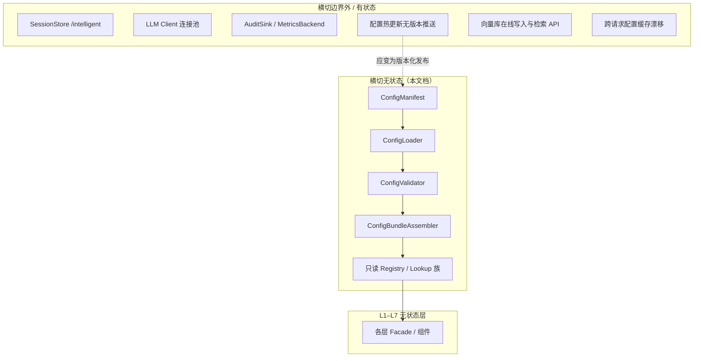
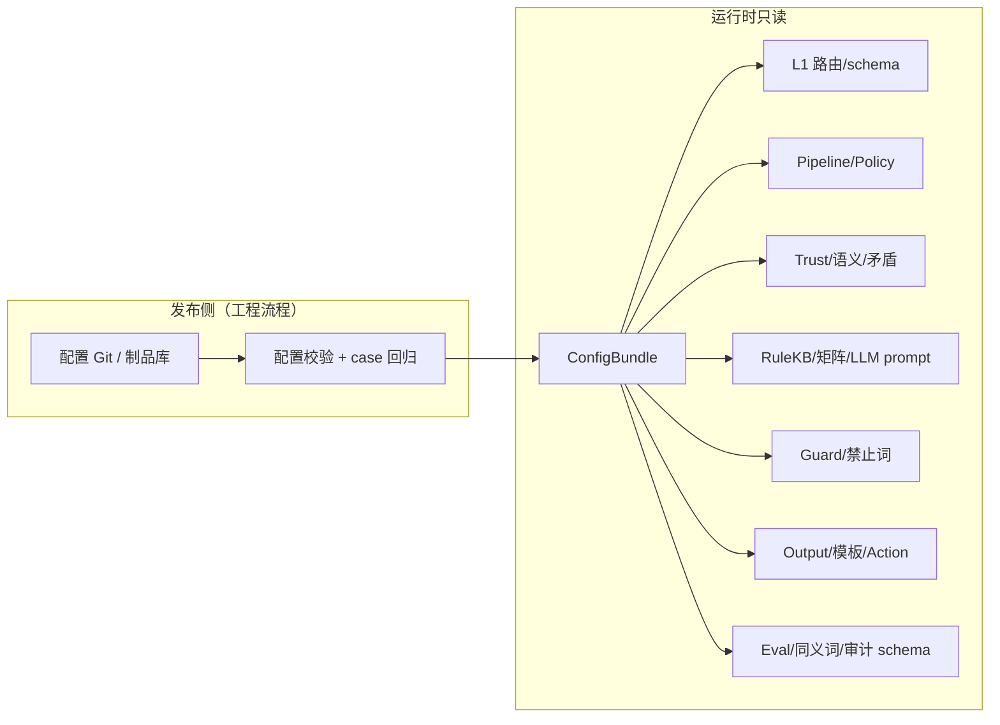
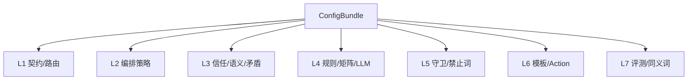

# 横切支撑 — 无状态组件设计

本文档描述 **横切支撑（Cross-Cutting Support）的无状态组件**，与各层（L1–L7）无状态组件、有状态组件明确隔离，便于配置版本化、代码复用与 20 case 回归。

**设计依据**：`overall.md` 横切支撑章节、L1–L7 各层已引用的 `CFG-*` 配置、input/output schema V1、`health_triage_cases.v1`，以及「配置即知识、非 RAG；群体先验仅护栏；模板/禁止词/规则同源」等架构结论。

---

## 一、横切支撑定位与边界

### 1.1 职责（提供版本化知识与只读查询，不跑 Pipeline）

横切支撑 **不是独立业务层**，不对应 L2 的某个 Step，而是被 L1–L7 消费的 **静态知识、契约定义与只读查询服务**。

| 做 | 不做 |
|----|------|
| 版本化配置加载与校验 | 执行分诊 Pipeline |
| 只读查询（规则、区间、模板、同义词） | 跨请求读写状态 |
| 统一 templateId / ruleId / configVersion | 替代 L4 裁决或 L5 守卫 |
| 配置-bundle 装配与层间绑定声明 | 在线无版本热更新 |
| 配置与 20 case 的可追溯映射 | 向量库在线写入与检索服务 |

### 1.2 无状态定义（横切范围内）

> 给定同一份 **已发布配置快照**（`ConfigBundle@version`），任意查询/解析组件的输出 **完全可复现**，不依赖请求历史、运营库或运行时可变索引。

**说明**：

- **配置文件本身** 可有版本号；**加载后的查询器** 在进程内只读，视为无状态。  
- **预计算 embedding 索引文件**（如 L3 Tier2）属于配置资产，不是请求内写入的向量库。  
- **LLM Client、SessionStore、AuditSink** 不属于横切无状态（见各层 stateful 文档）。

### 1.3 横切无状态 vs 有状态隔离



**原则**：

- 改配置 = 改 `configVersion` + 跑回归，不是改运行时内存。  
- 多层 **禁止各自维护一份** forbidden 词表；必须走横切 `ForbiddenPatternRegistry`。

---

## 二、横切支撑在架构中的位置



横切组件在 **进程启动或请求开始前** 装配 `ConfigBundle`（或按版本懒加载 immutable snapshot），各层只持 **只读引用**。

---

## 三、横切无状态组件清单

### 3.1 核心基础设施组件

| 组件 ID | 组件名 | 核心职责 |
|---------|--------|----------|
| X-01 | ConfigManifest | 全局配置清单与版本矩阵 |
| X-02 | ConfigLoader | 从制品加载各 CFG 文件 |
| X-03 | ConfigValidator | 配置结构与引用完整性校验 |
| X-04 | ConfigBundleAssembler | 组装不可变 ConfigBundle |
| X-05 | ConfigVersionResolver | 解析请求/环境使用的 bundle 版本 |
| X-06 | CrossCuttingFacade | 横切统一对外入口 |

### 3.2 契约与 Schema 注册

| 组件 ID | 组件名 | 核心职责 |
|---------|--------|----------|
| X-10 | InputSchemaRegistry | input schema 定义 |
| X-11 | OutputSchemaRegistry | output schema 定义 |
| X-12 | AuditRecordSchemaRegistry | L7 审计记录 schema |
| X-13 | ContractCompatibilityMatrix | input/output/audit 版本兼容 |

### 3.3 医学知识与健康参考（非 RAG）

| 组件 ID | 组件名 | 核心职责 |
|---------|--------|----------|
| X-20 | RuleKBRegistry | 硬规则知识库 |
| X-21 | RuleQueryService | 按 ruleId/条件查询规则元数据 |
| X-22 | PopulationPriorLookup | 分层群体参考区间查询 |
| X-23 | ChronicTagMappingRegistry | 慢病/品种 → 风险标签 |
| X-24 | RiskLevelOrderService | 风险等级序与 max 运算 |

### 3.4 情境、信任与矛盾（L3/L4 共享）

| 组件 ID | 组件名 | 核心职责 |
|---------|--------|----------|
| X-30 | TrustScoringConfigRegistry | signal 信任评分权重 |
| X-31 | ContradictionRulesRegistry | 矛盾检测规则表 |
| X-32 | ContextModifierMatrixRegistry | 情境修正矩阵（L4 用，定义源自横切） |
| X-33 | FusionWeightsRegistry | 信号融合权重 |
| X-34 | ArbiterPolicyRegistry | 风险仲裁策略 |
| X-35 | FreshnessThresholdRegistry | 数据新鲜度阈值 |

### 3.5 用户语义归一化（L3 可插拔）

| 组件 ID | 组件名 | 核心职责 |
|---------|--------|----------|
| X-40 | UserSemanticLexiconRegistry | Tier1 词典/同义词 |
| X-41 | IntentEmbeddingIndexRegistry | Tier2 静态 intent 索引（可选） |
| X-42 | SemanticNormalizerPolicyRegistry | 三层开关与阈值 |
| X-43 | UserPerceptionMergePolicyRegistry | structured×semantic 合并策略 |
| X-44 | SynonymExpandService | mustMention 同义词扩展（L7 共用） |

### 3.6 文案、模板、禁止词（L4–L7 同源）

| 组件 ID | 组件名 | 核心职责 |
|---------|--------|----------|
| X-50 | TemplateRegistry | 统一 templateId → 模板体 |
| X-51 | TemplateResolveService | 按 risk×flag 解析模板 |
| X-52 | ForbiddenPatternRegistry | 禁止词/隐性确诊模式库 |
| X-53 | LLMPromptTemplateRegistry | L4 LLM system/user 模板 |
| X-54 | SafetyNoticeTemplateRegistry | L5/L6 safetyNotice 片段 |
| X-55 | MissingDataLabelRegistry | missing 枚举 → 中文标签 |

### 3.7 编排、路由、呈现（L1/L2/L6）

| 组件 ID | 组件名 | 核心职责 |
|---------|--------|----------|
| X-60 | PipelineStepRegistryConfig | L2 步骤定义（与 L2-02 读同源） |
| X-61 | DegradationPolicyRegistry | 降级策略表 |
| X-62 | ShortCircuitPolicyRegistry | 短路策略表 |
| X-63 | RetryPolicyRegistry | 重试策略表 |
| X-64 | SceneRouteTableRegistry | L1 场景路由 |
| X-65 | AdapterErrorCodeRegistry | L1 错误码 |
| X-66 | ActionRouteTableRegistry | primary/secondary Action |
| X-67 | OutputPresentationPolicyRegistry | 文案长度等呈现策略 |

### 3.8 守卫与改写（L5）

| 组件 ID | 组件名 | 核心职责 |
|---------|--------|----------|
| X-70 | EmergencyToneRulesRegistry | 紧急弱化语气规则 |
| X-71 | RiskTextConsistencyRulesRegistry | 风险—文案一致矩阵 |
| X-72 | GuardRewritePolicyRegistry | finding → action 映射 |
| X-73 | EvidenceCitationPolicyRegistry | evidence 引用策略 |

### 3.9 评测与观测（L7）

| 组件 ID | 组件名 | 核心职责 |
|---------|--------|----------|
| X-80 | EvalPolicyRegistry | 全局评测策略 |
| X-81 | RiskMatchPolicyRegistry | 就高原则细则 |
| X-82 | SemanticSynonymMapRegistry | case mustMention 同义词 |
| X-83 | MetricsCardinalityPolicyRegistry | 指标标签白名单 |

### 3.10 追溯与 Case 映射

| 组件 ID | 组件名 | 核心职责 |
|---------|--------|----------|
| X-90 | CaseTraceabilityIndex | ruleId/templateId ↔ caseId 反向索引 |
| X-91 | ConfigChangeImpactHints | 配置变更建议跑哪些 case |

---

## 四、核心组件设计（X-01～X-06）

---

### X-01 ConfigManifest（配置清单）

#### 职责

声明 **一个发布单元** 包含哪些 CFG、版本号、依赖关系、适用 Agent 版本。

#### 输出 `ConfigManifest` 字段（概念）

| 字段 | 说明 |
|------|------|
| bundleVersion | 如 `xiaozhua.agent.config.v1.3.0` |
| agentApiVersion | 对齐 schema v1 |
| entries[] | cfgId、filePath、sha256、layerConsumers[] |
| compatibility | 最低/最高 pipeline 版本 |
| caseDatasetVersion | 回归绑定 `health_triage_cases.v1` |

#### 价值

- CI 一条命令知「改了哪些配置要跑哪些测试」  
- 多环境（dev/staging/prod）显式 pin bundleVersion

---

### X-02 ConfigLoader（配置加载器）

#### 职责

从本地目录/制品包 **只读加载** 各 JSON/YAML 为内存对象（immutable）。

#### 无状态保证

- `load(manifest) → RawConfigSet`；不修改源文件  
- 不连接运营「热更新」API（有状态）

#### 失败策略

- 缺文件 / JSON 解析失败 → 启动失败，**禁止** 带缺规则运行分诊

---

### X-03 ConfigValidator（配置校验器）

#### 职责

对 `RawConfigSet` 做 **横切级** 完整性与交叉引用校验。

#### 校验类别

| 类别 | 示例 |
|------|------|
| 结构 | 必填字段、枚举合法 |
| 引用 | templateId、ruleId 互引存在 |
| 医学一致 | emergency 规则覆盖 seizure、breathingDifficulty |
| 覆盖 | 20 case 每条至少能映射到一个 rule 或 template 变体（警告或失败可配置） |
| 重复 | ForbiddenPattern 与 output schema 对齐 |
| 安全 | 群体区间仅作护栏表述，无「个体正常值」字段 |

#### 输出

`ConfigValidationReport`：errors、warnings、impactedCaseIds（来自 X-91）

---

### X-04 ConfigBundleAssembler（配置包组装器）

#### 职责

将校验通过的 RawConfigSet 实例化为各 **Registry/Lookup** 只读对象，封装为 `ConfigBundle`。

#### 输出 `ConfigBundle`

| 字段 | 类型 |
|------|------|
| version | string |
| registries | 各 X-10～X-83 注册表只读句柄 |
| services | RiskLevelOrder、SynonymExpand、TemplateResolve、RuleQuery、PopulationPriorLookup |
| loadedAt | 元数据 |

#### 不变式

- Bundle 组装后 **不可变**（immutable）  
- 各层 Facade 只接收 `ConfigBundle` 子视图，避免层间乱 import 配置文件

---

### X-05 ConfigVersionResolver（配置版本解析器）

#### 职责

解析当前请求/进程应使用的 `bundleVersion`（环境变量、启动参数、header 可选）。

#### V1 行为

- 默认单一 `bundleVersion`  
- 不支持请求级随意切换（避免不可测）；测试可注入固定 bundle

---

### X-06 CrossCuttingFacade（横切门面）

#### 职责

对 L1–L7 Facade 提供 **统一配置入口**：

- `getBundle() → ConfigBundle`  
- `getRegistry<T>(id)`  
- `resolveTemplate(templateId)`  
- `queryRule(ruleId)`  
- `lookupPopulationPrior(species, ageTier, activity, tag, vitalKey)`

避免每层各自 `new Registry()`。

---

## 五、关键 Registry / Lookup 设计摘要

### X-20 RuleKBRegistry + X-21 RuleQueryService

**内容模块**（对齐 overall.md）：

| 模块 | 消费者 |
|------|--------|
| emergencyRules | L4-01 |
| dataQualityRules | L4-01、L3-03 |
| absoluteThresholdRules | L4-01 + X-22 |
| signalFloorRules | L4-01 |
| chronicComboRules | L4-01 |
| ageModifierRules | L4-01、X-32 |
| forcedMentionRules | L4-09、X-50 |

**RuleQueryService**：`getById`、`listByModule`、`explainHit(ruleId)` → 供 L7 Audit 与 case 追溯。

每条规则：`ruleId`、`conditionDigest`、`riskFloorContribution`、`emits[]`、`linkedCaseIds[]`（可选，供 X-90）。

---

### X-22 PopulationPriorLookup（分层群体参考区间）

#### 职责

**护栏用** 群体先验查询，**不是**个体正常值。

#### 查询维度

`species × ageTier × activityContext × specialTag × vitalKey` → `{ low, high, unit, note }`

#### 消费者

| 层 | 用途 |
|----|------|
| L3-05 | baseline 合理性 |
| L3-08 | populationPriorAllowed 边界 |
| L4-01 | 绝对生理护栏 |
| L4-02 | rawSeverity 粗判 |

#### 铁律

- 返回值标注 `priorType=population`，防止被 LLM 说成「这只宠物平时就这样」

---

### X-50 TemplateRegistry + X-51 TemplateResolveService

#### 职责

**全工程唯一 templateId 命名空间**，供 L4 Fallback、L5 消毒、L6 兜底 **共用**。

#### 命名约定（概念）

`{risk}_{flag}_{field}` 例：`emergency_default_summary`、`watch_data_missing_recommendation`

#### TemplateResolveService

输入：`finalRisk`、`flags[]`、`field`、`pipelineMeta.degraded`  
输出：`templateId` + 渲染参数槽位

避免 L4/L5/L6 三套互不认识的模板 ID。

---

### X-52 ForbiddenPatternRegistry

#### 职责

合并以下来源为 **单一版本化词库**：

- output_schema `forbiddenOutputPatterns`  
- L5 扩展（隐性确诊、保证）  
- L7 回归专用模式  

消费者：L5-02、L5-03、L7-08（**必须同版本**）。

---

### X-40～X-43 用户语义配置族

| Registry | 内容 |
|----------|------|
| UserSemanticLexicon | 口语 → 封闭标签 |
| IntentEmbeddingIndex | 可选；静态向量，版本化发布 |
| SemanticNormalizerPolicy | /health 默认 Tier1 only；Tier3 LLM 默认关 |
| UserPerceptionMergePolicy | structured 优先；低置信 semantic 不触发 normal |

与 L3 文档一致：**语义增强是配置能力，不是有状态记忆**。

---

### X-10～X-13 契约注册

| Registry | 绑定层 |
|----------|--------|
| InputSchemaRegistry | L1-01、Case 输入 |
| OutputSchemaRegistry | L1-04、L6-07、L7-03 |
| AuditRecordSchemaRegistry | L7-11 |
| ContractCompatibilityMatrix | L1-06、启动校验 |

**单一 schema 源**：L6 与 L7 结构评测不得各维护一份 output 定义。

---

## 六、ConfigBundle 与各层绑定矩阵

| 层 | 主要消费的横切组件 |
|----|-------------------|
| L1 | X-10、X-11、X-13、X-64、X-65 |
| L2 | X-60、X-61、X-62、X-63 |
| L3 | X-22、X-23、X-30、X-31、X-35、X-40～X-43 |
| L4 | X-20、X-21、X-22、X-32、X-33、X-34、X-53、X-50、X-24 |
| L5 | X-52、X-70、X-71、X-72、X-73、X-54、X-50 |
| L6 | X-50、X-55、X-66、X-67、X-11、X-54 |
| L7 | X-11、X-52、X-80～X-83、X-12、X-44、X-90 |



---

## 七、版本管理与发布流程（无状态视角）

### 7.1 版本号策略

| 对象 | 版本 |
|------|------|
| ConfigBundle | `xiaozhua.agent.config.vX.Y.Z` |
| RuleKB 子模块 | 可在 bundle 内嵌 moduleVersion |
| Case 数据集 | `health_triage_cases.v1` |
| Schema | `input.v1` / `output.v1` |

**semver 建议**：

- PATCH：文案模板、同义词  
- MINOR：新 ruleId、新 template 变体（向后兼容）  
- MAJOR：风险语义变更、schema 破坏性变更  

### 7.2 发布门禁（概念）

```
ConfigLoader → ConfigValidator → CaseRegressionRunner(20) → 发布 bundle
```

横切变更 **必须** 带 `ConfigChangeImpactHints`（X-91）建议跑的 case 子集（至少 smoke 全量）。

### 7.3 明确禁止

| 禁止 | 原因 |
|------|------|
| 生产无版本热改 RuleKB | 不可回归 |
| 层内私有 forbidden 词表 | 标准分裂 |
| 请求级加载不同版本且无 trace | 不可审计 |
| 横切配置写入 Session/审计回流决策 | 污染 Pipeline |

---

## 八、X-90 CaseTraceabilityIndex（Case 可追溯索引）

#### 职责

建立 **caseId ↔ ruleId/templateId/flag** 反向索引，服务排障与配置变更影响分析。

#### 数据来源

- 20 case 人工标注 `linkedRuleIds[]`（推荐）  
- 或 CI 首次全绿时自动生成快照（需人工审核）

#### 输出查询

- `casesByRule(ruleId)`  
- `rulesByCase(caseId)`  
- `templatesByCase(caseId)`

#### 价值

改 `R-CHR-003` 时，CI 直接提示跑 `chronic_heart_resp_warning` 等 case。

---

## 九、与有状态横切能力对照

| 能力 | 归类 | 说明 |
|------|------|------|
| RuleKB JSON 文件 | **无状态配置** | 版本化制品 |
| RuleQueryService | **无状态组件** | 只读查询 |
| 向量库在线检索 API | **有状态服务** | 非 V1 默认；静态 IntentEmbeddingIndex 可无状态 |
| SessionStore | **有状态** | L2 stateful，非横切 |
| LLM Client 池 | **有状态** | L4 stateful infrastructure |
| AuditSink | **有状态** | L7 stateful |
| 配置中心实时推送 | **有状态运维** | 应落地为新 bundle 版本，非进程内漂移 |
| 运营看板聚合 | **有状态** | 读 Audit，不回写 Config |

---

## 十、代码管理与分包建议

```
crosscutting/
  stateless/
    manifest/
    loader/
    validator/
    bundle/
    facade/
    registry/
      schema/
      rule_kb/
      population_prior/
      templates/
      forbidden/
      trust/
      semantic/
      pipeline_policies/
      guard/
      eval/
    services/
      rule_query/
      template_resolve/
      synonym_expand/
      population_prior_lookup/
      risk_level_order/
    traceability/
      case_index/
  config/                    # 版本化 CFG 制品（或独立 repo）
    v1.3.0/
      rule_kb/
      templates/
      ...
  contracts/
    ConfigBundle.types
```

**依赖规则**：

| 允许 | 禁止 |
|------|------|
| L1–L7 → crosscutting/stateless（只读 Bundle） | 各层 config/ 重复存放 forbidden 词表 |
| crosscutting → docs/schema、cases | crosscutting → SessionStore |
| Validator → CaseTraceabilityIndex | Registry 请求内 mutate |
| L7 与 L5 共用 ForbiddenPatternRegistry | RuleKB 自动被 L7 失败改写 |

---

## 十一、测试策略（横切专属）

### 11.1 单测

| 对象 | 方法 |
|------|------|
| ConfigValidator | 坏引用、缺 emergency 规则 |
| PopulationPriorLookup | 物种×年龄×体征查询 |
| TemplateResolveService | risk×flag 矩阵 |
| ForbiddenPatternRegistry | 与 schema 对齐 |
| RiskLevelOrderService | max 运算 |
| SynonymExpandService | mustMention 扩展 |

### 11.2 集成测

- 启动时 `Loader + Validator + Assembler` 必须成功  
- 各层 Facade 用同一 Bundle 跑 1 个 case smoke

### 11.3 回归约束

- `bundleVersion` 变更 → 全量 20 case（或 impact 子集 + smoke 全量）  
- ForbiddenPattern 变更 → L5 单测 + L7-08 回归  
- RuleKB 变更 → L4 rule 单测 + L7 risk 回归

---

## 十二、非功能要求

| 维度 | 要求 |
|------|------|
| 确定性 | 同 bundle 同查询同结果 |
| 启动 | 校验失败 fast-fail |
| 内存 | Bundle immutable 共享只读 |
| 安全 | 配置变更可审计（git sha + bundleVersion） |
| 扩展 | 新 CFG 在 Manifest 注册，不改 Facade 签名 |
| 文档 | 每个 ruleId/templateId 有 human-readable description |

---

## 十三、设计原则与总结

### 13.1 横切设计原则

1. **配置即知识，非 RAG**：V1 不靠文档向量库做分诊。  
2. **单一真相源**：schema、禁止词、模板 ID、RuleKB 各一份。  
3. **只读查询**：横切组件不写状态、不改 Pipeline 结果。  
4. **版本化发布**：可回归优于热更新。  
5. **群体先验仅护栏**：PopulationPriorLookup 标注 population，不当个体真相。  
6. **Case 可追溯**：rule/template 与 20 case 可双向索引。  
7. **层间解耦**：各层通过 ConfigBundle 子视图消费，不直接读散乱配置文件。

### 13.2 组件总览

横切无状态组件共 **约 40+ 个逻辑单元**，归纳为 **6 类**：

| 类别 | 代表组件 |
|------|----------|
| 配置生命周期 | X-01～X-06 |
| 契约 Schema | X-10～X-13 |
| 医学规则与先验 | X-20～X-24 |
| 信任/情境/语义 | X-30～X-44 |
| 模板/禁止词/文案 | X-50～X-55 |
| 编排/守卫/评测 | X-60～X-83 |
| 追溯 | X-90～X-91 |

**核心原则**：横切支撑是 **全 Agent 的「版本化大脑皮层」**——承载规则、模板、区间、同义词与契约；**不承载会话、连接池与审计写入**。L1–L7 负责「怎么跑」，横切负责「按哪一版知识跑」。