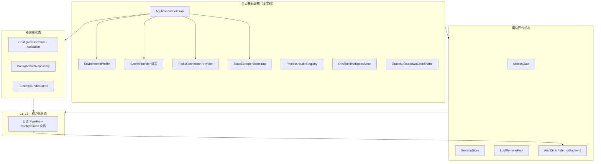
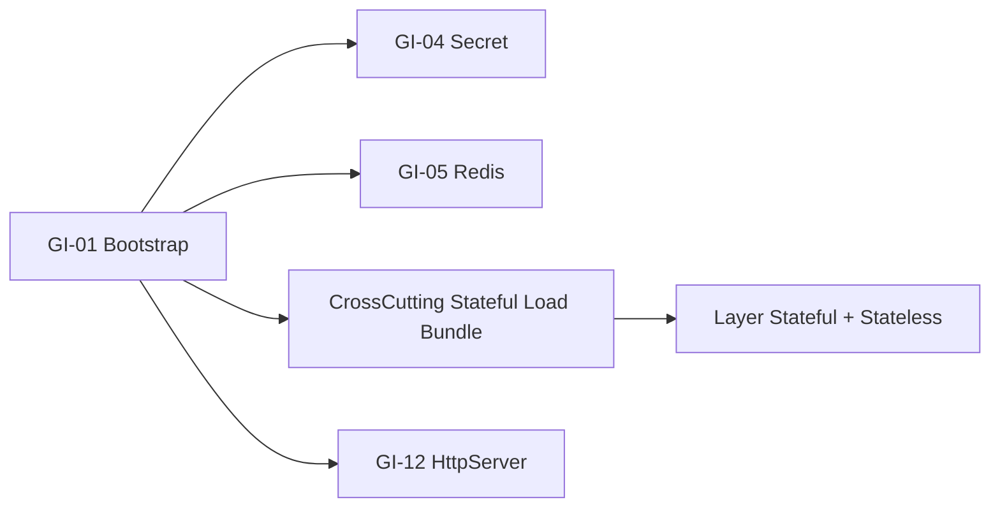

# 全局基础设施 — 组件设计

本文档描述 **Agent 运行时环境级基础设施**，与各 **层边界有状态**（L1/L2/L4/L7）、**横切有状态**（配置发布/密钥）并列，构成完整部署架构。  
**设计依据**：`overall.md`、各层 stateful 文档、`cross-cutting-stateless/stateful` 文档、ToC 传统多用户（非多租户）、「全局基础设施保持极小、不参与医学裁决」等架构结论。

---

## 一、全局基础设施定位

### 1.1 什么是「全局基础设施」

全局基础设施 **不是业务层**（不对应 L1–L7 的医学或契约职责），而是：

> **让 Agent 进程能安全启动、连接外部依赖、暴露运维面、并在多实例下一致运行的「运行时底盘」**。

它回答四类问题：

| 问题 | 全局基础设施 |
|------|-------------|
| 进程怎么起、怎么停？ | Bootstrap、Lifecycle、GracefulShutdown |
| 外部依赖怎么连？ | Redis、OTel、Secret、HTTP 宿主 |
| 实例是否健康、能否接流量？ | Health / Readiness |
| 环境差异怎么管？ | EnvironmentProfile、OpsKnobs |

### 1.2 与横切、层有状态的三层划分



| 归类 | 典型组件 | 判断标准 |
|------|---------|---------|
| **全局基础设施** | SecretProvider、Redis 连接、Trace 导出、Health | 多层消费；**与单次分诊语义无关** |
| **横切有状态** | ConfigReleaseStore、Bundle 激活 | 管 **哪一版知识** 生效；仍非医学 |
| **层有状态** | Session、LLM Pool、Audit | 管 **层边界副作用**（会话/IO/审计） |
| **横切无状态** | RuleKB Registry、Template | 只读知识查询 |
| **质控域 V2+** | UpstreamQualityAggregator | 只读离线分析；**不进请求路径** |

### 1.3 职责边界

| 做 | 不做 |
|----|------|
| 进程启动编排与依赖注入顺序 | 风险判断、规则执行 |
| 连接 Redis、OTel、密钥后端 | 存储 Session 业务字段、Audit 医学摘要 |
| 暴露 `/healthz`、`/readyz` | 替代 L1 `/health` 分诊 API |
| 环境配置（dev/staging/prod） | 无版本热改 RuleKB |
| 优雅停机（排空 in-flight） | 根据 Metrics 自动改 ConfigRelease |
| 全局限流旋钮、实例标识 | per-tenant 隔离（非 ToC V1） |

### 1.4 ToC 前提

- **单产品、全站一套** 配置发布与运维旋钮；无租户级基础设施分叉。  
- 多实例水平扩展时，实例共享：Redis、对象存储、LLM 端点、ActiveRelease 指针。  
- 用户级隔离在 **L1 AccessGate + L2 Session 键**，不在全局 infra 再分库。

### 1.5 四条硬红线（与全架构一致）

1. 全局基础设施 **不得** 参与 `finalRiskLevel` 计算。  
2. **不得** 读取 L7 AuditSink 反哺实时 Pipeline。  
3. **不得** 绕过 ConfigRelease 无版本修改策略。  
4. 故障时 **优先保证分诊 API 可降级返回**（L2 模板路径），infra 组件失败应 **fast-fail 启动** 或 **降级运维能力**，不拖垮已运行请求（视组件而定）。

---

## 二、全局基础设施组件清单

### 2.1 V1 核心（必须有）

| 组件 ID | 组件名 | 核心职责 |
|---------|--------|----------|
| GI-01 | ApplicationBootstrap | 进程启动编排与依赖注入 |
| GI-02 | EnvironmentProfile | 环境画像（dev/staging/prod） |
| GI-03 | ServiceLifecycleManager | 运行态：启动完成/运行/停机 |
| GI-04 | SecretProviderBinding | 密钥后端绑定（委托横切 ST-X-05） |
| GI-05 | RedisConnectionProvider | 共享 Redis 连接（Session + 限流） |
| GI-06 | TraceExporterBootstrap | OTel / trace 导出初始化 |
| GI-07 | ProcessHealthRegistry | Liveness / Readiness 探测 |
| GI-08 | GracefulShutdownCoordinator | 优雅停机与排空 |
| GI-09 | InstanceIdentityProvider | 实例 id、版本、启动时间 |
| GI-10 | GlobalInfrastructureFacade | 全局 infra 统一门面 |

### 2.2 V1 推荐（生产）

| 组件 ID | 组件名 | 核心职责 |
|---------|--------|----------|
| GI-11 | OpsRuntimeKnobsStore | 非医学运维旋钮（委托横切 ST-X-11） |
| GI-12 | HttpServerHost | HTTP 服务宿主与路由挂载 |
| GI-13 | BackgroundWorkerSupervisor | 异步 Audit 写入等后台 worker |
| GI-14 | DependencyReadinessGate | 启动时依赖就绪检查 |

### 2.3 V1 可选

| 组件 ID | 组件名 | 核心职责 |
|---------|--------|----------|
| GI-15 | FeatureToggleRuntime | 非医学功能开关（如 intelligent mock） |
| GI-16 | RateLimitBackendSelector | 内存 vs Redis 限流后端选择 |
| GI-17 | LocalDevStackProfile | 本地一键 mock 依赖 |

### 2.4 明确不属于全局基础设施（引用即可）

| 组件 | 归属文档 |
|------|---------|
| ConfigReleaseStore、Bundle 激活 | `cross-cutting-stateful` |
| AccessGate | `L1-stateful` |
| SessionStore | `L2-stateful` |
| LLMRuntimePool | `L4-stateful` |
| AuditSink、MetricsBackend | `L7-stateful` |
| RuleKB / Template 查询 | `cross-cutting-stateless` |
| UpstreamQualityAggregator | `quality/stateful`（V2+） |

---

## 三、启动与请求生命周期中的位置

### 3.1 进程冷启动顺序（推荐）

```
Phase 0: EnvironmentProfile 加载
Phase 1: SecretProviderBinding 初始化
Phase 2: RedisConnectionProvider / TraceExporterBootstrap
Phase 3: CrossCuttingStatefulFacade.ensureActiveBundleLoaded()
         （ConfigRelease → Loader → Validator → Assembler → Cache）
Phase 4: 层有状态组件构造
         - AccessGate（含 RateLimit 后端）
         - SessionStore（Redis）
         - LLMRuntimePool
         - AuditSink / MetricsBackend
Phase 5: L1–L7 无状态 Facade 注入 ConfigBundle
Phase 6: HttpServerHost 挂载路由
Phase 7: ProcessHealthRegistry.markReady()
```

**失败策略**：

| 失败点 | 行为 |
|--------|------|
| ActiveBundle 校验失败 | **进程退出**（禁止带病规则） |
| Redis 不可用（生产 Session） | **进程退出** 或 **仅 /health 模式**（可配置，默认 exit） |
| Trace 不可用 | **告警 + 继续**（可观测降级） |
| AuditSink 不可用 | **告警 + 继续**（L7 已定义 best-effort） |

### 3.2 单次分诊请求（infra 视角）

```
HttpServerHost 接收请求
  → TraceExporter 注入 traceId（若网关未传）
  → AccessGate（GI 提供 Redis 连接）
  → L1–L6 Pipeline（ConfigBundle 已绑定）
  → 响应用户
  → [异步] BackgroundWorker：L7 persist Audit/Metrics
```

全局 infra **不在请求热路径做重逻辑**；仅提供已初始化的连接与上下文。

### 3.3 优雅停机

```
SIGTERM → GracefulShutdownCoordinator
  → HttpServerHost.stopAccepting()
  → 等待 in-flight 请求完成（上限 drainTimeout）
  → BackgroundWorker flush
  → Redis / Trace shutdown
  → 进程退出
```

---

## 四、组件逐一设计

---

### GI-01 ApplicationBootstrap（应用启动编排器）

#### 职责

全进程 **唯一启动入口**，按固定 Phase 初始化 GI、横切有状态、层有状态、无状态 Facade，避免各模块自行 `main()` 乱序初始化。

#### 输出

`ApplicationContext`：持有各 Facade 与 infra 句柄的 **只读注册表**，供 HTTP handler / CLI 使用。

#### 原则

- Bootstrap **不包含** 医学逻辑与 case 回归（CLI `run_cases` 是独立入口，但共用同一 Bootstrap Phase 3–5）。  
- 启动完成后 `ApplicationContext` **不可变**（immutable）。

---

### GI-02 EnvironmentProfile（环境画像）

#### 职责

解析当前运行环境，驱动后端选择与严格程度。

#### 字段（概念）

| 字段 | 说明 |
|------|------|
| envName | `local` / `staging` / `prod` |
| accessModeDefault | strict / bypass（local 可 bypass） |
| redisRequired | prod true |
| auditMode | `async` / `sync_debug` |
| logLevel | |
| instanceRegion | 可选，非租户 |

#### ToC

- **无** `tenantId` 字段。  
- staging 与 prod 共享同一 **产品语义**，仅密钥与端点不同。

---

### GI-03 ServiceLifecycleManager（服务生命周期管理）

#### 职责

维护进程状态机：`INITIALIZING → READY → DRAINING → STOPPED`。

#### 接口（概念）

```
getState() → LifecycleState
markReady() / beginDrain() / markStopped()
```

#### 与 Health 关系

- `READY` 之前 Readiness 失败；Liveness 可在 `INITIALIZING` 后简单存活检查。

---

### GI-04 SecretProviderBinding（密钥绑定）

#### 职责

将横切 **ST-X-05 SecretProvider** 绑定到具体后端，对全局暴露统一 `SecretProvider` 接口。

#### 实现模式

| 环境 | 后端 |
|------|------|
| local | ST-X-09 EnvSecretProvider |
| prod | 云密钥管理 / K8s Secret / Vault |

#### 消费者

| 消费者 | secretId 示例 |
|--------|--------------|
| L4 LLMCredentialResolver | `llm.api_key` |
| L2 SessionStore | `redis.session` |
| L1 RateLimitGate | `redis.rate_limit`（可与 session 同实例不同 DB） |
| L7 AuditSink | `audit.storage`（若需） |

#### 原则

- Binding 在 Bootstrap Phase 1 **最早** 完成。  
- 明文 **不出** ApplicationContext 日志。

---

### GI-05 RedisConnectionProvider（Redis 连接提供器）

#### 职责

**全进程共享** Redis 连接池，供 L2 SessionStore、L1 RateLimitGate（可选）、ST-X-10 ReleaseNotificationBus（可选）使用。

#### 接口（概念）

```
getConnection(purpose: session | rate_limit | pubsub) → RedisClient
healthCheck() → boolean
```

#### 设计要点

- **按 purpose 分 DB index**（session=0, rate_limit=1），逻辑隔离，非租户隔离。  
- 连接失败：prod 启动 **fail-fast**（Session 强依赖时）。  
- **不** 在 Redis 存 RuleKB、Audit 全文（Audit 走 L7 专用存储）。

---

### GI-06 TraceExporterBootstrap（链路追踪导出初始化）

#### 职责

初始化 OpenTelemetry SDK / exporter，使 L2 `traceId`、L7 Audit、L4 LLM 遥测可关联。

#### 状态

- Exporter 缓冲、batch flush 间隔  
- 采样率（prod 可头部采样；**采样决策表可无状态配置**）

#### 与 L7 MetricsBackend 关系

- Trace **分布式链路**；Metrics **聚合计数**。  
- 可共用 OTel Collector，但组件职责分离。  
- V1 资源紧：可仅 AuditRecord.step 耗时 + 极简 traceId 透传。

#### 原则

- Trace 失败 **不** 阻断分诊。

---

### GI-07 ProcessHealthRegistry（进程健康注册表）

#### 职责

聚合各依赖 **Readiness** 探测，暴露运维 HTTP 端点（**非** App `/health` 分诊）。

#### 标准端点（概念）

| 端点 | 含义 |
|------|------|
| `/healthz` | Liveness：进程活着 |
| `/readyz` | Readiness：可接流量 |

#### 探测项

| 探测 | Readiness 影响 |
|------|----------------|
| ActiveBundle 已加载 | 必须 |
| Redis（若 required） | 必须 |
| LLM 端点（可选 TCP） | 可选；失败可仍 ready（走模板降级） |
| AuditSink | **不** 阻断 ready（best-effort） |

#### 与产品 API 区分

| 端点 | 用途 |
|------|------|
| `/healthz` `/readyz` | K8s / 负载均衡 |
| `POST /health` | **宠物健康分诊**（L1–L6） |

命名避免混淆；运维端点由 GI-12 挂载在 **管理端口** 或路径前缀 `/internal/`。

---

### GI-08 GracefulShutdownCoordinator（优雅停机协调器）

#### 职责

收到 SIGTERM 时协调：停接新请求、排空进行中分诊、flush 后台 Audit worker、关闭连接。

#### 参数

| 参数 | 建议 |
|------|------|
| drainTimeoutMs | 30s |
| forceExitAfterMs | 45s |

#### 原则

- 排空期间 **不** 写 Session 半态（L2 save 应在本请求闭环内完成或放弃并记日志）。  
- 不等 Audit 无限阻塞；超时 force flush 或丢弃进 DLQ（L7 ST-L7-11）。

---

### GI-09 InstanceIdentityProvider（实例标识提供器）

#### 职责

为日志、Audit、Metrics 提供 **低基数** 实例维度。

#### 字段

| 字段 | 说明 |
|------|------|
| instanceId | 主机名+pid 或 K8s pod uid |
| serviceVersion | 应用二进制版本（非 bundleVersion） |
| startedAt | |

#### 注意

- **不把 userId 作为实例属性**。  
- `bundleVersion` 来自 ConfigRelease，非本组件主责（可缓存展示）。

---

### GI-10 GlobalInfrastructureFacade（全局基础设施门面）

#### 职责

对 Bootstrap 外部提供 **统一访问** infra 能力，避免 handler 直接摸 Redis/OTel SDK。

#### 只读方法（概念）

```
getEnvironment() → EnvironmentProfile
getSecretProvider() → SecretProvider
getRedis() → RedisConnectionProvider
getInstanceIdentity() → InstanceIdentity
getLifecycle() → ServiceLifecycleManager
getOpsKnobs() → OpsRuntimeKnobsStore（可选）
isReady() → boolean
```

#### 边界

- **无** `setRiskLevel`、`activateBundle`（后者在 CrossCuttingStatefulFacade，限运维角色）。

---

### GI-11 OpsRuntimeKnobsStore（运维旋钮存储）

#### 职责

存放 **非医学、非 RuleKB** 的可调参数；实现可委托横切 ST-X-11。

#### 典型旋钮

| 旋钮 | 消费者 | 变更影响 |
|------|--------|---------|
| `access.rate_limit.user_per_min` | L1 | 仅流量 |
| `session.ttl_minutes` | L2 | 会话长度 |
| `llm.concurrency_max` | L4 Pool | 并发 |
| `audit.retention_days` | L7 | 留存 |
| `intelligent.enabled` | 路由 | 功能开关 |

#### 与 ConfigBundle 关系

- 改变旋钮 **不** 改变 `bundleVersion`。  
- 变更记入 **ConfigReleaseAuditLog** 或独立 `OpsKnobChangeLog`。  
- **禁止** L7 失败率自动调旋钮。

#### 存储

| 环境 | 方案 |
|------|------|
| local | 环境变量 / 本地 YAML |
| prod | 配置中心 / Redis 小表 |

---

### GI-12 HttpServerHost（HTTP 服务宿主）

#### 职责

绑定路由：分诊 API、intelligent API、**内部** healthz/readyz；配置超时、最大 body、中间件链。

#### 中间件链（概念顺序）

```
RequestId / Trace 注入
→ AccessGate（/health、/intelligent）
→ L1 AdapterFacade
→ （intelligent）SessionCoordinator
→ L2 Orchestrator
→ L1 OutputMapper
→ [async] L7 observe + persist
```

#### 原则

- 分诊路由 **不** 经过 ProcessHealthRegistry。  
- 管理端点可 **独立端口**（如 8081）减少暴露面。

---

### GI-13 BackgroundWorkerSupervisor（后台 Worker 监管）

#### 职责

管理 **异步副作用** worker 池：AuditSink 写入、Metrics flush、DLQ 重试（L7）。

#### 状态

- 队列深度、worker 数、丢弃计数  
- 停机时 `flush()` 协调

#### 原则

- Worker 失败 **不重跑** 分诊 Pipeline。  
- 与 GracefulShutdown 联动。

---

### GI-14 DependencyReadinessGate（依赖就绪门）

#### 职责

Bootstrap Phase 2 后，**主动探测** Redis、密钥、制品可达性，再进入 Phase 3。

#### 与 GI-07 区别

| GI-14 | GI-07 |
|-------|-------|
| 启动时一次性 | 运行期持续 |
| fail-fast | 负载均衡摘流 |

---

### GI-15 FeatureToggleRuntime（功能开关，可选）

#### 职责

非医学开关：如 `intelligent_endpoint_enabled`、`llm_enabled`（全站关闭则全走模板短路）。

#### 边界

- **不是** A/B 医学实验。  
- 关闭 LLM 等价于 L2 ShortCircuit + Degradation，**不是** 改 RuleKB。

---

### GI-16 RateLimitBackendSelector（限流后端选择，可选）

#### 职责

按 EnvironmentProfile 选择 L1 RateLimitGate 用 **内存** 还是 **Redis**。

| 环境 | 后端 |
|------|------|
| local / CI | 内存 |
| prod | Redis（多实例一致） |

---

### GI-17 LocalDevStackProfile（本地开发栈，可选）

#### 职责

一键启用：InMemory Session、EnvSecret、LocalFileRelease、JSONL Audit、MockLLM。

#### 价值

- 20 case 与 intelligent 本地联调 **零外部依赖**。  
- 与 prod Bootstrap **同一 Phase 顺序**，仅实现替换。

---

## 五、全局基础设施与横切有状态的关系

横切有状态文档已详述 ConfigRelease 体系；全局 infra **不重复实现**，而是 **托管其启动时机与失败策略**：

| 横切有状态 | 全局 infra 角色 |
|-----------|----------------|
| ST-X-01 ArtifactRepository | Bootstrap 传入 artifact 根路径 / 对象存储客户端（可由 GI 初始化） |
| ST-X-02 ConfigReleaseStore | Phase 3 必读；失败则 exit |
| ST-X-03 ActivationCoordinator | **仅** CI/运维 CLI 调用，不经 HTTP 分诊 API |
| ST-X-04 RuntimeBundleCache | 随 Bootstrap 预热 |
| ST-X-05 SecretProvider | GI-04 绑定 |
| ST-X-11 OpsRuntimeKnobs | GI-11 暴露 |



---

## 六、与各层有状态的装配关系

| 层有状态 | 全局 infra 供给 |
|---------|----------------|
| L1 AccessGate | Redis（限流）、EnvironmentProfile（accessMode）、OpsKnobs |
| L2 SessionStore | Redis（session purpose）、OpsKnobs（TTL） |
| L4 LLMRuntimePool | SecretProvider、OpsKnobs（并发）、Trace |
| L7 AuditSink / Metrics | BackgroundWorker、Trace、OpsKnobs（留存） |

**装配规则**：

- 层组件通过 **构造函数注入** 接口，不静态查找全局单例（测试可替换 InMemory）。  
- `ApplicationBootstrap` 是唯一 **组装根**（Composition Root）。

---

## 七、质控域（V2+）与全局 infra 的边界

| 组件 | 归类 | 说明 |
|------|------|------|
| UpstreamQualityAggregator | **quality/stateful** | 离线只读 Audit OLAP |
| AlertStateEngine | **quality/stateful** | 运维告警状态机 |

**不归入** 全局基础设施请求路径：

- 不随 Bootstrap Phase 阻塞 serving（可独立 worker 部署）。  
- **禁止** 写 ConfigReleaseStore、OpsKnobs 做自动策略切换（除非未来明确产品与合规评审）。

---

## 八、代码管理与分包建议

```
infrastructure/
  bootstrap/
    application_bootstrap/
    application_context/
  environment/
    environment_profile/
    local_dev_stack_profile/     # GI-17 可选
  lifecycle/
    service_lifecycle/
    graceful_shutdown/
  connections/
    redis_connection_provider/
    secret_provider_binding/
  observability/
    trace_exporter_bootstrap/
    instance_identity/
  health/
    process_health_registry/
    dependency_readiness_gate/
  runtime/
    ops_runtime_knobs/           # 或委托 crosscutting/stateful/ops
    feature_toggle/              # 可选
    rate_limit_backend_selector/
  server/
    http_server_host/
  workers/
    background_worker_supervisor/
  facade/
    global_infrastructure_facade/
  contracts/
```

**与现有目录关系**：

```
crosscutting/stateful/     # 配置发布、密钥实现体
adapter/stateful/        # L1
orchestrator/stateful/   # L2
decision/stateful/       # L4
eval/stateful/           # L7
infrastructure/        # 本文档（全局底盘）
quality/stateful/        # V2+ 质控
```

### 依赖规则

| 允许 | 禁止 |
|------|------|
| `infrastructure` → 各层/横切 **接口** | L3–L6 → `infrastructure` 具体实现 |
| Bootstrap 组装全树 | RuleEngine → Redis |
| 测试 `TestApplicationBootstrap` 替换 InMemory | 分诊 Handler → 直接 `new Redis()` |
| quality 读 Audit 副本 | quality → Bootstrap 阻塞 ready |

---

## 九、错误处理与运维语义

| 场景 | 分诊 API | 运维动作 |
|------|---------|---------|
| Redis 宕机（prod） | readyz 失败，摘流 | 扩容/修复 Redis |
| Bundle 加载失败 | 进程未启动 | 修配置/回滚 release |
| Secret 失效 | 200 + LLM 模板降级 | 轮换 Key |
| Audit 写失败 | 200 正常 | DLQ 告警 |
| Trace 宕机 | 200 正常 | 修 Collector |
| 优雅停机 | 完成 in-flight 后退出 | 滚动发布 |

---

## 十、测试策略

### 10.1 单测

| 组件 | 要点 |
|------|------|
| EnvironmentProfile | local vs prod 标志 |
| GracefulShutdown | drain 超时 |
| ProcessHealthRegistry | Bundle 未加载 → not ready |
| RateLimitBackendSelector | 环境切换 |

### 10.2 集成测

| 场景 | 预期 |
|------|------|
| LocalDevStackProfile 启动 | 无 Redis 跑通 /health case |
| prod profile 无 Redis | 启动失败 |
| SIGTERM | in-flight 完成 + worker flush |

### 10.3 与 20 case

- CI 使用 `GI-17 LocalDevStackProfile` + `accessMode=bypass`  
- case 回归 **不依赖** prod Redis / 真实 LLM  
- `bundleVersion` pin 在测试 `ApplicationContext`

---

## 十一、非功能要求（ToC）

| 维度 | 要求 |
|------|------|
| 启动时间 | 含 Bundle 校验，目标 < 30s（视制品大小） |
| 多实例 | 无本地态医学状态；Session/限流走 Redis |
| 安全 | 管理端点内网；Secret 最小权限 |
| 可观测 | 启动日志含 bundleVersion、instanceId |
| 扩展 | 新依赖加 Phase，不改分诊 Facade 签名 |

---

## 十二、明确排除

| 能力 | 归属 |
|------|------|
| 分诊 Pipeline | L1–L6 无状态 |
| ConfigBundle 查询 | 横切无状态 |
| Config 激活/回滚 | 横切有状态 |
| Session / Audit / LLM Pool 业务逻辑 | 各层 stateful |
| 医学质控聚合 | quality V2+ |
| 多租户 infra 隔离 | 不适用 |
| 无版本 RuleKB 热推送 | 禁止 |

---

## 十三、V1 实施顺序

| 优先级 | 交付物 |
|--------|--------|
| P0 | GI-01/02/10 + GI-17 LocalDevStack + HttpServer 挂载 |
| P0 | 与横切 Bundle 加载、L1–L7 Facade 联调 |
| P1 | GI-05 Redis + GI-04 Secret + GI-07 Health |
| P1 | GI-08 GracefulShutdown + GI-13 BackgroundWorker |
| P2 | GI-06 Trace + GI-11 OpsKnobs |
| P2 | GI-14 ReadinessGate 生产严格模式 |
| P3 | GI-15 FeatureToggle、GI-16 限流后端选择 |

---

## 十四、总结

全局基础设施是 Agent 的 **「运行时底盘」**，共 **10 个 V1 核心 + 4 个推荐 + 3 个可选** 组件：

**核心**：ApplicationBootstrap、EnvironmentProfile、ServiceLifecycleManager、SecretProviderBinding、RedisConnectionProvider、TraceExporterBootstrap、ProcessHealthRegistry、GracefulShutdownCoordinator、InstanceIdentityProvider、GlobalInfrastructureFacade。

**与横切、层有状态的分工一句话**：

- **横切无状态**：知识内容与只读查询。  
- **横切有状态**：哪一版知识生效、制品与密钥。  
- **层有状态**：会话、LLM IO、分诊审计。  
- **全局基础设施**：进程如何起停、如何连 Redis/Trace/密钥、如何对外暴露健康检查——**全站 ToC 共享，不参与医学裁决**。

与既有文档的关系：本文档 **不替代** `cross-cutting-stateful` 与 `L1/L2/L4/L7-stateful` 的细节，而是说明它们 **在部署运行时如何被组装、依赖与运维**；实施时以 `ApplicationBootstrap` 为单一组装根，避免基础设施逻辑渗入 L3–L6 医学管道。