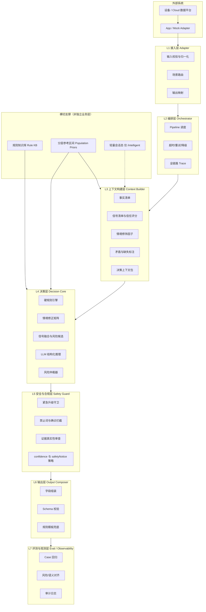
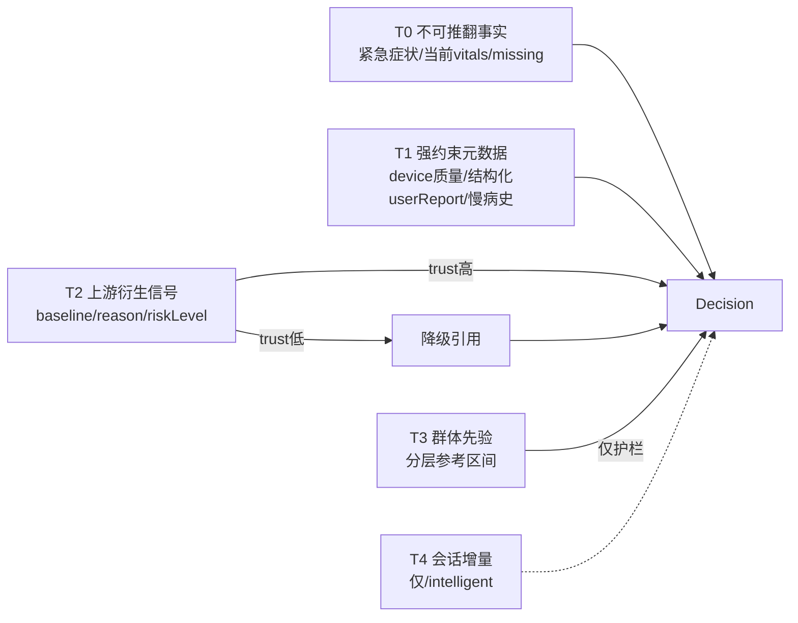
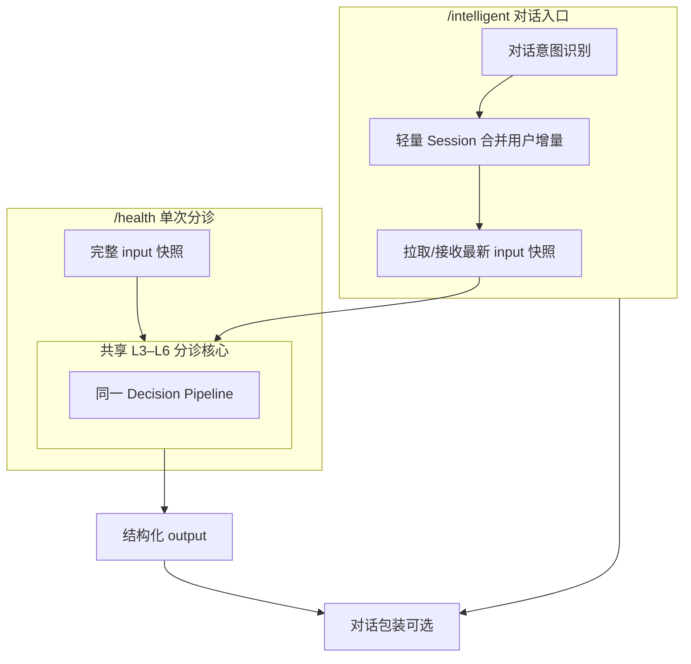

# 小爪 AI 健康/兽医分诊 Agent V1 — 架构分层设计

## 一、架构总览

### 1.1 系统定位

这不是通用聊天 Agent，而是 **受约束的医疗分诊决策服务**：

- **输入**：App/mock adapter 提供的单次健康快照（含设备、体征、上游 signal、用户自述、缺失项）
- **输出**：符合 `output_schema` 的结构化结果，供 `/health` 卡片直接渲染
- **核心能力**：证据融合、风险分级、安全兜底、缺数据诚实表达
- **非目标**：确诊、保证性结论、在无依据时做个体化趋势推断

### 1.2 设计原则

| 原则 | 含义 |
|------|------|
| 契约优先 | 严格消费 input_schema、产出 output_schema |
| 规则保底 | 紧急症状、数据质量、风险下限由确定性逻辑保障 |
| LLM 限权 | LLM 负责解释与文案，不单独裁决 emergency/normal |
| 分层信任 | 零信任针对「上游结论」，不是否定所有输入 |
| 输入即上下文 | V1 `/health` 主路径无状态，不编造未提供的历史 |
| 就高不就低 | 医疗场景冲突时取更高风险，并记录原因 |
| 可测可回归 | 20 case + schema 校验 + 语义约束构成验收闭环 |

### 1.3 总体分层图



---

## 二、各层详细设计

---

### L1 接入层（Adapter）

#### 职责

App 与 Agent 之间的**唯一边界**，只做契约转换，不做医学判断。

#### 输入侧

1. **校验**：必填顶层字段、`scene=health_triage`、ISO-8601 时间格式
2. **归一化**：枚举统一（riskLevel、dataQuality、activityLevel 等）
3. **入口分流**：
   - `/health` → 单次分诊 pipeline
   - `/intelligent` → 对话编排器，最终仍调用同一分诊核心

#### 输出侧

1. 将内部决策对象映射为 output_schema 全部必填字段
2. 填充 `primaryAction` / `secondaryAction`（如「联系兽医」「检查设备」「休息观察」）
3. 对 App 隐藏内部字段（trust score、规则命中明细、仲裁 reason）或按需通过 debug 通道输出

#### 设计要点

- **薄层**：换框架（LangGraph、自研 pipeline、SDK）不影响 App
- **不补数据**：输入缺什么就原样传入 L3，不在 Adapter 层「聪明地填默认值」

---

### L2 编排层（Orchestrator）

#### 职责

一次分诊请求的生命周期管理与失败策略。

#### 标准 Pipeline

```
构建上下文 → 硬规则预检 → 情境修正 → 信号融合 → LLM 生成 → 风险仲裁 → 安全审查 → 输出组装 → Schema 校验
```

#### 关键能力

| 能力 | 说明 |
|------|------|
| Trace | 以 `caseId` / `petId` / `timestamp` 贯穿全链 |
| 超时控制 | LLM 超时走规则模板降级，不返回空 |
| 有限重试 | 仅对 schema 失败、禁止词命中触发「局部重写」，非无限循环 |
| 降级策略 | 保留已确定的 `riskLevel`，文案退化为规则模板 |
| 同步单请求 | V1 不做多 Agent 协作，一条 pipeline 即可 |

#### 失败时最低保证

即使 LLM 完全不可用，也应能基于 `healthEvidence` + 硬规则输出合法结构化结果，且 `confidence` 标为 `low`。

---

### L3 上下文构建层（Context Builder）

#### 职责

把原始 input 转化为 **决策可读、验真可核对、评测可追踪** 的中间表示。这是**防编造的第一道闸**。

#### 3.1 事实清单（Fact Set）— T0/T1 高信任

只允许后续引用的客观事实：

- 当前 vitals 数值（有则记，无则显式 null）
- `pet` 档案：物种、年龄、体重、慢病史、用药、过敏
- `device` 状态：online、dataQuality、lastSeenAt、warningText
- `userReport` 结构化字段与原文
- `missingData` 列表

**规则**：LLM 与 evidence 只能引用 Fact Set 中存在的项。

#### 3.2 信号清单与信任评分（Signal Set + Trust Score）— T2 有条件信任

对每个 `healthEvidence.signals[]` 计算内部 **Signal Trust Score**（不暴露给用户）：

| 因素 | 加分 | 减分 |
|------|------|------|
| device.dataQuality | good | partial / stale / missing |
| updatedAt 新鲜度 | 与 vitals 一致 | 过期或未同步 |
| reason 与 context 一致性 | recentExercise 匹配 | reason 写「刚运动」但 context=none |
| baseline 合理性 | 在物种类别参考范围内 | 缺失或明显异常 |
| 与用户报告一致性 | 互相印证 | 明显冲突 |

**trust 低时策略**：

- 不引用 baseline 对比句
- evidence 改引当前原始值
- 在 summary 中说明「缺乏可靠个体基线，仅依据当前观测」

#### 3.3 情境修饰因子（Context Modifiers）

从输入提取，用于修正数值解释，**覆盖个体/环境差异的主战场**：

| 修饰因子 | 来源 | 作用 |
|---------|------|------|
| 活动态 | vitals.activityLevel + context.recentExercise | 区分运动后升高 vs 安静态异常 |
| 年龄风险 | context.ageRisk + pet.ageMonths | 幼宠/老年加权 |
| 慢病背景 | pet.chronicConditions + medications | 心脏病、肾病等加权 |
| 品种特征 | pet.breed + chronic tags（如短鼻） | 呼吸基线宽容度调整 |
| 疫苗/餐后 | recentVaccination / recentMeal | 疲倦、低热解释 |
| 环境温度 | environmentTempC | 热应激背景 |

#### 3.4 矛盾与缺失标注（Contradiction & Gap Flags）

自动打标，供 L4 使用：

| 标注类型 | 触发条件 | 示例 case |
|---------|---------|-----------|
| DATA_MISSING | missingData 非空或 vitals 大量 null | missing_vitals |
| DATA_STALE | dataQuality=stale | stale_device_data |
| USER_DEVICE_CONFLICT | 用户描述正常但设备安静态异常 | conflict_user_normal_sensor_fever |
| REASON_CONTEXT_MISMATCH | signal.reason 与 context 矛盾 | 内部质检 |
| EMERGENCY_USER_FLAG | 抽搐、呼吸困难等 | emergency_* |
| UPSTREAM_UNDER_RISK | healthEvidence 低于规则候选 | 仲裁输入 |

#### 3.5 决策上下文包（Decision Context Package）

汇总输出给 L4 的统一结构，包含：

- Fact Set
- Signal Set（含 trust score）
- Context Modifiers
- Flags
- 允许引用的证据边界说明
- 群体参考区间（见横切支撑 Ref）— **仅作护栏参考，标注为 population prior**

#### 记忆交互

- **V1 `/health`**：无状态，Decision Context 仅来自当次 input
- **V1 `/intelligent`**：合并轻量 Session 中的用户增量陈述（新症状、时间变化），但不合并 Agent 自算的历史体征

---

### L4 决策层（Decision Core）

#### 职责

在约束下完成风险判断与文案素材生成。采用 **「规则优先 + 情境修正 + 条件信任 signal + LLM 补全」** 混合架构。

#### 4.1 硬规则引擎（Rule Engine）— 最先执行

确定性逻辑，输出 **风险下限（risk floor）** 与 **强制约束**：

| 规则类别 | 逻辑 | 不可被 LLM 推翻 |
|---------|------|----------------|
| 紧急升级 | 抽搐、呼吸困难、严重创伤等 | 是 |
| 数据门禁 | missing/stale → 禁止判 normal | 是 |
| 绝对生理护栏 | 安静态极高热、极端呼吸率（分层群体区间） | 是 |
| 上游 signal 下限 | 存在 emergency/warning 级 signal 时不得压到 normal | 是 |
| 慢病加重 | 心脏病史 + 安静呼吸偏高等组合 | 是 |

输出：

- `ruleRiskFloor`：normal / watch / warning / emergency
- `forcedMentions`：必须提及的主题
- `forbiddenConclusions`：禁止的结论类型
- `ruleHits[]`：供 L7 审计

#### 4.2 情境修正矩阵（Context Modifier Matrix）

在硬规则之后、信号融合之前，对每个 vital/signal 做 **「对这个宠物、这个时刻」** 的解释修正：

```
最终信号解释 = 原始信号 × 情境权重 × 慢病权重 × 年龄权重 × 活动态修正
```

典型映射（与 20 case 对齐）：

| 场景 | 修正结果 |
|------|---------|
| 运动后体温 39.3 | watch，非 warning |
| 安静态体温 40.2 | warning |
| 疫苗后疲倦 | watch，结合食欲继续观察 |
| 幼犬发热 | warning（年龄加权） |
| 老年猫精神食欲差 | warning（年龄+慢病加权） |
| 短鼻犬呼吸偏高 + 张口呼吸 | emergency |

**群体硬编码区间在本层的角色**：仅用于「明显离谱」护栏和 trust 低时的粗判，**不是主引擎**。

#### 4.3 信号融合与风险候选（Signal Fusion）

综合以下来源，生成 `candidateRisk`：

| 来源 | 权重逻辑 |
|------|---------|
| 硬规则 floor | 取下限，不可更低 |
| 高 trust 的 healthEvidence.signals | 主参考 |
| 低 trust 的 signals | 降权，更多依赖当前 vitals + userReport |
| userReport 结构化字段 | 可升级，不可无故降级 |
| Context Modifiers | 修正单信号严重程度 |
| 多信号共振 | 多 vital 异常 → 升一级 |

同时生成：

- `candidateConfidence`：由数据质量、多源一致性、trust 均值决定
- `evidenceCandidates[]`：每条可回溯到 Fact Set 或可信 signal

#### 4.4 LLM 结构化推理层

LLM 的**允许职责**：

- 生成 `title`、`summary`、`recommendation`、`whenToSeeVet` 的用户可读文案
- 将 evidenceCandidates 整理为自然语言 `evidence[]`
- 在多个 watch 信号间做解释性排序
- 对 USER_DEVICE_CONFLICT 等生成「感受与监测不一致」的合理解释

LLM 的**禁止职责**：

- 单独决定 emergency 是否触发
- 在缺数据时声称健康
- 输出确诊、保证性结论
- 引用 Fact Set 以外的数值或历史趋势
- 否定硬规则 floor

**输入给 LLM 的上下文**应经过裁剪：Fact Set + 已修正信号 + Flags + 允许/禁止引用清单 + 规则 floor。

#### 4.5 风险仲裁器（Risk Arbiter）

当 `ruleRiskFloor`、`candidateRisk`、LLM 建议、`healthEvidence.riskLevel` 不一致时：

**仲裁优先级**：

1. 硬规则 emergency → 最终 emergency
2. 取所有候选中 **最高风险** 为默认
3. 若最终 risk 低于 healthEvidence 中最高 signal risk → 必须记录 `arbitrationReason`
4. confidence 随冲突程度下降；多源一致则上升
5. 数据 missing/stale → confidence 上限为 low

**与 README 对齐**：输出不符合预期风险等级时，不能静默忽略，reason 进入审计日志（必要时在 summary 中暗示不确定性，但不暴露内部实现细节）。

---

### L5 安全与合规层（Safety Guard）

#### 职责

医疗产品边界守卫，生成后审查（post-generation guard）。

#### 5.1 紧急升级守卫

复查最终输出是否将 emergency 场景写成「继续观察即可」「不用就医」；命中则强制改写或回退规则模板。

#### 5.2 禁止词与确诊拦截

对照 output_schema 的 `forbiddenOutputPatterns`：

- 确诊为、一定没事、不用看医生、无需就医、保证、百分百

扩展检查：

- 隐性确诊（「就是胃炎」「肯定是感染」）
- 隐性保证（「不用担心」「肯定能好」）

#### 5.3 证据真实性审查

`evidence[]` 每一项必须能回溯到：

- Fact Set 中的具体字段，或
- trust ≥ 阈值的 signal，或
- userReport 明确内容

**不得出现**输入中不存在的具体数值、时间、趋势。

#### 5.4 confidence 与 safetyNotice 策略

| 条件 | confidence | safetyNotice |
|------|------------|--------------|
| 数据 missing/stale | low | 按 case 要求 |
| watch 及以上 | medium+ | 通常需要 |
| warning / emergency | high（若数据可信） | 必须 |
| 存在冲突 | 降一级 | 必须说明非诊断、建议兽医 |

#### 处理策略

- 违规 → 局部字段重写（一次）→ 仍失败 → 规则模板兜底
- 宁可文案朴素，不可结构错误或医学越界

---

### L6 输出层（Output Composer）

#### 职责

填满 output_schema，保证 App 可直接渲染。

#### 字段生成策略

| 字段 | 来源策略 |
|------|---------|
| `riskLevel` | 仲裁器最终值 |
| `scene` | 固定 health_triage |
| `title` | 短、风险导向、用户可读 |
| `summary` | 解释「为何此风险」，含关键情境（运动/年龄/慢病） |
| `evidence` | 2–5 条，可核对，不编造 |
| `recommendation` | 可执行下一步 |
| `whenToSeeVet` | 明确升级条件（何时必须就医） |
| `missingData` | 与输入对齐，转用户可读描述 |
| `confidence` | 仲裁器 + 数据质量 |
| `safetyNotice` | 非诊断声明、不替代兽医 |
| `primaryAction` | 与 riskLevel 匹配的操作入口 |
| `secondaryAction` | 可选，如「检查设备」「记录症状」 |

#### Schema 校验

- 必填字段完整性
- 枚举合法性
- 类型正确性
- 不通过 → L2 触发模板兜底，确保 API 始终返回合法 JSON

---

### L7 评测与观测层（Eval / Observability）

#### 职责

V1 从一开始就存在，不是事后补丁。

#### 7.1 三类评测

| 评测类型 | 内容 |
|---------|------|
| 结构评测 | output 是否符合 schema |
| 风险评测 | riskLevel 是否满足 expected（就高原则） |
| 语义评测 | mustMention / mustNotMention / 禁止词 / 无编造 |

#### 7.2 观测与审计日志

每次请求记录：

- 输入摘要（含 dataQuality、missingData）
- Signal trust 分布
- 规则命中列表
- Flags（矛盾、缺失）
- 候选风险 vs 最终风险
- arbitrationReason（若有）
- LLM 原始输出 vs Guard 修正项
- 与 case expected 的差异（测试模式）

#### 7.3 V2 审计型记忆的数据来源

审计日志未来可沉淀为 **上游质量监控**（如某设备 baseline 系统性偏差），但不反向污染 V1 实时决策。

---

## 三、横切支撑组件

这些不是独立「业务层」，而是被 L3/L4 消费的支撑能力。

### 3.1 规则知识库（Rule KB）— V1 必需

**不是向量 RAG**，而是可版本化、可单测的配置知识：

| 知识模块 | 内容 |
|---------|------|
| 紧急症状表 | 抽搐、呼吸困难、严重创伤等 |
| 风险映射表 | signal.riskLevel → 候选风险 |
| 情境修正规则 | 运动/疫苗/年龄/慢病/品种 |
| 数据质量策略 | missing/stale/partial 的行为 |
| 组合升级规则 | 多信号共振、慢病+异常体征 |
| 输出模板 | safetyNotice、whenToSeeVet 句式 |
| 禁止结论清单 | 与 schema forbiddenOutputPatterns 对齐 |

与 20 case 直接映射，ROI 最高。

### 3.2 分层参考区间（Population Priors）— 护栏用

**不是主决策引擎**，而是粗粒度群体先验：

- 分层维度：物种（dog/cat）× 年龄档（幼/成/老）× 活动态（resting/active）× 特殊标签（短鼻等）
- 用途：
  1. 绝对危险护栏
  2. signal trust 评估 baseline 合理性
  3. trust 低且无个体 baseline 时的粗判
  4. 防止 LLM 脱离生理常识

**明确不做**：把群体区间当成「这个宠物的正常值」。

### 3.3 轻量会话态（Session State）— 仅 `/intelligent`

| 存储内容 | 不存储内容 |
|---------|-----------|
| 本轮用户新增症状/持续时间 | Agent 自算 baseline |
| 上一轮 riskLevel 与建议摘要 | 未经验证的历史体征 |
| 当前会话已提示的缺失项 | 替代 App 主数据的趋势 |

每轮应重新获取或接收 App 最新 input 快照。

### 3.4 时序与个体化信息 — 优先由上游注入

Agent **不**在 V1 主路径维护决策型时序记忆。个体化与趋势通过：

1. 当次 `healthEvidence.signals`（baseline、reason）
2. Context Modifiers（环境、运动、年龄、慢病）
3. 未来可扩展的 input provenance 字段（baselineSource、trend7d、sampleCount 等）

---

## 四、分层信任模型（贯穿 L3/L4）



**核心原则**：

- 零信任的是 **T2 的结论性叙事**，不是整个输入
- T2 不可信时，退回到 T0 + T1 + T3护栏，并降低 confidence
- **绝不**用 Agent 记忆在缺历史时脑补个体 trend

---

## 五、/health 与 /intelligent 的统一与差异



| 维度 | /health | /intelligent |
|------|---------|--------------|
| 调用模式 | 单次同步 | 多轮，但分诊核心仍结构化 |
| 记忆 | 无状态 | 轻量会话态 |
| 输出 | 直接渲染卡片 | 对话 + 底层结构化结果 |
| V1 mock | 完整展示 | 入口/占位/引用同一 risk 结果 |

**关键**：两个入口 **共享 L3–L6**，避免两套医学逻辑分叉。

---

## 六、端到端数据流（一次 /health 请求）

```
1. App 组装 input（含 vitals、healthEvidence、userReport、missingData）
        ↓
2. L1 校验归一化
        ↓
3. L2 启动 pipeline，分配 traceId
        ↓
4. L3 构建 Fact Set、Signal Trust、Modifiers、Flags、Decision Context
        ↓
5. L4.1 硬规则引擎 → risk floor + forced constraints
        ↓
6. L4.2 情境修正矩阵 → 修正后信号严重度
        ↓
7. L4.3 信号融合 → candidateRisk + evidenceCandidates + confidence
        ↓
8. L4.4 LLM → 文案草稿（受 floor 与 Fact Set 约束）
        ↓
9. L4.5 仲裁器 → 最终 riskLevel + confidence + arbitrationReason
        ↓
10. L5 Safety Guard → 禁止词/证据/紧急审查
        ↓
11. L6 组装 output + schema 校验
        ↓
12. L1 返回 App；L7 写审计日志 / 跑 case 评测
```

---

## 七、典型场景在各层的处理路径

| 场景 | 关键层 | 处理要点 |
|------|--------|---------|
| 正常日常 | L4 融合 | 多源一致 → normal, high confidence |
| 运动后发热 | L3 修饰 + L4 矩阵 | 运动情境降级，mustMention 休息补水 |
| 安静高热 | L4 规则 + 护栏 | warning，联系兽医 |
| 呼吸困难 | L4.1 紧急规则 | emergency，LLM 仅生成紧急文案 |
| 数据缺失 | L3 DATA_MISSING + L4 门禁 | watch/low，明确不能判断 |
| 数据过期 | L3 DATA_STALE | 不得说当前正常 |
| 用户/设备冲突 | L3 矛盾标注 + L4 融合 | 采信设备当前值，解释不一致 |
| 幼犬/老年/慢病 | L3 修饰 + L4 矩阵 | 年龄慢病加权，非硬编码一刀切 |
| 上游 baseline 不可信 | L3 trust 低 | 不引 baseline 对比，confidence 降级 |

---

## 八、记忆与知识库决策总表

| 组件 | V1 `/health` | V1 `/intelligent` | V2+ |
|------|-------------|-------------------|-----|
| 决策型时序记忆 | 不需要 | 不需要 | 仅当输入含足够历史且上游不可靠 |
| 轻量会话态 | 不需要 | 需要 | 增强 |
| 审计型时序日志 | 建议有（L7） | 建议有 | 用于上游质控 |
| Rule KB | **必需** | **必需** | 扩展场景 |
| 分层群体区间 | **必需（护栏）** | **必需（护栏）** | 更细分 |
| 文档 RAG | 不需要 | 不需要 | 辅助参考，不主导 risk |
| 上游 trend 字段 | 可选扩展 | 可选扩展 | 推荐由 App 注入 |

---

## 九、分阶段演进

### V1（当前目标）

- 七层架构完整落地
- Rule KB + 分层群体护栏
- 无状态 `/health` 主路径
- Signal Trust + 矛盾检测
- 规则优先 + LLM 文案 + Safety Guard
- 20 case 全量回归

### V1.x

- `/intelligent` 会话态
- input schema 扩展 provenance（baselineSource、sampleCount、trend7d）
- 更丰富的话术模板与品种标签

### V2+

- 审计型记忆驱动上游质量监控
- 文档 RAG 作为辅助参考层（不主导 riskLevel）
- 多 scene 路由（营养、行为等），共享 L5 Safety 层
- 条件成熟后再评估决策型时序记忆