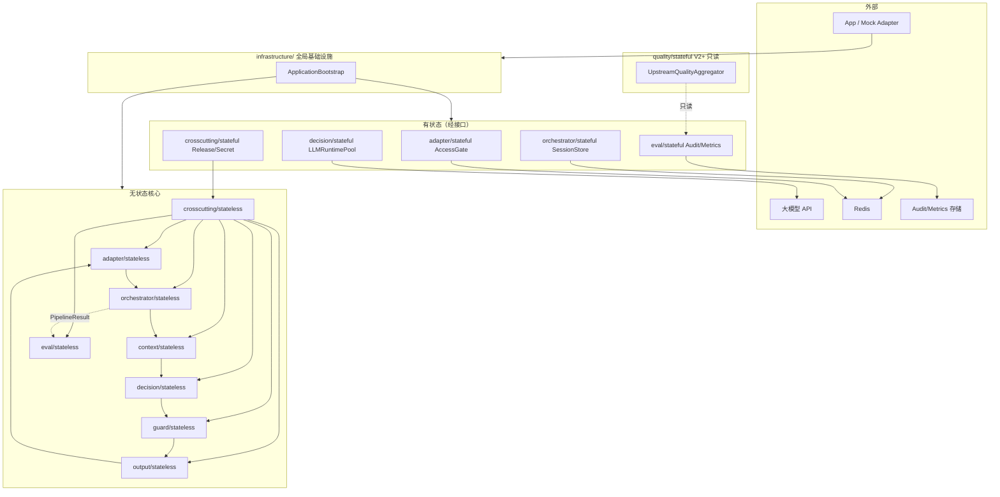

# 组件间依赖与调用约束

本文档汇总小爪 AI 健康/兽医分诊 Agent V1 架构中 **各包、各层、各域组件之间的依赖方向、调用顺序与禁止项**，作为实现与 Code Review 的统一约束。  
**设计依据**：`overall.md`、`infrastructure-overview.md`、L1–L7 无状态/有状态组件设计、横切无状态/有状态设计、ToC 传统多用户（非多租户）及「审计不反哺决策、配置版本化、输入即上下文」等原则。

---

## 一、文档目的与适用范围

### 1.1 目的

| 目标 | 说明 |
|------|------|
| 防止医学逻辑渗漏 | 避免 L1/L2 做裁决、L3 读 Session、L4 读 Audit |
| 防止有状态污染无状态 | 无状态包不直接依赖 DB/Redis/HTTP 客户端实现 |
| 保证可回归 | 同 input + 同 bundleVersion → 风险路径可复现 |
| 保证安全边界 | emergency、floor、Guard 不被绕过 |
| 统一组装 | 仅 `ApplicationBootstrap` 为 Composition Root |

### 1.2 适用范围

- **包含**：L1–L7 无状态/有状态、横切无状态/有状态、全局基础设施、V2+ 质控域（只读）。  
- **不包含**：App 客户端、设备/cloud 上游数据平台内部实现（仅通过 input_schema 契约交互）。

### 1.3 四条架构级硬红线（全文贯穿）

1. **实时分诊 Pipeline（L1–L6）禁止读取**：AuditSink 历史、RegressionHistory、UpstreamQualityAggregator、SessionStore（L3–L6 路径）、决策型时序记忆。  
2. **`finalRiskLevel` 仅由 L4 RiskArbiter 产出**；L5/L6 不得修改；有状态层不得影响其计算。  
3. **配置变更必须版本化**：禁止无 `bundleVersion` 热改 RuleKB/禁止词/模板。  
4. **评测与观测不反哺 serving**：L7 失败、Metrics 告警、DLQ 堆积 **不得** 改变当次或后续请求的 Pipeline 行为（除非人工发布新版本/旋钮）。

---

## 二、逻辑分层与包依赖总图

### 2.1 依赖方向（只允许从上到下或「经接口向内」）



### 2.2 依赖层级表（数字越小越靠外，**只能依赖同级或更内层**）

| 层级 | 包/域 | 可依赖 |
|------|------|--------|
| 0 | `infrastructure/` | 各层/横切 **接口** + 有状态 **实现绑定**（组装根） |
| 1 | HTTP Handler / Coordinator | infra Facade、L1、L2 外协作、L7 persist |
| 2 | `adapter/stateful`（L1） | infra（Redis/Secret）、contracts |
| 2 | `orchestrator/stateful`（L2） | infra Redis、contracts |
| 2 | `decision/stateful`（L4） | infra Secret、contracts |
| 2 | `eval/stateful`（L7） | infra、contracts |
| 2 | `crosscutting/stateful` | crosscutting/stateless、contracts |
| 3 | L1–L7 `stateless` | crosscutting/stateless（只读 Bundle）、本层 contracts、**下层** stateless |
| 4 | `crosscutting/stateless` | config 制品、schema、cases 定义 |
| 5 | `quality/stateful`（V2+） | eval/stateful **只读副本**、禁止 → Pipeline |

**禁止反向**：L3 → SessionStore 实现、L4 → AuditSink.read、L5 → LLMRuntimePool（Guard 不调 LLM）、RuleEngine → eval。

---

## 三、单次请求调用链约束

### 3.1 `/health` 同步分诊（主路径）

**严格顺序**（前一步失败则按层级错误语义终止，不进入后续医学步骤）：

```
[0] HttpServerHost
[1] AccessGateFacade.evaluate          → 失败: 401/403/429，停止
[2] L1-07 HealthTriageAdapterFacade    → 失败: 400，停止
[3] L2-10 OrchestratorFacade.runTriage (health_triage_v1_sync，无 Session)
      S01 BuildContext (L3)
      S02 EvaluateRules (L4)
      S03 ApplyContextModifiers (L4)
      S04 FuseSignals (L4)
      S05 GenerateLLMDraft (L4)        → 可短路/可降级，不终止 Pipeline
      S06 ArbitrateRisk (L4)
      S07 ApplySafetyGuard (L5)
      S08 ComposeOutput (L6)
      S09 ValidateOutputSchema (L6)
[4] L1-04 OutputMapper                 → publicOutput
[5] 响应 HTTP 200（或 L2 最低可用输出）
[6] 异步] L7-14 observe → L7 stateful persist   → 失败不影响 [5]
```

**调用约束**：

| 约束 | 说明 |
|------|------|
| AccessGate 在 L1 之前 | 未鉴权不得校验 input |
| L2 不重复 L1 schema 校验 | 防御性复用须同配置源 |
| L3 不调用 L4/L5/L6 | 只产出 DecisionContextPackage |
| L4 LLM 为唯一 LLM 调用点 | L5/L6/L7 禁止调 LLM |
| L5 在 L6 之前 | Guard 审查后再组装对外字段 |
| L7 在响应之后或并行 | 不得阻塞 [5] |
| 全程无 SessionStore | `/health` 零 Session 依赖 |

### 3.2 `/intelligent` 多轮分诊

在 `/health` 链路上 **仅增加** 下列步骤，**S01–S09 与 `/health` 必须一致**：

```
[1] AccessGate（同上，需 sessionId）
[2] L1 Facade（requiresSessionMerge=true）
[2a] SessionStoreFacade.load            → SessionDelta（L2 有状态，在 L2-10 外）
[3] L2-10 runTriage(..., { sessionDelta })
      S00 SessionInputMerger (L2-09)    → 仅合并 userReport 增量
      S01–S09 同 /health
[4] L1 OutputMapper
[5] 响应
[2b] SessionStoreFacade.save            → 在 L2-10 外，建议异步
[6] L7 persist（同 /health）
```

**调用约束**：

| 约束 | 说明 |
|------|------|
| SessionStore.load/save **不在** L2-10 内 | Facade 只收 `sessionDelta` 参数 |
| L2-09 不读 SessionStore | 纯函数 merge |
| L3–L6 **不** 感知 SessionStore | 只消费 EnrichedNormalizedInput |
| vitals/healthEvidence **不被** Session 覆盖 | Merger 硬规则 |
| L4 Arbiter **不** 读 `lastTurnRiskLevel` 做降级 | 仅可作 L3 meta 标注 |

### 3.3 离线 CI `run_cases`

```
CaseDatasetLoader (L7)
  → 每 case: 完整 Pipeline（建议 accessMode=bypass，无 Session）
  → L7 Matchers + RegressionReportBuilder
  → RegressionHistoryStore.store（有状态，CI 专用）
```

**约束**：CI 评测 **不** 写生产 AuditSink（或写 isolated 前缀）；评测失败 **不** 改 ConfigRelease。

---

## 四、层间依赖矩阵（无状态核心）

### 4.1 允许的直接依赖

| 调用方 → 被调用方 | 允许 | 方式 |
|------------------|------|------|
| L1 → crosscutting | ✓ | Schema、路由表只读 |
| L1 → L2 | ✓ | IngressBundle |
| L2 → L3–L6 | ✓ | StepHandler 接口注入 |
| L3 → crosscutting | ✓ | Trust、Prior、Lexicon 只读 |
| L4 → L3 产物 | ✓ | 只读 DecisionContextPackage |
| L4 → crosscutting | ✓ | RuleKB、Matrix、Prompt 模板 |
| L4 → L4 stateful | ✓ | **仅** `llmClient` 接口（L4-07） |
| L5 → L4 产物 | ✓ | Draft + 约束 |
| L5 → crosscutting | ✓ | ForbiddenPattern（与 L7 同版本） |
| L6 → L5 产物 | ✓ | GuardedDraft |
| L6 → crosscutting | ✓ | Template、Action 表 |
| L1 ← L6 | ✓ | ComposedOutput → OutputMapper |
| L7 → L1–L6 产物 | ✓ | **只读** PipelineResult、publicOutput |
| L7 → crosscutting | ✓ | EvalPolicy、Synonym、Schema |

### 4.2 禁止的层间依赖

| 禁止 | 原因 |
|------|------|
| L1 → L3/L4/L5/L6 | 接入层不做医学 |
| L2 → L4 规则实现（import 具体类） | 只通过 Handler 接口 |
| L3 → L4/L5/L6 | 上下文层不裁决、不守卫 |
| L3 → SessionStore / Audit | 输入即上下文 |
| L4 → L5/L6 | 决策层不终检、不映射 |
| L4 → SessionStore | 禁止历史 risk |
| L5 → L4 Arbiter（改写 risk） | floor 已冻结 |
| L6 → L4/L3 重算 risk | 只组装 |
| L6 → LLM | 输出层不调模型 |
| L1–L6 → L7 | 管道不依赖评测层 |
| L4–L6 → eval/stateful | 禁止读 Audit |
| 任意层 → quality/stateful（实时路径） | V2 只读离线 |

### 4.3 L3 / L5 / L6 无有状态组件

L3、L5、L6 包内 **不得** 出现 `stateful/` 子包或 DB 客户端；所有存储副作用在 L2/L4/L7 边界。

---

## 五、有状态组件调用约束

### 5.1 通用规则

| 规则 | 说明 |
|------|------|
| 无状态 → 有状态 | **只允许依赖接口**，在 Bootstrap 注入 |
| 有状态 → 无状态 | **允许**（如 Loader 调 Validator）；**禁止** 无状态反向依赖有状态实现 |
| 有状态 → 有状态 | 尽量少；优先经 infra 提供共享连接（Redis、Secret） |
| 写操作 | 默认 **异步 best-effort**（Audit、Session save） |
| 读操作参与决策 | **仅** L2-09 消费的 `SessionDelta`（且不含 vitals 历史） |

### 5.2 各层有状态：谁可调用谁

| 有状态组件 | 可被谁调用 | 不可被谁调用 |
|-----------|-----------|-------------|
| AccessGate（L1） | HttpServerHost | L2–L7、SessionStore |
| SessionStore（L2） | IntelligentCoordinator | L2-10 内部、L3–L6、L4 Arbiter |
| LLMRuntimePool（L4） | L4-07 经 `llmClient` | L5、L6、L7、L2 |
| AuditSink / Metrics（L7） | ObservabilityPersistenceFacade | L1–L6 实时路径 |
| ConfigReleaseStore（横切） | Bootstrap、CI activate CLI | L4 RuleEngine、HTTP 分诊 Handler |
| SecretProvider（横切） | L1/L4/L7/infra 经接口 | 写入 Audit 明文 |
| OpsRuntimeKnobs | Bootstrap 读、运维 API 写 | Pipeline 内根据 Metrics 自动写 |

### 5.3 Session 与 Auth 分工

| 数据 | 生产者 | 消费者 | 禁止 |
|------|--------|--------|------|
| userId | AccessGate | SessionStore 键、Audit 元数据 | 写入 NormalizedInput 医学字段 |
| sessionId | 请求头 | SessionStore | AccessGate 读写 Session 内容 |
| SessionDelta | SessionStore.load | L2-09 | L3 直读 Store |
| AuthContext | AccessGate | Handler、Audit | L4 裁决逻辑 |

---

## 六、横切配置消费约束

### 6.1 ConfigBundle 只读消费

| 规则 | 说明 |
|------|------|
| 各层只持 ConfigBundle **子视图** | 避免层间 import 散乱 CFG 文件 |
| 请求级冻结 bundleVersion | 写入 TraceContext、AuditRecord.versions |
| 请求中途禁止切换 Bundle | promoteActive 不影响 in-flight |
| ForbiddenPattern **唯一源** | L5、L7-08 必须同 Registry 版本 |
| OutputSchema **唯一源** | L1、L6、L7-03 同源 |
| PopulationPrior **标注 population** | 不得当个体 baseline 写入 evidence |

### 6.2 横切无状态 vs 横切有状态

| 操作 | 执行者 | 调用时机 |
|------|--------|---------|
| RuleQuery / TemplateResolve | crosscutting/stateless | 每请求，只读 |
| Loader / Validator / Assembler | crosscutting/stateless | 启动或 activate 后 |
| getActiveRelease / activate | crosscutting/stateful | 启动读；activate 仅 CI/运维 |
| RuntimeBundleCache.get | crosscutting/stateful | 启动 + promote 后 |

### 6.3 禁止的配置相关调用

- L4 RuleEngine 在请求内调用 `activateRelease()`  
- L7 根据 `passRate` 调用 `setActiveRelease()`  
- 各层私有维护 `forbidden_words.json`  
- Registry 在请求内 `mutate` 规则权重  
- 从 Audit 聚合结果写回 OpsKnobs（自动闭环）

---

## 七、全局基础设施组装约束

### 7.1 Composition Root

**唯一组装根**：`ApplicationBootstrap`（infrastructure）。

| 允许在 Bootstrap 中 | 禁止在 Bootstrap 中 |
|------------------|-------------------|
| 构造各 Facade 并注入依赖 | 医学规则判断 |
| 绑定 Secret、Redis、Trace | 跑 case 回归（CLI 另入口，可复用 Phase） |
| 加载 ActiveBundle，失败 exit | 无 Validator 启动 serving |
| 注册 Http 路由 | 在 L3 模块静态初始化 Redis |

### 7.2 启动 Phase 依赖顺序（不可乱序）

```
EnvironmentProfile
  → SecretProviderBinding
  → Redis / Trace
  → CrossCutting Bundle Load（fail-fast）
  → 层有状态实例化
  → L1–L7 无状态 Facade
  → HttpServer markReady
```

### 7.3 运维端点 vs 产品 API

| 路径类型 | 经过 AccessGate | 经过分诊 Pipeline |
|---------|----------------|------------------|
| `POST /health`（分诊） | ✓（生产） | ✓ |
| `POST /intelligent` | ✓ | ✓ |
| `/healthz` `/readyz` | ✗ | ✗ |
| CI `activateRelease` | ✗ | ✗ |

---

## 八、数据对象流转与污染约束

### 8.1 关键 DTO 边界

| 对象 | 产生 | 可流入 | 禁止流入 |
|------|------|--------|---------|
| Raw HTTP body | App | L1 only | L3–L6 直连 |
| NormalizedInput | L1-02 | L2、L3 | 含 userId 医学污染 |
| EnrichedNormalizedInput | L2-09 | L3 | 含 Session 内 vitals |
| DecisionContextPackage | L3 | L4 only | 回写 L1 |
| DecisionResult / ArbitrationResult | L4 | L5、L6、L7 只读 | L2 修改 risk |
| GuardedDraft | L5 | L6 | 绕过 Arbiter 改 risk |
| ComposedOutput | L6 | L1-04、L7 | 回灌 L4 |
| PublicOutput | L1-04 | App、L7 | 含 internalAudit 默认 |
| PipelineResult.internalAudit | L2-08 | L7、debug | App 默认响应 |
| AuthContext | AccessGate | Handler、Audit 元数据 | NormalizedInput |
| SessionDelta | SessionStore | L2-09 only | L3–L6 直读 |
| AuditRecord | L7-11 | AuditSink | L4 实时 read |

### 8.2 医学字段不可变链

```
riskFloor (L4 RuleEngine)
  → candidateRisk (L4 Fusion)
  → finalRiskLevel (L4 Arbiter only)
  → publicOutput.riskLevel (L1 投影，不得改值)
```

L5 可改 **文案**；L6 可 **模板兜底文案**；**不得** 降低 `finalRiskLevel`  below `riskFloor`。

### 8.3 证据与事实边界

- `evidence[]` 必须可回溯 Fact Set 或高 trust signal（L5-03、L3 evidenceBoundary）。  
- LLM **不得** 引入 Fact Set 外数值（L4-07 + L5）。  
- Session **不得** 向 Fact Set 追加 vitals 历史。

---

## 九、异步、副作用与失败语义

### 9.1 副作用分类

| 副作用 | 同步/异步 | 失败对用户的影晌 |
|--------|----------|-----------------|
| 分诊计算 L1–L6 | 同步 | 降级模板仍 200 |
| SessionStore.save | 建议异步 | 无（记日志） |
| AuditSink.write | 异步 | 无 |
| MetricsBackend.emit | 异步 | 无 |
| LLM invoke | 同步（S05 内） | 空 draft + 模板 |
| Config activate | 运维操作 | 不影响已在途请求 |

### 9.2 降级与短路调用约束

| 策略组件 | 所属 | 可决定 |
|---------|------|--------|
| ShortCircuitPolicy | L2 无状态 | 跳过 S05 LLM |
| DegradationPolicy | L2 无状态 | 模板兜底、保留 riskFloor |
| RetryPlanner | L2 无状态 | S05/S09 有限重试 |
| CircuitBreaker | L4 有状态 | LLM 快速失败分类 |
| Guard 局部重写 | L5 | 文案字段，一次 |

**禁止**：DegradationPolicy 将 `missing_vitals` 降为 `normal` 叙事；ShortCircuit 跳过 S07 Guard。

---

## 十、观测与评测调用约束

### 10.1 L7 双模式

| 模式 | 触发者 | 可调 Pipeline | 可写有状态 |
|------|--------|--------------|-----------|
| 在线 observe | Handler 异步 | **否** | AuditSink、Metrics |
| 离线 regression | CI CLI | **是**（完整跑 case） | RegressionHistoryStore |

### 10.2 评测与 serving 隔离

- L7 Matcher 结论 **不** 传入 L2 `DegradationPolicy`。  
- `caseEvalDelta` 仅测试模式进入 Audit，**不** 触发重试分诊。  
- RegressionReport 失败 → CI 非零退出，**不** 自动 activate 旧版或新版 Bundle。

### 10.3 Metrics 基数约束

- **禁止** 以 `userId`、`petId`、`caseId`（生产）作为 Metric label（L7-13 + ST-L7-05）。  
- 允许：`riskLevel`、`degraded`、`stepId`、`entry`、`dataQuality`。

---

## 十一、V2+ 质控域依赖约束

```
AuditSink（OLAP 副本）
  → UpstreamQualityAggregator（只读）
  → 运营报表 / AlertStateEngine
```

| 允许 | 禁止 |
|------|------|
| quality 读历史 Audit 聚合 | quality → L4 RuleEngine |
| 人工根据报告改 RuleKB Git | Aggregator 自动 activate Bundle |
| 告警通知运维 | 告警修改 OpsKnobs 闭环 |

质控域 **不** 注册在 HttpServer 分诊中间件链中。

---

## 十二、测试与本地开发依赖替身

### 12.1 可替换实现（同接口）

| 接口 | 测试替身 | 用途 |
|------|---------|------|
| SessionStore | InMemory | intelligent 集成测 |
| AuditSink | InMemory / 捕获列表 | 断言 Audit 字段 |
| LLMClient | MockLLMBackend | 固定 draft / 失败模拟 |
| SecretProvider | EnvSecretProvider | 无密钥 CI |
| ConfigReleaseStore | LocalFilePointer | 本地 bundle |
| AccessGate | bypass 模式 | 20 case 回归 |

### 12.2 测试依赖约束

- 无状态单测 **不得** 启动 Redis/真实 LLM。  
- 20 case 风险金标：**LLM off 或 mock** 仍须 pass risk 评测。  
- 语义 mustMention 评测：**LLM mock on**，与风险评测分层。  
- 改 ForbiddenSynonym 表 → 须同步更新 L7 快照或 policyVersion bump。

---

## 十三、反模式清单（Code Review 必拒）

| # | 反模式 | 正确做法 |
|---|--------|---------|
| 1 | L3 import SessionStore | L2 外 load → merge |
| 2 | L4 Arbiter 读 Audit 上次 risk | 仅用当次 Package |
| 3 | L5 将 emergency 改为 watch | Guard 仅改文案或拒绝 |
| 4 | L6 缓存 output 按 petId 返回 | 每请求重算 |
| 5 | L7 失败触发 Pipeline 重跑 | 报告 only |
| 6 | Handler 内 activate 新 Bundle | CI/运维 CLI |
| 7 | 层内私有 forbidden 列表 | X-52 Registry |
| 8 | LLM 在 L5/L6 调第二次 | 仅 L4-07 |
| 9 | Session 存 vitals 历史 | 只存 user 增量 |
| 10 | Metrics 打 userId 标签 | traceId 关联 Audit |
| 11 | AccessGate 写 Session | L2 SessionStore |
| 12 | Bootstrap 跳过 ConfigValidator | fail-fast |
| 13 | intelligent 与 /health 两套 L4 逻辑 | 共享 S01–S09 |
| 14 | OpsKnobs 被 L7 自动调整 | 人工变更 |
| 15 | quality 组件挂分诊中间件 | 独立离线 job |

---

## 十四、版本与追溯约束

每次分诊请求 **必须** 在 Audit/trace 中可追溯到：

| 版本字段 | 来源 |
|---------|------|
| bundleVersion | ConfigRelease ActiveRelease |
| pipelineVersion | X-60 PipelineStepRegistry |
| ruleKbModuleVersion | ConfigManifest 条目 |
| evalPolicyVersion | CFG-L7-01 |
| guard/forbiddenVersion | X-52 |
| llmEndpointRegistryVersion | L4 端点表 |
| accessMode | EnvironmentProfile |

**约束**：上述版本由请求入口冻结，L7 观测只记录，不选择版本。

---

## 十五、依赖约束总表（速查）

| 从 \ 到 | infra | CCs | CC | L1s | L2s | L4s | L7s | L1 | L2 | L3 | L4 | L5 | L6 | L7 |
|---------|-------|-----|-----|-----|-----|-----|-----|----|----|----|----|----|----|-----|
| infra | - | 组装 | 组装 | 组装 | 组装 | 组装 | 组装 | 组装 | 组装 | 组装 | 组装 | 组装 | 组装 | 组装 |
| Handler | ✓ | | | ✓ | ✓协调 | | ✓async | ✓ | ✓ | | | | | ✓async |
| L1s | ✓ | | | | | | | | | | | | | |
| L2s | ✓ | | | | | | | | | | | | | |
| L4s | ✓ | | | | | | | | | | ✓接口 | | | |
| L7s | ✓ | | | | | | | | | | | | | |
| L1 | | | ✓ | | | | | | ✓ | | | | | |
| L2 | | | ✓ | | | | | | ✓ | ✓ | ✓ | ✓ | ✓ | |
| L3 | | | ✓ | | | | | | | | | | | |
| L4 | | | ✓ | | | | ✓接口 | | | | | ✓ | | |
| L5 | | | ✓ | | | | | | | | | | ✓ | |
| L6 | | | ✓ | | | | | | | | | | | |
| L7 | | | ✓ | | | | | | | | | | | |

图例：CCs=横切有状态，CC=横切无状态；✓=允许（经接口或编排）；空=禁止直接依赖。

---

## 十六、总结

组件间依赖与调用的核心可归纳为 **五句话**：

1. **单向管道**：App → AccessGate → L1 → L2 → L3 → L4 → L5 → L6 → L1 出参；L7 只挂在尾部观测，不嵌入环内。  
2. **无状态不碰实现**：L1–L7 stateless 只依赖接口与 ConfigBundle；DB/Redis/LLM HTTP 在层 stateful 或 infra。  
3. **有状态不回流决策**：Session、Audit、Metrics、Release 历史 **不得** 被 L3–L6 实时读取用于 risk。  
4. **横切单一真相**：schema、禁止词、模板、RuleKB 经 bundleVersion 发布；各层禁止私有副本。  
5. **唯一组装根**：`ApplicationBootstrap` 负责依赖图；`/health` 与 `/intelligent` 共享同一 L4 医学链，差异仅在 L2 会话协调。

实施与评审时，凡违反第十三节反模式或第四节禁止矩阵的依赖/调用，应视为 **架构级缺陷**，需在合并前修正或通过显式 ADR 修订架构（并 bump `bundleVersion` 与回归 case）。