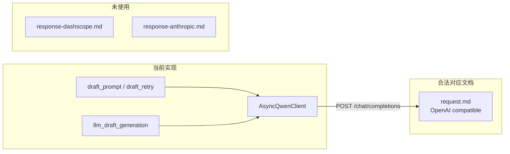

# 小爪 AI 健康/兽医分诊 Agent V1 — 通义千问 LLM API 合规比对报告

**文档类型**：交付存档 / API 合规审计  
**比对范围**：`xiaozhua-health-agent` LLM 实现 vs `docs/api/tongyi` 官方 API 说明  
**声明范围**：WP4 ③-2 文案生成、WP5 LLM 重试与 guard repair（`copy/`、`pipeline/llm_draft_generation.py`）  
**运行时选型**：FastAPI + OpenAI 兼容模式（`openai.AsyncOpenAI`）  
**报告日期**：2026-06-09  

---

## 摘要

当前 LLM 实现采用通义千问 **OpenAI 兼容模式**（`compatible-mode/v1/chat/completions`），与 `docs/api/tongyi/request.md` 所述调用规范 **一致且合法**。

- **未使用** DashScope 原生协议（`response-dashscope.md`）与 Anthropic 兼容协议（`response-anthropic.md`），无协议混用风险。
- **结构化输出**（`response_format: json_object`）与 Prompt 中的 JSON 明示要求 **同时满足** API 文档约束。
- LLM **仅负责** `DraftCopyJSON` 文案，不参与 `riskLevel` / `confidence` 裁决，与 `pipeline-design.md` §5.3 及 WP4/WP5 设计一致。
- 在默认配置（`qwen-plus`、非思考模式、`XIAOZHUA_PIPELINE_LLM_ENABLED=false`）下，**无 API 违规项**；换用 Qwen3 思考类模型时需补全 `enable_thinking` 等扩展参数。

**总体判定**：

| 维度 | 判定 |
|------|------|
| 协议与端点 | 合法 |
| 认证方式 | 合法 |
| 请求必填字段 | 合法 |
| `response_format=json_object` + Prompt | 合法 |
| `messages` 角色与多轮 repair | 合法 |
| 响应解析（OpenAI 兼容形态） | 合法 |
| 默认 `qwen-plus` 生产路径 | 合法 |
| 换 Qwen3 思考模型 | 需补参数，否则有风险 |

---

## 1. 比对依据

### 1.1 官方 API 文档

| 文档 | 路径 | 协议 | 本报告角色 |
|------|------|------|-----------|
| OpenAI 兼容请求/响应 | `docs/api/tongyi/request.md` | `POST .../compatible-mode/v1/chat/completions` | **实现所依主文档** |
| DashScope 原生 | `docs/api/tongyi/response-dashscope.md` | `.../text-generation/generation` | 对照：未使用 |
| Anthropic 兼容 | `docs/api/tongyi/response-anthropic.md` | `.../apps/anthropic/v1/messages` | 对照：未使用 |

### 1.2 设计与计划文档

| 文档 | 路径 | 角色 |
|------|------|------|
| 五模块管道 | `docs/implementation/coze/pipeline-design.md` | ③-2 LLM 职责边界、重试策略 |
| 开发计划 | `docs/plans/coze-workflow-dev-plan.md` | WP4/WP5 交付范围 |
| WP0–WP5 一致性报告 | `docs/delivery/wp0-wp5-implementation-consistency-report.md` | 实现与架构对齐背景 |

### 1.3 被审计实现

| 模块 | 路径 | 职责 |
|------|------|------|
| 客户端配置 | `xiaozhua-health-agent/src/xiaozhua_health_agent/copy/qwen_settings.py` | Base URL、模型、超时、Key |
| HTTP 客户端 | `xiaozhua-health-agent/src/xiaozhua_health_agent/copy/qwen_client.py` | `AsyncQwenClient`、请求/响应解析 |
| Prompt 组装 | `xiaozhua-health-agent/src/xiaozhua_health_agent/copy/draft_prompt.py` | system/user、`json_object` |
| 文案重试 | `xiaozhua-health-agent/src/xiaozhua_health_agent/copy/draft_retry.py` | 解析重试、多轮 repair |
| ③-2 管道 | `xiaozhua-health-agent/src/xiaozhua_health_agent/copy/copy_llm_pipeline.py` | 单 case 文案生成编排 |
| WP5 桥接 | `xiaozhua-health-agent/src/xiaozhua_health_agent/pipeline/llm_draft_generation.py` | guard repair LLM 调用 |
| 环境变量示例 | `xiaozhua-health-agent/.env.example` | `QWEN_*`、`XIAOZHUA_PIPELINE_LLM_ENABLED` |
| 单元测试 | `xiaozhua-health-agent/tests/copy/test_qwen_client.py` 等 | 客户端与 Prompt 契约 |

---

## 2. 协议选型

### 2.1 三种官方接入方式对照

| 文档 | 端点形态 | 项目是否使用 | 评价 |
|------|----------|-------------|------|
| `request.md` | OpenAI 兼容 `/compatible-mode/v1/chat/completions` | **是** | 正确选型 |
| `response-dashscope.md` | DashScope 原生 `/text-generation/generation` | 否 | 未混用 |
| `response-anthropic.md` | Anthropic 兼容 `/apps/anthropic/v1/messages` | 否 | 未混用 |

### 2.2 实现与文档映射



**结论**：实现仅解析 OpenAI 兼容响应（`choices[].message.content`、`usage.prompt_tokens` 等），与 DashScope 原生的 `output.choices`、`input_tokens` 字段不同。在 `base_url` 固定为 `compatible-mode` 的前提下，**请求与响应协议自洽**。

---

## 3. 请求侧合规逐项

### 3.1 端点与认证

| 要求（`request.md`） | 实现 | 结论 |
|---------------------|------|------|
| 华北2默认 URL：`https://dashscope.aliyuncs.com/compatible-mode/v1` | `DEFAULT_QWEN_BASE_URL` 同值 | 合法 |
| `Authorization: Bearer <API Key>` | `AsyncOpenAI(api_key=...)` | 合法 |
| API Key 环境变量 | `QWEN_API_KEY`（非官方 `DASHSCOPE_API_KEY`） | 运维命名差异，不影响 API |
| 地域 URL 可配置 | `QWEN_BASE_URL` 可覆盖 | 合法；新加坡等地域需人工匹配 Key |

### 3.2 必填参数

| 参数 | 文档要求 | 实现 | 结论 |
|------|----------|------|------|
| `model` | 必选 | 默认 `qwen-plus`，`QWEN_MODEL` 可覆盖 | 合法 |
| `messages` | 必选 | `system` + `user`；重试时 `assistant` + `user` | 合法 |

**多轮消息用途**：

| 场景 | 消息链 | 代码位置 |
|------|--------|----------|
| 首轮文案 | `system` → `user`（含 `templatePack`） | `build_draft_chat_completion_request` |
| 解析/行动 repair | 原链 → `assistant`（上轮 JSON）→ `user`（repair 提示） | `append_draft_repair_user_message` |
| WP5 guard repair | 原链 → `assistant`（当前 draft）→ `user`（violations 列表） | `generate_guard_repair_llm_draft_async` |

### 3.3 结构化输出 `response_format`

文档要求（`request.md`）：

1. 请求体设置 `response_format: {"type": "json_object"}`
2. **提示词中须明确要求输出 JSON**，否则可能报错

| 检查项 | 实现 | 结论 |
|--------|------|------|
| API 参数 | `create_kwargs["response_format"] = {"type": "json_object"}` | 合法 |
| system 约束 | 「只输出一个 JSON 对象，字段名严格为：…」 | 合法 |
| user 指令 | 「仅输出 JSON 对象，无其它文字」 | 合法 |
| 字段提示 | `templatePack.outputSchema` 嵌入 user JSON | 增强项，不违规 |

### 3.4 采样与长度参数

| 参数 | 文档 | 实现默认值 | 结论 |
|------|------|-----------|------|
| `temperature` | `[0, 2)`；qwen-plus 默认 0.7 | `0.4`（`QWEN_DEFAULT_TEMPERATURE`） | 合法，偏确定性 |
| `max_tokens` | 可选；文档标注将废弃 | `1200`（`QWEN_DEFAULT_MAX_TOKENS`） | 对 qwen-plus 仍合法 |
| `stream` | 默认 `false` | 未开启 | 合法 |
| `top_p` / `top_k` 等 | 可选 | 未传，使用模型默认 | 合法 |

### 3.5 未启用能力（符合医疗分诊设计）

以下能力在文档中可选，**实现刻意未传**，与 WP 设计一致：

| 参数/能力 | 未启用原因 |
|-----------|-----------|
| `enable_search` | 禁止联网检索编造医学事实 |
| `tools` / `tool_choice` | ③-2 仅需 JSON 文案，非 Function Calling |
| `parallel_tool_calls` | 同上 |
| 向量 RAG / 文档理解 | V1 明确不做 |

### 3.6 与 WP 设计的一致性（业务层）

| 设计约束（`pipeline-design.md`） | 实现 | 结论 |
|----------------------------------|------|------|
| LLM 不修改 `finalRiskLevel` / `confidence` | Prompt 禁止；解析仅产 `DraftCopyJSON` | 一致 |
| 窄上下文，不喂全量 raw input | `user` 仅含 `templatePack`（③-1 产物） | 一致 |
| 多轮仅用于 repair | `draft_retry` / `llm_draft_generation` | 一致 |
| LLM 失败有底线 | 机械文案 + merge fallback | 一致 |

---

## 4. 响应侧合规逐项

### 4.1 OpenAI 兼容响应结构

文档形态（`request.md` §chat 响应对象）：

```json
{
  "choices": [{
    "message": { "role": "assistant", "content": "..." },
    "finish_reason": "stop"
  }],
  "usage": {
    "prompt_tokens": 3019,
    "completion_tokens": 104,
    "total_tokens": 3123
  }
}
```

实现（`qwen_client._parse_chat_completion`）：

| 字段 | 是否解析 | 结论 |
|------|----------|------|
| `choices[0].message.content` | 是，作为 LLM 正文 | 正确 |
| `usage.prompt_tokens` / `completion_tokens` / `total_tokens` | 是，映射为 `QwenTokenUsage` | 正确 |
| `finish_reason` | 是，记录但未分支处理 `length` | 合法；见 §5.3 |
| `message.reasoning_content` | 否 | qwen-plus 无影响；见 §5.1 |
| `tool_calls` | 否 | 未启用 tools，无影响 |

### 4.2 未使用协议的响应差异（避免误用）

| 协议 | 响应特征 | 若误用后果 |
|------|----------|-----------|
| DashScope 原生 | 外层 `status_code` + `output.choices`；token 为 `input_tokens`/`output_tokens` | 解析失败 |
| Anthropic 兼容 | `content[]` 块数组、`stop_reason` | 解析失败 |

当前 `base_url` 与解析逻辑均锁定 OpenAI 兼容形态，**无混用风险**。

### 4.3 解析防御（工程增强）

| 机制 | 位置 | 说明 |
|------|------|------|
| `json_object` 模式 | API 层 | 主约束 |
| Markdown 围栏剥离 | `draft_parser.extract_json_object_text` | 模型偶发带围栏时的兜底 |
| 行动 route 锁定 | `action_lock_enforcer` | 解析后强制回写 ③-1 draft |
| 空响应拒绝 | `_parse_chat_completion` | 触发 retry / 机械兜底 |

以上属 **API 合规之上的鲁棒性加固**，不违反通义 API 规范。

---

## 5. 错误处理与运维

### 5.1 异常映射

| SDK/API 异常 | 实现映射 | 上层处理 |
|-------------|----------|----------|
| `APITimeoutError` | `QwenTimeoutError` | `copy_llm_pipeline` 返回 `QWEN_TIMEOUT` |
| `APIConnectionError` | `QwenApiError` | 返回 `QWEN_API` |
| `APIStatusError` | `QwenApiError`（含 `status_code`、body 摘要） | 返回 `QWEN_API` |
| 无 `choices` / 空 `content` | `QwenClientError` | retry 或机械兜底 |
| 未配置 Key | `QwenConfigurationError` | 返回 `QWEN_CONFIG` |

### 5.2 超时与重试分层

| 层级 | 配置 | 说明 |
|------|------|------|
| HTTP 客户端 | `QWEN_TIMEOUT_SEC=30`、`QWEN_MAX_RETRIES=2` | 传输层；文档非流式最长约 300s，实现更保守 |
| ③-2 业务重试 | `DraftGenerationRetryOptions.max_attempts=3` | 解析/行动 repair |
| WP5 外层协调 | `DraftRetryOptions.max_llm_retries` | guard 违规后 repair |
| 最终兜底 | 机械文案 + merge fallback | 不依赖 API |

### 5.3 已知工程缺口（非 API 违规）

| 缺口 | 影响 | 缓解 |
|------|------|------|
| `finish_reason=length` 未专门分支 | JSON 可能被截断 | `draft_parser` 失败 → retry → 机械兜底 |
| 非流式 + 30s 超时 | 极端慢响应可能超时 | 机械兜底；可调 `QWEN_TIMEOUT_SEC` |
| 未解析 `reasoning_content` | 思考模型下可能忽略思维链 | 默认 `qwen-plus` 无影响；见 §6.1 |

---

## 6. 风险与后续建议

### 6.1 模型升级：思考模式未显式关闭（中等风险）

**文档要求**（`request.md`）：混合思考模型需通过 OpenAI SDK 的 `extra_body={"enable_thinking": false}` 关闭思考（若不需要）。

**现状**：未传 `extra_body`；默认 `QWEN_MODEL=qwen-plus`（非思考），**当前无问题**。

**若切换为** `qwen3.7-plus`、`qwen-plus` 思考版等：

- 可能返回 `reasoning_content`，增加延迟与 token 成本
- 实现仅读 `message.content`；多数情况下 JSON 仍在 `content`，但行为未在代码中锁定

**建议**：换 Qwen3 系模型时，在 `AsyncQwenClient.create_chat_completion` 中显式传入 `extra_body={"enable_thinking": False}`（除非产品刻意启用思考）。

### 6.2 `max_tokens` 与 `max_completion_tokens`（低风险）

文档标注 `max_tokens` 将废弃；Qwen3.7-Max/Plus 等思考类推荐 `max_completion_tokens`。

**现状**：对 `qwen-plus` 仍有效。

**建议**：升级至 Qwen3.7+ 且启用思考时，评估迁移参数名。

### 6.3 地域与 Key 匹配（运维风险）

新加坡、法兰克福等地域 URL 需替换 `WorkspaceId`，且 **Key 与地域须匹配**。

**现状**：`QWEN_BASE_URL` 可配置，代码不校验。

**建议**：部署清单中注明地域、URL、Key 三元组。

### 6.4 默认运行路径

| 开关 | 默认值 | 含义 |
|------|--------|------|
| `XIAOZHUA_PIPELINE_LLM_ENABLED` | `false` | 里程碑 B 默认走机械文案 |
| `QWEN_API_KEY` | 未配置 | 启用 LLM 前必须设置 |

启用 LLM 文案路径需同时：`LLM_ENABLED=true` + 有效 `QWEN_API_KEY`。

---

## 7. 环境变量与默认配置清单

| 变量 | 默认值 | API 相关性 |
|------|--------|-----------|
| `QWEN_API_KEY` | （空） | Bearer 认证 |
| `QWEN_BASE_URL` | `https://dashscope.aliyuncs.com/compatible-mode/v1` | 端点 |
| `QWEN_MODEL` | `qwen-plus` | `model` 参数 |
| `QWEN_TIMEOUT_SEC` | `30` | 客户端超时 |
| `QWEN_MAX_RETRIES` | `2` | SDK 传输重试 |
| `QWEN_DEFAULT_TEMPERATURE` | `0.4` | `temperature` |
| `QWEN_DEFAULT_MAX_TOKENS` | `1200` | `max_tokens` |
| `XIAOZHUA_PIPELINE_LLM_ENABLED` | `false` | 产品开关，非 API |

---

## 8. 合规判定总表

| # | 检查项 | 依据文档 | 判定 |
|---|--------|----------|------|
| 1 | 使用 OpenAI 兼容端点 | `request.md` | 通过 |
| 2 | Bearer API Key 认证 | `request.md` | 通过 |
| 3 | `model` + `messages` 必填 | `request.md` | 通过 |
| 4 | `system` / `user` / `assistant` 角色合法 | `request.md` | 通过 |
| 5 | `response_format=json_object` | `request.md` | 通过 |
| 6 | Prompt 明示 JSON 输出 | `request.md` | 通过 |
| 7 | `temperature` ∈ [0, 2) | `request.md` | 通过 |
| 8 | 未混用 DashScope 原生请求/响应 | `response-dashscope.md` | 通过（未使用） |
| 9 | 未混用 Anthropic 请求/响应 | `response-anthropic.md` | 通过（未使用） |
| 10 | 响应解析字段与 OpenAI 形态一致 | `request.md` | 通过 |
| 11 | LLM 职责限于文案（WP4/WP5） | `pipeline-design.md` | 通过 |
| 12 | 思考模式显式关闭（Qwen3） | `request.md` | 待升级模型时补充 |
| 13 | `max_completion_tokens`（Qwen3 思考） | `request.md` | 待升级模型时评估 |

---

## 9. 结论

在 **「华北2 + `qwen-plus` + OpenAI 兼容模式 + 结构化 JSON 文案」** 既定路径下，当前 `xiaozhua-health-agent` 的通义千问 LLM 实现 **符合** `docs/api/tongyi/request.md` 的调用规范，与 DashScope 原生、Anthropic 兼容文档 **无冲突**（因未走该两条接入路径）。

**交付层面可陈述为**：

1. API 接入方式选型正确，请求/响应协议自洽。
2. 结构化输出满足官方「参数 + Prompt」双重要求。
3. LLM 调用边界与 WP4/WP5 医学安全设计一致。
4. 模型升级至 Qwen3 思考系列前，需补充 `enable_thinking` 等 DashScope 扩展参数审计。

---

## 10. 修订记录

| 版本 | 日期 | 说明 |
|------|------|------|
| 1.0 | 2026-06-09 | 首版：基于 WP0–WP5 完成态与 `docs/api/tongyi` 三份文档比对 |

---

## 附录 A：关键代码锚点

| 职责 | 文件 | 符号 |
|------|------|------|
| 默认 Base URL / 模型 | `copy/qwen_settings.py` | `DEFAULT_QWEN_BASE_URL`、`DEFAULT_QWEN_MODEL` |
| 聊天补全调用 | `copy/qwen_client.py` | `AsyncQwenClient.create_chat_completion` |
| Prompt + `json_object` | `copy/draft_prompt.py` | `build_draft_chat_completion_request` |
| 多轮 repair | `copy/draft_retry.py` | `append_draft_repair_user_message` |
| WP5 guard repair | `pipeline/llm_draft_generation.py` | `generate_guard_repair_llm_draft_async` |

## 附录 B：相关交付文档

| 文档 | 路径 |
|------|------|
| WP0–WP5 实现一致性报告 | `docs/delivery/wp0-wp5-implementation-consistency-report.md` |
| 开发计划 | `docs/plans/coze-workflow-dev-plan.md` |
| 五模块管道设计 | `docs/implementation/coze/pipeline-design.md` |
