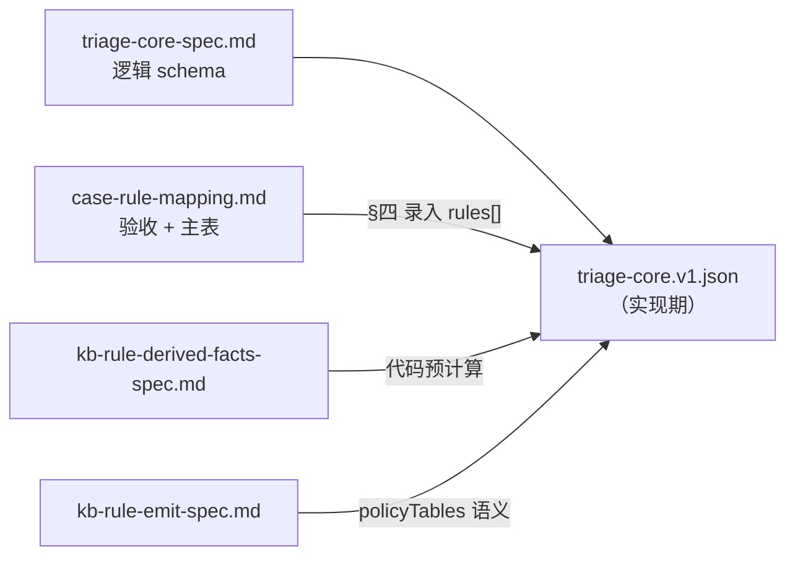
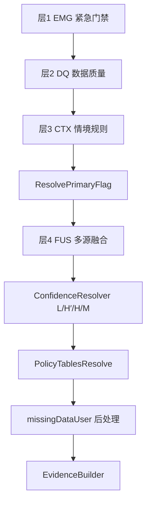

# 20 Case 验收映射与规则主表 — 设计文档

**文档定位**：`docs/implementation/coze/case-rule-mapping.md`  
**配套**：[triage-core-spec.md](./triage-core-spec.md)（单文件决策表逻辑 schema）、[pipeline-design.md](./pipeline-design.md)、计划制品 `assets/triage-core.v1.json`（**V1 暂不实现 JSON 文件**）  
**用途**：20 case **验收规格**、规则 **人类可读主表**（录入决策表时的内容依据）、`ruleId` ↔ `caseId` 追溯。  
**依据**：`docs/cases/health_triage_cases.v1.json`、`docs/architecture/overall.md`（L4 RuleEngine 精神）

> **执行制品**：步骤 ② 的规则、融合、置信度、PolicyTables、Evidence 映射 **统一** 写入 `triage-core.v1.json`（见 [triage-core-spec.md](./triage-core-spec.md)）。  
> ~~独立 `kb-rule.v1.json`~~ 与 ~~字符串谓词 DSL~~ **已废弃**；`when` 在决策表中为 **结构化条件块**（`all` / `any` / `fact` / `field`）。

---

## 一、文档目的与职责边界

| 目标 | 说明 |
|------|------|
| 可回归 | 每个 case 标明「应命中哪些 ruleId、产出何种 risk/confidence」 |
| 可维护 | 改规则时知道影响哪些 case；易错点集中在 §五 `pitfall`/`neg` |
| 可录入 | §四 主表为录入 `triage-core.v1.json` `rules[]` 时的 **内容规格** |
| 可回迁 | `rules[].id` 将来映射到正式架构 `RuleKBRegistry` |

| 本文 **负责** | 本文 **不负责** |
|--------------|----------------|
| §五 **增强验收总表**（含 pitfall、mustMention 引用） | 逐案 forcedMentions / evidence 全文 |
| §四 规则主表（人类可读 when 摘要） | 逐案复述 input 触发依据 |
| ruleId ↔ caseId 索引、冲突消解 | DerivedFacts 计算逻辑（见 [kb-rule-derived-facts-spec.md](./kb-rule-derived-facts-spec.md)） |
| primaryFlag 优先级 | policyTables 表体（见 [kb-rule-emit-spec.md](./kb-rule-emit-spec.md) + 决策表） |
| | 结构化 `when` JSON 全文（实现期写入决策表） |
| | KB-TPL（文案 copy）、KB-FORBID、KB-SYN |
| | 决策表顶层 schema（见 [triage-core-spec.md](./triage-core-spec.md)） |

---

## 二、与单文件决策表的关系

### 2.1 制品与文档一览



| 制品 / 文档 | 角色 |
|------------|------|
| **`triage-core.v1.json`** | **唯一执行制品**（rules + fusion + confidence + policyTables + evidenceByFlag + postProcess） |
| **`triage-core-spec.md`** | 单文件 section 定义、结构化 `when` 语法、② 执行顺序 |
| **本文 §四** | 规则 **内容主表**；实现时将各行转为 `rules[]` 条目 |
| **本文 §五** | **唯一 case 级验收表**；不重复维护机器 when |
| **`kb-rule-emit-spec.md`** | 瘦 `then` 与 PolicyTables **字段语义**；表体物理位置在决策表内 |

### 2.2 规则记录（决策表 `rules[]` 摘要）

完整字段见 [triage-core-spec.md](./triage-core-spec.md) §四。摘要：

| 字段 | 说明 |
|------|------|
| `id` | 如 `EMG-01`（原 `ruleId`） |
| `layer` | `EMG` / `DQ` / `CTX` |
| `priority` | CTX 层 **when 评估顺序**（越小越先）；**不**决定最终 primaryFlag（见 §6.3） |
| `when` | **结构化条件块**（非 DSL 字符串） |
| `then` | 瘦 emit：`risk`、`riskFloor?`、`primaryFlag`、`mentionsAdd?`；DQ-03 为 `null` |
| `caseIds` / `notes` | 回归与边界说明 |

### 2.3 `then` 与后处理（Coze V1 最小集）

规则 `then` **只允许** 医学裁决与叙事主键；文案元数据由决策表内 `policyTables` 按 `primaryFlag` 查表。

| `then` 字段 | 说明 |
|-------------|------|
| `risk` | 候选风险（FUS 参与 max） |
| `riskFloor` | **仅 DQ-01/02** |
| `primaryFlag` | KB-TPL / PolicyTables 主键（如 CTX-09a/b 均 `POST_EXERCISE`，不靠别名） |
| `mentionsAdd` | 可选追加（如 CTX-04 用药） |

> `confidence`：决策表 `confidence` 区块（L / **H′** / H / M），非 ruleId。  
> PolicyTables / Evidence：决策表同文件 section；语义见 [kb-rule-emit-spec.md](./kb-rule-emit-spec.md) §四。

### 2.4 规则分层与 ② 管道（layer）



| layer / 组件 | 职责 |
|-------------|------|
| EMG | 一票 emergency；emit 最小集：`candidateRisk` + `primaryFlag` |
| DQ | missing/stale 门禁（emit 含 floor + primaryFlag）；**DQ-03 零 emit**，partial 由 Resolver 读 `dataQuality` |
| CTX | 主情境判级；emit 最小集 + 用药/呕吐等 **forcedMentions 追加** |
| **ResolvePrimaryFlag** | 从全部 `ruleHits` 的 `then.primaryFlag` 按 §6.3 优先级选定唯一主键（见 [triage-core-spec.md](./triage-core-spec.md) §七步骤 4） |
| FUS | 全局 max 融合（可实现为代码，不必逐条 JSON） |
| **ConfidenceResolver** | 决策表 `confidence` 区块；含 **H′**（case #13） |
| **PolicyTablesResolve** | 决策表 `policyTables` 区块 |
| **missingDataUser** | `postProcess` 翻译（§4.2.1）；在 EvidenceBuilder **之前** |
| **EvidenceBuilder** | 决策表 `evidenceByFlag` 区块；可读 `missingDataUser[]` |

> **AUX 层已取消**：原 AUX-01/04 语义并入 CTX-05/CTX-04；原 AUX-03 由 `dataQuality=partial` + Resolver 承担；原 AUX-02 由 DQ-01 + 全局后处理承担。  
> **CONF 规则表已取消**：并入 `ConfidenceResolver`（§4.5），含 **H′**。  
> **POP 层已取消**：原 POP-01/02 绝对体征兜底 **并入 CTX-01/02 的 OR 分支**（§3.2、§4.3）；FUS 不再单独读 POP floor。  
> **emit 最小集**：文案元数据由决策表 `policyTables` 承担，见 [kb-rule-emit-spec.md](./kb-rule-emit-spec.md)。

---

## 三、DerivedFacts 与 when 条件（非 DSL）

### 3.1 DerivedFacts：代码预计算，不在决策表内

**DerivedFacts** 在 ② 入口由 **代码** 对 `FactSheet` 一次性预计算；**不写入** `triage-core.v1.json`。  
决策表 `rules[].when` 通过 `{ "fact": "符号名" }` 引用。

| 符号 | 定义（摘要） |
|------|-------------|
| `isResting` | 安静/非运动情境 |
| `hasExerciseContext` | 运动/玩耍上下文（宽） |
| `vitalsCoreMissing` | 核心体征三项全 null |
| `maxSignalRisk` / `upstreamRisk` | 上游风险聚合 |
| `userSaysNormal` / `deviceShowsRestingFever` | 用户/设备冲突 |
| `hasChronicHeart` / `isSenior` / `isPuppyKitten` | 慢病与年龄 |
| `isBrachycephalic` / `openMouthBreathingReported` / `severeRestingResp` | 呼吸紧急边界（#4 vs #12） |
| `hasRestingTachycardia` / `hasRestingTachypnea` | 慢病安静体征 **心率 vs 呼吸** 分流（#6 vs #20） |

> 完整定义、易错点、与规则的对应关系，见 [kb-rule-derived-facts-spec.md](./kb-rule-derived-facts-spec.md)。

### 3.2 结构化 `when`（取代谓词 DSL）

| 原 DSL | 决策表写法 |
|--------|-----------|
| `A ∧ B` | `{ "all": [ A, B ] }` |
| `A ∨ B` | `{ "any": [ A, B ] }` |
| `NOT X` | `{ "not": X }` |
| `userReport.seizure = true` | `{ "field": "userReport.seizure", "eq": true }` |
| `isResting` | `{ "fact": "isResting" }` |

语法与示例见 [triage-core-spec.md](./triage-core-spec.md) §五。  
**禁止** 在决策表中使用字符串谓词 DSL 作为执行格式。

### 3.3 绝对体征兜底（原 POP-*，已并入 CTX-01/02）

原 **Population Prior** 群体护栏（POP-01/02）不再作为独立 ruleId 或 FUS 候选层；绝对阈值写进 **CTX 规则的 OR 兜底分支**，与临床情境分支共用同一 `emit`（`candidateRisk=warning` + 对应 `primaryFlag`）。

| 原 ruleId | 并入 | 兜底分支（摘要） | 回迁 priorRef |
|-----------|------|------------------|---------------|
| POP-01 | **CTX-01** | `isResting` ∧ `NOT hasExerciseContext` ∧ `temperatureC ≥ 40.0` | `priorRef: POP-01` |
| POP-02 | **CTX-02** | `isResting` ∧ `NOT hasExerciseContext` ∧ `RR ≥ 50` | `priorRef: POP-02` |

**共同前置**：`NOT hasExerciseContext`（结构化 `when` 内 `{ "not": { "fact": "hasExerciseContext" } }`）。  
**运动后发热**（case #2/#5）不得命中 CTX-01/02，走 CTX-09 → watch。  
**20 case 行为不变**：case #3 走 CTX-01 **临床分支**（分支 A）；case #4 走 CTX-02 **临床分支**（RR≥45 + breathingDifficulty）；兜底分支（B）覆盖 **未来**「极端 vital 但缺伴随字段」输入。

---

## 四、全局规则清单（录入 `rules[]` 的主表）

> 下表为 **人类可读规格**；实现时将每行录入 `triage-core.v1.json` 的 `rules[]`，`when` 转为结构化条件块（见 §3.2、[triage-core-spec.md](./triage-core-spec.md) §5.3～5.4）。  
> `fusion`、`confidence`、`policyTables` **不** 作为 ruleId 行，见决策表固定区块与同文档 §4.4～§4.6。

### 4.1 层 1：EMG（紧急）

| ruleId | when（摘要） | emit.candidateRisk | primaryFlag | caseIds |
|--------|-------------|-------------------|-------------|---------|
| **EMG-01** | `userReport.seizure = true` | emergency | EMERGENCY_SEIZURE | emergency_seizure |
| **EMG-02** | `userReport.seizure = true` 已由 EMG-01 覆盖；本规则：`maxSignalRisk=emergency` **或** `upstreamRisk=emergency` | emergency | EMERGENCY_RESPIRATORY | emergency_breathing_difficulty |
| **EMG-03** | `userReport.trauma = true` | emergency | EMERGENCY_TRAUMA | （扩展） |
| **EMG-04** | `breathingDifficulty=true` **且**（`severeRestingResp` **或** `openMouthBreathingReported` **或**（`isBrachycephalic` 且 RR≥55）） | emergency | EMERGENCY_RESPIRATORY | emergency_breathing_difficulty |

**关键边界（case #4 vs #12）**：

- `respiratory_rate_high_resting`：`breathingDifficulty=true`，RR=52，signal=**warning** → **不命中 EMG-04**（RR<60 且无张口呼吸）→ 走 CTX-02  
- `emergency_breathing_difficulty`：RR=68，signal=**emergency**，张口呼吸 → **命中 EMG-02 或 EMG-04**

> 实现建议：**优先** `upstreamRisk=emergency` 或 `maxSignalRisk=emergency`（EMG-02），再评估 EMG-04。这样 case #12 稳定，case #4 不会被误判为 emergency。

---

### 4.2 层 2：DQ（数据质量）

| ruleId | when | emit（最小集） | caseIds |
|--------|------|----------------|---------|
| **DQ-01** | `device.dataQuality = missing` **或** `vitalsCoreMissing` | `riskFloor=watch`, `candidateRisk=watch`, `primaryFlag=DATA_MISSING` | missing_vitals |
| **DQ-02** | `device.dataQuality = stale` | `riskFloor=watch`, `candidateRisk=watch`, `primaryFlag=DATA_STALE` | stale_device_data |
| **DQ-03** | `device.dataQuality = partial` | **（零 emit）** | limping_pain_watch, emergency_seizure, senior_cat_low_energy, persistent_vomiting_warning |

> DQ-01/02 的 forcedMentions、forbiddenThemes、safetyNotice、action、evidence 由 **PolicyTables**（`DATA_MISSING` / `DATA_STALE`）提供，见 [kb-rule-emit-spec.md](./kb-rule-emit-spec.md) §4。  
> **DQ-03**：不 emit `flags`；`dataQuality=partial` 使 Resolver **H** 失败 → 通常 **M**；**不** 抬 risk。case #13 在 partial + EMG + 抽搐时走 **H′** → high。

**DQ 禁止项（写进 FUS-00 元规则）**：

- DQ-01/02 命中时 **禁止** `finalRisk = normal`  
- DQ-02 命中时「当前正常」类叙事由 `ForbiddenByFlag[DATA_STALE]` 约束（非规则 emit）

#### 4.2.1 `missingDataUser` 全局后处理（原 AUX-02）

`missingDataUser[]` **不是独立 ruleId**，在 ② 产出 `TriageCoreResult` 前 **始终执行**。

**执行顺序（P0-2 定案）**：`ConfidenceResolver` → `PolicyTablesResolve` → **`missingDataUser`** → `EvidenceBuilder` → 组装 `TriageCoreResult`（见 [triage-core-spec.md](./triage-core-spec.md) §七）。

| 条件 | 行为 |
|------|------|
| `input.missingData` 非空 | 将枚举项翻译为用户可读描述，写入 `missingDataUser[]`（去重） |
| 同时命中 DQ-01 | 与 `EvidenceByFlag[DATA_MISSING]` / `ForcedMentionsByFlag[DATA_MISSING]` 一致，不重复抬 risk |
| EvidenceBuilder | 可读 `missingDataUser[]` 追加 bullets；**禁止**编造缺失项未列出的细节 |

**典型 case**：#10 仅 DQ-01；#8 有 `missingData: ["activity"]` 但 **不命中 DQ-01**，仍须后处理填充 `missingDataUser`。

---

### 4.3 层 3：CTX（情境主规则，按 priority 评估 when）

**评估顺序**：`priority` 数字小的 **先评估** `when`；**允许多条 CTX 同时命中**（写入 `ruleHits[]`）。  
**本步不产出最终 `primaryFlag`**——各条 `then.primaryFlag` 仅为候选；统一在 **ResolvePrimaryFlag**（§6.3）从 **全部 ruleHits**（含 EMG/DQ/CTX）中选取唯一主键。  
`forcedMentions` 默认由 PolicyTables 提供；用药等场景在规则层 **追加** `mentionsAdd`。

| priority | ruleId | when（摘要） | candidateRisk | primaryFlag | caseIds |
|----------|--------|-------------|---------------|-------------|---------|
| 10 | **CTX-01** | `isResting` ∧ `NOT hasExerciseContext` ∧（**A** 物种高温阈值 ∧（energy↓ 或 appetite↓）**∨** **B** `temp≥40.0`） | warning | FEVER_RESTING | high_fever_resting |
| 20 | **CTX-02** | `isResting` ∧ `NOT hasExerciseContext` ∧（**A** `RR≥45` ∧（breathingDifficulty 或 respiratory signal warning+）**∨** **B** `RR≥50`） | warning | RESP_RESTING | respiratory_rate_high_resting |
| 30 | **CTX-03** | `hasChronicHeart` ∧ `hasRestingTachycardia`（**心率**维度，见下详述） | warning | HR_RESTING_CHRONIC | heart_rate_high_resting_warning |
| 40 | **CTX-04** | `hasChronicHeart` ∧ `hasRestingTachypnea`（**呼吸**维度，见下详述） | warning | CHRONIC_HEART_RESP | chronic_heart_resp_warning（含原 AUX-04 用药合规） |
| 50 | **CTX-05** | `userSaysNormal` 且 `deviceShowsRestingFever` | warning | USER_DEVICE_CONFLICT | conflict_user_normal_sensor_fever（含原 AUX-01） |
| 60 | **CTX-06** | `userReport.vomiting = repeated` | warning | REPEATED_VOMITING | persistent_vomiting_warning |
| 70 | **CTX-07** | isSenior 且 energy very_low/reduced 且 appetite reduced 且 有慢病史 | warning | SENIOR_DECLINE | senior_cat_low_energy |
| 80 | **CTX-08** | isPuppyKitten 且 isResting 且 temp≥39.5 且 energy 降低 | warning | PUPPY_FEVER | puppy_fever_high_risk |
| 90 | **CTX-09a** | hasExerciseContext 且 temp 偏高（≥39.0 且 signal temperature watch） | watch | POST_EXERCISE | mild_fever_after_exercise |
| 91 | **CTX-09b** | hasExerciseContext 且 HR 偏高（signal heart_rate watch） | watch | POST_EXERCISE | heart_rate_high_after_play |
| 100 | **CTX-10** | signal id=hrv 且 watch 且（notes 环境变化 或 user 紧张） | watch | HRV_STRESS | hrv_stress_watch |
| 110 | **CTX-11** | `limping=true` 或 `pain=true` 或 signal pain | watch | LIMPING_PAIN | limping_pain_watch |
| 120 | **CTX-12** | signal recovery 或 user 症状含恢复慢/睡眠差 | watch | SLOW_RECOVERY | recovery_slow_watch |
| 130 | **CTX-13** | `diarrhea=mild` 且 energy normal | watch | MILD_DIARRHEA | mild_diarrhea_watch |
| 140 | **CTX-14** | `recentVaccination=true` 且 energy lower | watch | POST_VACCINE | post_vaccine_tired_watch |
| 200 | **CTX-15** | upstreamRisk=normal 且 maxSignalRisk≤normal 且 无 DQ 且 无用户危险字段 | normal | NORMAL_DAILY | normal_dog_daily_check |

**CTX-09a/09b 与 `POST_EXERCISE`（P0-1 定案）**：

- `then.primaryFlag` **直接**写 `POST_EXERCISE`，与 `policyTables`、`KB-TPL`、`KB-SYN` 查表键一致。  
- 发热（#2）与心率（#5）差异 **仅** 通过 `rules[].id` → `ruleHits`（`CTX-09a` / `CTX-09b`）区分。  
- **不使用** `POST_EXERCISE_FEVER` / `POST_EXERCISE_HR`；**不需要** `postProcess.primaryFlagAliases`。  
- 文案侧按事实择槽（体温 vs 心率）见 [kb-tpl-template-spec.md](./kb-tpl-template-spec.md) §四 `summarySlotPriority`。

**CTX-01 when 详述**（含原 POP-01；`notes` 建议写 `priorRef: POP-01`）：

```
isResting
AND NOT hasExerciseContext
AND (
      【分支 A — 临床情境】
      (species=cat 且 temp≥40.0 或 species=dog 且 temp≥39.8)
      AND (energy in (lower, very_low) OR appetite=reduced)

   OR 【分支 B — 绝对兜底，原 POP-01】
      temperatureC ≥ 40.0
)
```

- case #3：分支 A 与 B 均满足 → 仅记 **一条** `ruleHits: CTX-01`。  
- case #2：`hasExerciseContext=true` → **整条 CTX-01 不命中**。

**CTX-02 when 详述**（含原 POP-02；`notes` 建议写 `priorRef: POP-02`）：

```
isResting
AND NOT hasExerciseContext
AND (
      【分支 A — 临床情境】
      respiratoryRateBpm ≥ 45
      AND (breathingDifficulty=true OR 存在 respiratory 类 signal 且 risk≥warning)

   OR 【分支 B — 绝对兜底，原 POP-02】
      respiratoryRateBpm ≥ 50
)
```

- case #4：RR=52 + breathingDifficulty → 分支 A（亦满足 B）；**不命中 EMG-04**。  
- case #12：RR=68 → **EMG**，非 CTX-02 主叙事；分支 B **仅 warning**，不升 emergency。

**CTX-03 when 详述**（P1 定案；按 **心率** 维度，与 CTX-04 分流）：

```
hasChronicHeart
AND hasRestingTachycardia
```

`hasRestingTachycardia` 定义见 [kb-rule-derived-facts-spec.md](./kb-rule-derived-facts-spec.md) §3.15（含 `isResting`、`NOT hasExerciseContext`、heart_rate signal 或 HR 阈值）。

- case #6：HR=198 + `heart_rate` signal warning + 心脏杂音史 → **命中**  
- case #20：HR=148、主 signal 为 **respiratory** → **不命中**（无心率维度异常）  
- case #5：`hasExerciseContext=true` → **不命中**

**CTX-04 when 详述**（P1 定案；按 **呼吸** 维度）：

```
hasChronicHeart
AND hasRestingTachypnea
```

`hasRestingTachypnea` 定义见 [kb-rule-derived-facts-spec.md](./kb-rule-derived-facts-spec.md) §3.16。

- case #20：RR=48 + `respiratory` signal warning + 心脏病史 → **命中**  
- case #6：虽有 RR=40，但 CTX-03（priority 30）已命中 → `primaryFlag=HR_RESTING_CHRONIC`  
- case #4：可有呼吸异常但 **无** `hasChronicHeart` → 走 CTX-02，非 CTX-04

**CTX-05 emit（最小集）**：`candidateRisk=warning`, `primaryFlag=USER_DEVICE_CONFLICT`。文案约束见 PolicyTables；`primaryFlag` 使 Resolver **H** 失败 → **M**（case #11）。

**CTX-04 条件追加**（吸收原 AUX-04；**唯一保留在规则层的文案追加**）：

| 条件 | 追加 |
|------|------|
| `medications` 非空 **或** notes 含「用药/正在用药」 | `emit.forcedMentions` +=「不要自行调整药量」 |

`forbiddenThemes`「自行调整药量」由 `ForbiddenByFlag[CHRONIC_HEART_RESP]` 提供。  
CTX-06「不要自行**用药**」在 `ForcedMentionsByFlag[REPEATED_VOMITING]` 中，与调药触发条件不同。

---

### 4.4 层 4：FUS（融合）

**FUS-00 融合算法**（伪逻辑）：

```
candidates = [
  EMG 层最高 risk,
  DQ 层 riskFloor,
  CTX 主规则 candidateRisk,   // 已含 CTX-01/02 绝对兜底 OR 分支（原 POP-01/02）
  upstreamRisk（若不为 unknown）,
  maxSignalRisk
]

// 用户危险字段硬升级
if seizure → emergency
if vomiting=repeated → at least warning
if limping or pain → at least watch

finalRisk = max(candidates)
```

**FUS-01 仲裁记录**：若 `finalRisk < maxSignalRisk` 或 `finalRisk < upstreamRisk`（当二者非 unknown）→ 写 `arbitrationNote`（一般不应发生，若发生说明规则缺口）。

**与 case 对齐**：20 case 中 upstream 与 CTX 设计为一致，融合主要用于 **防漏**（如忘记某 CTX 时 signal 仍抬 floor）。

---

### 4.5 ConfidenceResolver（决策表 `confidence` 区块）

`confidence` 在 FUS 产出 `finalRiskLevel` 之后、**`missingDataUser` 后处理之前** 由固定逻辑计算。**无 `ruleId`**，不写入 `ruleHits`。

#### 评估顺序（先命中先返回）

| 代号 | 条件 | `confidence` | 对应原 CONF | 典型 case |
|------|------|--------------|-------------|-----------|
| **L** | `dataQuality=missing` 或 `vitalsCoreMissing` 或 `dataQuality=stale` | low | CONF-01 | #10、#19 |
| **H′** | `finalRisk=emergency` 且 `ruleHits` 含 **EMG-*** 且 `userReport.seizure=true` | high | 补 emit 最小集后 partial 仍须 high 的缺口 | **#13** |
| **H** | `dataQuality=good` 且 **`primaryFlag !== USER_DEVICE_CONFLICT`** 且满足以下 **任一**：① `finalRisk=normal` 且 `missingData` 为空；② `finalRisk∈{warning,emergency}` 且 `maxSignalRisk`/`upstreamRisk`（非 unknown）与 `finalRisk` 同档或更低且无 `arbitrationNote` | high | CONF-04、CONF-05 | #1、#3、#4、#6、#12、#17、#20 |
| **M** | 未命中 L、H′、H | medium | CONF-02、CONF-03、CONF-06 合并 | #2、#5、#7～#9、#11、#14～#16、#18 |

#### 设计说明

- **可解释 watch**（POST_EXERCISE、POST_VACCINE、HRV_STRESS 等）**不必**在 Resolver 中枚举 primaryFlag：`good` + `watch` 自然不满足 H → 落 **M**。  
- **partial**（`dataQuality=partial`，DQ-03 **零 emit**）：不满足 H 的 `good` → 通常 **M**；**不** 阻挡 emergency risk。  
- **H′** 用途：case #13 在 partial 下仍 expected `high`——**EMG + 用户硬报告抽搐** 压过 partial；**不依赖** `emit.flags` 或 `confidenceHint`。  
- **H′ 不适用于** 仅 upstream/signal emergency、无 `seizure=true` 的 case（如 #12 走 **H**）。

#### 与 DQ/CTX emit 的关系

- **运行时只读** `finalRiskLevel`、`dataQuality`、`primaryFlag`、`ruleHits`、`maxSignalRisk`、`upstreamRisk`、`arbitrationNote`、`userReport` 布尔字段。  
- **不读** `emit.confidenceHint`、`emit.flags[]`（已废弃）。

---

### 4.6 PolicyTablesResolve + missingDataUser + EvidenceBuilder（决策表固定区块）

在 ConfidenceResolver **之后**执行（顺序：`CR → PolicyTablesResolve → missingDataUser → EvidenceBuilder → TriageCoreResult`）。

| 组件 | 输入 | 产出 |
|------|------|------|
| **PolicyTablesResolve** | `primaryFlag`, `finalRiskLevel`, 规则追加的 `forcedMentions` | `forbiddenThemes`, `safetyNoticeRequired`, `primaryActionHint`, 合并后 `forcedMentions` |
| **missingDataUser** | `FactSheet.missingData[]`, `postProcess` 翻译表 | `missingDataUser[]` |
| **EvidenceBuilder** | `primaryFlag`, FactSheet, **`missingDataUser`** | `evidenceBullets[]` |

四张表（`ForcedMentionsByFlag`、`ForbiddenByFlag`、`SafetyByFlag`、`ActionByFlagRisk`）与 `evidenceByFlag` **物理位置**在 `triage-core.v1.json`；字段语义与表体内容见 [kb-rule-emit-spec.md](./kb-rule-emit-spec.md) §四。

---

## 五、20 Case 验收总表（唯一 case 级验收入口）

下表为 **唯一 case 级验收表**：实现后每个 case 核对「命中规则 → Triage Core 产出 → 与 `health_triage_cases.v1.json` 的 `expected` 对齐」。

| # | caseId | ruleHits | conf | risk | conf. | primaryFlag | SN | mustMention（cases） | mustNotMention | neg | pitfall |
|---|--------|----------|------|------|-------|-------------|-----|----------------------|----------------|-----|---------|
| 1 | normal_dog_daily_check | CTX-15 | H | normal | high | NORMAL_DAILY | F | 状态平稳、日常观察 | 确诊、立即就医 | — | 空 signals 勿无故 watch |
| 2 | mild_fever_after_exercise | CTX-09a | M | watch | medium | POST_EXERCISE | T | 休息、补水、复查 | 确诊 | 不命中 CTX-01 | 不得 warning |
| 3 | high_fever_resting | CTX-01 | H | warning | high | FEVER_RESTING | T | 体温、联系兽医、精神状态 | 一定没事 | 不命中 CTX-09 | when 须含 NOT hasExerciseContext |
| 4 | respiratory_rate_high_resting | CTX-02 | H | warning | high | RESP_RESTING | T | 呼吸、安静状态、联系兽医 | 不用看医生 | **不命中 EMG** | breathingDifficulty alone ≠ emergency |
| 5 | heart_rate_high_after_play | CTX-09b | M | watch | medium | POST_EXERCISE | T | 刚运动、休息后复查 | 心脏病 | 不命中 CTX-03 | — |
| 6 | heart_rate_high_resting_warning | CTX-03 | H | warning | high | HR_RESTING_CHRONIC | T | 安静状态、既往史、联系兽医 | 确诊 | 不命中 CTX-04 作主叙事 | 须 `hasRestingTachycardia`；慢病史进 evidence |
| 7 | hrv_stress_watch | CTX-10 | M | watch | medium | HRV_STRESS | F | 压力、睡眠、环境变化 | 确诊 | — | SN=false，勿强加免责声明 |
| 8 | limping_pain_watch | CTX-11, DQ-03 | M | watch | medium | LIMPING_PAIN | T | 减少运动、观察步态、持续或加重 | 确诊 | — | missingData 须体现；勿编造步态 |
| 9 | recovery_slow_watch | CTX-12 | M | watch | medium | SLOW_RECOVERY | F | 恢复、睡眠、降低活动强度 | 确诊 | — | 非 warning |
| 10 | missing_vitals | DQ-01 | L | watch | low | DATA_MISSING | F | 数据不足、设备、不能判断 | 正常、一定没事 | — | **禁止 normal** |
| 11 | conflict_user_normal_sensor_fever | CTX-05 | M | warning | medium | USER_DEVICE_CONFLICT | T | 用户描述、体温、复查 | 忽略设备数据 | — | 采信设备；conf=M 非 H |
| 12 | emergency_breathing_difficulty | EMG-02 或 EMG-04 | H | emergency | high | EMERGENCY_RESPIRATORY | T | 立即、兽医、就医 | 继续观察即可 | 非 CTX-02 主叙事 | 必须 emergency；文案不能弱化 |
| 13 | emergency_seizure | EMG-01, DQ-03 | H′ | emergency | high | EMERGENCY_SEIZURE | T | 抽搐、立即、兽医 | 不用看医生 | — | partial 不挡 risk；须 **H′** 非 M |
| 14 | persistent_vomiting_warning | CTX-06, DQ-03 | M | warning | medium | REPEATED_VOMITING | T | 反复呕吐、联系兽医、不要自行用药 | 一定没事 | — | FUS：repeated vomiting ≥ warning |
| 15 | mild_diarrhea_watch | CTX-13 | M | watch | medium | MILD_DIARRHEA | T | 腹泻、观察、精神 | 确诊 | — | 勿升 warning |
| 16 | senior_cat_low_energy | CTX-07, DQ-03 | M | warning | medium | SENIOR_DECLINE | T | 老年、食欲、联系兽医 | 只是正常老化 | — | 勿用「正常老化」淡化 |
| 17 | puppy_fever_high_risk | CTX-08 | H | warning | high | PUPPY_FEVER | T | 幼犬、体温、联系兽医 | 继续观察即可 | — | 幼犬发热不能 watch |
| 18 | post_vaccine_tired_watch | CTX-14 | M | watch | medium | POST_VACCINE | T | 疫苗、观察、食欲 | 确诊 | — | 低热勿判 warning |
| 19 | stale_device_data | DQ-02 | L | watch | low | DATA_STALE | F | 数据过期、设备在线、不能依据旧数据判断 | 当前正常 | — | 有 vitals 仍禁「当前正常」 |
| 20 | chronic_heart_resp_warning | CTX-04 | H | warning | high | CHRONIC_HEART_RESP | T | 心脏病史、安静呼吸、联系兽医 | 自行调整药量 | **不命中 CTX-03** | 须 `hasRestingTachypnea`；用药时 mentionsAdd |

**列说明**：

| 列 | 含义 |
|----|------|
| `conf` | ConfidenceResolver 代号（§4.5）：L / H′ / H / M；**非 ruleId** |
| `risk` / `conf.` | 对应 output `riskLevel` / `confidence` |
| `SN` | `safetyNoticeRequired`（T=true，F=false） |
| `mustMention` / `mustNotMention` | 引用 `docs/cases/health_triage_cases.v1.json` 的 `expected`；文案评测以 cases 为准 |
| `neg` | 本 case **不得** 命中的规则或叙事（调试速查） |
| `pitfall` | 单条易错点（原逐案详表精华） |

**真源分工**（本文不逐案维护副本）：

- **input 触发条件** → `health_triage_cases.v1.json` 的 `input`
- **结构化 `when`** → `triage-core.v1.json` `rules[]`（设计期见 §四）
- **`forcedMentions` / `forbiddenThemes` / `evidenceBullets`** → 决策表 `policyTables` + `evidenceByFlag`（见 §4.6、[kb-rule-emit-spec.md](./kb-rule-emit-spec.md)）

**H′ 注释**（仅 case #13）：`conf=H′` 当且仅当 EMG 命中 + `userReport.seizure=true` + `dataQuality=partial`。case #12 同为 emergency 但 `conf=H`（无 H′）。

---

## 六、规则优先级与冲突消解

### 6.1 层间优先级

```
EMG > DQ floor > CTX（含绝对兜底 OR 分支）
  → ResolvePrimaryFlag（§6.3）
  → FUS max
  → ConfidenceResolver（L/H′/H/M）
  → PolicyTablesResolve → missingDataUser → EvidenceBuilder
```

### 6.2 常见冲突场景

| 冲突 | 消解 |
|------|------|
| 运动后发热 vs 安静高热规则 | `hasExerciseContext` 为 true 时 **CTX-01 不命中**（when 含 `NOT hasExerciseContext`），走 CTX-09 |
| 极端 vital 无伴随字段 | CTX-01 分支 B（temp≥40）或 CTX-02 分支 B（RR≥50）仍 warning + 对应 primaryFlag；**无独立 POP** |
| breathingDifficulty vs emergency | 见 EMG-04 阈值；case 4 warning，case 12 emergency |
| 用户说正常 vs 设备发热 | CTX-05 优先于「用户正常」叙事；warning + medium |
| stale 有 vitals 数值 | DQ-02 floor watch；禁止「当前正常」 |
| partial + emergency | EMG 优先；DQ-03 零 emit；risk 不挡；confidence：**H′**（#13 抽搐）或 **M**（#8/#14/#16）或 **H**（#12 good） |
| upstream unknown + DQ | DQ floor；不采信 unknown 为 normal |
| CTX-03 vs CTX-04 | **按体征维度分流**：CTX-03 仅 `hasRestingTachycardia`（心率）；CTX-04 仅 `hasRestingTachypnea`（呼吸）。#20 仅命中 CTX-04；#6 仅 CTX-03 作主叙事。若罕见地两者同命中，**ResolvePrimaryFlag** 按 §6.3 同层 tie-break（CTX `priority` 小者优先）→ `HR_RESTING_CHRONIC` |

### 6.3 ResolvePrimaryFlag（primaryFlag 选取）

在 **全部 `rules[]` 评估完成、FUS 之前**执行（见 [triage-core-spec.md](./triage-core-spec.md) §七步骤 4）。  
**禁止**用「CTX 首个命中」或「仅看 CTX 层」代替本步骤。

#### 6.3.1 算法

```
1. candidates = 从 ruleHits[] 中每条命中规则的 then.primaryFlag
                 （then 为 null 的规则如 DQ-03 不贡献候选）
2. 按下表「叙事层级」从高到低，在 candidates 中取 rank 最高者
3. 若多个 candidate 处于同一叙事层级（如同为 CHRONIC_* 下 HR_RESTING_CHRONIC 与 CHRONIC_HEART_RESP）：
     → 取对应 CTX 规则 priority 数值 **最小** 的那条的 primaryFlag
4. 输出唯一 primaryFlag，写入 TriageCoreResult，供 FUS 之后各步使用
```

#### 6.3.2 叙事层级（rank 从高到低）

```
EMERGENCY_* > DATA_MISSING / DATA_STALE > USER_DEVICE_CONFLICT >
FEVER_RESTING / RESP_RESTING / CHRONIC_* / SENIOR / PUPPY >
POST_EXERCISE / POST_VACCINE > HRV / LIMPING / RECOVERY / DIARRHEA > NORMAL_DAILY
```

#### 6.3.3 多规则命中示例

| case | ruleHits | 候选 primaryFlag | 结果 |
|------|----------|------------------|------|
| #13 emergency_seizure | EMG-01, DQ-03 | `EMERGENCY_SEIZURE`（DQ-03 零 emit） | `EMERGENCY_SEIZURE` |
| #8 limping_pain_watch | CTX-11, DQ-03 | `LIMPING_PAIN` | `LIMPING_PAIN` |
| #12 emergency_breathing_difficulty | EMG-02/04（+ 可能 CTX-02） | `EMERGENCY_RESPIRATORY` > `RESP_RESTING` | `EMERGENCY_RESPIRATORY` |
| #10 missing_vitals | DQ-01 | `DATA_MISSING` | `DATA_MISSING` |
| #2 / #5 运动后 | CTX-09a 或 CTX-09b | 均为 `POST_EXERCISE` | `POST_EXERCISE`（区分靠 ruleHits id） |

---

## 七、ruleId → caseId 反向索引（回归用）

| ruleId | 服务的 caseIds |
|--------|----------------|
| EMG-01 | emergency_seizure |
| EMG-02, EMG-04 | emergency_breathing_difficulty |
| DQ-01 | missing_vitals |
| DQ-02 | stale_device_data |
| DQ-03 | limping_pain_watch, emergency_seizure, senior_cat_low_energy, persistent_vomiting_warning |
| CTX-01 | high_fever_resting |
| CTX-02 | respiratory_rate_high_resting |
| CTX-03 | heart_rate_high_resting_warning |
| CTX-04 | chronic_heart_resp_warning |
| CTX-05 | conflict_user_normal_sensor_fever |
| CTX-06 | persistent_vomiting_warning |
| CTX-07 | senior_cat_low_energy |
| CTX-08 | puppy_fever_high_risk |
| CTX-09a | mild_fever_after_exercise |
| CTX-09b | heart_rate_high_after_play |
| CTX-10 | hrv_stress_watch |
| CTX-11 | limping_pain_watch |
| CTX-12 | recovery_slow_watch |
| CTX-13 | mild_diarrhea_watch |
| CTX-14 | post_vaccine_tired_watch |
| CTX-15 | normal_dog_daily_check |

---

## 八、与 KB-TPL / 评测的衔接

| TriageCoreResult 字段 | 来源 | 下游 |
|----------------------|------|------|
| `primaryFlag` | ResolvePrimaryFlag（§6.3，全 ruleHits） | KB-TPL 查表键、PolicyTables 主键 |
| `forcedMentions` | PolicyTables + 规则 `mentionsAdd` | ③ Prompt + ④ ForcedMentionChecker（+ KB-SYN） |
| `forbiddenThemes` | PolicyTables | ③ Prompt + KB-FORBID |
| `safetyNoticeRequired` / `primaryActionHint` | PolicyTables | KB-TPL 选 snippet / KB-ACTION → ③④⑤ |
| `evidenceBullets` | EvidenceBuilder | ③ evidence；④ 真实性校验 |
| `confidence` | ConfidenceResolver（含 **H′**） | output 锁定字段 |
| `ruleHits` | FUS 元数据 | 调试；H′ 判定 EMG 命中 |

**职责分工**（详见 [kb-tpl-template-spec.md](./kb-tpl-template-spec.md) §一）：

- **② `policyTables`**：说什么必须提到 / 禁止、是否免责、行动 hint（单一真源）  
- **KB-TPL**：怎么说（copy、语气、`llmInstructions`、槽位）  
- **KB-SYN**：mustMention 同义词扩展（评测 + ForcedMentionChecker）  
- ~~`case-template-index`~~：已取消；评测读 `health_triage_cases.v1.json`

**评测分工**：

| 层级 | 依据 | 硬门槛 |
|------|------|--------|
| **Triage Core** | §五总表：`finalRisk`、`conf` | 20/20 `riskLevel`；`confidence` 与 `conf` 一致 |
| **文案** | cases `expected` + KB-SYN | `mustNotMention` / 禁止词；`mustMention` 软门槛（≥18/20） |

**失败排查**（见 [pipeline-design.md](./pipeline-design.md) §9.4）：risk 错 → §四 / 决策表；confidence 错 → §4.5 + §五 `conf`；mustMention 缺 → `ForcedMentionsByFlag` 或 KB-SYN；句式缺 → KB-TPL `copy`；边界混淆 → §六冲突表 + §五 `pitfall`/`neg`。

**confidence 调试**：查 §五 `conf` 列（L / H / H′ / M），**不查** 已废弃的 CONF-* ruleId。

---

## 九、实施与维护建议

1. **先实现决策表骨架**：按 [triage-core-spec.md](./triage-core-spec.md) 定义 `meta`、`fusion`、`confidence`、`postProcess`，再录入 EMG + DQ + 10 个核心 CTX case。  
2. **case #4 与 #12 必须同一批单测**，防 breathingDifficulty 误判 emergency。  
3. **改规则**：只改 `triage-core.v1.json` 对应 `rules[].id`；同步更新本文 §四 `notes`、§五对应行 `pitfall`/`neg`（若边界变化）、决策表 `policyTables`/`evidenceByFlag`（若文案变）。  
4. **禁止** 在本文与决策表之间长期双写完整 `when` JSON；本文保留摘要，决策表保留结构化真源。  
5. **禁止** 在 case 级维护 policyTables 副本；文案验收以 cases `expected` + 决策表 policy 为准。  
6. `rules[].id` 命名与正式 `RuleKBRegistry` 保持一致；`meta.bundleVersion` 与 case 回归 pin 同步（如 `1.0.0`）。  
7. DerivedFacts 变更时同步 [kb-rule-derived-facts-spec.md](./kb-rule-derived-facts-spec.md) 与引用该 fact 的 `when` 块。

---

## 十、总结

**步骤 ② 不是 20 条 case 硬编码**，而是单文件决策表 **`triage-core.v1.json`**：约 21 条 `rules[]`（结构化 `when` + 瘦 `then`）+ `fusion` + `confidence`（L/H′/H/M）+ `policyTables` + `evidenceByFlag` + `postProcess`；**DerivedFacts 在代码**。  
本文档角色为 **§四 规则主表（录入依据）+ §五 单表验收 + §六 冲突索引**；**已取消** 原 §六 逐案详表，避免与 policyTables / cases JSON 三处维护。  
原 **AUX / CONF / POP 独立层** 已取消；**H′** 补 case #13；关键边界：**#4 vs #12**、**#2 vs #3 运动排除**、**#6 vs #20 心率/呼吸分流**、**DQ 禁止 normal**、**missingDataUser 先于 EvidenceBuilder**。  
文案达标由决策表 `policyTables` + KB-TPL + ④ 负责；case 级 `mustMention` 以 `health_triage_cases.v1.json` 为准。