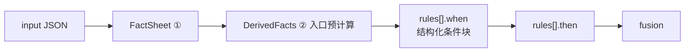
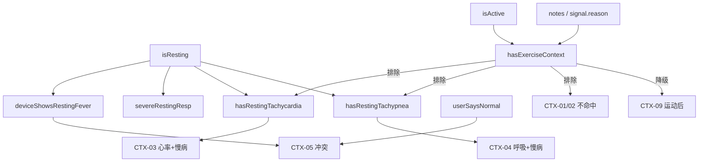

# DerivedFacts 字段说明详表

**DerivedFacts** 是在 **步骤 ① 解析完成、步骤 ② 规则引擎入口** 时，对 `FactSheet` **一次性预计算** 的布尔量/枚举量/聚合量。  
作用是把分散在 input 里的字段合成 **稳定、可复用的判断条件**，供 `triage-core.v1.json` 的 `rules[].when` 通过 `{ "fact": "符号名" }` 引用，并统一 **case #4 vs #12** 等边界。

**位置**：**② 代码内**预计算；**不写入** `triage-core.v1.json`，**不写入**最终 `output_schema`，不暴露给 App。  
**原则**：只基于 **当次 input 可核对事实** 计算，不读历史、不编造。  
**决策表关系**：见 [triage-core-spec.md](./triage-core-spec.md) §5.5。

---

## 一、在管道中的位置

- **计算时机**：② 开始前算一次，全程只读。  
- **消费方**：`evalWhen(rules[].when)`、**CTX-01/02 绝对兜底分支**、**confidence** 区块 H（多源一致性）。  
- **与 `then` 关系**：DerivedFacts 决定规则是否命中；命中后才产生瘦 `then`。

---

## 二、DerivedFacts 总表

| 符号 | 类型 | 简要定义 | 核心作用 | 主要服务的规则 |
|------|------|----------|----------|----------------|
| `isResting` | bool | 当前处于安静/非运动情境 | 区分「安静态异常」vs「运动后偏高」 | CTX-01/02/03/04、EMG-04 |
| `isActive` | bool | 当前处于活动/运动情境 | 识别活动态生理升高 | CTX-09、与 isResting 互斥判断 |
| `hasExerciseContext` | bool | 存在运动/玩耍上下文（宽） | **运动后降级** 的关键开关；**CTX-01/02 前置排除** | CTX-09a/b、case #2/#5 |
| `vitalsCoreMissing` | bool | 核心体征三项全缺 | 配合 dataQuality 做缺失门禁 | DQ-01 |
| `maxSignalRisk` | enum | 上游 signals 最高风险 | 融合候选、EMG 触发 | EMG-02、FUS-00 |
| `upstreamRisk` | enum | healthEvidence.riskLevel | 上游总风险、融合与仲裁 | EMG-02、FUS-00、CTX-15 |
| `userSaysNormal` | bool | 用户主观描述「一切正常」 | 用户/设备冲突检测 | CTX-05 |
| `deviceShowsRestingFever` | bool | 安静态下设备测得发热 | 冲突 case 的设备侧条件 | CTX-05 |
| `hasChronicHeart` | bool | 有心脏相关既往史 | 安静心率/呼吸加权 | CTX-03、CTX-04（含用药合规 emit） |
| `isSenior` | bool | 老年宠物 | 精神食欲下降加权 | CTX-07 |
| `isPuppyKitten` | bool | 幼宠 | 发热更谨慎 | CTX-08 |
| `isBrachycephalic` | bool | 短鼻/扁脸品种背景 | 呼吸紧急阈值放宽 | EMG-04、case #12 |
| `openMouthBreathingReported` | bool | 用户报张口呼吸 | 呼吸紧急强化 | EMG-04 |
| `severeRestingResp` | bool | 安静态呼吸率极高 | 与 warning 级呼吸区分 emergency | EMG-04；**排除** case #4 |
| `hasRestingTachycardia` | bool | 安静非运动情境下 **心率** 异常 | CTX-03 与 CTX-04 **分流**（心率 vs 呼吸） | CTX-03；**排除** case #20 |
| `hasRestingTachypnea` | bool | 安静非运动情境下 **呼吸** 异常 | 慢病 + 安静呼吸偏快 | CTX-04 |

---

## 三、各字段详细说明

### 3.1 `isResting`

| 项 | 说明 |
|----|------|
| **定义** | `vitals.activityLevel ∈ {resting, unknown}` **且** `context.recentExercise ∈ {none, unknown}` |
| **含义** | 从设备活动态与情境看，宠物 **当前不在运动后窗口内**，更接近「安静休息」状态。 |
| **作用** | 区分两类生理升高：**安静态异常**（更警惕，倾向 warning）vs **运动后暂时偏高**（倾向 watch）。 |
| **为何包含 unknown** | 设备未给出活动态时，若无运动上下文，保守按安静处理，避免漏掉安静高热/高呼吸 case。 |
| **典型 case** | `high_fever_resting`（true）vs `mild_fever_after_exercise`（false，因有 intense exercise） |
| **易错点** | 不能只看 `activityLevel=resting` 而忽略 `recentExercise=intense`；后者应使 isResting=false。 |
| **关联规则** | CTX-01 安静高热（含原 POP-01 兜底）、CTX-02 安静呼吸（含原 POP-02 兜底）、CTX-03/04 慢病+安静体征 |

---

### 3.2 `isActive`

| 项 | 说明 |
|----|------|
| **定义** | `vitals.activityLevel ∈ {active, intense}` **或** `context.recentExercise ∈ {moderate, intense}` |
| **含义** | 宠物 **刚处于或正处于较高活动水平**。 |
| **作用** | 作为「运动可解释」的必要条件之一；与 `hasExerciseContext` 配合，但范围更窄（结构化字段）。 |
| **与 hasExerciseContext 区别** | `isActive` 只看枚举字段；`hasExerciseContext` 还看 notes、signal.reason 文本。 |
| **典型 case** | `heart_rate_high_after_play`（true）、`mild_fever_after_exercise`（true） |
| **易错点** | `activityLevel=light` 且 `recentExercise=light` 时 isActive 可能为 false，但仍可能有 watch 信号，需看具体规则。 |
| **关联规则** | CTX-09a/b 运动后 watch |

---

### 3.3 `hasExerciseContext`

| 项 | 说明 |
|----|------|
| **定义** | `isActive = true` **或** `context.notes` 含「刚运动/刚玩耍」等 **或** 任一 `signal.reason` 含「运动/玩耍/跑」等关键词 |
| **含义** | **宽口径** 运动情境：不仅看枚举，还看上游解释与用户备注。 |
| **作用** | ① 启用运动后降级（watch 而非 warning）；② **CTX-01/02 when 中 `NOT hasExerciseContext`**，防止安静高热/高呼吸规则误命中运动后 case；③ 防止 CTX-01 误命中 case #2。 |
| **为何需要** | case 里常见 notes=`["刚运动"]`、signal.reason=`"刚运动后体温升高"`，单靠 isActive 可能不够。 |
| **典型 case** | #2 `mild_fever_after_exercise`、#5 `heart_rate_high_after_play` → **必须为 true** |
| **易错点** | 安静高热 case #3 必须为 **false**；若 true 会错误降级 risk。 |
| **关联规则** | CTX-09a/b；CTX-01/02 的 `NOT hasExerciseContext` 前置条件 |

---

### 3.4 `vitalsCoreMissing`

| 项 | 说明 |
|----|------|
| **定义** | `temperatureC`、`heartRateBpm`、`respiratoryRateBpm` **均为 null** |
| **含义** | 三大核心生命体征 **全部不可用**（不是单项缺失）。 |
| **作用** | 与 `device.dataQuality=missing` 一起支撑 **数据缺失门禁**；支撑「不能判断健康」叙事。 |
| **为何是三项** | 与 case `missing_vitals` 对齐；单项 null（如 seizure case 体温 null）**不**应单独触发此事实。 |
| **典型 case** | `missing_vitals` → true；`emergency_seizure` → false（仍有 HR、RR） |
| **易错点** | 有任一体征值则 vitalsCoreMissing=false，但仍可能 dataQuality=partial/missing 走 DQ 其他逻辑。 |
| **关联规则** | DQ-01 |

---

### 3.5 `maxSignalRisk`

| 项 | 说明 |
|----|------|
| **定义** | 对 `healthEvidence.signals[].riskLevel` 取 **等级最大值**（emergency > warning > watch > normal） |
| **含义** | 上游 **单信号维度** 最严重的风险档。 |
| **作用** | ① FUS 融合候选之一（防止漏掉上游严重 signal）；② EMG-02 当 signal 已为 emergency 时触发紧急。 |
| **无 signals 时** | 视为「无贡献」或等价于 normal，不参与抬高（由具体实现约定，建议为空集时不抬高） |
| **典型 case** | #12 signal respiratory=emergency → emergency；#4 signal=warning → warning |
| **易错点** | 不能替代 CTX 情境判断；只是融合 **下限保底** 的一个来源。 |
| **关联规则** | EMG-02、FUS-00 |

---

### 3.6 `upstreamRisk`

| 项 | 说明 |
|----|------|
| **定义** | `healthEvidence.riskLevel` 原值 |
| **含义** | App/设备侧已经聚合好的 **总风险标签**。 |
| **作用** | ① 融合候选；② emergency 快速通道（upstream=emergency）；③ unknown 时配合 DQ 禁止 normal。 |
| **unknown 特殊处理** | **不参与** max 抬高为 normal 的依据；在 missing/stale case 中常与 DQ 联用 → watch + low confidence。 |
| **典型 case** | #10 upstream=unknown + missing；#12 upstream=emergency |
| **易错点** | 分层信任：upstream 是候选之一，不是终审；用户 emergency 字段或 EMG 仍可抬高。 |
| **关联规则** | EMG-02、FUS-00、CTX-15（normal 需 upstream=normal） |

---

### 3.7 `userSaysNormal`

| 项 | 说明 |
|----|------|
| **定义** | `userReport.text` 含「没事/正常/和平时一样/挺正常」等 **且** `symptoms` 为空 **且** `energy=normal`（可扩展 appetite/drinking normal） |
| **含义** | 用户 **主观认为宠物状态正常**，与客观监测可能不一致。 |
| **作用** | 检测 **用户—设备冲突** 的前半部分；驱动 CTX-05，要求文案解释「感受与监测不一致」。 |
| **典型 case** | `conflict_user_normal_sensor_fever` → true |
| **易错点** | 仅 text 说正常但 energy=lower 时不应算 true；避免漏掉精神差信号。 |
| **关联规则** | CTX-05（含原 AUX-01 语义，基于 DerivedFacts 而非 notes 字符串） |

---

### 3.8 `deviceShowsRestingFever`

| 项 | 说明 |
|----|------|
| **定义** | `isResting=true` **且** 体温 ≥ 阈值（犬 ≥39.5°C，猫 ≥39.8°C，可配置） |
| **含义** | 在 **安静情境** 下，设备仍测得 **明显偏高体温**。 |
| **作用** | 冲突 case 的 **设备侧** 条件；与 `userSaysNormal` 组合 → CTX-05。 |
| **与 CTX-01 区别** | CTX-01 更严（如猫 40.0+精神差）；本事实用于 **冲突检测**，阈值可略低以覆盖 39.9°C case。 |
| **典型 case** | `conflict_user_normal_sensor_fever`（39.9°C，resting）→ true |
| **易错点** | 运动后 isResting=false 时不应触发，避免运动后误报冲突。 |
| **关联规则** | CTX-05 |

---

### 3.9 `hasChronicHeart`

| 项 | 说明 |
|----|------|
| **定义** | `pet.chronicConditions` 含 `heart_murmur_history`、`heart_disease`、`brachycephalic`（若配置为心血管相关）等 |
| **含义** | 宠物有 **心脏/心血管相关既往史或体质标签**。 |
| **作用** | 安静态心率/呼吸异常时 **加权升级**；文案需提及既往史、联系兽医、用药禁忌。 |
| **典型 case** | #6 `heart_murmur_history`；#20 `heart_disease` + 用药 |
| **易错点** | 运动后心率 case #5 **不应**因本事实升 warning（需 hasExerciseContext 优先）。 |
| **关联规则** | CTX-03、CTX-04（用药条件 emit 禁止自行调药） |

---

### 3.10 `isSenior`

| 项 | 说明 |
|----|------|
| **定义** | `context.ageRisk=senior` **或** `ageMonths` ≥ 阈值（猫≥84月、犬≥96月，可配置） |
| **含义** | **老年宠物**，同样症状容忍度更低。 |
| **作用** | 精神食欲下降、恢复慢等规则加权；文案出现「老年」提示。 |
| **典型 case** | #16 `senior_cat_low_energy`；#9 recovery_slow 含 senior notes |
| **易错点** | 与 isPuppyKitten 互斥使用；同一只宠物通常不同时为 true。 |
| **关联规则** | CTX-07；CTX-12 可辅助 |

---

### 3.11 `isPuppyKitten`

| 项 | 说明 |
|----|------|
| **定义** | `context.ageRisk=puppy_kitten` **或** `ageMonths ≤ 6`（可配置） |
| **含义** | **幼宠**，发热、精神差等更需要谨慎。 |
| **作用** | 幼犬发热 case 倾向 **warning** 而非 watch；forcedMentions 含「幼犬」。 |
| **典型 case** | #17 `puppy_fever_high_risk`（3 月龄） |
| **易错点** | 不要仅因幼宠就把所有 watch 升 warning；需结合发热+精神差等条件（CTX-08）。 |
| **关联规则** | CTX-08 |

---

### 3.12 `isBrachycephalic`

| 项 | 说明 |
|----|------|
| **定义** | `chronicConditions` 含 `brachycephalic` **或** breed 为 Pug 等配置列表 |
| **含义** | **短鼻/扁脸** 品种，呼吸负担更大。 |
| **作用** | 呼吸困难紧急规则 EMG-04 的加强条件（较低 RR 阈值也可紧急）。 |
| **典型 case** | #12 `emergency_breathing_difficulty`（Pug + brachycephalic） |
| **易错点** | 单独 short nose **不**等于 emergency；需结合 breathingDifficulty、RR、张口呼吸等。 |
| **关联规则** | EMG-04 |

---

### 3.13 `openMouthBreathingReported`

| 项 | 说明 |
|----|------|
| **定义** | `userReport.symptoms` 或 `userReport.text` 含「张口呼吸」 |
| **含义** | 用户观察到 **开放性呼吸困难** 表现。 |
| **作用** | EMG-04 紧急升级条件之一；比单纯 `breathingDifficulty=true` 更指向 emergency。 |
| **典型 case** | #12 含「张口呼吸」→ true；#4 无张口呼吸 → false |
| **易错点** | 这是 **case #4 vs #12 分流的关键** 之一：#4 可有 breathingDifficulty 但无张口呼吸。 |
| **关联规则** | EMG-04 |

---

### 3.14 `severeRestingResp`

| 项 | 说明 |
|----|------|
| **定义** | `isResting=true` **且** `respiratoryRateBpm ≥ 60`（与 emergency case 对齐，可配置） |
| **含义** | **安静状态下呼吸率极高**，接近紧急生理范围。 |
| **作用** | EMG-04 触发条件；与 CTX-02（warning，RR≥45 等）形成 **分级**。 |
| **典型 case** | #12 RR=68 → true；#4 RR=52 → **false** |
| **易错点** | **切勿**单独用 `breathingDifficulty=true` 代替本事实做 emergency，否则 #4 误判。 |
| **关联规则** | EMG-04；与 CTX-02 互斥层级 |

---

### 3.15 `hasRestingTachycardia`

| 项 | 说明 |
|----|------|
| **定义** | `isResting=true` **且** `hasExerciseContext=false` **且** 满足 **任一**：① 存在 `signals[].id=heart_rate` 且 `riskLevel≥warning`；② `heartRateBpm≥170`（可配置；犬/猫可分档） |
| **含义** | 安静非运动窗口内，**心率维度** 的客观异常（非呼吸）。 |
| **作用** | 驱动 **CTX-03**（`hasChronicHeart` 前提下）；与 CTX-04（呼吸维度）分流，避免 #20 被误标为 `HR_RESTING_CHRONIC`。 |
| **典型 case** | #6 HR=198 + heart_rate signal warning → **true**；#20 HR=148、无 heart_rate signal → **false**；#5 运动后 → **false**（`hasExerciseContext`） |
| **易错点** | 不能仅用 `hasChronicHeart` + 任意 HR 数值；须有心率 signal 或达阈值。 |
| **关联规则** | CTX-03 |

---

### 3.16 `hasRestingTachypnea`

| 项 | 说明 |
|----|------|
| **定义** | `isResting=true` **且** `hasExerciseContext=false` **且** 满足 **任一**：① 存在 `signals[].id=respiratory` 且 `riskLevel≥warning`；② `respiratoryRateBpm≥40` |
| **含义** | 安静非运动窗口内，**呼吸维度** 的客观异常。 |
| **作用** | 驱动 **CTX-04**（`hasChronicHeart` 前提下）；与 CTX-02（无慢病）区分。 |
| **典型 case** | #20 RR=48 + respiratory signal warning → **true**；#4 有呼吸异常但无慢病 → CTX-02 非本 fact 单独触发 CTX-04 |
| **易错点** | 与 `severeRestingResp`（EMG 阈值 RR≥60）分层不同；本 fact 服务 warning 级 CTX-04。 |
| **关联规则** | CTX-04 |

---

## 四、DerivedFacts 之间的逻辑关系

| 关系 | 说明 |
|------|------|
| `hasExerciseContext` ⇒ 通常 ¬`isResting` | 运动 case 不应同时走 CTX-01/02（when 含 `NOT hasExerciseContext`） |
| `userSaysNormal` ∧ `deviceShowsRestingFever` | 冲突检测核心组合 |
| `severeRestingResp` ⇒ `isResting` | 安静呼吸极高前提为安静 |
| `openMouthBreathingReported` | 可加强 EMG，但不要单独替代 maxSignalRisk/upstream |
| `hasRestingTachycardia` vs `hasRestingTachypnea` | 心率 vs 呼吸维度；#6 仅前者；#20 仅后者 |
| `hasRestingTachycardia` ⇒ `¬hasExerciseContext` | 运动后心率升高不走 CTX-03 |

---

## 五、按 case 速查（验证）

| caseId | 应关注的 DerivedFacts |
|--------|----------------------|
| normal_dog_daily_check | isResting 可 true；hasExerciseContext=false |
| mild_fever_after_exercise | hasExerciseContext=**true**；isResting=false |
| high_fever_resting | isResting=**true**；hasExerciseContext=false |
| respiratory_rate_high_resting | isResting=true；severeRestingResp=**false**；openMouth=**false** |
| heart_rate_high_after_play | hasExerciseContext=true |
| heart_rate_high_resting_warning | hasRestingTachycardia=**true**；hasChronicHeart=true |
| hrv_stress_watch | isResting=true；hasExerciseContext=false |
| missing_vitals | vitalsCoreMissing=**true** |
| conflict_user_normal_sensor_fever | userSaysNormal=true；deviceShowsRestingFever=true |
| emergency_breathing_difficulty | severeRestingResp=true；openMouth=true；isBrachycephalic=true |
| emergency_seizure | vitalsCoreMissing=**false** |
| stale_device_data | vitalsCoreMissing=false（有旧 vitals） |
| puppy_fever_high_risk | isPuppyKitten=**true**；isResting=true |
| chronic_heart_resp_warning | hasChronicHeart=true；hasRestingTachypnea=**true**；hasRestingTachycardia=**false** |

---

## 七、记忆

- **安静 vs 运动**：`isResting` / `isActive` / `hasExerciseContext`  
- **数据是否够用**：`vitalsCoreMissing` + `upstreamRisk`  
- **上游有多严重**：`maxSignalRisk` / `upstreamRisk`  
- **人说正常但设备不对**：`userSaysNormal` + `deviceShowsRestingFever`  
- **特殊体质**：`hasChronicHeart` / `isSenior` / `isPuppyKitten` / `isBrachycephalic`  
- **呼吸紧急分流**：`openMouthBreathingReported` + `severeRestingResp`（**不是**单独的 breathingDifficulty）  
- **慢病安静体征分流**：`hasRestingTachycardia`（CTX-03）vs `hasRestingTachypnea`（CTX-04）