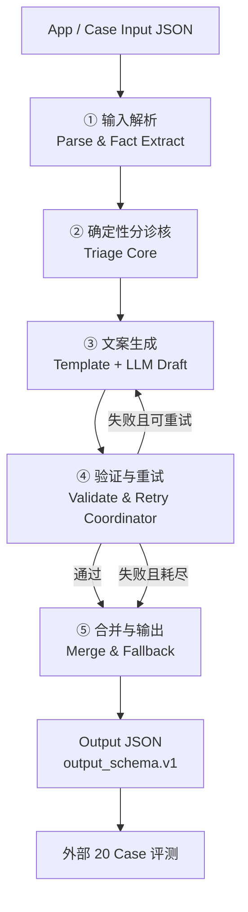
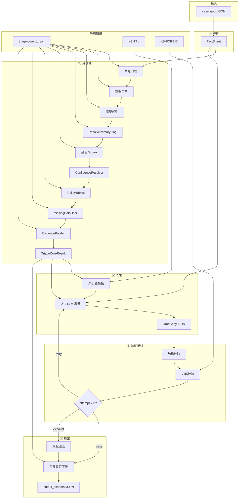

# 小爪 AI 健康分诊 Agent — Coze 快速验证版详细设计方案

本文档综合前述讨论，给出一份 **可在 Coze 内快速实现、覆盖 20 case 功能与鲁棒性验证** 的完整设计方案。它是完整七层架构的 **有意简化子集**，不是替代版；目标是 **先验证医学与安全逻辑正确，再回迁自研实现**。

---

## 一、设计目标与边界

### 1.1 目标

| 目标 | 说明 |
|------|------|
| 功能验证 | 20 个 `health_triage_cases.v1` 全部产出合法 `output_schema` |
| 鲁棒性 | emergency 必升级、缺数据不编造、禁止确诊、风险就高 |
| 快速落地 | Coze 工作流 + 少量查表/代码节点，1～4 天可跑通 |
| 可回迁 | 规则表、模板表、校验逻辑可映射回 L2–L6 + 横切 Registry |

### 1.2 范围

**包含**：

- `/health` 单次分诊主路径  
- 输入 → 确定性分诊 → 模板化文案 → 校验 → 有限重试 → 结构化输出  
- 外部批跑 20 case 评测  

**不包含**（验证阶段刻意砍掉）：

- 鉴权、限流、Session、`/intelligent` 多轮  
- ConfigRelease、审计持久化、Metrics、全局 infra  
- 向量 RAG、决策型时序记忆  
- L3 语义 Tier2/embedding、精细 Signal Trust 打分  

### 1.3 核心设计信条

1. **risk 由确定性逻辑裁决，LLM 只写文案**  
2. **输入即上下文，不编造未提供的事实**  
3. **模板选句式，LLM 填槽润色，Tool 守合规**  
4. **重试是补救，模板兜底是底线**  
5. **知识库 = 文案与合规配置，不是兽医文档 RAG**

---

## 二、总体架构

### 2.1 管道总览（5 大步骤）



### 2.2 与原七层映射

| Coze 步骤 | 合并的原层级 | 核心职责 |
|-----------|-------------|----------|
| ① 输入解析 | L1 精简 + L3 Fact 提取 | 契约校验、事实表 |
| ② 确定性分诊核 | L3 标注 + L4 规则/融合/仲裁 + PolicyTables | **finalRisk、confidence、primaryFlag、文案约束包** |
| ③ 文案生成 | L4 LLM 限权 + 横切 Template | 用户可读字段 |
| ④ 验证与重试 | L5 + L6 校验 + L2 Retry | 结构/内容合规、有限重试 |
| ⑤ 合并与输出 | L6 Compose + Fallback | 完整 output_schema |

### 2.3 数据流中的关键对象

整个管道通过三个中间对象串联，避免「全靠 Prompt 记状态」：

**A. `FactSheet`（① 产出）**  
从 input 提取的客观事实，供 ②③④ 引用。

**B. `TriageCoreResult`（② 产出，全程锁定）**  
医学结论与文案约束，③ 不得修改其中裁决字段。

**C. `DraftCopyJSON`（③ 产出，可重试）**  
仅含文案字段的 JSON，经 ④ 校验后与 B 合并。

---

## 三、步骤 ① 输入解析

### 3.1 职责

- 校验最小契约：`scene=health_triage`、必填顶层字段存在  
- 归一化枚举（riskLevel、dataQuality 等大小写/别名）  
- 构建 `FactSheet`，**不做医学判断、不补全缺失值**

### 3.2 FactSheet 结构（逻辑字段）

| 分组 | 字段 |
|------|------|
| 标识 | caseId, petId, pet.name, species, ageMonths, breed |
| 档案 | chronicConditions, medications, allergies, neutered |
| 设备 | deviceOnline, dataQuality, lastSeenAt, warningText |
| 体征 | temperatureC, heartRateBpm, respiratoryRateBpm, hrvMs, activityLevel, sleepQuality, vitals.updatedAt |
| 上游 | healthEvidence.riskLevel, healthEvidence.signals[] |
| 用户 | userReport.text, 结构化症状字段, symptoms[] |
| 情境 | recentExercise, recentVaccination, ageRisk, environmentTempC, context.notes[] |
| 缺失 | missingData[] |

### 3.3 实现建议（Coze）

- 优先 **代码节点** 解析 JSON  
- 无代码时用 LLM **仅做提取**，输出固定 JSON schema，并限制「不得推断、不得填 null 字段」

### 3.4 不做

- 鉴权、Session 合并  
- 语义归一化 Tier2  
- 修改 input 原始医学含义  

---

## 四、步骤 ② 确定性分诊核（心脏）

这是整个方案 **最重要** 的一步。所有 20 case 的 `riskLevel` 与 `confidence` 应主要在此确定，**不交给 LLM**。

### 4.1 输出：TriageCoreResult

| 字段 | 说明 | 主要来源 |
|------|------|----------|
| `finalRiskLevel` | normal / watch / warning / emergency | fusion（`rules[].then` + upstream） |
| `confidence` | low / medium / high | **ConfidenceResolver**（L / **H′** / H / M） |
| `primaryFlag` | 模板与 PolicyTables 主键 | `rules[].then` + `postProcess.primaryFlagPriority`（**无** flag 别名表；CTX-09a/b 均 `POST_EXERCISE`） |
| `forcedMentions[]` | 文案必提主题 | **PolicyTables** + 规则追加（CTX-04 用药等） |
| `forbiddenThemes[]` | 文案禁止主题 | **PolicyTables**（`ForbiddenByFlag`） |
| `evidenceBullets[]` | 2～5 条可核对事实句 | **EvidenceBuilder**（`EvidenceByFlag`） |
| `missingDataUser[]` | 用户可读缺失说明 | `postProcess`（**先于** EvidenceBuilder） |
| `primaryActionHint` | 主行动意图枚举 | **PolicyTables**（`ActionByFlagRisk`） |
| `safetyNoticeRequired` | bool | **PolicyTables**（`SafetyByFlag`） |
| `arbitrationNote` | 与 healthEvidence 不一致时记录 | FUS |
| `ruleHits[]` | 命中规则 id（含 EMG-*，供 **H′** 判定） | 规则评估 |

> **规则 `then` 最小集**（仅写在 `triage-core.v1.json` `rules[]`）：`risk`、`riskFloor`（DQ-01/02）、`primaryFlag`、可选 `mentionsAdd`。详见 [kb-rule-emit-spec.md](./kb-rule-emit-spec.md)、[triage-core-spec.md](./triage-core-spec.md)。  
> `flags[]` 不再由规则产出；调试时可由 `primaryFlag` 派生。  
> **CTX-09a/09b**：`then.primaryFlag` 均为 `POST_EXERCISE`；区分仅 `ruleHits`（见 [case-rule-mapping.md](./case-rule-mapping.md) §4.3）。

### 4.2 判定顺序（严格串行）

```
层1 EMG → 层2 DQ → 层3 CTX
  → ResolvePrimaryFlag（postProcess.primaryFlagPriority，见 triage-core-spec §七步骤 4）
  → 层4 FUS
  → ConfidenceResolver（L / H′ / H / M）
  → PolicyTablesResolve
  → missingDataUser 后处理
  → EvidenceBuilder
  → TriageCoreResult
```

**原则**：前面层可设定 **风险下限（floor）**，后面层 **不得降低** floor。

> **无独立 AUX/CONF 层**；`rules[].then` 最小集 + 决策表 **`policyTables`** 查表（见 [kb-rule-emit-spec.md](./kb-rule-emit-spec.md)）。  
> **H′**：partial（DQ-03 `then: null`）+ EMG + `seizure=true` 时仍 `confidence=high`（case #13）。

### 4.3 层 1：紧急门禁（一票 emergency）

任一命中 → `finalRiskLevel = emergency`；`safetyNoticeRequired` 由 **PolicyTables**（`SafetyByFlag`）提供。规则定义以 [case-rule-mapping.md](./case-rule-mapping.md) §4.1 为准：

| 规则 ID | 条件（摘要） | 对应 case |
|---------|-------------|-----------|
| EMG-01 | `userReport.seizure = true` | emergency_seizure |
| EMG-02 | `maxSignalRisk=emergency` 或 `upstreamRisk=emergency` | emergency_breathing_difficulty |
| EMG-03 | `userReport.trauma = true`（扩展） | — |
| EMG-04 | `breathingDifficulty=true` 且（`severeRestingResp` / 张口呼吸 / 短鼻+RR≥55） | emergency_breathing_difficulty |

> **case #4 vs #12**：`breathingDifficulty=true`  alone 不触发 EMG-04；#12 优先 EMG-02 或 EMG-04。

命中后仍继续提取 `evidenceBullets`，但 **risk 不得低于 emergency**。

### 4.4 层 2：数据质量门禁

| 规则 ID | 条件 | 风险策略 | 对应 case |
|---------|------|----------|-----------|
| DQ-01 | dataQuality = missing 或 vitals 核心项全 null | floor ≥ watch，**禁止 normal** | missing_vitals |
| DQ-02 | dataQuality = stale | floor ≥ watch，**禁止「当前正常」叙事** | stale_device_data |
| DQ-03 | dataQuality = partial | **零 emit**；不单独抬 risk；confidence 通常 M（#13 走 H′） | 多个 |

- **DQ-01/02** `then`：`riskFloor` + `risk` + `primaryFlag`（`DATA_MISSING` / `DATA_STALE`）；文案约束由 **`policyTables`** 提供。  
- **DQ-03** **`then: null`**；`dataQuality=partial` 由 `confidence` 区块读取，通常 **M**；不单独抬 risk。case #13 例外走 **H′**。  
- **`missingDataUser`**：凡 `input.missingData` 非空均在 **PolicyTablesResolve 之后、EvidenceBuilder 之前**翻译填充（见 [triage-core-spec.md](./triage-core-spec.md) §七）。

### 4.5 层 3：情境规则（watch / warning 主战场）

按 **优先级从高到低** 匹配，命中则给出候选 risk（仍受层 1/2 floor 约束）：

| 规则 ID | 模式 | 候选 risk | primaryFlag | 对应 case |
|---------|------|-----------|-------------|-----------|
| CTX-01 | 安静态高热（临床分支 **或** temp≥40.0 兜底，含原 POP-01）；`NOT hasExerciseContext` | warning | FEVER_RESTING | high_fever_resting |
| CTX-02 | 安静态呼吸偏高（RR≥45+症状 **或** RR≥50 兜底，含原 POP-02）；`NOT hasExerciseContext` | warning | RESP_RESTING | respiratory_rate_high_resting |
| CTX-03 | `hasChronicHeart` ∧ `hasRestingTachycardia`（心率维度，见 mapping §4.3） | warning | HR_RESTING_CHRONIC | heart_rate_high_resting_warning |
| CTX-04 | `hasChronicHeart` ∧ `hasRestingTachypnea`（呼吸维度，见 mapping §4.3）；用药时追加禁自行调药 | warning | CHRONIC_HEART_RESP | chronic_heart_resp_warning |
| CTX-05 | 用户描述正常但设备安静态发热（DerivedFacts，非 notes 匹配） | warning | USER_DEVICE_CONFLICT | conflict_user_normal_sensor_fever |
| CTX-06 | 反复呕吐 | warning | REPEATED_VOMITING | persistent_vomiting_warning |
| CTX-07 | 老年 + 精神食欲差 + 慢病史 | warning | SENIOR_DECLINE | senior_cat_low_energy |
| CTX-08 | 幼犬发热 + 精神差 | warning | PUPPY_FEVER | puppy_fever_high_risk |
| CTX-09a | 运动后体温偏高（hasExerciseContext + temp≥39.0 + temperature signal watch） | watch | POST_EXERCISE | mild_fever_after_exercise |
| CTX-09b | 运动后心率偏高（hasExerciseContext + heart_rate signal watch） | watch | POST_EXERCISE | heart_rate_high_after_play |
| CTX-10 | HRV 偏低 + 环境压力 | watch | HRV_STRESS | hrv_stress_watch |
| CTX-11 | 跛行/疼痛 + 活动减少 | watch | LIMPING_PAIN | limping_pain_watch |
| CTX-12 | 恢复慢 + 睡眠差 | watch | SLOW_RECOVERY | recovery_slow_watch |
| CTX-13 | 轻度腹泻 + 精神尚可 | watch | MILD_DIARRHEA | mild_diarrhea_watch |
| CTX-14 | 疫苗后疲倦 | watch | POST_VACCINE | post_vaccine_tired_watch |
| CTX-15 | 多源一致正常 | normal | NORMAL_DAILY | normal_dog_daily_check |

**情境修正要点**（写在 CTX 规则条件里；绝对阈值作为 CTX-01/02 的 OR 兜底分支，**无独立 POP 层**）：

- `NOT hasExerciseContext` 写入 CTX-01/02 when → 运动后体温/心率走 **watch**（CTX-09a/09b），不得 warning  
- `recentExercise=intense` 或 context.notes 含「刚运动/刚玩耍」→ `hasExerciseContext=true`  
- `activityLevel=resting` + 异常 vital + 非运动情境 → 倾向 **warning**  
- `ageRisk=puppy_kitten` / `senior` → 加权（CTX-07/08），不单独确诊  

### 4.6 层 4：多源融合（Risk Arbiter 简化版）

```
candidateRisks = [
  层1结果,
  层2 floor,
  层3规则结果,              // CTX-01/02 已含原 POP 绝对兜底 OR 分支
  healthEvidence.riskLevel,
  max(signals[].riskLevel),
  由 userReport 布尔字段触发的升级（如 seizure → emergency）
]

finalRiskLevel = max(candidateRisks)   // emergency > warning > watch > normal
```

**特殊规则**：

- `primaryFlag=USER_DEVICE_CONFLICT`（CTX-05）时，**不信用户「没事」**，采信设备当前值，倾向 warning；Resolver **H** 排除 → **M**  
- `healthEvidence.riskLevel=unknown` 且 DQ-01/02 命中 → 不得输出 normal  
- 若 finalRisk 低于 healthEvidence 中最高 signal risk → 写 `arbitrationNote`  

### 4.7a ConfidenceResolver（决策表 `confidence` 区块，非 `rules[]`）

FUS 产出 `finalRiskLevel` 后，按 **固定顺序** 计算 `confidence`（详见 [case-rule-mapping.md](./case-rule-mapping.md) §4.5）：

| 代号 | 条件（摘要） | 值 |
|------|-------------|-----|
| **L** | missing / vitalsCoreMissing / stale | low |
| **H′** | emergency 且 `ruleHits` 含 EMG-* 且 `seizure=true` | high（**补 partial 缺口**，case #13） |
| **H** | good 且 `primaryFlag !== USER_DEVICE_CONFLICT`，且 normal 空缺失或 warning/emergency 多源一致 | high |
| **M** | 其余 | medium |

**原则**：无 CONF ruleId；③ 不得修改锁定后的 `confidence`。

### 4.7b PolicyTablesResolve（决策表 `policyTables` 区块）

在 ConfidenceResolver **之后**执行。按 `primaryFlag`（及 `finalRiskLevel`）查四表，填充 `forcedMentions`（默认）、`forbiddenThemes`、`safetyNoticeRequired`、`primaryActionHint`；再合并规则层 **追加** 的 `forcedMentions`（CTX-04 用药等）。

完整表定义见 [kb-rule-emit-spec.md](./kb-rule-emit-spec.md) §4.1～4.4。  
`ForcedMentionsByFlag` 覆盖 POST_EXERCISE、FEVER_RESTING、DATA_MISSING、EMERGENCY_* 等全部 primaryFlag。

### 4.7c EvidenceBuilder（② 后处理）

在 **`missingDataUser` 翻译完成之后**执行。按 `EvidenceByFlag[primaryFlag]` 从 FactSheet 组装 `evidenceBullets[]`；`missingDataUser` 非空时可并入 bullets（与 §4.2.1 一致）。  
**禁止**：输入没有的数值、无依据的趋势/基线百分比。示例句式见决策表 `evidenceByFlag`（语义 [kb-rule-emit-spec.md](./kb-rule-emit-spec.md) §四）。  

### 4.9 实现建议（Coze）

**强烈推荐单个代码节点** 加载 [triage-core-spec.md](./triage-core-spec.md) 定义的 **`triage-core.v1.json`**，完成 DerivedFacts 预计算 → `rules[]` 评估 → `fusion` / `confidence` / `policyTables` / `evidenceByFlag` / `postProcess`。**不要用 LLM 做 ②**。

| 做法 | 说明 |
|------|------|
| **推荐** | 读 **单文件决策表** + 通用 `evalWhen()` 遍历结构化 `when` |
| **不推荐** | 30+ Coze 条件分支与 JSON 双写；字符串谓词 DSL 解析器 |
| **废弃** | 独立 `kb-rule.v1.json` + 分散 PolicyTables 制品 |

规则 `id` 与 20 case 映射见 [case-rule-mapping.md](./case-rule-mapping.md)；决策表 schema 见 [triage-core-spec.md](./triage-core-spec.md)。V1 阶段 **可不提交** JSON 文件，以 spec + mapping 为设计真源。

---

## 五、步骤 ③ 文案生成（三子步）

### 5.1 职责边界

| 做 | 不做 |
|----|------|
| 查模板得文案骨架 | 修改 finalRiskLevel / confidence |
| LLM 填槽、润色、语气自然化 | 新增 evidence 事实 |
| 输出 DraftCopyJSON | 确诊、保证性结论 |
| 服从 forcedMentions / forbiddenThemes | 忽略 emergency 强度 |

### 5.2 子步 ③-1：模板解析（确定性，不用 AI）

**输入**：`TriageCoreResult`（含 `finalRiskLevel`、`primaryFlag`、`forcedMentions`、`forbiddenThemes`、`safetyNoticeRequired`、`primaryActionHint`、`evidenceBullets`）

**查表**：`templates[finalRiskLevel + "." + primaryFlag]` → 解析为 `CopyTemplateResolved`（见 [kb-tpl-template-spec.md](./kb-tpl-template-spec.md) §十三）

**CopyTemplateResolved 含**：

| 字段 | 来源 |
|------|------|
| `titlePattern`、`summaryOutline`、`recommendationTemplate`、`whenToSeeVetTemplate` | KB-TPL `copy` |
| `llmInstructions`、`toneProfileId`、`evidenceStyle` | KB-TPL `guidance` / `meta` |
| `filledSlots` | `slots.v1` + FactSheet |
| `requiredMentions`、`forbidden` | **②** `forcedMentions` / `forbiddenThemes` + KB-FORBID（**不**读模板 mentionHints） |
| `safetyNoticeSnippet` | `safety-notices` + `safetyNoticeRequired` |
| `primaryAction` 映射 | **KB-ACTION** + `primaryActionHint` |

`primaryFlag` 在 ② 已按 [case-rule-mapping.md](./case-rule-mapping.md) §6.3 优先级选定。

### 5.3 子步 ③-2：LLM 填槽润色（唯一 AI 生成点）

**输入**（窄上下文，非全量 raw input）：

```
CopyTemplate（骨架）
TriageCoreResult：forcedMentions, forbiddenThemes, evidenceBullets, primaryActionHint
FactSheet：pet.name, species（仅润色用）
```

**输出**：`DraftCopyJSON`（仅文案字段）：

```
title
summary
evidence[]        // 以 evidenceBullets 为主，可轻度合并润色，不可增事实
recommendation
whenToSeeVet
safetyNotice
primaryAction: { label, route? }
secondaryAction?: { label, route? }
```

**LLM System 约束（要点）**：

- 不得输出 riskLevel、confidence  
- 不得使用 forbiddenThemes 相关表述  
- emergency 必须体现紧迫就医导向  
- DATA_MISSING / DATA_STALE 不得写「目前健康正常」  
- evidence 只能改写 bullets，不能新加数字  

### 5.4 子步 ③-3：与验证的关系

③ 本身不验证；生成后立即进入 **步骤 ④**。  
若 Coze 支持，③-2 要求 **JSON mode / 结构化输出**。

---

## 六、步骤 ④ 验证与重试

### 6.1 两层验证 Tool

#### A. 结构校验（ValidateStructure）

| 检查项 | 失败码 |
|--------|--------|
| 合法 JSON | PARSE_ERROR |
| 必填文案字段非空 | FIELD_MISSING |
| evidence 为字符串数组 | TYPE_ERROR |
| primaryAction 含 label | ACTION_INVALID |

#### B. 内容校验（ValidateContent）

| 检查器 | 规则 | 严重度 |
|--------|------|--------|
| ForbiddenPatternMatcher | 确诊为、一定没事、不用看医生、保证、百分百… | HIGH |
| EmergencyToneGuard | finalRisk=emergency 但出现「继续观察即可」「先等等」 | HIGH |
| RiskTextConsistencyGuard | warning/emergency 但 summary 过度轻描淡写 | MED |
| EvidenceAuthenticityChecker | 文案数值/事实不在 FactSheet + bullets 内 | HIGH |
| ForcedMentionChecker | forcedMentions 关键词未出现（可选，评测友好） | MED |
| SafetyNoticeEnforcer | safetyNoticeRequired 但为空或过短 | MED |

**输出**：`ValidationResult { pass, violations[] }`  
每条 violation：`code, field, message, severity`

### 6.2 重试协调器（Retry Coordinator）

**参数**：

```
maxAttempts = 3        // 首次 + 最多 2 次重试
maxLLMRetries = 2
```

**决策表**：

| 失败类型 | 第 1 次 | 第 2 次 | 第 3 次 |
|----------|---------|---------|---------|
| PARSE_ERROR / FIELD_MISSING | 重试 ③-2，强调仅 JSON | 重试 ③-2 | → 步骤 ⑤ 模板兜底 |
| FORBIDDEN / EVIDENCE_HALLUCINATION | 重试 ③-2 + violations 列表 | → ⑤ 兜底 | — |
| EMERGENCY_TONE_WEAK | 重试 或 直接套 emergency 模板句 | ⑤ 兜底 | — |
| SAFETY_NOTICE_MISSING | 局部补 safetyNoticeSnippet | ⑤ 兜底 | — |
| FORCED_MENTION_MISSING | 重试 ③-2 | 可接受或重试一次 | ⑤ 兜底 |

**重试铁律**：

- **不得**修改 `TriageCoreResult` 中任何裁决字段  
- 重试 Prompt 必须附带 `violations[]` 与「仅重写违规字段」指令  
- **禁止**无限循环  

### 6.3 与步骤 ⑤ 的关系

- 验证通过 → ⑤ 合并输出  
- 重试耗尽 → ⑤ 用 **纯模板填槽**（不用 LLM）生成文案，保证必有合法 output  

---

## 七、步骤 ⑤ 合并与输出

### 7.1 合并规则

最终 `output_schema`：

| 字段 | 来源 |
|------|------|
| `riskLevel` | **② TriageCoreResult**（锁定） |
| `confidence` | **②**（锁定） |
| `scene` | 固定 `health_triage` |
| `missingData` | ② `missingDataUser[]` 或 input 翻译 |
| `title, summary, evidence, recommendation, whenToSeeVet, safetyNotice, primaryAction, secondaryAction` | ③ 校验通过稿 **或** ⑤ 模板兜底稿 |
| `primaryAction.route` | ActionRouteKB 查表（按 risk + primaryActionHint） |

### 7.2 模板兜底（Fallback）

当 ④ 重试耗尽，**不再调用 LLM**：

- 用 `CopyTemplate` 直接 slot fill（petName 等）  
- `evidence` = `evidenceBullets` 原文（不润色）  
- `safetyNotice` = 固定片段  
- 保证结构 100% 合法、医学语气保守  

**原则**：宁可文案朴素，不可 risk 错误或结构非法。

### 7.3 最终结构校验

合并后再做一次 **完整 output_schema** 结构校验（必填字段、枚举），作为出站前最后一道闸。

---

## 八、知识资产设计（仿原架构，非 RAG）

### 8.1 资产清单

| 资产 ID | 名称 | 用途 | 对应原架构 |
|---------|------|------|-----------|
| **TRIAGE-CORE** | **单文件决策表** `triage-core.v1.json` | ② 全部确定性逻辑：`rules[]`、`fusion`、`confidence`、`policyTables`、`evidenceByFlag`、`postProcess` | RuleKBRegistry + 策略表（回迁时可按 section 拆分） |
| KB-TPL | 文案模板（copy + guidance + slots） | ③-1、⑤ 兜底 | TemplateRegistry |
| KB-FORBID | 禁止词表 | ④ 校验 + ③ Prompt | ForbiddenPatternRegistry |
| KB-ACTION | 动作 label/route 映射 | ⑤ `primaryAction` | ActionRouteTableRegistry |
| KB-SYN | 同义词表 | ④ ForcedMentionChecker、评测 | SemanticSynonymMapRegistry |

> ~~独立 KB-RULE + KB-POLICY 多制品~~ 已合并为 **TRIAGE-CORE**；schema 见 [triage-core-spec.md](./triage-core-spec.md)。DerivedFacts **不在**决策表内，由 ② 代码预计算（[kb-rule-derived-facts-spec.md](./kb-rule-derived-facts-spec.md)）。

### 8.2 TemplateKB 结构（建议）

索引：`riskLevel × primaryFlag`（20 格，见 [kb-tpl-template-spec.md](./kb-tpl-template-spec.md) §3.4）。

每条模板 **仅含**：`titlePattern`、`summaryOutline`、`recommendationTemplate`、`whenToSeeVetTemplate`、`llmInstructions`、`toneProfileId`、`evidenceStyle`、`slots`。

**合规与行动不写在 KB-TPL**：`forcedMentions` / `forbiddenThemes` / `safetyNoticeRequired` / `primaryActionHint` 来自 ② `policyTables`；免责声明片段见 KB-TPL `safety-notices`；同义词见 **KB-SYN**。

**不建** Coze 向量知识库检索医学文档。

### 8.3 知识维护原则

- 改医学规则 → 改 `triage-core.v1.json` 的 `rules[]` 或 `fusion`；改文案约束 → 改同文件 `policyTables` 或 KB-TPL；**`bundleVersion` +1**  
- 禁止词 **单一来源**（Prompt 引用与 ValidateContent 共用 KB-FORBID；与决策表 `ForbiddenByFlag` 对齐）  
- 20 case 验收映射见 [case-rule-mapping.md](./case-rule-mapping.md)；**禁止** mapping 文档与决策表双写完整 `when`

### 8.4 Coze 落地方式

| 优先级 | 方式 |
|--------|------|
| 1 | 代码节点读 **`triage-core.v1.json`** 单文件 / 工作流变量 |
| 2 | Coze 表格/数据库插件（运营改 **policyTables** 或 KB-TPL） |
| 3 | Coze 向量 KB **仅放短模板片段且按 templateId 过滤** |
| 不推荐 | 开放式兽医 RAG |

---

## 九、20 Case 验证方案

### 9.1 评测流程

```
加载 cases/health_triage_cases.v1.json
  → 对每个 case.input 调用 Coze 工作流
  → 收集 output JSON
  → 运行评测器
  → 输出报告（pass/fail + 原因）
```

### 9.2 评测维度

| 维度 | 规则 | 硬门槛 |
|------|------|--------|
| 结构 | 符合 output_schema 必填字段 | 是 |
| riskLevel | 与 expected.riskLevel 一致 | **是** |
| confidence | 与 expected 一致，或 L/M/H（含 H′→high）三档一致 | 建议 |
| mustMention | 关键词命中（KB-SYN 同义词） | 建议 |
| mustNotMention | 不得出现 | 是 |
| forbiddenPatterns | 全局禁止词 | 是 |
| safetyNoticeRequired | 为 true 时 safetyNotice 非空 | 是 |

### 9.3 通过标准建议

- **硬门槛**：20/20 riskLevel 正确 + 0 禁止词 + 0 结构错误  
- **软门槛**：mustMention ≥ 18/20（文案可微调同义词表）  

### 9.4 失败排查顺序

1. risk 错 → 改 **`triage-core.v1.json` `rules[]` / `fusion`（②）**，不要先改 Prompt  
2. 禁止词 / emergency 语气 → 改 **KB-FORBID**、决策表 **`policyTables`** 或 **KB-TPL**  
3. mustMention 缺 → 改决策表 **`ForcedMentionsByFlag`** 或 **KB-SYN**；文案句式改 **KB-TPL** `copy`  
4. JSON 格式 → 改 ③ Prompt 或加强结构重试  

---

## 十、Coze 工作流节点清单

| 节点 | 类型 | 对应步骤 |
|------|------|----------|
| Start | 入参 input JSON | — |
| ParseInput | 代码 | ① |
| TriageCore | 代码（读 triage-core.v1.json） | ② |
| ResolveTemplate | 代码查表 | ③-1 |
| DraftGenerator | LLM JSON | ③-2 |
| ValidateStructure | 代码/插件 | ④-A |
| ValidateContent | 代码/插件 | ④-B |
| RetryCoordinator | 条件 + 变量 attempt | ④ |
| DraftRewriter | LLM（带 violations） | ④ 重试 |
| TemplateFallback | 代码查表填槽 | ⑤ |
| MergeOutput | 代码 | ⑤ |
| FinalSchemaCheck | 代码 | ⑤ |
| End | 输出 output JSON | — |

**不推荐**：无代码节点时用大量条件分支替代 ②；与单文件决策表方案冲突，维护成本极高。

---

## 十一、鲁棒性保证（简化版五条底线）

1. **医学裁决确定性**：② 规则算 risk，LLM 不可改  
2. **证据边界**：evidence 仅来自 bullets / FactSheet，④ 可机检  
3. **就高融合**：多源冲突取最高风险  
4. **情境先于区间**：运动/疫苗/年龄/慢病规则优先于单纯体温阈值  
5. **失败可交付**：重试耗尽 → 模板兜底，永远返回合法 JSON  

---

## 十二、与完整架构的差异及回迁路径

| Coze 简化版 | 回迁后展开为 |
|-------------|-------------|
| ParseInput | L1-01～03 + L3 FactSetExtractor |
| TriageCore（`triage-core.v1.json`） | L3 + L4 RuleEngine/Fusion/Arbiter + 横切 Template/Forbidden 策略表（按 section 拆分回迁） |
| TemplateKB | X-50 TemplateRegistry 等 |
| DraftGenerator | L4-07 StructuredTriageLLM |
| ValidateContent | L5-01～11 |
| RetryCoordinator | L2 RetryPlanner + L5 GuardRewritePlanner |
| MergeOutput + Fallback | L6-01～09 |
| 外部 Case 评测 | L7-01～14 |
| — | 再加 L1 AccessGate、L2 Session、L7 Audit、横切 Release |

**回迁时 `triage-core.v1.json` 的 `rules[]` / `policyTables` 与 KB-TPL 应几乎原样迁入 ConfigBundle**，而非散落在 Prompt 里。

---

## 十三、实施阶段建议

### 阶段 A（Day 1）：risk 全绿

- 实现 ① + ②  
- ⑤ 纯模板输出（无 LLM）  
- 批跑 20 case，**只验 riskLevel**  

### 阶段 B（Day 2～3）：文案 + 合规

- 加 KB-TPL、③-1、③-2  
- 加 ④ 两层验证 + 有限重试  
- 验 mustMention / mustNotMention / 禁止词  

### 阶段 C（Day 4）：打磨与文档

- 调同义词表、兜底模板  
- 固化 `rules[].id` ↔ caseId 映射（见 case-rule-mapping）  
- 记录 `triage-core.v1.json` 的 `meta.bundleVersion` 供日后回迁  

---

## 十四、设计总图（端到端）



---

## 十五、总结

**Coze 快速验证版 = 确定性分诊核（②）+ 模板驱动文案（③-1）+ 限权 LLM 填槽（③-2）+ 双层验证与有限重试（④）+ 裁决字段锁定合并（⑤）**；知识库只做 **规则表与文案模板表**，不做兽医 RAG；鲁棒性靠 **规则保底、证据边界、就高原则、模板兜底**，而不是靠 LLM 一次生成全文。