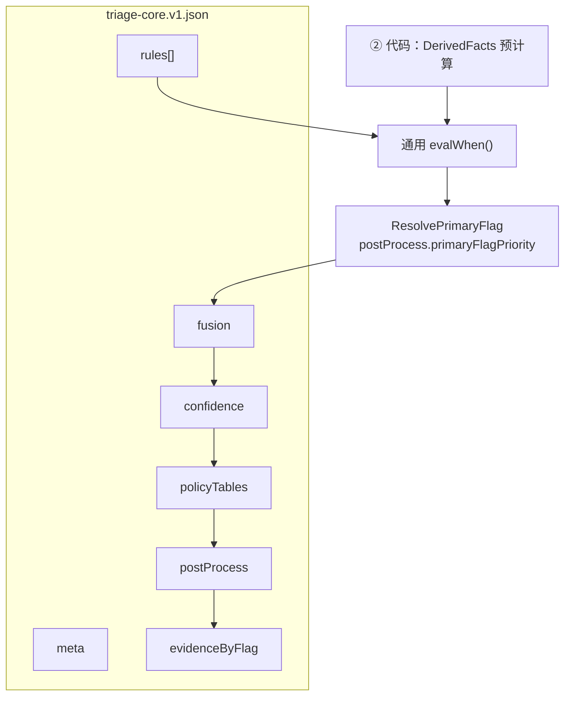

# Triage Core 单文件决策表 — 设计规范

**文档定位**：`docs/implementation/coze/triage-core-spec.md`  
**计划制品路径**（实现阶段）：`docs/implementation/coze/assets/triage-core.v1.json`  
**配套**：`pipeline-design.md`（② 管道）、`case-rule-mapping.md`（20 case 验收）、`kb-rule-derived-facts-spec.md`（DerivedFacts）、`kb-rule-emit-spec.md`（emit 最小集与 PolicyTables 字段语义）、`kb-tpl-template-spec.md`（③⑤ 文案模板；合规真源仍在决策表 `policyTables`）

**设计结论**：Coze 步骤 ② 的 **唯一执行制品** 为单文件决策表 `triage-core.v1.json`，取代原「谓词 DSL 字符串 + 独立 `kb-rule.v1.json` + 分散 PolicyTables 制品」方案。  
**V1 阶段**：本文档仅定义架构与逻辑 schema；**暂不提交**实际 JSON 文件。

---

## 一、为何改为单文件决策表

| 原方案问题 | 单文件决策表做法 |
|-----------|----------------|
| `case-rule-mapping.md` §四 与 `kb-rule.v1.json` **双写** when 条件 | **机器真源** 仅 `triage-core.v1.json`；mapping 文档只保留 §五验收总表（含 pitfall）与 §四规则摘要 |
| `when` 为字符串 DSL（`∧`、`NOT`），需解析器或手抄分支 | `when` 为 **结构化条件块**（`all` / `any` / `fact` / `field`），通用 evaluator 遍历 |
| PolicyTables 在 emit-spec 与规则 JSON **分离** | `policyTables`、`evidenceByFlag` **同文件不同 section** |
| FUS / ConfidenceResolver 伪装成 ruleId | 固定 **声明式区块**，不进入 `rules[]` |

**不变**：医学分层（EMG → DQ → CTX → FUS）、瘦 emit、ConfidenceResolver（L/H′/H/M）、PolicyTables 查表、DerivedFacts 在代码预计算——均与已完成的 AUX/CONF/POP/emit 简化一致。

---

## 二、文档与制品职责划分

| 文档 / 制品 | 职责 |
|------------|------|
| **`triage-core.v1.json`**（实现期） | **唯一执行制品**：rules、fusion、confidence、policyTables、evidenceByFlag、postProcess |
| **`triage-core-spec.md`**（本文） | 单文件逻辑 schema、`when` 结构化语法、② 加载与评估顺序 |
| **`case-rule-mapping.md`** | **验收规格**：§五增强总表（含 pitfall/neg）、§四规则主表、ruleId ↔ caseId 索引；**不重复**完整 when JSON |
| **`kb-rule-derived-facts-spec.md`** | DerivedFacts 定义与边界（**实现于代码**，不写入决策表） |
| **`kb-rule-emit-spec.md`** | emit 最小集语义、PolicyTables **字段含义**；表体以决策表 `policyTables` 为准 |
| ~~`kb-rule.v1.json`~~ | **废弃**；由 `triage-core.v1.json` 替代 |

---

## 三、`triage-core.v1.json` 顶层结构



### 3.1 Section 一览

| Section | 类型 | 职责 |
|---------|------|------|
| `meta` | object | `schemaVersion`、`bundleVersion`、兼容说明、锚定 20 case 数据集版本 |
| `rules` | array | 有序规则列表（EMG / DQ / CTX）；每条含 `id`、`layer`、`when`（结构化）、`then`（瘦 emit） |
| `fusion` | object | FUS-00 候选来源、`hardOverrides`、元约束（DQ 禁止 normal 等） |
| `confidence` | object | ConfidenceResolver 四行：L、H′、H、M（**非 ruleId**） |
| `policyTables` | object | `ForcedMentionsByFlag`、`ForbiddenByFlag`、`SafetyByFlag`、`ActionByFlagRisk` |
| `evidenceByFlag` | object | EvidenceBuilder 按 `primaryFlag` 取 FactSheet 路径 |
| `postProcess` | object | `missingDataUser` 翻译表、`primaryFlagPriority`（§七步骤 4、§7.1） |

### 3.2 `meta` 建议字段

| 字段 | 说明 |
|------|------|
| `schemaVersion` | 固定 `xiaozhua.coze.triage_core.v1` |
| `bundleVersion` | 语义化版本，与 case 回归 pin 一致（如 `1.0.0`） |
| `description` | 人类可读摘要 |
| `casesDataset` | 锚定 `xiaozhua.health_triage_cases.v1` |
| `derivedFactsImplementation` | 固定 `code`（不在 JSON 内定义计算逻辑） |

---

## 四、`rules[]` 规则记录

### 4.1 字段

| 字段 | 类型 | 必填 | 说明 |
|------|------|------|------|
| `id` | string | 是 | 全局唯一，如 `EMG-01`、`CTX-01`；写入 `ruleHits[]` |
| `layer` | enum | 是 | `EMG` / `DQ` / `CTX` |
| `priority` | number | CTX 必填 | CTX 层 **when 评估顺序**（越小越先）；**不**单独决定 primaryFlag；同层多命中时可用于 §6.3 tie-break |
| `name` | string | 建议 | 人类可读名称 |
| `when` | ConditionBlock | 是 | 结构化触发条件（见第五节） |
| `then` | EmitBlock \| null | 是 | 瘦 emit；`null` 表示零 emit（如 DQ-03） |
| `caseIds` | string[] | 建议 | 回归追溯；运行时可选忽略 |
| `notes` | string | 建议 | 易错点、`priorRef: POP-01` 等 |

**已取消字段**（相对原 kb-rule 草案）：`floorOnly`（由 `then.riskFloor` 表达）、字符串 `when` 谓词 DSL。

### 4.2 `then`（EmitBlock，瘦 emit 最小集）

与 [kb-rule-emit-spec.md](./kb-rule-emit-spec.md) §二一致：

| 字段 | 说明 |
|------|------|
| `risk` | 即 `candidateRisk`：`normal` / `watch` / `warning` / `emergency` |
| `riskFloor` | **仅 DQ-01/02** |
| `primaryFlag` | 主情境键 |
| `mentionsAdd` | 可选；追加 `forcedMentions`（如 CTX-04 用药） |

**DQ-03**：`then: null` 或省略 `then` 对象。

---

## 五、结构化 `when`（取代谓词 DSL）

### 5.1 设计原则

- **不用**字符串表达式（无 `∧`、`∨` 解析器）。  
- **只用** JSON 可遍历的嵌套对象；② 代码节点实现 **单一** `evalWhen(when, ctx)`。  
- `ctx` 含 `FactSheet`、预计算 `DerivedFacts`、常用聚合（`maxSignalRisk`、`upstreamRisk`）。

### 5.2 条件原子

| 类型 | JSON 形态 | 含义 | 示例 |
|------|-----------|------|------|
| **fact** | `{ "fact": "isResting" }` | DerivedFacts 布尔为 true | 安静态 |
| **not** | `{ "not": <ConditionBlock> }` | 取反 | 非运动情境 |
| **field** | `{ "field": "userReport.seizure", "eq": true }` | FactSheet 字段比较 | 抽搐 |
| **field** 比较 | `{ "field": "vitals.temperatureC", "gte": 40.0 }` | 数值 / 枚举比较 | 绝对高热兜底 |
| **field** 集合 | `{ "field": "pet.species", "in": ["cat", "dog"] }` | 枚举 in | 物种分支 |
| **signal** | `{ "signal": { "id": "respiratory", "riskGte": "warning" } }` | 上游 signal 聚合 | CTX-02 分支 A |
| **derived** | `{ "derived": "maxSignalRisk", "eq": "emergency" }` | 预计算聚合量 | EMG-02 |

**组合**：

| 组合 | JSON 形态 | 对应原 DSL |
|------|-----------|-----------|
| 全部满足 | `{ "all": [ ... ] }` | `AND` / `∧` |
| 任一满足 | `{ "any": [ ... ] }` | `OR` / `∨` |

### 5.3 示例：`EMG-04`（概念结构，非实现文件）

```json
{
  "id": "EMG-04",
  "layer": "EMG",
  "name": "呼吸困难紧急（用户报告 + 体征阈值）",
  "when": {
    "all": [
      { "field": "userReport.breathingDifficulty", "eq": true },
      {
        "any": [
          { "fact": "severeRestingResp" },
          { "fact": "openMouthBreathingReported" },
          {
            "all": [
              { "fact": "isBrachycephalic" },
              { "field": "vitals.respiratoryRateBpm", "gte": 55 }
            ]
          }
        ]
      }
    ]
  },
  "then": {
    "risk": "emergency",
    "primaryFlag": "EMERGENCY_RESPIRATORY"
  },
  "caseIds": ["emergency_breathing_difficulty"],
  "notes": "case #4 不命中：RR=52<60 且无张口呼吸"
}
```

### 5.4 示例：`CTX-01`（含原 POP-01 OR 兜底）

顶层 `all`：`isResting`、`NOT hasExerciseContext`、内层 `any`：

- **分支 A（临床）**：物种温度阈值 + energy/appetite 下降  
- **分支 B（兜底）**：`temperatureC >= 40.0`

`then` 统一：`risk: warning`，`primaryFlag: FEVER_RESTING`。  
完整条件树录入实现期 JSON；人类可读摘要见 [case-rule-mapping.md](./case-rule-mapping.md) §4.3 CTX-01 详述。

### 5.5 DerivedFacts 与 `when` 的关系

| 项 | 约定 |
|----|------|
| **定义** | 见 [kb-rule-derived-facts-spec.md](./kb-rule-derived-facts-spec.md) |
| **计算** | ② 入口 **代码** 一次性预计算；**不写入** `triage-core.v1.json` |
| **引用** | `when` 内通过 `{ "fact": "符号名" }` 引用 |
| **原因** | 边界逻辑（#4 vs #12、运动排除）集中在代码，避免 JSON 重复长条件 |

---

## 六、固定区块（非 `rules[]`）

### 6.1 `fusion`（FUS-00）

声明式描述，**不**做成 `FUS-00` ruleId：

| 子字段 | 内容 |
|--------|------|
| `candidates` | 候选来源列表：`emgMax`、`dqFloor`、`ctxMainRisk`、`upstreamRisk`、`maxSignalRisk` |
| `hardOverrides` | 用户硬字段升级表（如 `seizure → emergency`） |
| `constraints` | 元约束：DQ-01/02 禁止 `normal`；仲裁 `arbitrationNote` 条件 |
| `riskOrder` | `["emergency","warning","watch","normal"]` |

算法语义与 [case-rule-mapping.md](./case-rule-mapping.md) §4.4 一致。

### 6.2 `confidence`（ConfidenceResolver）

四行 **按序** 评估，先命中先返回：

| `id` | 条件摘要 | 产出 |
|------|---------|------|
| `L` | missing / vitalsCoreMissing / stale | `low` |
| `H_prime` | emergency + ruleHits 含 EMG-* + seizure=true | `high` |
| `H` | good + primaryFlag ≠ USER_DEVICE_CONFLICT + 多源一致 | `high` |
| `M` | 默认 | `medium` |

每行在 JSON 中用结构化 `when`（与 rules 同语法）或等价声明字段；详见 case-rule-mapping §4.5。

### 6.3 `policyTables` + `evidenceByFlag`

表体定义与 [kb-rule-emit-spec.md](./kb-rule-emit-spec.md) §四、§4.5 **内容一致**，但 **物理位置** 迁入 `triage-core.v1.json`。  
emit-spec 文档保留 **字段语义与维护说明**，不再作为独立制品路径。

### 6.4 `postProcess`

| 子字段 | 内容 |
|--------|------|
| `missingDataUser` | `missingData` 枚举 → 用户可读文案映射；在 **EvidenceBuilder 之前**执行（见 §七） |
| `primaryFlagPriority` | ResolvePrimaryFlag 叙事层级与 tie-break 配置（与 [case-rule-mapping.md](./case-rule-mapping.md) §6.3.2 一致） |

**不含 `primaryFlagAliases`**：`CTX-09a` / `CTX-09b` 的 `then.primaryFlag` **直接**写 `POST_EXERCISE`（见 [case-rule-mapping.md](./case-rule-mapping.md) §4.3）；规则 id 差异仅写入 `ruleHits[]`。

---

## 七、② TriageCore 执行顺序

```
1. 加载 triage-core.v1.json（进程/工作流启动一次）
2. 预计算 DerivedFacts(FactSheet)          // 代码，非 JSON
3. 按 layer 序评估 rules[]：EMG → DQ → CTX
   - 每条：evalWhen(rule.when, ctx) → 命中则累积 then、写入 ruleHits[]
   - 本步 **不产出最终 primaryFlag**（允许多条规则同时命中，如 #13 EMG-01 + DQ-03）
   - CTX 层按 priority 从小到大依次评估 when；多条 CTX 可同时命中
4. 解析 primaryFlag（ResolvePrimaryFlag）
   - 从步骤 3 全部命中规则的 then.primaryFlag 中，按 postProcess.primaryFlagPriority 取优先级最高者
   - 优先级定义见 [case-rule-mapping.md](./case-rule-mapping.md) §6.3
   - 仅此一项写入 TriageCoreResult.primaryFlag，供步骤 6～9 使用
5. 执行 fusion 配置 → finalRiskLevel、arbitrationNote
6. 执行 confidence 配置 → confidence（可读 primaryFlag、ruleHits）
7. PolicyTablesResolve(primaryFlag, finalRiskLevel, mentionsAdd…)
8. postProcess.missingDataUser（翻译 input.missingData → missingDataUser[]）
9. EvidenceBuilder(evidenceByFlag, FactSheet, missingDataUser)
10. 组装 TriageCoreResult
```

### 7.1 primaryFlag 与 CTX「首个命中」的关系

| 项 | 说明 |
|----|------|
| **错误理解** | 「CTX 按 priority 首个命中即 primaryFlag」——仅单条 CTX 且无 EMG/DQ 时碰巧正确 |
| **正确语义** | CTX priority 只决定 **when 评估顺序**；最终 primaryFlag 由 **步骤 4** 在 **全部 ruleHits** 上按层间优先级统一选定 |
| **多规则命中示例** | #13：EMG-01（`EMERGENCY_SEIZURE`）+ DQ-03（零 emit）→ `EMERGENCY_SEIZURE`；#8：CTX-11（`LIMPING_PAIN`）+ DQ-03 → `LIMPING_PAIN` |
| **CTX-09a / 09b** | `then.primaryFlag` 均为 `POST_EXERCISE`；#2/#5 区分靠 `ruleHits` 中的规则 id，不靠不同 primaryFlag |

**Coze 实现**：推荐 **单个代码节点** 完成 2～10；避免 30+ 条件分支与 JSON 双写。

---

## 八、与 20 case、回迁的关系

### 8.1 验收

- **硬门槛**：`case-rule-mapping.md` §五 总表（risk、conf、primaryFlag）。  
- **调试**：`ruleHits[]` 对应 `rules[].id`。  
- **改规则**：只改 `triage-core.v1.json` 对应 `id` 行；同步更新 mapping **易错点**（若边界变化）。

### 8.2 回迁正式架构

| 决策表 section | 回迁目标 |
|----------------|----------|
| `rules[]` | `RuleKBRegistry`（可按 layer 拆文件） |
| `when` 结构化块 | ConfigBundle 内 predicate JSON，或编译为代码 |
| `policyTables` | `TemplateRegistry`、`ForbiddenPatternRegistry` 等 |
| `fusion` / `confidence` | L4 `RiskArbiter` + 内置 Resolver |
| `id` + `caseIds` | L7 审计与回归追溯 |

---

## 九、维护原则

1. **改医学逻辑** → 改 `triage-core.v1.json` `rules[]` 或 `fusion`；`bundleVersion` +1。  
2. **改文案约束** → 改 `policyTables` 或 KB-TPL；不必改规则 `then`（除非 primaryFlag 变）。  
3. **改 DerivedFacts 边界** → 改代码 + `kb-rule-derived-facts-spec.md`；检查引用该 fact 的 `when` 块。  
4. **禁止** 在 mapping 文档与 JSON 之间长期双写 when 全文；mapping 只保留摘要与验收表。  
5. **禁止** 恢复字符串谓词 DSL 作为执行路径。

---

## 十、总结

**Triage Core 单文件决策表** = `rules[]`（结构化 `when` + 瘦 `then`）+ 同文件内的 `fusion`、`confidence`、`policyTables`、`evidenceByFlag`、`postProcess`；**DerivedFacts 仍在代码**。  
相对原 DSL + 多制品方案，**医学语义不变**，**维护面收敛为一份 JSON + 验收 mapping + DerivedFacts 边界文档**。
