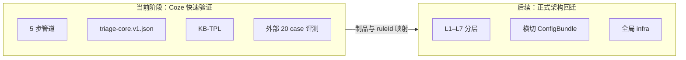
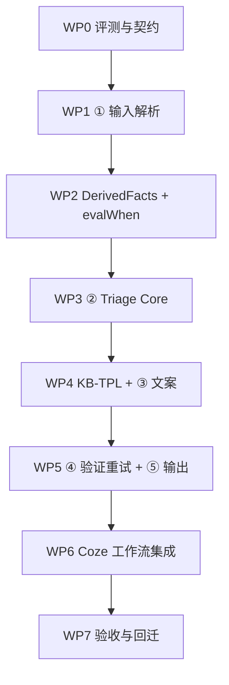

# 小爪 AI 健康/兽医分诊 Agent V1 — 开发计划

本文档基于此前全部前提：**契约与 case**（`docs/README.md`、`docs/schema`、`docs/cases`）、**完整七层架构**（`docs/architecture`）、**Coze 快速验证简化版**（`docs/implementation/coze`），给出可执行的完整开发计划。  
**不含排期、不含代码**；当前仓库以设计文档为主，已有起步制品 `docs/implementation/coze/assets/triage-core/config/policy_tables.template.jsonc`。

---

## 一、项目目标与成功标准

### 1.1 要验证什么

| 层级 | 目标 |
|------|------|
| **医学与安全** | 20 case 风险分级正确；emergency 必升级；缺数据不编造；禁止确诊与保证性结论 |
| **契约** | 消费 `input_schema`，产出完整 `output_schema` 结构化 JSON |
| **工程** | Coze 低代码原型可跑通；规则/模板/校验可回迁正式 L2–L6 + 横切 Registry |
| **可回归** | 改规则或模板后，批跑 20 case 能立刻定位失败 case 与原因 |

### 1.2 V1 明确不做

- 鉴权、限流、Session、`/intelligent` 多轮
- ConfigRelease、审计持久化、Metrics、全局 infra
- 向量 RAG、决策型时序记忆、精细 Signal Trust 打分
- App 端真实接入（本阶段以 mock adapter + 外部批跑为主）

### 1.3 硬门槛 vs 软门槛

| 类型 | 标准 |
|------|------|
| **硬门槛** | 20/20 `riskLevel` 正确；0 结构错误；0 `forbiddenOutputPatterns`；`safetyNoticeRequired=true` 时 `safetyNotice` 非空 |
| **软门槛** | `confidence` 与 expected 一致或三档（L/M/H）对齐；`mustMention` ≥ 18/20（可借助 KB-SYN 同义词） |

**原则**：risk 错了先改 ② 决策表，不要先改 LLM Prompt。

---

## 二、总体实施策略

### 2.1 双轨关系



- **现在**：按 `pipeline-design.md` 五模块逐步实现，**本地优先、评测驱动**。
- **以后**：Coze 产物按模块映射回 `docs/architecture` 各层，不推倒重来。

### 2.2 实施顺序

**按管道逻辑模块、自底向上、② 为核心**，顺序固定为：

```
评测基础设施 → ① 输入解析 → DerivedFacts 引擎 → ② 确定性分诊核（分批规则）
→ risk-only 全绿 → KB-TPL + ③ 文案 → ④ 验证重试 → ⑤ 合并兜底
→ Coze 工作流串联 → 端到端 20 case 全量验收 → 回迁文档与制品清单
```

**不要**：先搭 Coze 大 Prompt、先写全套模板、在 risk 未稳时调 LLM 文案。

### 2.3 中间对象（项目的状态边界）

| 对象 | 产出步骤 | 谁可读 | 谁不可改 |
|------|----------|--------|----------|
| **FactSheet** | ① | ②③④ | 不含医学推断 |
| **TriageCoreResult** | ② | ③④⑤ | ③④ 不得改 `finalRiskLevel`、`confidence`、PolicyTables 锁定字段 |
| **DraftCopyJSON** | ③ | ④⑤ | 可重试；失败由 ⑤ 模板兜底 |

---

## 三、工作分解结构（WBS）

共 **8 个工作包（WP）**，按依赖顺序排列。



---

## WP0：评测与契约基础设施

### 目的

任何模块改动后，能在一次批跑中知道「影响了哪些 case、失败在哪一层」。

### 交付物

| 交付物 | 说明 |
|--------|------|
| Case 加载器 | 读取 `docs/cases/health_triage_cases.v1.json` |
| Schema 校验器 | 对照 `input_schema` / `output_schema` 做结构检查 |
| Risk-only 评测器 | 仅比 `expected.riskLevel`（+ 可选 `confidence`） |
| 语义评测器 | `mustMention`、`mustNotMention`、`forbiddenOutputPatterns`、`safetyNoticeRequired` |
| 批跑报告 | 每 case：pass/fail、失败维度、ruleHits 摘要（若 ② 已接入） |
| 运行模式 | `risk-only` / `full-output` 两种，便于分阶段验收 |

### 验收

- 对 20 case input 能加载并解析 expected 约束
- 对任意 stub output 能输出结构化 pass/fail 报告
- 失败排查指引与 `pipeline-design.md` §9.4 一致（risk 错 → ②；禁止词 → KB-FORBID/模板）

### 依赖

无（仅读 docs）。

---

## WP1：① 输入解析（Parse & Fact Extract）

### 目的

App/case JSON → 客观 **FactSheet**；契约边界，不做医学判断。

### 交付物

| 交付物 | 说明 |
|--------|------|
| 输入校验 | `scene=health_triage`、必填顶层字段、ISO-8601 |
| 枚举归一化 | `riskLevel`、`dataQuality`、`activityLevel` 等 |
| FactSheet 构建 | 分组与 `pipeline-design.md` §3.2 一致 |
| 错误语义 | 缺字段明确失败，不 silent pass、不填默认值 |

### 字段分组（FactSheet）

- 标识：caseId、petId、name、species、ageMonths、breed  
- 档案：chronicConditions、medications、allergies、neutered  
- 设备：deviceOnline、dataQuality、lastSeenAt、warningText  
- 体征：temperatureC、heartRateBpm、respiratoryRateBpm、hrvMs、activityLevel、sleepQuality、updatedAt  
- 上游：healthEvidence.riskLevel、signals[]  
- 用户：userReport 全文 + 结构化症状字段  
- 情境：recentExercise、recentVaccination、ageRisk、environmentTempC、notes[]  
- 缺失：missingData[]  

### 验收

- 20 case input 全部解析成功  
- `missing_vitals`：vitals 核心项保持 null，不被补全  
- `stale_device_data`：`dataQuality=stale` 原样保留  
- 单元级：故意缺必填字段 → 明确报错  

### 对应架构

L1 Adapter 精简 + L3 Fact Set Builder 子集。

### 依赖

WP0。

---

## WP2：DerivedFacts 预计算 + evalWhen 通用引擎

### 目的

为 ② 提供稳定、可单测的布尔/枚举事实；为结构化 `when` 提供求值器。

### 交付物

#### A. DerivedFacts（代码预计算，不写入 JSON）

按 `kb-rule-derived-facts-spec.md` 实现全部符号，至少包括：

| 符号 | 关键用途 |
|------|----------|
| `isResting` / `isActive` | 安静 vs 活动态 |
| `hasExerciseContext` | 运动后降级（#2/#5 vs #3/#4） |
| `vitalsCoreMissing` | DQ-01 |
| `maxSignalRisk` / `upstreamRisk` | EMG-02、FUS |
| `userSaysNormal` / `deviceShowsRestingFever` | CTX-05 |
| `hasChronicHeart` | CTX-03/04 |
| `isSenior` / `isPuppyKitten` | CTX-07/08 |
| `isBrachycephalic` / `openMouthBreathingReported` / `severeRestingResp` | EMG-04（#4 vs #12） |
| `hasRestingTachycardia` / `hasRestingTachypnea` | CTX-03 vs CTX-04（#6 vs #20） |

#### B. evalWhen 引擎

- 支持结构化条件块：`all` / `any` / `fact` / `field`  
- **不实现** 字符串谓词 DSL（`∧`、`NOT` 文本）  
- 输入：FactSheet + DerivedFacts + 单条 `rules[].when`  
- 输出：boolean  

#### C. DerivedFacts 断言表

- 每个符号绑定「典型 case / 易错 case / 期望 true/false」  
- 作为单测与回归的固定夹具  

### 验收

- 边界 case 断言全过：  
  - #2：`hasExerciseContext=true`，`isResting=false`  
  - #4：`breathingDifficulty=true` 但不触发 EMG-04 alone  
  - #12：`severeRestingResp` 或 EMG-02 触发 emergency  
  - #11：`userSaysNormal` + 设备安静发热  
  - #13：partial 数据 + seizure（为 H′ 铺路）  
- evalWhen 可对空规则集、单条规则、组合条件正确求值  

### 依赖

WP1。

---

## WP3：② 确定性分诊核（Triage Core）

### 目的

**唯一医学裁决点**：产出锁定的 `TriageCoreResult`；LLM 不参与 risk。

### 核心制品：`triage-core.v1.json`

单文件决策表（`triage-core-spec.md`），sections：

| Section | 职责 |
|---------|------|
| `meta` | schemaVersion、bundleVersion、casesDataset |
| `rules[]` | EMG / DQ / CTX 有序规则 |
| `fusion` | FUS-00 候选来源、hardOverrides、DQ 禁止 normal |
| `confidence` | L / H′ / H / M（非 ruleId） |
| `policyTables` | ForcedMentions、Forbidden、Safety、ActionByFlagRisk |
| `evidenceByFlag` | EvidenceBuilder 路径映射 |
| `postProcess` | missingDataUser 翻译、primaryFlagPriority |

**机器真源**：仅此 JSON + DerivedFacts 代码。  
**人类验收规格**：`case-rule-mapping.md` §五（不双写完整 when JSON）。

**当前进度**：已有 `policy_tables.template.jsonc` 模板，需并入完整 `triage-core.v1.json` 并补齐 rules/fusion/confidence 等 section。

### ② 固定执行顺序

```
DerivedFacts 预计算
→ 层1 EMG 规则评估
→ 层2 DQ 规则评估
→ 层3 CTX 规则评估（按 priority）
→ ResolvePrimaryFlag（postProcess.primaryFlagPriority）
→ fusion（max 候选 + floor + 特殊规则）
→ ConfidenceResolver（L → H′ → H → M）
→ PolicyTablesResolve
→ missingDataUser 翻译
→ EvidenceBuilder
→ 输出 TriageCoreResult
```

### 规则分批实现与每批验收

| 批次 | 内容 | 主要覆盖 case | 本批 risk-only 目标 |
|------|------|---------------|---------------------|
| **A** | EMG-01~04 | #12 呼吸困难、#13 抽搐 | emergency 路径正确 |
| **B** | DQ-01~03 | #10 缺失、#19 过期、#13 partial | 禁止 normal；stale 叙事约束 |
| **C** | CTX-15 | #1 正常 | normal 路径 |
| **D** | CTX-01/02 | #3 安静高热、#4 安静呼吸 | warning + `NOT hasExerciseContext` |
| **E** | CTX-09a/b | #2 运动后发热、#5 运动后心率 | watch + POST_EXERCISE |
| **F** | CTX-03/04/05~08 | #6/#11/#14~#17/#20 | 慢病、冲突、呕吐、老年、幼犬 |
| **G** | CTX-10~14 | #7~#9/#15/#18 | watch 类症状 |

每批完成后：**risk-only 批跑 20 case**，记录 pass 数与失败 caseId。

### TriageCoreResult 字段清单

| 字段 | 来源 |
|------|------|
| `finalRiskLevel` | fusion |
| `confidence` | ConfidenceResolver |
| `primaryFlag` | ResolvePrimaryFlag |
| `forcedMentions[]` | policyTables + 规则 mentionsAdd |
| `forbiddenThemes[]` | policyTables |
| `evidenceBullets[]` | evidenceByFlag + FactSheet |
| `missingDataUser[]` | postProcess 翻译 |
| `primaryActionHint` | ActionByFlagRisk |
| `safetyNoticeRequired` | SafetyByFlag |
| `arbitrationNote` | fusion（与 upstream 不一致时） |
| `ruleHits[]` | 规则评估（含 EMG-*，供 H′） |

### 关键医学逻辑检查清单

| 场景 | 必须行为 |
|------|----------|
| 运动后体温/心率偏高 | watch（CTX-09），不得 warning |
| 安静态高热/高呼吸 | warning（CTX-01/02） |
| 仅 `breathingDifficulty=true` | 不 alone 触发 EMG-04（#4） |
| 短鼻 + 极高 RR + 张口呼吸 | emergency（#12） |
| 用户说正常 + 设备安静发热 | warning，不信用户「没事」（#11） |
| missing/stale | floor ≥ watch，禁止 normal / 「当前正常」（#10/#19） |
| partial + seizure | confidence 走 H′=high（#13） |
| USER_DEVICE_CONFLICT | confidence 排除 H → M（#11） |
| 幼犬/老年/慢病 | 加权 warning，不确诊（#16/#17/#20） |
| CTX-03 vs CTX-04 | 心率 vs 呼吸维度分流（#6 vs #20） |

### WP3 完成标志（阶段 1 里程碑）

- **20/20 riskLevel 正确**  
- confidence 建议 ≥ 18/20  
- `primaryFlag` 与 `case-rule-mapping.md` §五一致  
- `ruleHits[]` 可追溯  
- 此阶段 output 可为 stub 文案，仅 risk/confidence 真实  

### 对应架构

L3 标注 + L4 RuleEngine / Context Modifier / Signal Fusion / Risk Arbiter + 横切 PolicyTables。

### 依赖

WP0、WP1、WP2；policyTables 可先用 template 填充再迭代。

---

## WP4：KB-TPL + ③ 文案生成

### 目的

在 risk 锁定后，生成用户可读文案；LLM **唯一**生成点，且只写文案。

### 知识资产（`kb-tpl-template-spec.md`）

```
docs/implementation/coze/assets/kb-tpl/config/
├── templates.v1.json         # 20 条主模板（risk × primaryFlag）
├── slots.v1.json             # 全局槽位
├── tone-by-risk.v1.json      # 语气 profile
├── safety-notices.v1.json    # 免责声明片段
├── fallback-by-risk.v1.json  # ⑤ 兜底
└── kb-syn.v1.json            # mustMention 同义词
```

另需 **KB-FORBID**（禁止词，④ 与 ③ Prompt 共用）、**KB-ACTION**（primaryAction label/route）。

### ③ 两子步

#### ③-1 ResolveTemplate（确定性，无 LLM）

- 主键：`templates[finalRiskLevel + "." + primaryFlag]`  
- 输入：`TriageCoreResult` + `FactSheet`  
- 输出：`CopyTemplateResolved`（copy 骨架 + filledSlots + ② 锁定的 forced/forbidden/safety）  

**分工红线**：

- 合规 boolean 与 forced/forbidden **真源在 triage-core `policyTables`**  
- KB-TPL 只管「怎么说」，不重复维护 forcedMentions 等  

#### ③-2 DraftGenerator（LLM）

- 输入：窄上下文（模板骨架 + evidenceBullets + pet.name，非全量 raw input）  
- 输出：`DraftCopyJSON`：title、summary、evidence[]、recommendation、whenToSeeVet、safetyNotice、primaryAction、secondaryAction?  
- 约束：不输出 riskLevel/confidence；不增 evidence 事实；emergency 语气紧迫；DATA_* 不得写「目前健康正常」  

### 模板建设顺序建议

1. emergency 类（EMERGENCY_* / #12/#13）  
2. DATA_MISSING / DATA_STALE（#10/#19）  
3. warning 高频（FEVER_RESTING、RESP_RESTING、USER_DEVICE_CONFLICT 等）  
4. watch 类（POST_EXERCISE、HRV_STRESS 等）  
5. NORMAL_DAILY（#1）  

### 验收

- 20 格模板索引无空洞（或明确 fallback-by-risk 覆盖）  
- DraftCopyJSON 结构合法  
- mustMention 软门槛；禁止词仍为 0  
- LLM 不可用时可跳过本 WP 部分验收，但 WP5 兜底必须能产出合法文案  

### 依赖

WP3 稳定（至少 primaryFlag 枚举冻结）。

---

## WP5：④ 验证与重试 + ⑤ 合并与输出

### 目的

保证出站 JSON 100% 合法、合规；LLM 失败时有确定性底线。

### ④ 两层验证

| 层 | 组件 | 检查 |
|----|------|------|
| **A 结构** | ValidateStructure | JSON、必填字段、类型、primaryAction.label |
| **B 内容** | ValidateContent | ForbiddenPattern、EmergencyToneGuard、EvidenceAuthenticity、ForcedMentionChecker、SafetyNoticeEnforcer、RiskTextConsistencyGuard |

violations 格式：`{ code, field, message, severity }`。

### 重试协调器

- `maxAttempts = 3`（首次 + 最多 2 次重试）  
- **不得修改** TriageCoreResult 任何裁决字段  
- 重试 Prompt 附带 violations +「仅重写违规字段」  
- 按失败类型分支：PARSE → 强调 JSON；FORBIDDEN/EVIDENCE → 带 violations 重写；EMERGENCY_TONE → 套 emergency 模板句；耗尽 → ⑤  

### ⑤ 合并与兜底

| output 字段 | 来源 |
|-------------|------|
| `riskLevel`、`confidence` | ② 锁定 |
| `scene` | 固定 `health_triage` |
| `missingData` | ② `missingDataUser[]` |
| 文案字段 | ③ 通过稿 **或** ⑤ 纯模板机械填槽（无 LLM） |
| `primaryAction` | KB-ACTION + `primaryActionHint` |

**Fallback 原则**：evidence = evidenceBullets 原文；宁可朴素，不可 risk 错误或结构非法。  
出站前再做一次 **完整 output_schema** 校验。

### WP5 完成标志（阶段 2 里程碑）

- 端到端 20 case **硬门槛全绿**  
- mustMention 软门槛 ≥ 18/20  
- 模拟 LLM 全失败时，Fallback 仍产出合法 output  

### 对应架构

L5 Safety Guard + L6 Output Composer + L2 Retry 简化。

### 依赖

WP3、WP4、KB-FORBID、KB-ACTION。

---

## WP6：Coze 工作流集成

### 目的

将 WP1–WP5 本地已验证逻辑，装配为 Coze 可调用工作流。

### 节点清单（与 pipeline-design §十 对齐）

| 节点 | 类型 | 步骤 |
|------|------|------|
| Start | 入参 input JSON | — |
| ParseInput | **代码** | ① |
| TriageCore | **代码**（读 triage-core.v1.json） | ② |
| ResolveTemplate | **代码** | ③-1 |
| DraftGenerator | LLM JSON mode | ③-2 |
| ValidateStructure | 代码/插件 | ④-A |
| ValidateContent | 代码/插件 | ④-B |
| RetryCoordinator | 条件 + attempt 变量 | ④ |
| DraftRewriter | LLM（带 violations） | ④ 重试 |
| TemplateFallback | **代码** | ⑤ |
| MergeOutput | **代码** | ⑤ |
| FinalSchemaCheck | **代码** | ⑤ |
| End | output JSON | — |

### 集成顺序（分步上线）

1. **ParseInput → TriageCore → End**（输出 TriageCoreResult + stub 文案），外部 API 批跑验证 risk  
2. 接入 ResolveTemplate → DraftGenerator  
3. 接入 Validate* → Retry → Fallback → Merge  
4. 全链路 20 case  

### Coze 落地原则

| 优先级 | 方式 |
|--------|------|
| 1 | 代码节点读 **单文件** triage-core + KB-TPL JSON |
| 2 | 表格/DB 插件改 policyTables 或模板（运营友好） |
| 3 | 向量 KB 仅短模板片段 + templateId 过滤 |
| **禁止** | 开放式兽医 RAG；30+ 条件分支替代 ② |

### 验收

- Coze API 与本地批跑对同一 input 的 `riskLevel` 一致  
- Coze 侧 20 case 硬门槛与本地一致  
- bundleVersion 在工作流/变量中可 pin  

### 依赖

WP3–WP5 本地已通过。

---

## WP7：全量验收、文档与回迁准备

### 7.1 全量验收矩阵

| 维度 | 规则 | 门槛 |
|------|------|------|
| 结构 | output_schema 必填 | 硬 |
| riskLevel | = expected | 硬 |
| confidence | = expected 或 L/M/H 三档 | 软 |
| mustMention | KB-SYN 扩展后命中 | 软 |
| mustNotMention | 不得出现 | 硬 |
| forbiddenPatterns | schema 列表 + 扩展隐性确诊/保证 | 硬 |
| safetyNoticeRequired | true 时非空 | 硬 |

### 7.2 失败排查手册

1. risk 错 → `triage-core` rules/fusion/DerivedFacts，**不改 Prompt**  
2. confidence 错 → `confidence` 区块 L/H′/H/M 顺序与条件  
3. mustMention 缺 → `ForcedMentionsByFlag` 或 KB-SYN  
4. 禁止词 / emergency 语气 → KB-FORBID、policyTables、KB-TPL copy  
5. JSON 格式 → ③ Prompt 或 ValidateStructure 重试  
6. primaryFlag 错 → ResolvePrimaryFlag 优先级与 CTX 规则 then  

### 7.3 回迁映射清单

| Coze 模块/制品 | 回迁目标 |
|----------------|----------|
| ParseInput | L1 Adapter + L3 Fact Set |
| DerivedFacts | L3 Context Builder |
| triage-core `rules[]` | L4 RuleEngine + RuleKBRegistry |
| fusion + confidence | L4 Fusion + Risk Arbiter |
| policyTables | 横切 PolicyTables |
| evidenceByFlag | L3/L4 Evidence 组件 |
| KB-TPL | TemplateRegistry |
| KB-FORBID | ForbiddenPatternRegistry |
| KB-ACTION | ActionRouteTableRegistry |
| Validate* | L5 Safety Guard |
| Merge/Fallback | L6 Output Composer |
| 批跑评测器 | L7 Eval |

### 7.4 版本与变更管理

- `triage-core.meta.bundleVersion` 与 KB-TPL `meta` **独立版本、联合回归**  
- 改规则 → rules/fusion + bundleVersion +1 + 20 case  
- 改文案约束 → policyTables 或 KB-TPL + 联合回归  
- **禁止** case-rule-mapping 与 triage-core 双写完整 when  

### 依赖

WP6 端到端通过。

---

## 四、知识资产完整清单与职责

| 资产 ID | 路径/制品 | 职责 | 消费步骤 |
|---------|-----------|------|----------|
| **TRIAGE-CORE** | `triage-core.v1.json` | 规则、融合、置信度、policyTables、evidence | ② |
| **DerivedFacts** | 代码（spec 定义） | when 条件事实 | ② 入口 |
| **KB-TPL** | `assets/kb-tpl/config/*` | 文案骨架、槽位、兜底 | ③⑤ |
| **KB-FORBID** | 禁止词表 | Prompt + ④ | ③④ |
| **KB-ACTION** | 动作映射 | primaryAction | ⑤ |
| **KB-SYN** | 同义词 | mustMention 评测 + ForcedMentionChecker | ④评测 |
| **Cases** | `docs/cases/*.json` | 验收真源 | WP0 |
| **Schemas** | `docs/schema/*.json` | 契约 | WP0、⑤ |
| **case-rule-mapping** | 验收规格 + 规则主表 | 人类录入依据，非机器 when | WP3、WP7 |

**已废弃**：独立 `kb-rule.v1.json`、字符串谓词 DSL、模板内重复 forced/forbidden。

---

## 五、测试策略

### 5.1 测试金字塔

| 层级 | 内容 |
|------|------|
| **单元** | DerivedFacts 每符号；evalWhen 条件组合；ConfidenceResolver 四行；ResolvePrimaryFlag |
| **规则** | 每条 ruleId 最小触发 input 夹具；EMG/DQ/CTX 分层 |
| **集成** | ①→② 全链；②→③-1 模板命中；③→④→⑤ 端到端 |
| **回归** | 20 case 批跑；pin bundleVersion |
| **负向** | 缺字段、LLM 胡说、禁止词注入、evidence 幻觉 |

### 5.2 分阶段评测模式

| 阶段 | 模式 | 通过标准 |
|------|------|----------|
| WP3 中 | risk-only | 20/20 risk |
| WP4 中 | risk + 结构 stub | risk 仍 20/20 |
| WP5 后 | full-output | 硬门槛全绿 |
| WP6 后 | Coze API full-output | 与本地一致 |

### 5.3 关键 case 夹具

#1 正常、#2 运动后 watch、#3 安静 warning、#4/#12 呼吸边界、#10/#19 数据质量、#11 冲突、#12/#13 emergency、#13 H′、#16 老年、#17 幼犬、#20 慢病呼吸。

---

## 六、环境与运行形态

### 6.1 本地开发栈（对应架构 GI-17 LocalDevStack）

- InMemory 或文件读 JSON 制品  
- MockLLM 或真实 LLM API（文案阶段）  
- `accessMode=bypass`  
- JSONL 或控制台审计（可选）  
- **零 Redis / 零 ConfigRelease**  

### 6.2 Coze 运行栈

- 工作流变量或上传 JSON 承载 triage-core、KB-TPL  
- ② 必须为代码节点  
- 外部脚本通过 Coze API 批跑 20 case  

### 6.3 与 App 的关系（V1 mock）

- App mock adapter 组装 input_schema JSON  
- `/health` 展示 output 卡片字段（title、risk、evidence、recommendation、safetyNotice）  
- `/intelligent` 本阶段不实现  

---

## 七、风险与缓解

| 风险 | 影响 | 缓解 |
|------|------|------|
| ② 用 LLM 或大量 Coze 分支 | risk 不稳定、难维护 | 单文件决策表 + 代码节点 |
| mapping 与 JSON 双写 | 回归漂移 | mapping 仅验收；JSON 唯一真源 |
| 先做模板后做 ② | primaryFlag 对不上 | ② 冻结后再建 20 格模板 |
| DerivedFacts 边界错误 | #4/#12/#2/#3 连锁错 | 专用断言表 + case 驱动 TDD |
| LLM 文案幻觉 | evidence 编造 | ④ EvidenceAuthenticity + ⑤ 兜底 |
| policyTables 与 case 不一致 | mustMention 失败 | 以 case-rule-mapping §五 对齐 Safety/Forced |
| Coze 先上后本地 | 调试困难 | 本地批跑通过后再迁 Coze |

---

## 八、交付物总览

| 类别 | 交付物 |
|------|--------|
| **可执行** | 本地批跑入口；Coze 工作流（可 API 调用） |
| **制品** | `triage-core.v1.json`（完整）；`kb-tpl/config/*`；KB-FORBID；KB-ACTION；KB-SYN |
| **逻辑** | FactSheet 解析；DerivedFacts；evalWhen；TriageCore 全链；TemplateResolver；Validator；Merger/Fallback |
| **验证** | 20 case 报告（硬门槛全绿）；失败 case 排查记录 |
| **文档** | 回迁映射表；bundleVersion 变更说明；已知限制（V1 不做的清单） |

---

## 九、执行检查表（按 WP 顺序自检）

- [ ] **WP0** 能批跑 20 case 并出 risk-only 报告  
- [ ] **WP1** FactSheet 20/20 解析，missing 不补值  
- [ ] **WP2** DerivedFacts 边界断言全过，evalWhen 可用  
- [ ] **WP3-A** EMG 批次 #12/#13 emergency 正确  
- [ ] **WP3-B** DQ 批次 #10/#19 禁止 normal  
- [ ] **WP3-C~G** 全规则 + FUS + confidence → **20/20 risk**  
- [ ] **WP4** 20 格模板 + DraftCopyJSON 结构合法  
- [ ] **WP5** 硬门槛全绿 + Fallback 可用  
- [ ] **WP6** Coze 与本地 risk 一致  
- [ ] **WP7** 回迁清单 + 全量验收报告归档  

---

## 十、总结

**完整开发计划 = 8 个工作包、一条管道、两个里程碑：**

1. **里程碑 A（医学正确）**：WP0→WP3 完成，`20/20 riskLevel`，TriageCoreResult 可输出。  
2. **里程碑 B（产品可演示）**：WP4→WP6 完成，完整 `output_schema` 硬门槛全绿，Coze 可调用。  
3. **里程碑 C（可演进）**：WP7 回迁文档与版本化制品，为正式 L1–L7 实现铺路。

**实施方式**：严格按管道模块逐步实现；**② 确定性分诊核是投入重点**；本地评测驱动；Coze 最后做编排壳；知识资产遵守「决策表单源、模板管话术、mapping 管验收」三分法。